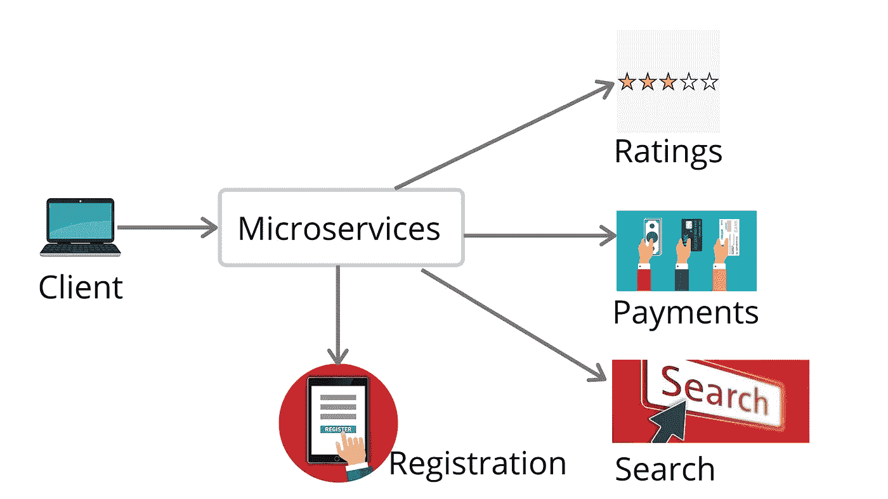
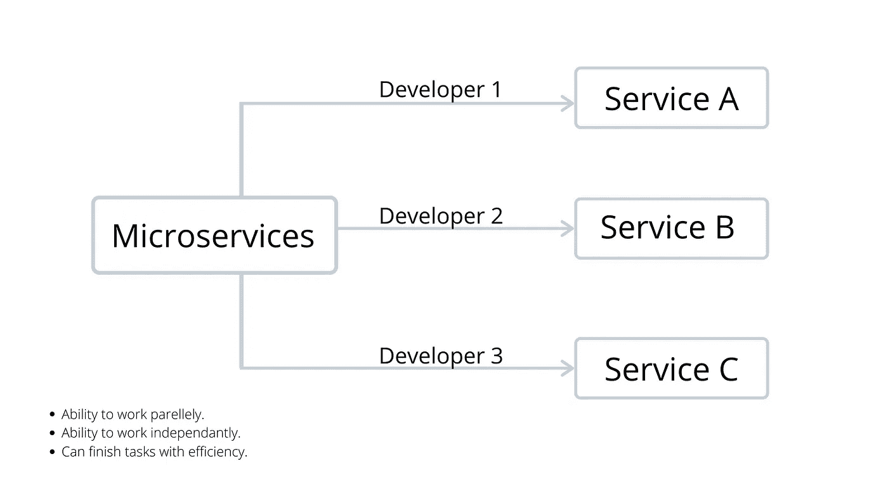
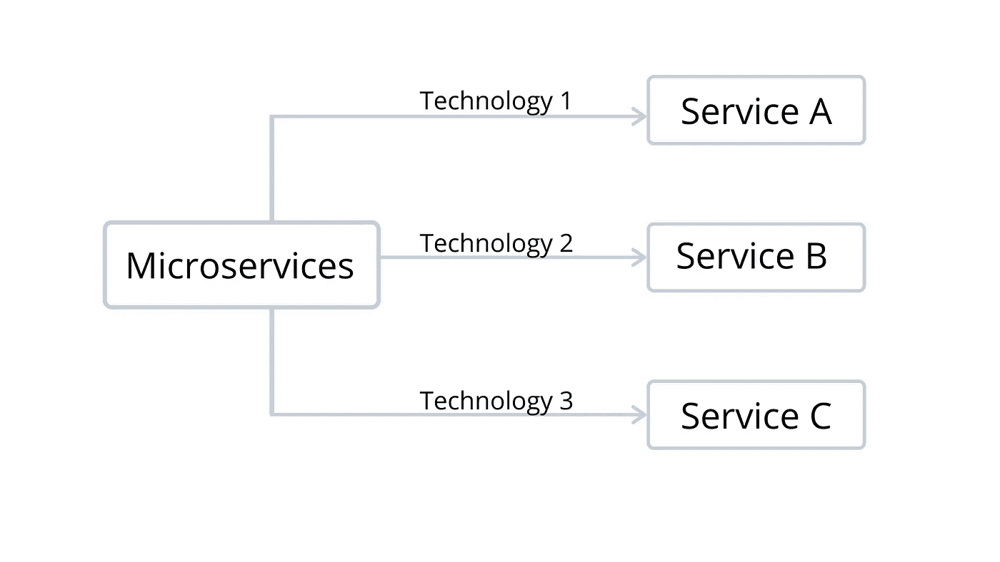
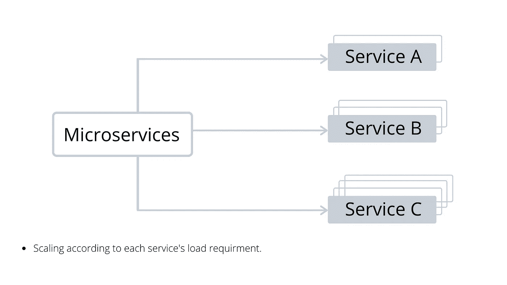

# 微服务架构及其益处。

> 原文：<https://medium.com/analytics-vidhya/micro-service-architecture-and-how-it-could-be-beneficial-a0193baf4801?source=collection_archive---------15----------------------->

在微服务出现之前，领先的架构被称为单片架构。它允许将应用程序的所有组件打包并组装到一个容器中。把所有东西都紧紧包起来会带来一些不便。举几个例子；

可靠性:如果一个特性崩溃，整个系统都会崩溃。

不灵活:很难或不能用混合技术构建

可伸缩性:每次应用程序必须更新时，整个系统都需要更新。

开发:这需要很长的开发时间，因为每个特性都是一个接一个地完成的。

这导致了一种新的方法，现在被称为微服务。

简而言之，微服务可以被描述为特定于某个服务的所有相关数据和功能都包含在该服务本身中。

由于这种架构的性质，它使每个服务相互独立，这意味着它可以独立部署和开发。所以像这样的松散耦合使得开发人员能够彼此并行工作，比如说；开发人员一处理服务 A，开发人员二处理服务 B，依此类推。假设一个新的开发人员加入了团队，这个成员可以被分配特定服务的任务，这使得整个团队更容易在他们之间分配工作。让事情变得简单，不是吗？

对于这种架构的开发者来说，更多的机会是它允许开发者拥有一个混合的技术栈。开发人员可以在同一个应用程序中使用不同的技术处理不同的服务。不仅如此！如果某个特定服务出现故障，不会导致整个系统停止运行，相反，在系统的其余部分平稳运行的同时，更容易识别问题所在并修复它。

扩展性怎么样？对于微服务来说，可扩展性是一个很大的优势，因为它可以轻松地向外扩展，并且只适用于比其他服务器更需要扩展的相关单个服务器。假设有 3 个服务和 3 个专用服务器，但只有第 3 个服务器的负载较高，因此我们可以通过放置更多机器来扩展第 3 个服务器。这就是所谓的粒度扩展，即单个组件根据其需求进行扩展，而不是将所有组件一起扩展。

但是拥有一个可靠的系统的关键依赖于架构师。一个开发良好的敏捷微服务架构可以让开发者和平台变得更加容易。

一些使用微服务架构的流行网站有:网飞、优步、亚马逊和 Ebay。