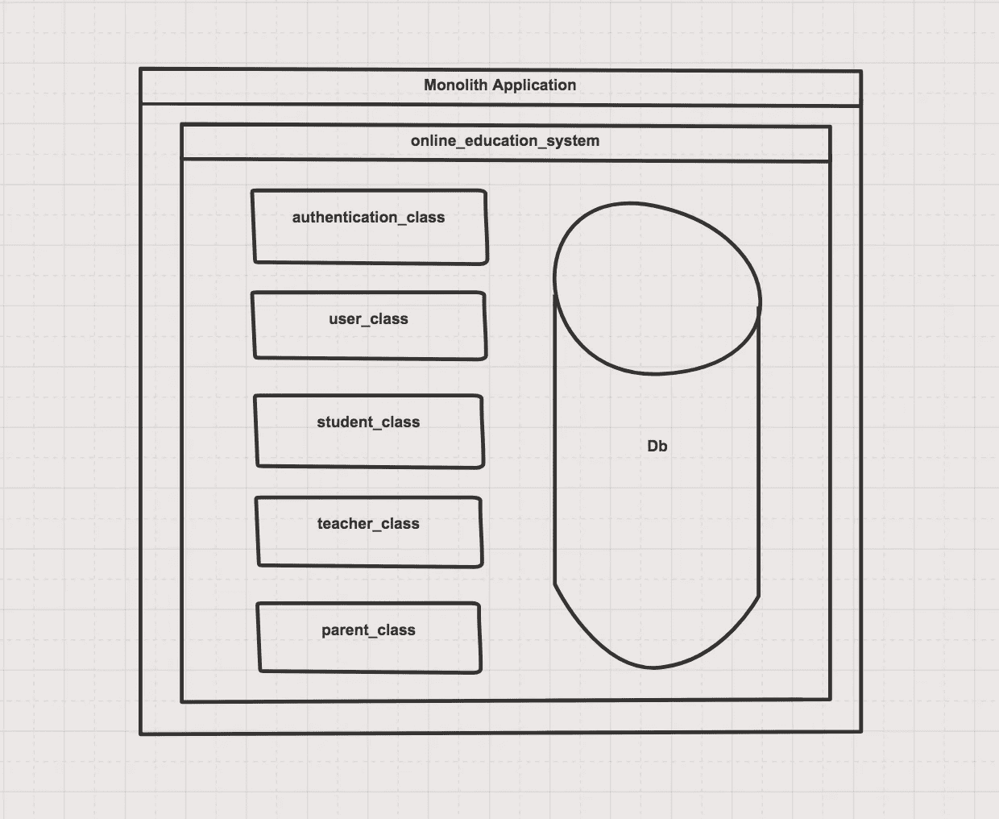
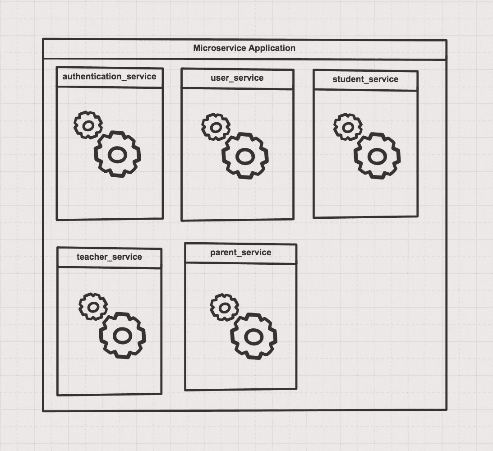
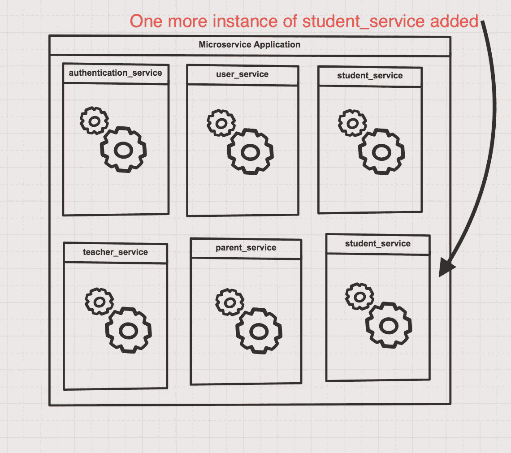

# 微服务架构——简介

> 原文：<https://medium.com/analytics-vidhya/microservices-architecture-an-introduction-603f48099e34?source=collection_archive---------21----------------------->

图片来源:https://www.pexels.com 的免费图片

在很短的时间内，微服务架构获得了广泛的流行。举几个例子，亚马逊和网飞已经转向微服务。我们先来了解一下什么是微服务。我将借助一个示例应用程序来解释。当产品的性质复杂时，你可能会更欣赏。

**一、样品产品:**

我们要为这个教程构建的产品将被称为在线教育系统。将有两种用户，学生和教师。教师可以创建课程内容。他/她的仪表板将显示课程内容。当学生登录时，他/她可以看到不同的课程及其关联的教师。学生可以选择特定的课程。完成课程后，学生可以提供每门课程的评分。

**二世。进一步分解**

让我们进一步分解一下。应用程序中涉及哪些不同的参与者——学生和教师。我们还希望将父母添加到系统中。家长可以登录并创建课程课程表，并将其分配给他们的孩子(学生)。

我们不会深究应用程序的技术细节。我们将根据业务能力和用户管理来划分应用程序。

1.  用户管理系统。
2.  认证系统
3.  学生的操作及其数据
4.  母公司的运营及其数据
5.  教师操作及其数据

**三。应用程序的整体设计**

根据维基百科:

> 在软件工程中，**单片应用**描述了一种单层软件应用，其中用户界面和数据访问代码被组合成来自单个平台的单个程序。

下面是在线教育系统的整体版本。你把所有的逻辑放在一个应用程序中。

应用程序的整体版本

**四。应用的微服务设计**

根据维基百科:

> **微服务**是面向服务架构(SOA)架构风格的变体，它将应用程序构建为松散耦合的服务集合。

下面是 online_education_system 的微服务版本。您将应用程序分成许多更小的服务，每个服务都是松散耦合的。

应用程序的微服务版本

**V .整体服务 Vs .微服务**

如果我们谈论开始构建一个应用程序的容易程度，monolith 是首选。与微服务不同，在整体架构中，您不需要担心服务集成和通信。但是几年后，代码库变得丑陋，难以管理签入和其他挑战。

六。选择—微服务架构

微服务的实施并不容易，而且它有一定的价格，你应该为此做好准备。在微服务应用的情况下，多个数据库、测试和部署是昂贵的事情。

> 当你在构建一个复杂的产品时，你需要有正确的思维模式和长远的眼光。

> 还有，我想引用**福勒的微服务设计原则“微服务是围绕业务能力组织的。”**

因此在**第二部分**中列出的那些业务能力只不过是应用程序的服务。

**七。选择微服务架构的好处**

**a .生产力。**

这是最重要的。当服务根据业务能力明确分离时，可以实现很多目标。即使是小团队也可以在更短的时间内构建更多，因为通信是使用 JSON 通过 HTTP/REST 完成的，团队总是知道其他服务的响应是什么样的。最终，这更像是将服务与请求和响应缝合在一起。

**b .整洁干净的代码库**

大多数代码和逻辑分离来自底层架构。对于新加入团队的人来说，这变得很容易。

**c .较少的相互依赖性**

每个服务都独立于另一个服务。它给了开发者很大的自由。导致更少的代码冲突和更多的时间花在实际工作上。

**d .可扩展性**

可以部署更多负载的特定服务。下面是仅横向扩展 student_service 的示例。

横向扩展微服务应用非常简单。

考虑一下扩展一个整体应用程序。您必须部署整个应用程序。

e .为每项服务选择不同技术堆栈的自由。

每个服务可以根据其核心工作拥有自己的技术体系。假设一个服务的工作是处理更多的系统级操作，你可以选择用 C++来写。还有一种服务的工作是处理大量数据，python 可能是更好的选择。你并不局限于一种语言或平台。

**f .扩展性**

明天，您希望再添加一个模块来处理应用程序的商业智能。您可以添加一个名为 business_intelligence_service 的微服务，而不会影响现有的应用程序。真正的即插即用系统。

像所有架构一样，它也有缺点和限制。你必须找出你试图解决的问题的好处是否大于坏处。

> 声明:话虽如此，微服务架构在开始时似乎很花哨，最终会变得很痛苦。因此，最后一条建议是**在需要时转移到微服务**。

如果你想阅读更多这类文章，请关注我。此外，如果你是一个喜欢在尖端技术上建造东西的人，我很想听听你的意见。