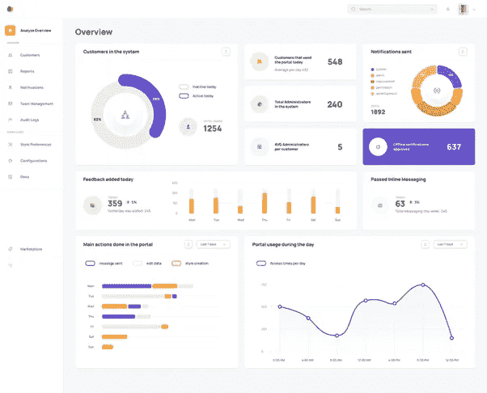
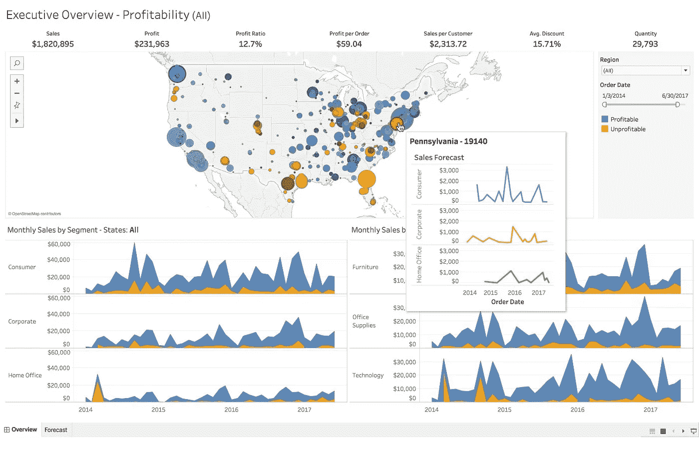

# 微软 Power BI vs Tableau |哪个最好？

> 原文：<https://medium.com/analytics-vidhya/microsoft-power-bi-vs-tableau-which-one-is-best-38389b16f22f?source=collection_archive---------7----------------------->

对于数据分析师来说，微软 Power BI vs Tableau 始终是一场至关重要的战斗。Power BI 提供了大量的特性，同样还有地图、支持、编码语言等等。另一方面，Tableau 专注于提供优秀的数据可视化。

在过去的几年中，Power BI 和 Tableau 正在成为商业智能工具中的关键角色。在旧时代，Tableau 是唯一最可靠的商业智能工具。但是后来，力量 BI 出现了。

很快它成为 Tableau 的竞争对手。这两种工具都提供了各种各样的功能、优势，并且也各有优缺点。但是这些工具作为收集数据洞察力的工具发展得更快。

你知道吗，在过去的年代，商务人士依赖 IT 部门通过互联网或计算机系统生成报告？但是在 Tableau 和 Power BI 发展之后，业务专业人员现在能够创建任何报告。

BI 的力量将它带到了一个新的高度。在 Power BI 中，最终用户可以访问各种来源的数据，并根据自己的需要进行清理。最后，在几秒钟内生成报告。

正如我上面提到的，这两种工具在商业智能中发展更快。他们也是商业智能和数据可视化行业的领跑者。这些工具附近没有其他工具。让我们对这些工具进行一个基本的比较。

**功率 BI 与 Tableau 的基本比较**

Tableau 是最好的数据可视化工具。它提供了各种可视化工具，使用户更容易获取数据。它还允许您利用任意数量的数据点进行分析。

另一方面，权力，BI 没有 Tableau 那么强大。但它最适合小型企业。任何小型企业都负担得起，而且它为其运营提供了足够的功能。

它具有用户友好的界面，允许您创建强大的仪表板。让我们通过查看它们的定义来理解这种比较。

**异能匕**

Power BI 是微软公司的一部分。它是最好的基于云的商业分析和商业智能平台之一。它为您提供了对业务最重要的数据的全面概述。

Power Bi 的主要目标是提供最佳的商业智能和交互式可视化。正如我上面提到的，它是基于云的服务，也提供基于桌面的界面。

它是一个完整的商业智能工具，因为它提供了各种数据仓库功能，如数据发现、数据准备和交互式仪表板。

您还可以使用 Power BI 连接所有数据源。它还提供可扩展的仪表板，使您可以轻松选择各种可视化。例如蓝图，然后将导航中的数据拖放到可视化中。

**功率 BI 的特性**

*   内容包
*   打印仪表板
*   获取数据源
*   自定义可视化
*   自然语言问答

**画面**

Tableau 是世界上领先的可视化工具。它广泛应用于商业智能行业。Tableau 最好的部分是，它有能力将原始数据转换成可理解的格式，而无需任何编码和技术技能。

您还可以在 Tableau 中快速进行数据分析。您可以在工作表和仪表板中搜索数据可视化。Tableau 还能让您获得切实可行的见解，并创建出色的仪表盘。它是最好的商业智能工具之一。

我们可以使用它来生成报告、仪表板和对来自多个来源的大量数据的分析。正如我上面提到的，这是最优秀的数据可视化工具。它提供交互式数据可视化，以理解数据并提出见解。它对所有类型的组织和商业用户都非常有用。

Tableau 提供简单的拖放功能。在整个企业中分析关键数据、分享关键见解非常容易。它还使用轻松创建创新的可视化和报告。您还可以嵌入现有业务应用程序的仪表板，如 SharePoint with Tableau。

**画面特征**

*   数据混合
*   不需要技术知识
*   实时分析
*   数据协作
*   DAX 分析功能

我们来谈谈 PowerBI 和 Tableau 的显著区别

**电源 BI vs Tableau**

**1。数据访问**

Power BI 并不是最有影响力的商业智能工具。因此，它不允许您将应用程序与 Hadoop 数据库连接起来。但是你可以把它和一些不太强大的小型数据库连接起来，比如 Salesforce 和 google analytics。

另一方面，Tableau 是最有影响力的商业智能工具。可以用 Hadoop 数据库连接。它还可以自动识别资源。你可以把它和一个巨大的数据库连接起来。

**2。可视化**

Tableau 和 Power BI 都为业务经理提供了复杂的可视化功能。这种可视化有助于发现模式、降低成本、加快流程并达成共识。PowerBI 提供了大量的数据点来提供数据可视化。

它提供了超过 3500 个数据点用于挖掘数据集。使用 Power BI 不需要任何编码知识。它还通过用自然语言询问问题来帮助您创建可视化。它是在 Power BI 中个人数字助理 Cortana 的帮助下完成的。

另一方面，Tableau 以其数据可视化功能而闻名。用户可以在 Tableau 中使用 24 种不同类型的基线可视化。这些可视化包括热图、折线图和散点图。您可以在没有编码知识的情况下使用它来开发复杂的可视化效果。

**3。客户支持**

Power BI 通过免费的 Power BI 帐户为其用户提供有限的客户支持。你可以在 Power BI 中获得支持，但付费用户将获得比免费用户更快的支持。它还提供了最好的支持、资源和文档。它包括用户社区论坛的指导学习。此外，它还提供了合作伙伴如何使用该平台的示例。

另一方面，Tableau 拥有出色的客户支持。它有一个大型的社区讨论论坛。它还将在线支持分为在线桌面和服务器。Tableau 还拥有超过 150，000 名活跃用户，他们参与了社区中的 500 多个全球用户组。您可以通过电话、电子邮件以及登录客户门户网站获得直接支持。

**4。部署**

Power BI 基于 Saas 模式，即。软件即服务。另一方面，Tableau 有两种选择，即基于云的安装和本地安装。当云中有大量数据时，它工作得最好。另一方面，在处理大量数据时，Power，BI 无法更好地工作。

**5。定价**

Power BI 向其用户提供三种订阅。它分为桌面版、专业版和高级版。桌面对单个用户是免费的。专业版订阅起价为每位用户每月 9.99 美元。Pro subscription 提供了数据治理、内容打包和分发等附加功能。

您还可以享受 pro 套装的 60 天免费试用。最后但并非最不重要的高级订阅每月起价 4995 美元。高级订阅基于每个专用云计算和存储资源

另一方面，Tableau 还提供三种订阅服务来满足用户需求。订阅如下:创建者、浏览者和查看者。所有的价格都是按用户每月列出的。但是账单是按年收费的。

下面就让我们一个一个来探究订阅吧。creator 计划的费用是每个用户每月 70 美元。您需要为内部部署或云平台支付相同的费用。探索计划的内部成本为 35 美元，云部署成本为 42 美元。

请注意，Tableau Viewer 应该至少有 100 个观众来购买该计划。你也可以从 Tableau 获得 14 天的免费试用。这样，买之前可以先测试一下。它还提供每个用户每年 500 美元的套餐，用于更深入的使用，没有数据限制。

**结论**

现在你对权力 BI 和 Tableau 之间的比较已经有了一个清晰的图像。最后，我想根据您的需求和预算推荐这些工具。如果您是小型企业，那么 Power BI 是您的最佳选择。它非常便宜，并提供所有必要的功能来满足中小型企业的需求。

另一方面，如果你的企业足够大，那么你应该考虑 Tableau。因为它是最强大的商业智能工具，可以在任何规模的企业中工作。它也比 Power BI 贵。但是如果你有一个大企业，你应该使用 Tableau。对于大型企业来说，这是物有所值的产品。