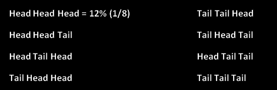

# 机器学习的强大力量

> 原文：<https://medium.com/analytics-vidhya/mighty-p-of-machine-learning-4a2c44ae8a2?source=collection_archive---------29----------------------->

p 值在机器学习中的意义。


弗兰基·查马基在 [Unsplash](https://unsplash.com?utm_source=medium&utm_medium=referral) 上拍摄的照片

这是非常愉快的一天。带着在你的机器学习旅程中学习新东西的目的，你开始学习多元线性回归。但是在你开始之前，你会碰到这个叫做 **p 值**的谜。这个术语会让你经历高中数学，甚至在相当长的时间后，你也不会理解它的意思。但这是一个非常重要的概念，涉及到训练你的模型。

几天前我也遇到过同样的情况。但是在看了不同的例子后，我在某种程度上理解了它的意思。让我们通过**著名的抛硬币例子**来了解这个奥秘。

# **掷硬币的例子**


照片由[rupixen.com](https://unsplash.com/@rupixen?utm_source=medium&utm_medium=referral)在 [Unsplash](https://unsplash.com?utm_source=medium&utm_medium=referral) 上拍摄

一天，一个朋友来你家给你表演一个魔术。他带了一枚硬币。在魔术开始之前，你认为硬币是公平的(头和尾都存在)。这就变成了无效假设。

这里我们试图证明零假设是错误的。我们的另一个假设是硬币是不公平的(2 个正面或 2 个反面)。现在你的朋友开始变魔术了。

**第一次折腾**


第一次投掷的可能结果

他第一次扔硬币，硬币落在头上。这并不是一个令人惊讶的结果，因为如果零假设为真，这种情况发生的概率是 50 % (0.5)。

**第二次投掷**


第二次投掷的可能结果

他第二次扔硬币，它又落到了头上。这种情况仍有相当大的可能性(25 %或 0.25%)。到目前为止，我们的零假设是正确的，我们没有疑问。

**第三次折腾**



第三次投掷的可能结果

这是第三次，它落到了头上。你对零假设的信心开始下降，因为如果硬币是公平的，连续 3 个头的可能性非常低(~12 %或 0.12)。你不相信他，因为他是你的朋友

**第四次折腾**


第四次投掷的可能结果

第四次折腾会让你怀疑你的朋友。这一次，硬币也落在了头上。你开始怀疑硬币可能是魔法商店硬币，因为这种情况发生的可能性很低(~6%或 0.0625)。下一次投掷将决定你是否拒绝你的无效假设。

**第五次投掷**


第五次投掷的可能结果

第五次投掷结果是正面，你现在拒绝了硬币是公平的零假设，因为这种情况发生的可能性非常低(~3%或 0.03125)。你决定采用硬币不平衡的另一种假设。结果发现这枚硬币是从一家魔法商店买的。

**p 值是零假设为真的概率吗？数量**


来源:推特

它是在假设零假设为真的情况下，通过**得到与之前计算结果相似的结果的概率。即使 p 值更小，零假设也可能是真的。这取决于你考虑的数据。**

# **p 值在机器学习中有什么意义？**

让我们将上述理论应用于一个数据集。考虑一个具有不同独立变量(特征)的数据集，例如小时数、出勤率和学生的性别(0 代表男性，1 代表女性)。基于这三个特征，我们必须预测输出，即学生获得的分数。

多元线性回归的等式如下所示:


多元线性回归方程

> 零假设表示一个假设中的两个变量之间没有显著的关系。

在这里，我们的**无效假设是特征和输出**之间没有关系。这意味着，如果更改特性的值，对输出没有任何影响。然后是我们的**替代假设(在一个或多个特征和输出之间有一些关系)**描述了一个不同于我们的零假设的场景。正如我们在抛硬币问题中所做的那样，我们需要分析不同特征的 p 值，以便我们可以拒绝或接受零假设。

p 值决定多元线性回归方程中存在的系数的值。根据零假设，特征和输出之间没有关系，这意味着系数将为 0。p 值将决定这是真是假。

但在此之前，我们需要设置 p 值的显著性水平。我们用通常的值 P = 0.05 吧。该值表示任何 p 值小于 0.05 的要素都将证明零假设是错误的。


p 值

以上数值表示小时数和出勤率的 p 值低于显著水平(0.05)。但性别的 p 值大于显著水平(0.05)。这证明了我们的零假设是错误的，并且在特征(小时数和出勤率)和输出(总分)之间存在关系。它还表明，学生的性别遵循零假设(学生的性别和他们的分数之间没有关系(这是真的))。这意味着**小时数和**出勤率的变化会触发**总分(产出)**的显著变化。

# 如何用 python 实现这整个过程？

有许多可能的方法来执行特征选择。但是 **SciKit-Learn** 库提供了一个名为 **LinearRegression** 的类。该类自动为您的数据使用最有效的要素选择策略，并相应地拟合您的数据。


训练多元线性回归模型

```
from sklearn.linear_model import LinearRegressionregressor = LinearRegression()regressor.fit(X_train, Y_train)
```

上述代码可用于在 python 中训练多元线性回归模型。这里 X_train 和 Y_train 分别是训练集中的特征和输出。

定型模型后，它可用于预测值，如下所示。这里 X_test 包含测试集的自变量(特征)。模型对 X_test 的预测存储在 Y_pred 中。


预测产量

```
Y_pred = regressor.predict(X_test)
```

请注意，线性回归类使用最有效的策略自动执行要素选择。因此，我们不必通过查看它们的 p 值来手动选择特征。

希望这个关于 p 值的解释能对你的机器学习之旅有所帮助。