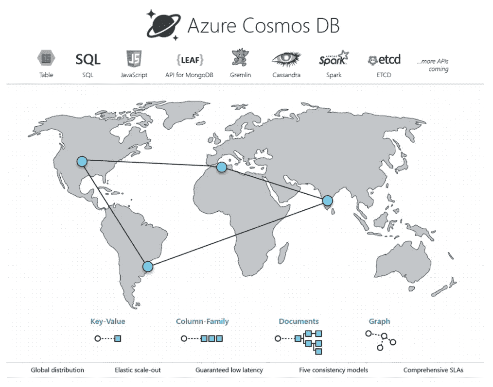
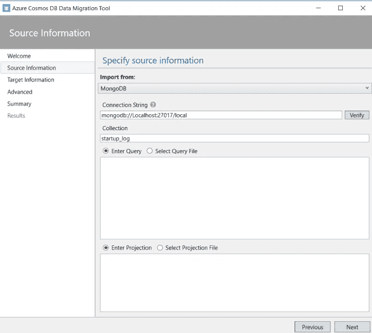
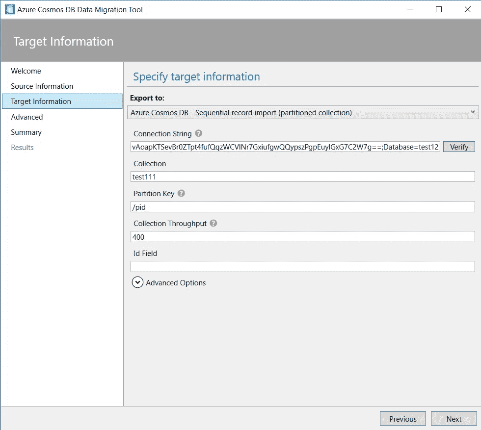
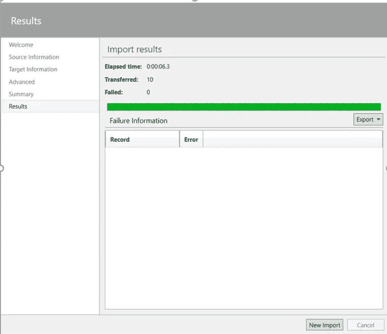
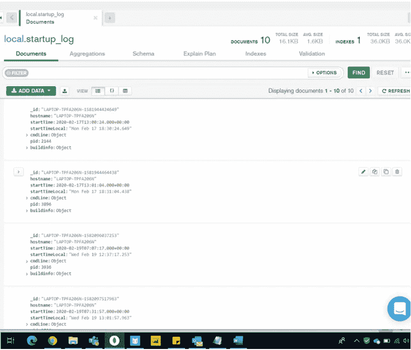
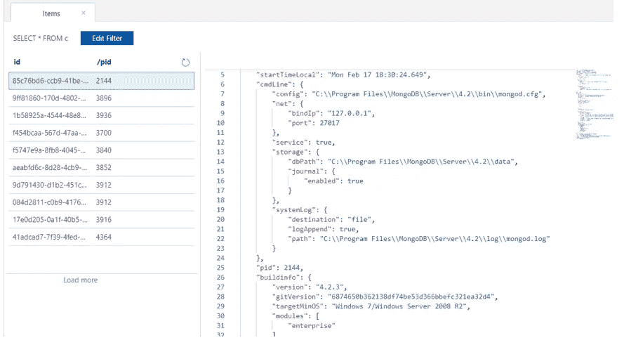

# 使用迁移工具将 Mongo DB 迁移到 Azure Cosmos DB

> 原文：<https://medium.com/analytics-vidhya/migrating-mongo-db-to-azure-cosmos-db-using-migration-tool-c867ea53bbe3?source=collection_archive---------21----------------------->

# 为什么是 Cosmos DB？

当今的应用程序需要高度响应且始终在线。为了实现低延迟和高可用性，这些应用程序的实例需要部署在靠近用户的数据中心。应用程序需要实时响应高峰时段使用量的巨大变化，存储不断增长的数据量，并在几毫秒内将这些数据提供给用户。

# 受益于微软 Azure Cosmos DB 的解决方案

任何 web、移动、游戏和物联网应用程序，如果需要在全球范围内处理海量数据、读取和写入，并且对各种数据的响应时间接近实时，都将受益于 Cosmos DB 有保证的高可用性、高吞吐量、低延迟和可调一致性。了解 Azure Cosmos DB 如何用于构建物联网和远程信息处理、零售和营销、游戏以及 web 和移动应用。

# 移民

用 SQL API 创建一个 Cosmos DB 帐户

当我们使用软件进行迁移时，它仅支持 1 次迁移，相当于 DMS 的离线迁移

**第一步**:

选择信号源

通过传递连接字符串并指定要迁移的集合 make selected，与本地机器上运行的本地 Mongo DB 服务器建立连接

我们在选择集合时非常小心，因为它们应该在连接字符串中指定的数据库中。

**第二步**:

选择目标

我们必须选择要将数据迁移到的选项，因为我们可以选择的选项很少。

在这里，我们必须指定我们将在 Azure 门户上的 Cosmos DB 帐户的 Key 部分中获得的 Cosmos DB 的连接字符串，在那里，我们必须选择 primary key 选项，因为它包含所有必要的端点和密码。

连接字符串不包含将存储数据的数据库，因此必须向其中添加应预先创建的数据库名称和具有相同分区键的容器。

我们还必须指定集合的名称和分区键。

并根据您的需要设置吞吐量。

**第三步:**

跳过高级设置，在摘要中查看迁移的确认信息，然后单击导入按钮，等待它在没有任何错误的情况下完成。

**第四步:**

检查传输的数据量是否与源数据中的数据量匹配。

源数据:

Azure 中的目标数据:

