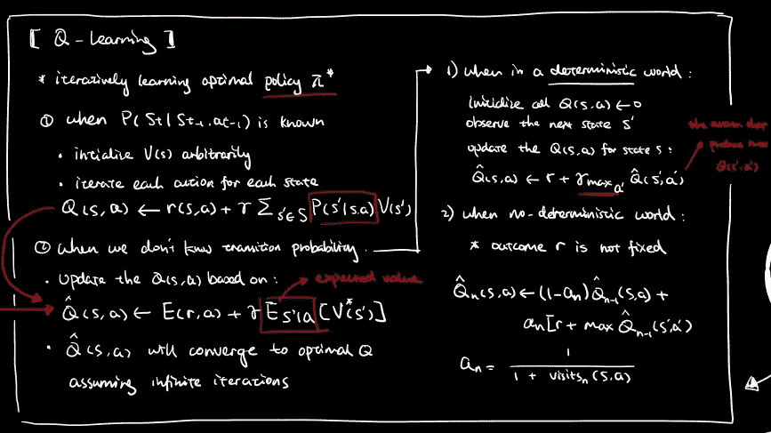

# 用于直觉理解的思维导图机器学习(第一部分)

> 原文：<https://medium.com/analytics-vidhya/mind-mapping-machine-learning-for-intuitive-understanding-part-1-3dbf149028d7?source=collection_archive---------16----------------------->

快速浏览一下机器学习的构建模块

机器学习主题的手写备忘单

*从网站下载高分辨率备忘单:*

 [## 数据分析|可视化设计工作室

### 面向数据科学爱好者的免费数据分析教程和可下载笔记。

www.visual-design.net](https://www.visual-design.net/data-analytics) 

# 1.关联规则挖掘

> 给定一组事务，找出规则，这些规则将根据事务中其他项目的出现来**预测项目**的出现。

## 核心概念:

*   **支持**:包含一个项目集 X 的事务的分数
*   **置信度:**Y 中的项目在包含 X 的事务中出现的频率
*   **lift** : lift 计算为置信度除以支持度，考虑了规则的统计独立性

## 算法:

**Apriori 算法**

*   **生成和测试方法**
*   生成候选项集并测试它们是否频繁
*   **先验原则:**如果一个项集是频繁的，那么它的子集也一定是频繁的
*   **反单调性质**:一个项目集的支持度永远不会超过它的子集的支持度
*   规则生成基于频繁项集和最小置信度阈值

**FP 增长算法**

*   **分而治之的采矿方法**
*   构建**FP 树**,它是事务数据库的一个紧凑表示，并且是按频率有序排列的
*   易于遍历和挖掘基于每个节点的条件模式

# 2.使聚集

> C 光泽分析:寻找对象组，使得一个组中的对象彼此相似，而与其他组中的对象不同。

## 算法:

**K 表示聚类**

*   **划分聚类方法**
*   随机选择**初始质心**并将点分配到最近的质心
*   重新计算质心，直到它们不再改变

**凝聚聚类**

*   **层次聚类方法**
*   基于**邻近矩阵**将单个集群合并在一起
*   邻近矩阵通过特定策略计算，例如最小值、最大值、一般平均值、沃德方法等

**数据库扫描**

*   **基于密度的聚类方法**
*   所有点分为三种类型:**核心点、边界点和噪声点**
*   由两个参数决定:指定的半径( **Eps** )和范围内的最小点数( **MinPts** )
*   集群是围绕核心点形成的

 [## DBSCAN 如何工作，为什么要使用它？

### 首先，这是我在 medium 上的第一个故事，如果我做错了什么，我很抱歉。其次，我不太擅长…

towardsdatascience.com](https://towardsdatascience.com/how-dbscan-works-and-why-should-i-use-it-443b4a191c80) 

# 3.基于实例的学习

> 不是所有的学习算法都是通过学习一个函数来推广的。基于实例的学习是一类不学习算法而是直接与已知实例进行比较的算法。

## 算法:

**k 近邻(kNN)**

*   基于最近的 k 个邻居的标签的分类
*   所有属性都具有相同的权重

**支持向量机(SVM)**

*   基于相对于正类和负类之间的边界的位置对数据进行分类
*   创建一个**超平面**以最大化利润
*   引入**复杂度参数**以最小化分类误差

**SVM 的延伸**

1.  使用**核技巧**当实例是**不可线性分离** *(包括多项式核和 RBF 核)*
2.  **SVM 回归:**将分类问题转化为回归问题
3.  **多类 SVM:** 处理非二元分类

# 4.贝叶斯学习

## 贝叶斯定理:

> 贝叶斯定理提供了一种基于其**先验概率**、假设下**观察到各种数据的概率以及**观察到的数据本身**计算这种假设的概率的直接方法**

## 贝叶斯分类器:

**贝叶斯最优分类器**

*   显式搜索假设空间
*   **用假设的**后验概率**加权假设预测**

 [## 贝叶斯最优分类器简介-人工智能开发中心

### 贝叶斯最优分类器是一个概率人体模型，它可能为一个品牌做出最可能的预测…

aidevelopmenthub.com](https://aidevelopmenthub.com/a-gentle-introduction-to-the-bayes-optimal-classifier/) 

**朴素贝叶斯分类器**

*   假设属性是相互独立的
*   通过属性值的结合来描述实例

 [## 朴素贝叶斯分类器

### 贝叶斯定理是在给定另一个已经发生的事件的概率的情况下，求出一个事件发生的概率

www.geeksforgeeks.org](https://www.geeksforgeeks.org/naive-bayes-classifiers/) 

**贝叶斯网络**

*   考虑属性间的**条件依赖**
*   使用**简单的图形符号**用于条件独立性断言，因此用于完全联合分布的紧凑规范
*   用**条件概率表**表示条件依赖

 [## 贝叶斯信念网络简介-机器学习掌握

### 概率模型可以定义变量之间的关系，并用于计算概率。比如说…

machinelearningmastery.com](https://machinelearningmastery.com/introduction-to-bayesian-belief-networks/) 

# 5.强化学习

> 涉及代理人与提供奖励的环境相互作用的问题；目标是学习如何采取行动以获得最大回报

## 马尔可夫决策过程(MDP)

*   加固问题的数学公式
*   找到将状态映射到行动的最优策略，目标是最大化 T2 价值函数

 [## 去神秘化的强化学习:马尔可夫决策过程(第一部分)

### 第 2 集，揭开马尔可夫过程、马尔可夫回报过程、贝尔曼方程和马尔可夫决策过程的神秘面纱。

towardsdatascience.com](https://towardsdatascience.com/reinforcement-learning-demystified-markov-decision-processes-part-1-bf00dda41690) 

## q 学习

*   当 MDP 和**未知报酬和转移函数**时，代理经常迭代地学习状态和动作的评估函数。
*   对于每个状态和该状态的每个动作: **Q(s，a)** 基于当前 r(s，a)的**即时奖励**和后续状态的**折扣奖励**进行更新
*   即使随机遍历环境，值迭代也是有效的，但是我们必须在无限运行中无限频繁地访问每个状态，以便**收敛到最优策略**

 [## Q-Learning 初学者指南

### 无模型强化学习

towardsdatascience.com](https://towardsdatascience.com/a-beginners-guide-to-q-learning-c3e2a30a653c) 

# 6.数据预处理

## 处理不完整的数据

1.  忽略元组
2.  手动填写缺失的数据
3.  自动填写:*使用全局常数、属性平均值或最可能值*
4.  矩阵分解方法
5.  多重插补

## 处理噪声数据

1.  **宁滨**
2.  **回归**
3.  **聚类**

## 处理冗余数据

1.  **特征选择技术** *，如相关性、启发式搜索、救济或包装*
2.  **主成分分析**

## **处理不平衡数据**

1.  **过采样**少数或**欠采样**多数
2.  **基于聚类的过采样**
3.  **重击**

 [## 如何使用 SMOTE 处理不平衡数据

### 通过 Python 中的案例研究

medium.com](/analytics-vidhya/balance-your-data-using-smote-98e4d79fcddb) 

# 7.异常检测

## 基于统计的方法

*   假设正态数据遵循某种统计模型
*   两种类型的统计模型:

1.  **单变量模型**
2.  **多元模型**

## 基于邻近的方法

1.  **o 的 r 邻居:**基于距离的邻近度量
2.  **局部异常因子(LOF):** 基于密度的邻近度量

 [## 用于异常检测的局部异常因子

### 关于局部异常值因子(LOF)的简短摘要

towardsdatascience.com](https://towardsdatascience.com/local-outlier-factor-for-anomaly-detection-cc0c770d2ebe) 

## 基于聚类的方法

1.  **DBSCAN:** 当离群值不属于任何聚类时
2.  **k 表示:**当离群点远离最近的聚类时
3.  **基于聚类的局部离群因子(CBLOF)** :离群点形成小聚类时

## 基于分类的方法

1.  **暴力破解算法**
2.  **SVM:** 学习正常数据和异常值之间的界限

# 8.数据流挖掘

> 从**实时、连续、有序的**项目序列中提取知识结构的过程。

## 改变漂移检测器:

*   **累积和(顺序分析):**通过比较阈值和漂移速度来检测变化漂移
*   **DDM(统计过程控制)**:由漂移水平和警告水平控制
*   **ADWIN(自适应滑动窗口):**使用指数直方图捕捉错误率的变化

## 分类器:

1.  **基线分类器:** *如多数类分类器、懒惰分类器。决策树等等*
2.  **Hoeffding Tree** :根据即将出现的实例决定是否增长树
3.  **Hoeffding 自适应树:**结合 Hoeffding 树和 ADWIN，因此能够根据概念漂移进行自适应改变
4.  赫夫丁树的其他扩展: VDFT，CVFDT …
5.  **集成分类器** : OzaBag，自适应随机森林

 [## 数据流的机器学习

### 数据流模型的一个核心特征是数据流随着时间而发展，算法必须对这种变化做出反应…

www.cms.waikato.ac.nz](https://www.cms.waikato.ac.nz/~abifet/book/chapter_5.html) 

# 带回家的信息

这是对机器学习中一些基本主题的概述，包括*基于实例的学习、聚类、关联规则挖掘、贝叶斯学习、强化学习、数据预处理、异常检测和数据流挖掘*。此外，简要介绍了每个主题下的算法和核心概念。这篇文章的主要目的是在一个抽象的层次上对概念进行分类和比较。每个主题的详细解释将在以后的文章中给出…

## 更多资源

 [## 如何成为一流的大学

### 轻松学习的四个基本技巧和心理窍门

link.medium.com](https://link.medium.com/hSwWWDqqw9)  [## 数据分析|可视化设计工作室

### 面向数据科学爱好者的免费数据分析教程和可下载笔记。

www.visual-design.net](https://www.visual-design.net/data-analytics)  [## 简化机器学习

### 第 1 部分:机器学习简介

medium.com](/ai-in-plain-english/simplified-machine-learning-concepts-ep1-dd794ee7dd0c)  [## 简化机器学习

### 第四部分:使用主动回忆学习集成方法

medium.com](/dev-genius/simplified-machine-learning-66c7a47cde18)