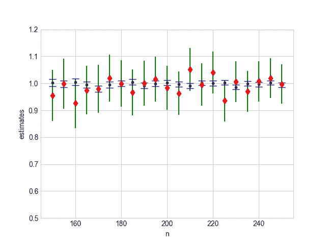

# 注意边缘(I):估计样本的边界/来源

> 原文：<https://medium.com/analytics-vidhya/mind-the-edge-i-estimating-boundary-origin-of-a-sample-17658b6d2fb3?source=collection_archive---------26----------------------->

最近，我想到了一个统计问题。给定一个样本分布，我们如何估计这个分布的极端情况？

这个问题其实可以放在一个非常现实的场景中。例如，每天我们花一些时间在公共汽车站等公共汽车。假设这里考虑的公交路线没有手机 app。一个重要的信息是等待时间的分布，它产生平均、最小和最大等待时间。想象一下最简单的设定，假设等待时间为 0 到 *T* 分钟的均匀分布。我们如何根据出门等车收集的数据来估算 *T* ？

幸运的是，这个问题已经被研究得相当透彻，在这里，我想向读者展示一些直觉，而不需要太多复杂的代数。我也将提出一个计算机模拟的可视化，以帮助读者获得更多的感受。

这个场景中最简单的玩具模型(据我所知)如下。让我们考虑一组正整数 *S* = {1，2，3，…， *N* }，我们定义一个随机变量 *X* ，它以相等的概率从 *S* 中取值。接下来假设我们获取 *n* 个观测值，并收集***X***=*X*1、…、 *Xn* 。 ***X*** 那个井估计 *N* 的作用是什么？用我在学校学到的统计学术语来说，什么是好的统计数据，可以很好地估计出 *N* 。

有几个合理的选择。例如，假设 *n* 足够大，我们期望**X的样本平均值接近于 *X* 的总体平均值，即( *N* +1)/2，因此我们可以将**

2 样本平均值 ***X*** -1

作为一个评估者。这当然不是唯一的办法。对于上过统计学的读者来说，很容易发现最大似然估计量是 max( ***X*** )，也就是说，我们选择历史上我们见证过的最大数作为 *N* 的估计。然而，它并不太好，因为它是有偏见的。可以修改。在大 *N* (或固定 *N* 但使 *S* 连续)的限度内，

(*n*+1)max(***X***)/*n*

是一个无偏估计量，可以很直接地证明这个估计量的方差小于前一个估计量。

为了了解这是如何工作的，下面我取 *N* = 100000， *n* = 150~250，并绘制出比率的模拟结果

(*n*+1)max(***X***)/(*nN*)

用黑点和

(2 个样本平均值的***X***-1)/*N*

红色钻石。

使用 2 个标准偏差绘制误差线。正如我们所看到的，红色菱形波动与宽标准差密切相关。

在这一点上，我希望我已经清楚地提出了一个估计参数域上限的好方法。

然而，这并不是整个故事的结尾。我们可以根据上面的讨论，提出下面的问题。假设公共汽车等待时间具有从 *T* 到 10 分钟的均匀分布。我们如何根据外出等车收集的数据来估算 *T* ？

基于以上经验，我们可以认为合适的估计量是 min ***X*** 。这也是我的感觉。这种直觉又让我想到了机器学习实践中的另一个问题。在本文的第二部分，我将介绍我最近对高维空间中边缘效应的理解。