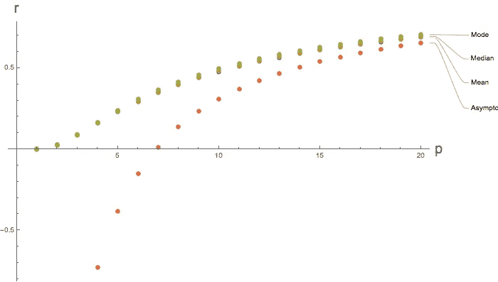

# 注意边缘(II):估计样本的边界/来源

> 原文：<https://medium.com/analytics-vidhya/mind-the-edge-ii-estimating-the-boundary-origin-of-a-sample-6e338db0b955?source=collection_archive---------19----------------------->

在上一篇文章中，

 [## 注意边缘(I):估计样本的边界/来源

### 最近，我想到了一个统计问题。给定一个样本分布，我们如何估计极端情况…

medium.com](/@wh.h.hsiao/mind-the-edge-i-estimating-boundary-origin-of-a-sample-17658b6d2fb3) 

我提出了兴趣问题，并提出了一种思考/解决它的方法。我还补充了一个数值模拟，以可视化或说服读者一种方式似乎优于其他方式。

概括地说，如果我们有一个在某个范围内的基础分布值，为了估计该范围的上限，通常一个足够的估计量是重复实验的最大值。经过一些数字调整后，它可以既充分又不偏不倚，这对统计学家来说通常被认为是“好的”。

这样的知识不足为奇。前一段时间从本科层次统计学学的，我觉得是挺成熟的一门学科。

在这篇文章中，我想分享一个我最近意识到的相关事实。在某种程度上，我认为它也是有文献记载的知识，但我个人认为它太有趣了，不能只被学术界的一小部分人知道。

同样，我想用一个场景来详细说明。假设平面上有一个圆盘。然后你可以指定一个你最喜欢的坐标系来量化圆盘的位置，或者圆盘的中心。然而，圆盘的设计者决定不告诉你这个中心的确切位置。更确切地说，设计者愿意给出从盘中统一随机选择的坐标( *x* ， *y* )，并且允许你想要多少样品就要多少样品。你如何估计和定位这个圆盘的中心？

很自然地，我们可以对这个难题做出许多概括。比方说，我们可以去更低的维度，用区间[ *c* -1， *c* +1]代替圆盘。或者另一方面，我们可以去更高的维度，用一个实心球代替故事中的圆盘，实心球可以用 3，4，…来定义，无论你喜欢哪个维度。

当我第一次看到这个问题时，我的直觉是我可以通过聚焦在具有最小星等的样本上来估计圆盘中心的坐标*x***x*+*y***y*。正如我们在上一篇文章中所做的，一些数字因素需要调整。事实证明，直觉在某种程度上是正确的，只是如果我们去非常高的维度，比如说 26 维的世界，直觉就不是那么有效了。

为了证明这一点，我考虑在一个 *p* 维单位球上均匀分布的 *n* 个样本点，也就是一个外径为 1 的球。然后我从这 *n* 个样本点调查半径最小值的分布。这是一个标准的订单统计练习。足够有趣的是，对于适度大的 *n* 和大的 *p* ，这个分布的中值、均值和众数都趋近于边缘 *r* = 1，而不是 *r* = 0。特别是，它们都有渐近线

1- (log *n* )/ *p*

正文中描述的 n = 1000 的最小 r 分布的众数、中位数和均值。

在上面的图中，我精确地计算了具有不同 p 的 *n* = 1000 的中值、众数和平均值。为了比较，我也画了渐近线。

严格来说，上个帖子介绍的直觉是不会出错的。随着问题规模的扩大，它变得毫无效率。生活在 *d* = 26，或者更高的世界里，被一些问题困扰，似乎不太现实。这个低效率的例子是统计学习中一个挑战的原型，被称为维数灾难。当我第一次意识到这个深奥的概念和我们每天遇到的一些简单的谜题之间的联系时，我激动不已。