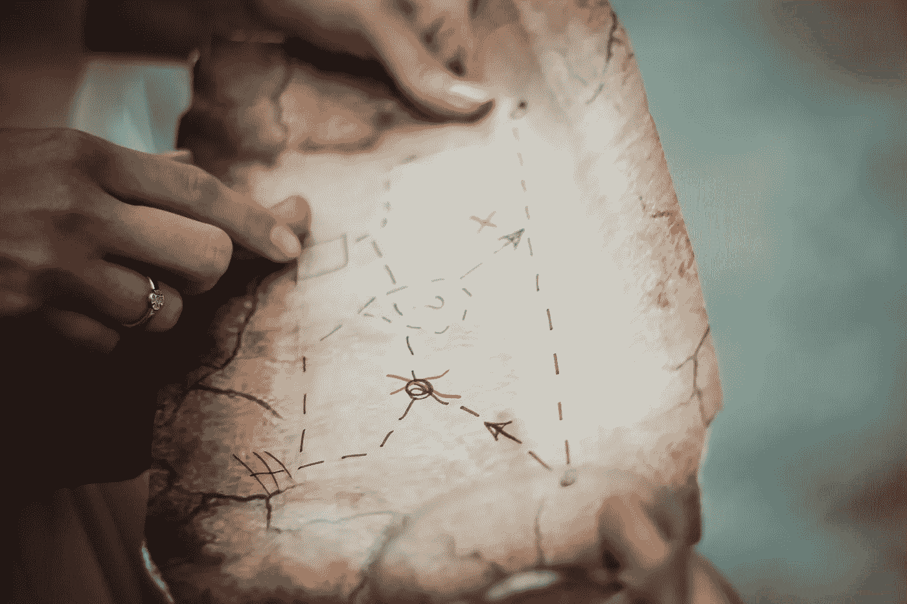
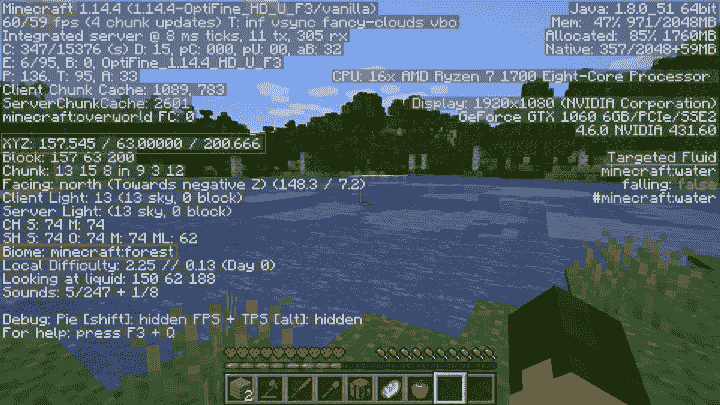
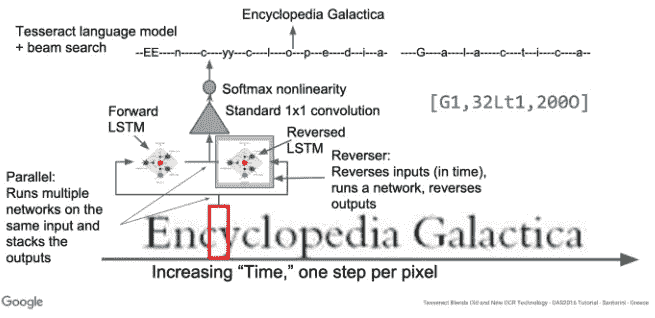
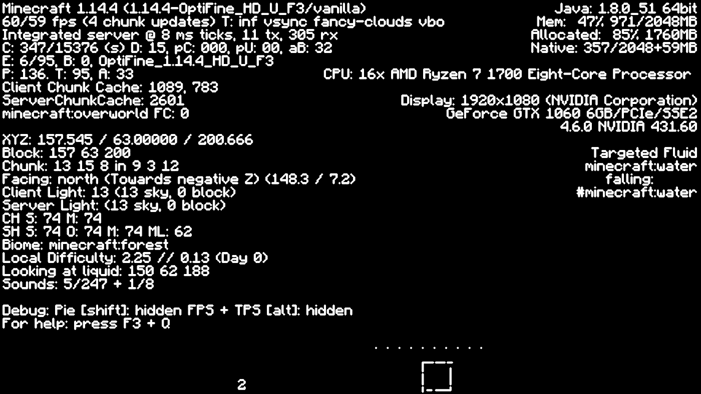
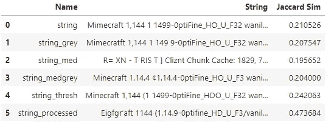
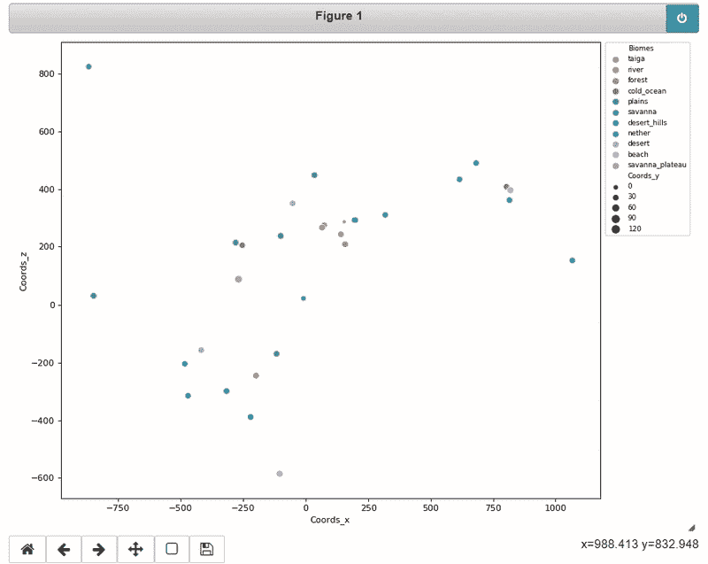

# 《我的世界》制图仪

> 原文：<https://medium.com/analytics-vidhya/minecraft-mapper-ab4478e98297?source=collection_archive---------14----------------------->

## 应用计算机视觉

## 比较 Tesseract 和 Google Cloud Vision OCR 引擎



照片由 N. on Unsplash 拍摄

俗话说“一幅画胜过千言万语”，那么如果一幅画里有千言万语呢？要使该图像有用，首先需要从图像中提取文本。考虑到乍看起来有多简单，这实际上是一项相当棘手的任务。幸运的是，已经有一些非常聪明的人在研究这个问题。在本帖中，我们将讨论使用对象字符识别(OCR)系统来执行一个相对简单的任务:从《我的世界》调试屏幕中提取一些文本。

> 免责声明:这可能不是这项任务的最佳解决方案，而是一个有趣的项目来测试和学习，而不是创建一个优化的解决方案。实际上，我们可能只是使用单个字符识别，而不是成熟的 LSTM，只是在用一些图像处理提取字母组后训练一个简单的字符分类器。由于文本相当僵硬，我们可以制定一个具体的解决方案，也许我会在未来。

## 一些背景

首先，如果你不熟悉《我的世界》调试界面，它经常被用来收集玩家当前所在位置的信息。菲尔·沃森，也被称为菲尔扎，你们中的一些人可能知道他 5 年的不朽的硬核跑步，经常使用这种方法来保存最喜欢的位置。XYZ 旁边给出了玩家的坐标:……(见下图红色方框所示)在基于 Java 的游戏中，按 F3 键会弹出屏幕。随后点击 F2 将保存一个截图，通常保存在 AppData\Roaming\位置。minecraft \截图。我学会了这个巧妙的小技巧，但发现自己希望当我试图记住某个特定位置(如某个特定的生物群落)时，能够以更快可用的方式更容易地提取和汇集数据。



minecraft 中的调试屏幕截图示例，其中突出显示了感兴趣的部分

现在，你是否对《我的世界》感兴趣并不重要。我们将会看到，这是一种应用和测试现有的两个 OCR 引擎的好方法: [Tesseract](https://tesseract-ocr.github.io/) (通过包装器 [pytesseract](https://pypi.org/project/pytesseract/) 使用)和 [Google Cloud Vision](https://cloud.google.com/vision/docs/ocr) API。

Tesseract 最初于 1985 年至 1994 年间由布里斯托尔的惠普实验室和科罗拉多州格里利的惠普公司开发，2005 年由惠普开源。自 2006 年以来，它是由谷歌开发的[1]。宇宙魔方 4，这是我们将使用的版本，增加了一个新的神经网络，长短期记忆。**长短期记忆(LSTM)** 是一种人工递归神经网络，具有处理数据序列而不是单个数据点的反馈连接。本质上，这允许单个字符串成单词/序列。Google Vision OCR 引擎的一般工作流程如下所示。这将允许字母和字符序列被分组和分离，然后被提取。



宇宙魔方如何使用 LSTMs [2]

再说一次，并不是所有这些都太重要，因为我们从事的是使用的**业务。Google Vision API 没有训练的方法，它只是简单地使用开箱即用，而 Tesseract 是用 C++构建的，因此使用 python 包装器减少了模型访问。有些参数可以由 pytesseract 通过 config 参数指定；例如方向、语言和分类引擎。然而，我建议查看一下关于 [pytesseract](https://tesseract-ocr.github.io/tessdoc/ImproveQuality) 的文档或这篇精彩的概述[文章](https://nanonets.com/blog/ocr-with-tesseract/#technologyhowitworks?&utm_source=nanonets.com/blog/&utm_medium=blog&utm_content=%5BTutorial%5D%20OCR%20in%20Python%20with%20Tesseract,%20OpenCV%20and%20Pytesseract) [2】，因为我们不会在这里具体讨论太多细节。**

## 事实真相

现在，这个项目的目标是从图像中提取文本，并以某种方式使用这些文本。要做到这一点，我们需要完成几项任务，这也是这个项目的真正目标:在更真实的环境中组织、练习和解决问题；而不是教科书上令人生厌的重复例子。该项目有几项主要任务，我们将以某种形式进行介绍:

1.  从图像中提取文本——这将需要一些预处理+ OCR 引擎
2.  将文本解析成可用的结构——我们将使用正则表达式
3.  抓取一组图像并序列化以供重用——文件处理和序列化，主要使用 pandas
4.  **从截图中提取文本**

这是我们将使用 OCR 引擎的地方。我不会详细介绍我所做的每一个细节和测试，因为我认为它不会提供任何有用的信息，github 页面上还有一个更详细的 Jupyter 笔记本，但我想提出几点。首先，我从最容易获得的——pytesserac 开始。安装需要几个步骤，但是如果您跟随并在本地运行，安装是相当简单的。我用的是宇宙魔方 4.0 版。您可以使用以下命令获得确切的版本:

```
pytesseract.get_tesseract_version()
[1]: LooseVersion ('4.0.0.20181030')
```

为了获得文本，我使用了以下代码:

```
def get_string(img, config = r'--psm 3'):
    string = pytesseract.image_to_string(img, lang='eng', config = config)
    return stringdef clean_string(string):
    tmp = ''
    for line in string:
        tmp += line.replace('\n', ' ')
    tmp = tmp.replace("'",'"')
    return tmpimg = cv2.imread(os.path.join(screenshot_dir, img_name))
string = get_string(img)
string = clean_string(string)
```

这是本文顶部图像的输出:

```
Mimecraft 1,144 1 1499-0ptiFine_HO_U_F32 wanillas &H/59 fps o chunk updates: T: inf wsanc fancu—clouds vbo Integrated server @ 2 m= ticks, 11 tx, 3685 rx IS T el el O o I S = W 1 1 I o = e E: 6795 E: A, OptiFine_1.14.4_HO F: 136 T: 95, A: 33 Client Chunk Cache: 1829 723 ServerChunkBache: Z6E1 minectattoverworld FCE  ATZ 157.545 / 628606868 ¢ 26860 685 Block: 157 &2 2608 . : Chunk: 12 1528 in9 32 12 e Facing: north (Towards negative 22 (1433 £ 7.2 Client Light: 12 13 =ky, 8 blocks  Serwver Light: 13 sky, 8 blocks  CH S 79 H: 74  SHS 7074 M 79 HL: 62  Biome: minecraft:forest  Lozal Difficulty; 225 £ 812 (Dag &  Looking at Lliguid: 158 &2 188  Sounds: 52497 + 158  Oebug: Fie [shiftl: hidden FFS + TFS [altl hidden  : Digp_ga,%  Jf 3  For help: press F3 + 1 PS A e Rk  - A - A                                           Jdaua: 1208 51 cdhbit Mem: 474 971 2892ME Allozated: 235K 17eBME Hative: 257 =26848+52M6  CEL: 16x AMD Fuzen 7 17688 Eight-Core =Tl =t 19281886 (HYIDIA Corporation?  efgroe 0T 1868 60B/FCle 33E2 C 9 P R R T  Targeted Fluid e s R e falling: fal== #minecraftwater
```

正如你可以告诉只是定性，它并不伟大。提醒我们，我真正关心的是 XYZ 后面的数字:..和生物群落的类型。它在这些章节中摘录了以下内容:

```
ATZ 157.545 / 628606868 ¢ 26860
Biome: minecraft:forest
```

生物群落部分实际上是正确的。现在，一种可能提高准确性的方法是对我们的图像进行一些处理，因为通过一些测试，我注意到 Tesseract 根据字体做得更好。为了理解接下来的处理步骤，如果我们实际上做得更好或更差，我将使用 Jaccard 相似性度量[4]。我们可以这样写:

```
def get_jaccard_sim(str1, str2): 
 a = set(str1.split()) 
 b = set(str2.split())
 c = a.intersection(b)
 return float(len(c)) / (len(a) + len(b) — len(c))
```

在写出我认为是基本事实的东西后，最初的尝试有一个大约 0.2 的 Jaccard 相似度。然后，我开始尝试一些不同的预处理步骤，如转换为灰度，阈值，并应用一些过滤器，试图使文本更容易处理。事实证明，字体的类型起着很大的作用，尽管这种字体看起来非常简单，但事实并非如此。



应用处理步骤后的图像

以下是不同尝试后的结果:



应用不同处理步骤后的 Jaccard 相似性结果

正如你所看到的，最后一组使用阈值处理和一些过滤的处理给出了一个更好的结果。我感兴趣的部分的确切文本，即坐标和生物群落是:

```
8YZ: 157.545 / 63.00000 / 200.666Biome: minecraft.forest
```

这是他们最亲密的一次。下面是我使用的处理代码:

```
def process_image(img):
 thresh_img = cv2.cvtColor(img, cv2.COLOR_BGR2GRAY)
 _,thresh_img = cv2.threshold(thresh_img,220,255,cv2.THRESH_BINARY)
 thresh_img = cv2.GaussianBlur(thresh_img,(5,5), 0)
 thresh_img = cv2.bilateralFilter(thresh_img,5,50,10)
 _,thresh_img = cv2.threshold(thresh_img,50,255,cv2.THRESH_BINARY)
 kernel = cv2.getStructuringElement(cv2.MORPH_ELLIPSE,(3,3))
 thresh_img = cv2.morphologyEx(thresh_img, cv2.MORPH_OPEN, kernel)
 return thresh_img
```

玩了一段时间后，我决定研究另一种方法，这使我想到了 Google Cloud Vision API。同样，这很容易设置。安装指南可以在[这里](https://googleapis.dev/python/vision/latest/index.html)找到，一些文档可以在[这里](https://cloud.google.com/vision/docs/ocr)找到。为此，你需要一个 API 密匙，这是一项你最终可以付费的服务。即使有“永远免费”的使用限制，你也必须有一个有效的付费账户。无论如何，一定要检查所有的文档。我建议您像我一样，在处理每张图像后序列化并保存文本输出，这样就不会过多地调用 Vision API。说了这么多，但是精确度确实是我一直期待的。我们有一个智能卡 sim 卡。0.8 的！是我用宇宙魔方能做到的两倍。更重要的是，我们还获得了我们感兴趣的文本的良好准确性:

```
XYZ: 157.545 / 63.00000 / 200.666
Biome: minecraft:forest
```

因此，我们现在将使用这个解决方案，但是我仍然非常赞成使用本地运行的解决方案，所以我计划将来研究 pytesseract 或其他解决方案。此外，我将图像的最终处理作为图像输入到 Vision API 中。

> 这里的关键是，谷歌视觉解决方案绝对优于宇宙魔方。但是，通过一些处理，从 Tesseract 获得的结果可以得到改善。使用训练有素的网络和关于这些图像的一些知识的更简单但更具体的定制解决方案将是最好的方法。

**2。将文本解析成可用格式**

既然我们已经以足够准确的方式从图像中获得了文本，我们就可以解析它，只收集我们关心的部分。为此，我使用了标准的[正则表达式库](https://docs.python.org/3/library/re.html)。这是我的两个功能:

```
def get_coords(data):
    p = re.compile(r'-?\d+\.\d+\s?\/\s?-?\d+\.\d+\s?\/\s?-?\d+\.\d+')
    coords = p.findall(data)
    if coords:
        coords = re.findall(r'-?\d+\.\d+', coords[0])
        coords = [float(x) for x in coords]
    else:
        pass
    return coordsdef get_biome(data):
    p = re.compile(r'Biome\: minecraft\:?(\w+)')
    biome = p.findall(data)
    return biome
```

> 注意:由于我从 Tesseract 获得的文本非常接近，我可能会在正则表达式中使用一些变化来解释任何不准确之处，而不是从图像中获得完美的文本。这也是需要进一步探索的。

上面给出了坐标列表的输出:[157.545，63.0，200.666]和生物群落“森林”。

**3。抓取图像集，序列化并绘制**

这部分是比较直截了当的部分。我们只需浏览截图目录中的所有文件，并将保存的位置、生物群落和文本添加到 JSON 文件中。在我看来，创建一个熊猫数据框架是处理这个问题最简单的方法。我还实现了一个检查，看看我们是否已经处理了截图，以免浪费 OCR 计算时间。首先，迭代的主要步骤:

```
def do_steps(entry):
    coords = None
    biomes = None
    img = cv2.imread(entry.path)
    processed_img = process_image(img)
    string_vision = get_string_gvision(processed_img)
    string_vision = clean_string(string_vision)
    coord = get_coords(string_vision)
    biome = get_biome(string_vision)
    if coord:
        coords = coord
        if biome:
            biomes = biome[0]
        else:
            biomes = 'unknown'
    return entry.name, string_vision, coords, biomes
```

主迭代循环处理图像的读取并保存到 JSON，同时检查图像是否已经处理过:

```
df = None
try:
    df = pd.read_json(os.path.join('output','dataframe.json'), orient='records')
except ValueError:
    print('No dataframe found, creating new.')if df is None:
    print('[INFO] Creating dataframe...')
    df = pd.DataFrame(columns=['Screenshot', 'Text', 'Coords_x', 'Coords_y', 'Coords_z', 'Biomes'])
    for entry in os.scandir(screenshot_dir):
        if entry.path.endswith(".png") and entry.is_file():
            entry_name, text, coords, biomes = do_steps(entry)
            if coords:
                print('[INFO] Adding new entry: {}'.format(entry.name))
                df = df.append({'Screenshot': [entry_name], 
                                'Text': text, 
                                'Coords_x': coords[0],
                                'Coords_y': coords[1],
                                'Coords_z': coords[2],
                                'Biomes': biomes}, ignore_index=True)
            else:
                print('[INFO] no coordinates found: {}'.format(entry.name))else: #df already exists
    for entry in os.scandir(screenshot_dir):
        if entry.path.endswith(".png") and entry.is_file():
            if entry.name in df.Screenshot.str[0].values:
                print('[INFO] Entry already exists: {}'.format(entry.name))
            else:
                print('[INFO] Adding new entry: {}'.format(entry.name))
                entry_name, text, coords, biomes = do_steps(entry)
                if coords:
                    df = df.append({'Screenshot': [entry_name], 
                                    'Text': text, 
                                    'Coords_x': coords[0],
                                    'Coords_y': coords[1],
                                    'Coords_z': coords[2],
                                    'Biomes': biomes}, ignore_index=True)
                else:
                    print('[INFO] no coordinates found: {}'.format(entry.name))

df.to_json(os.path.join('output','dataframe.json'), orient='records')
```

终于有情节了！我使用散点图，将显示悬停截图的缩略图。这是 matplotlib 和 seaborn 的组合。我不得不称赞这个[帖子](https://stackoverflow.com/questions/42867400/python-show-image-upon-hovering-over-a-point)的形象展示。



显示截图、位置和各自生物群落的标绘数据。

## 未来更新

我总是喜欢添加一个未来工作部分，也许是出于科学写作的习惯，但也是为了让我未来的自己可以探索这个项目或下一个项目的改进。

*   当然，正如我提到的，为这个任务创建一个定制的解决方案将允许它在本地运行，并且使用标准的图像处理和简单的字符识别模型架构应该很容易做到。
*   更有效的图像序列化，像 hdf5 而不是 json。
*   一个不同的情节，也许使用 plotly 或一些基于网络的可视化，使其更容易访问。

如果你在这篇文章的任何部分提供了一些有用的信息或一点灵感，请考虑给予认可，并关注我以获取更多信息。

你可以在我的 [github](https://github.com/robintwhite) 上找到源代码。

# 参考

1.  宇宙魔方光学字符识别。【https://github.com/tesseract-ocr/tesseract 
2.  泽卢克和萨贝尔。使用 Tesseract、OpenCV 和 Python 进行 OCR 的综合指南。2020 年 1 月。[https://nanonets.com/blog/ocr-with-tesseract/](https://nanonets.com/blog/ocr-with-tesseract/)
3.  沃克 j，藤井 y，Popat A. C..2018.[基于网络的文档 OCR 服务](https://das2018.cvl.tuwien.ac.at/media/filer_public/85/fd/85fd4698-040f-45f4-8fcc-56d66533b82d/das2018_short_papers.pdf)。
4.  古普塔。Python 中文本相似性度量的概述。[https://towards data science . com/overview-of-text-similarity-metrics-3397 c 4601 f 50](https://towardsdatascience.com/overview-of-text-similarity-metrics-3397c4601f50)。2018 年 5 月