# 使用 Tensorflow + Python 和谷歌 Colab 进行销售收入预测的迷你人工神经网络

> 原文：<https://medium.com/analytics-vidhya/mini-ann-to-predict-sales-revenue-using-tensorflow-python-with-google-colab-e9ebb0c8349b?source=collection_archive---------6----------------------->

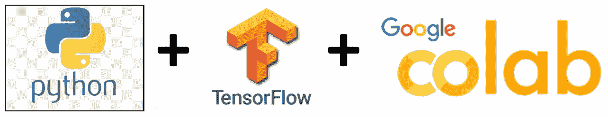

# 介绍

在当前的市场中，每家公司都希望根据不同的参数来预测他们产品的销售。这有助于任何组织根据未来的预测来计划和完成所有事情。这种预测有助于并保护组织免受任何即将到来的损失，或者多次允许盈利。

# 业务挑战

一家公司拥有冰淇淋业务，它希望建立一个模型，根据温度(摄氏度)预测冰淇淋销售的每日收入(美元)。为此，公司决定构建一个简单的人工神经网络来解决这个问题。所提供的数据将以气温为输入，以美元计算的总日收入为输入。

# 机器学习完整项目

在本项目中，将开发一个微型人工神经网络，作为回归模型，并根据输入参数进行预测。将使用 Scikit learn 中的回归工具包(一种用于此类问题的经典且非常有效的机器学习方法)对该模型进行交叉验证。

> ***导入数据集***

在这个项目中，使用了一个名为 SalesData.csv 的数据集，该数据集可以从链接[中下载。usp =共享](https://drive.google.com/file/d/1pZeKsoDFMyTvxC-YndiHu_huto4WOreA/view?usp=sharing)。也可以通过链接[https://git hub . com/sushan Kumar-estech/使用 mini-ANN 预测销售收入/blob/master/SalesData.csv](https://github.com/sushantkumar-estech/Prediction-of-sales-revenue-using-mini-ANN/blob/master/SalesData.csv) 来可视化整个数据集。

数据集 2D 阵列 500 行 X 2 列，其中第一列显示温度，将在模型训练期间用作输入，第二列显示收入，将在模型训练期间用作输出。

数据集的顶行是这样的:

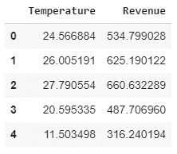

导入数据集的前 5 行

以及数据集的最后五行:

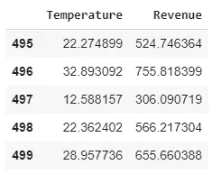

同一数据集的最后 5 行

还有一些关于数据集的更多信息

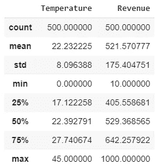

数据集的详细信息

还有更多。

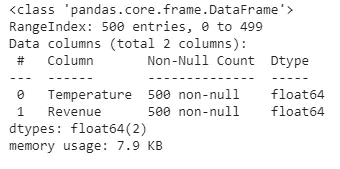

有关数据集中数据类型的详细信息

> ***数据集可视化***

下图显示了温度(单位为 C)与收入(单位为美元)之间的曲线。曲线中的每个蓝点都显示了与一天中的温度相对应的收入金额。

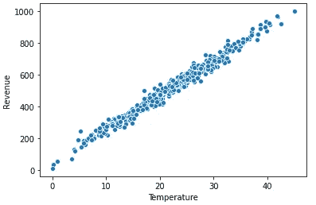

温度[ C] v/s 收入[美元]曲线

从该曲线可以很容易地预测到，收益与日温度成线性关系，即如果日温度增加，收益也会增加。但是不知道斜率(m)和截距(b)。(注:直线方程为 Y = mX+b，其中**‘m’**为直线的斜率，**‘b’**为截距)。

> ***创建模型***

如上所述，该模型是一个微型人工神经网络，由一个输入层、几个隐含层和一个输出层组成。因为在本项目中有一个值，即 X，即温度(单位为°C ),根据该值将计算另一个值，即 Y，即收入(单位为美元)。这就是为什么模型的输入层和输出层只有一个神经元的原因。还提到它将是迷你神经网络，所以隐藏层只有一个神经元，这对于这样的应用将是足够的。所有三层，每层一个神经元，彼此完全连接。

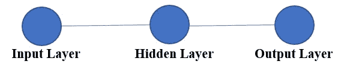

模型结构

创建的模型摘要如下:

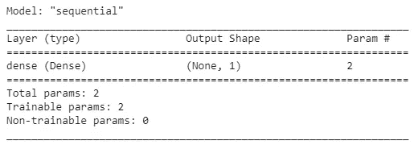

模型摘要

如前所述，这是一个迷你人工神经网络，只有 2 个参数，需要训练。一个代表斜率(m ),另一个代表截距(b ),以完成直线方程，即 Y=mX+b。

> ***训练模型***

为了训练模型，数据集需要通过，或者换句话说，模型需要适合数据集。在训练时，参数如优化函数、时期数、验证分割等。需要决定。这些值对模型的训练有影响。必须始终防止模型过度拟合或拟合不足。

对于这个项目“Adam”优化器，选择了 100 个时期和验证分割= 0.2。该模型根据数据集中的 400 个值进行训练，同时针对 100 个值进行验证。

随着模型开始被训练，一个时代接一个时代，模型变得更好，损失开始减少。在前 10 个时期期间，在对训练和验证数据进行训练时，模型的性能总结如下:

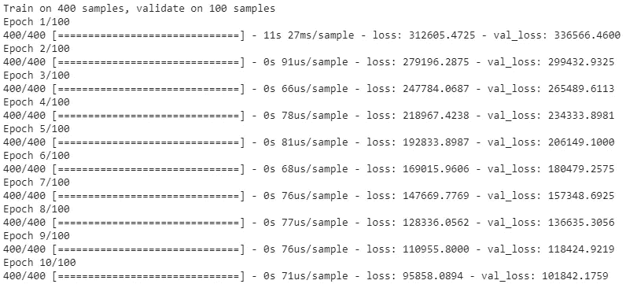

从摘要中可以看出，第一个历元之后的训练损失是 312605.4725，验证损失是 336566.4600。(此处计算的损失是均方误差，其计算方法是将实际输出和预测输出之间的所有差异相加，然后除以数据集的输入数，即训练数据集为 400，验证数据集为 100。想了解更多关于‘均方误差’的信息，请查看链接:[https://www . freecodecamp . org/news/machine-learning-mean-squared-error-regression-line-c 7 DDE 9a 26 b 93/](https://www.freecodecamp.org/news/machine-learning-mean-squared-error-regression-line-c7dde9a26b93/))

从 36 到 46 个时期的模型性能总结如下所示:

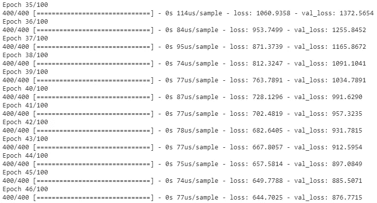

在这里，可以看到损失的减少，训练损失可以从 1060.9358 下降到 644.7025，验证损失可以从 1372.5654 下降到 876.7715。

模型在过去 10 个时期的性能总结如下:

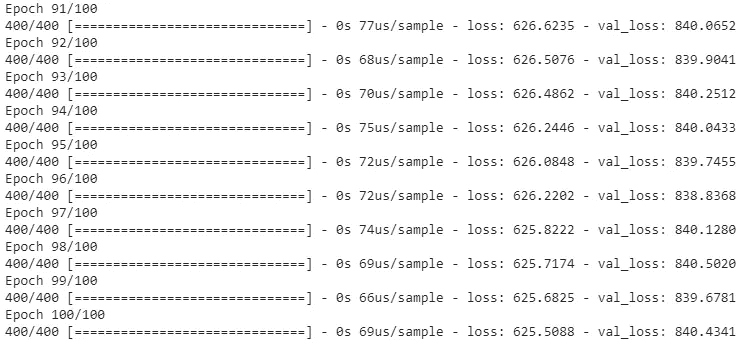

在最后一个时期，损失变得稳定，不再减少。这些是模型在给定参数值下的最小损失

> ***评估模型***

模型损失 v/s 历元图显示了训练损失如何随着历元数量的增加而减少。

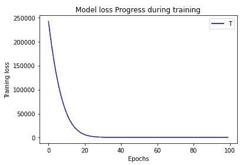

可以看出，损耗随着时期的增加而减少，但是在 35 个时期之后它们变得饱和，并且损耗的进一步减少可以忽略不计。

验证损失也显示了同样的行为。从下图中可以看出，它们也随着时期数的增加而减少，但在 35 个时期后几乎达到饱和。蓝线表示培训损失，红线表示验证损失。

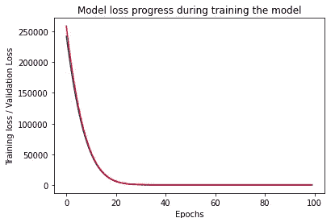

100 个时期对于训练具有上述超参数的这种模型来说是足够的。该模型也可以用更少的时期来训练，并且可以达到与用 100 个时期训练它之后所达到的相同的精度。

如前所述，模型中有两个参数需要训练。所以经过训练，他们的数值是 22.191706 和 25.261503。因此对于线性直线方程，斜率(m) = 22.191706，截距(b)=25.261503，这使得方程 Y=22.191706*X+25.261503，或者对于这个项目，它将是收入(美元)= 22.191706 *温度(摄氏度)+25.261503。

如下所示，迷你人工神经网络模型使用上述模型方程预测了同一数据集的输出。(当然，模型自己做，只有值需要通过它传递)。可以看出，模型预测线(显示为红色)最符合数据集。模型在可用数据集上表现良好。

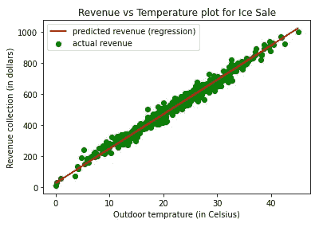

> ***使用模型*** 进行预测

为了使用经过训练的迷你 ANN 模型进行预测，5℃的温度值通过该模型，这给出了收入= 134.55237 的输出。

> ***使用 Scikit learn*** 中的回归工具包确认模型

Scikit learn 有可用模型，专门用于执行回归任务。对于这种线性回归，在相同的数据集上调用和训练。训练参数后，斜率(m)为 21.44362551，截距(b)为 44.83126709。

将这些参数值与训练微型人工神经网络后得到的值进行比较，斜率差为 0.74808049，截距差为 19.5697641。

下图显示了 Scikit learn 线性回归模型对同一数据集的预测输出。

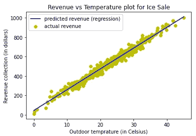

对于使用经过训练的 Scikit learn 线性回归模型的预测，5°C 的温度值通过该模型，这给出了收入= 152.04939464 的输出。比较 Scikit learn 线性回归模型的输出和 mini ANN 模型的输出，有 17.497025 美元的收入差异，这是因为它们的斜率(m)和截距(b)值不同。

# 结论

如果与给定的数据集值进行比较，迷你人工神经网络模型表现良好，并且与 Scikit learn 线性回归模型的收益输出范围相同。迷你 ANN 模型可以通过改变超参数值或者通过添加更多的隐藏层或者通过在隐藏层中添加更多的神经元而变得更好

# 应用

这种模型可以用在任何需要基于可用的过去数据集进行预测/预报的商业应用中。

# 参考

数据集的完整代码可以从下面的 Github 库下载。

[https://github . com/sushantkumar-estech/Prediction-of-sales-revenue-using-mini-ann . git](https://github.com/sushantkumar-estech/Prediction-of-sales-revenue-using-mini-ANN.git)

# 注意

此外，如果你是机器学习的初学者，并且热衷于了解更多，那么你可以搜索 GitHub 帐户 **sushantkumar-estech** 或者可以使用链接【https://github.com/sushantkumar-estech】的来了解有趣的项目

从你的练习愿望中选择任何项目，如果有任何问题，你可以写信给我。我很乐意帮忙。

享受阅读，快乐学习！！