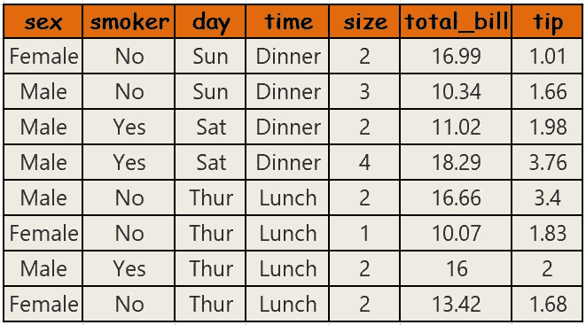
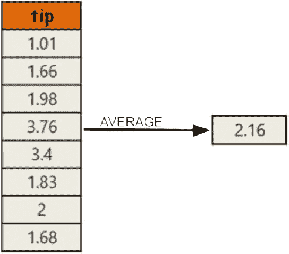
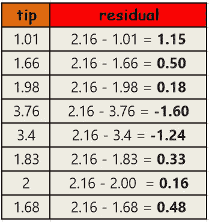
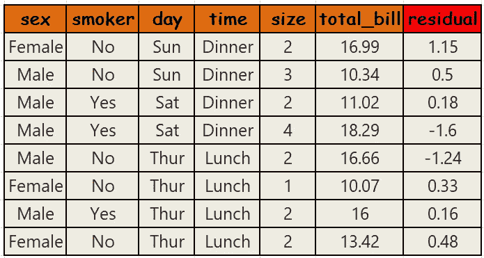
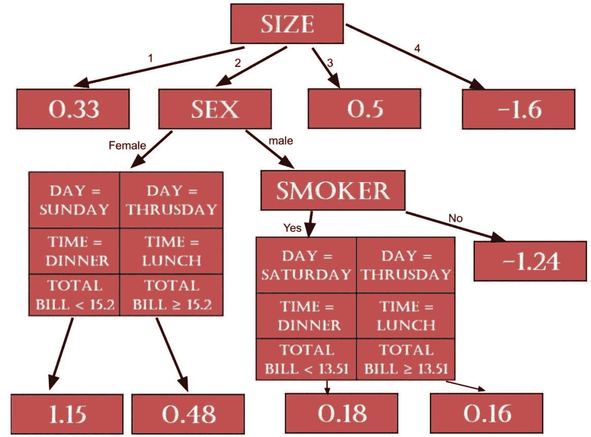
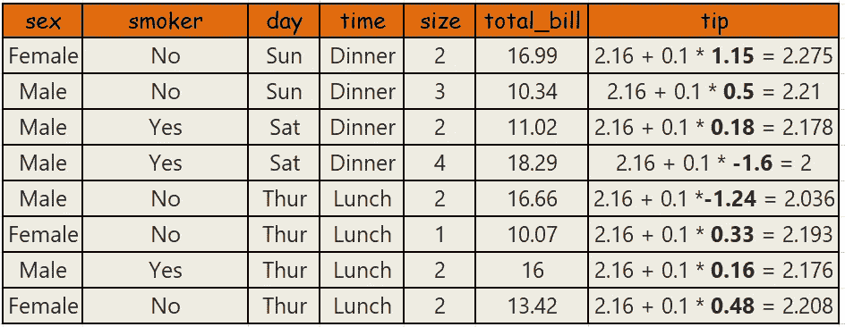
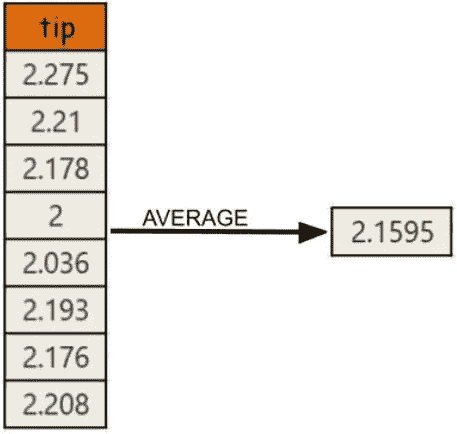
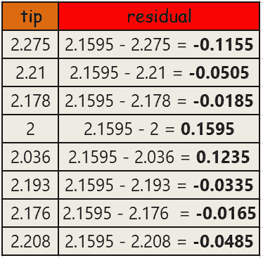
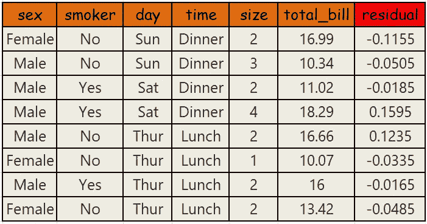

# 通过学习梯度推进回归来最小化你的错误

> 原文：<https://medium.com/analytics-vidhya/minimize-your-errors-by-learning-gradient-boosting-regression-2c002c65a064?source=collection_archive---------15----------------------->

梯度推进是一种推进算法，主要用于回归以及机器学习中的分类问题。

在这篇博客中，我们将了解梯度推进回归算法如何为数据集生成连续值。但是在我们开始我们的模型工作之前，我们必须知道如何建立一个决策树。所以，如果你不熟悉决策树，你可以 [**点击这里**](/analytics-vidhya/a-deep-dive-to-decision-trees-6575e016d656?source=friends_link&sk=82fb99bb05d07712858d642c840ae29a) 来了解**决策树是如何构建的**

## 关于梯度推进算法的一些要点是→

1.  梯度增强基于单个 [**叶**](https://drive.google.com/open?id=1UGUsRLbXBvGdCsM4Nc60fd5fW5SUBfsX) ，并且该叶代表所有样本的初始猜测
2.  我们首先猜测的是平均值。然后梯度推进建立树。
3.  梯度提升是基于前一个决策树产生的错误。

## 模型是如何工作的？

为了探索梯度推进模型的工作原理，我们将使用“TIPS”数据集，其中我们需要预测数据集中的“tip”列。

***第一步*** :首先我们将计算‘tip’列的平均值。

****

*****第三步*** :现在，我们必须使用这个新的数据集来构建决策树。**

****

**分析完成后，建立的回归树是:**

****

***** * IMP * ***→要了解这个回归树是如何构建的，你可以通过 [**点击这里**](/@soumo.villa7/how-regression-with-decision-trees-works-ba8b523097cf?source=friends_link&sk=5f4153c5e50da3bebf58a7a798aab5de) 来检验这个博客。**

****IMP NOTE** →如果最后有一个以上的残差值落在一个叶类别中，那么我们必须对这些值进行平均，例如，如果 1.15、0.18 和 0.16 在一个叶节点中，那么(1.15 + 0.18 + 0.16)/3 = 0.4966 将是叶节点的值。**

*****第四步*** :之后，第一次训练过程完成。在下一个训练过程中，首先我们将使用 **Average tip +(学习率*来自新测试功能树的剩余结果)**计算我们对此数据集的预测。在这里，学习率是一个超参数，因此我们可以根据我们的数据集调整或更改它，以获得最佳结果。**

***示例* →对于我们数据集中的第一行，预测值为:2.16 + 0.1 * 1.15 = 2.275**

*****第五步*** :现在，我们将通过对数据集使用新的预测来形成新的数据集。**

****

**步骤 6:在此之后，我们将再次计算我们的新预测的平均小费，即**

****

**在此之后，我们将**再次计算残差，并为预测**制作新的回归树。**

********

****注** →来自该数据集的新回归树的结构可能与先前的不同。**

*   **** ****IMP**** **→这里不打算构造回归树。只是要注意，第二训练过程的 tip 预测将=第一平均 tip +(学习率*来自第一回归树的残值)+(学习率*来自第二回归树的残值)**
*   **因此，当我们继续训练我们的数据集 N 次时，对于一组新的特征，如果我们想要预测输出，那么它将等于:**第一平均 tip +(学习率*来自第一回归树的残值)+(学习率*来自第二回归树的残值)+(学习率*来自第三回归树的残值)+………………..(学习率*第 n 棵回归树的残值)****

**因此，我们刚刚意识到梯度推进算法如何在机器学习中工作，并可以实现各种回归问题。希望你已经掌握了梯度推进的关键概念。如果你对这个话题有任何疑问，请在评论中告诉我，在此之前，请享受学习的乐趣。**