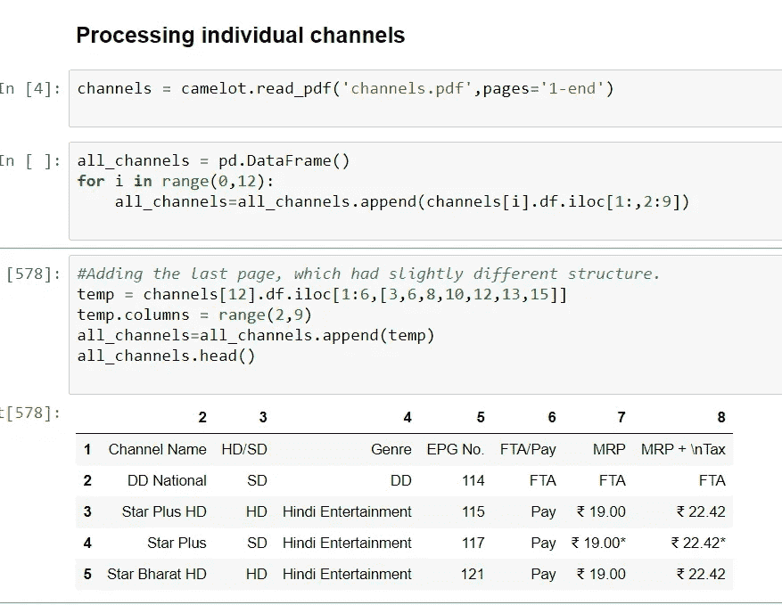
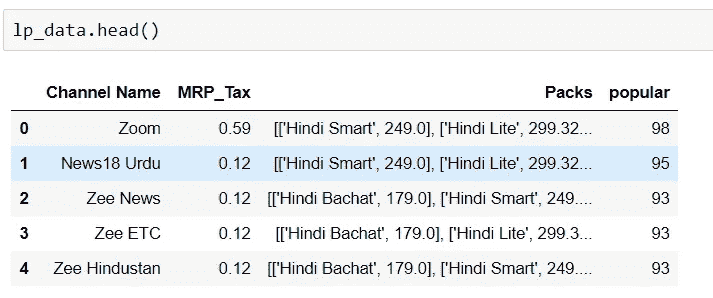

# 用整数规划(和纸浆)最小化菜单选择成本

> 原文：<https://medium.com/analytics-vidhya/minimizing-tata-sky-bills-with-integer-programming-and-pulp-be3a95877c58?source=collection_archive---------19----------------------->

*(以及重新构建问题如何导致简单的解决方案)*

塔塔天空是一家印度电视网络提供商，像所有此类提供商一样，它提供了一系列错综复杂的独立和捆绑频道供用户选择。鉴于我很少使用，我一直想尽量减少我在他们服务上的巨额支出，但实际上浏览他们的目录并计算我是否会更好地使用一个包，或者一个独立的频道，或者两者的某种复杂组合，是一项相当艰巨的任务，我一直推迟到我意识到这是一个我可以用整数编程解决的问题。

在我想出了一个方法之后，让我着迷的是，一旦这个问题以一种稍微不同的方式被框定，它会变得多么微不足道。这种重构，而不仅仅是解决方案的技术细节，是我写这篇文章的动机。

# 问题是

Tata Sky 提供超过 300 个付费频道(和 275 个免费频道),以及大约 170 个包，由大约 54 个频道的中间值组成，一些大的包数以百计。我们的目标是选择独立频道和软件包的组合，为用户提供所需的所有*SaaS-胡巴系列*，同时将支出降至最低。要找到这项任务的最佳组合，需要搜索包和独立通道的整个空间，这是一项相当艰巨的手动任务，这就需要整数编程。

# 线性和整数规划

一般的线性规划问题可以表示为:

我们本质上是在给定一组线性约束和实值决策变量的情况下，试图最小化一个线性函数。经济、商业、车辆路线、调度中的许多问题都可以作为线性规划(LP)来建模和求解。

然而，我们要使用的是 LP 的一个变体，其中决策变量被进一步限制为整数，在我们的例子中，只是二进制的。一个常见的问题是背包问题。

基本背包问题([环节](https://www.codesdope.com/course/algorithms-knapsack-problem/))

简单地说，这里的目标是最大化包中物品的价值，同时满足其携带限制。然而，我们正在解决的是这个问题的逆问题:我们试图在保留观看所选频道的能力的同时最小化成本。

从计算角度来看，这并不是一个简单的解决方案。虽然大多数线性程序在多项式时间内是可解的，但是对于整数程序却没有这样的保证，在最坏的情况下，整数程序具有指数复杂性。如果我们选择 50 个我们希望能够观看的频道，并且我们知道有 100 个包装至少具有这些频道中的一个，那么我们有 2 个⁵⁰组合来搜索！

一个线性规划可以在灰色区域取任何值，而一个 IP 解决方案只能是其中一个蓝点。

为了实现这一点，我将使用 PuLP，这是一个用于线性优化问题的 Python 建模库。

不过，先说数据。

# 数据，数据，数据…

正如人们常说的，ML 的困难部分——尽管这并不是真正的 ML——是数据，而且创建这个解决方案的大部分时间都花在了 ETL 上。由于 Tata Sky 没有通过提供现成的开源数据集来让我轻松做到这一点，所以第一步是找到一种方法来构建它。

这里最直接的解决方案是从他们的网站上抓取数据，但由于我不确定这背后的合法性，我决定谨慎行事。幸运的是，我在网上找到了一些 pdf 文件，它们带有格式相对较好的表格中的频道和包。因为，pdf 是基于文本的。我可以通过点击和拖动从文档中选择文本，我可以使用 Python 的 Camelot 库从文本中提取数据。

从几乎完全由单个频道表组成的 pdf 中提取单个频道信息相对简单。

是的，从第 4 个到第 578 个被执行的单元格——这是一个笔记本的组装！

然而，这些包明显更难，有很多错误和不一致，并且在验证方面需要更多的东西。

没错，是组装的，但弄清楚还是挺有趣的。

这个漫长的数据步骤的最终结果是一个表，其中包含所有 588 个不同的频道、它们的独立价格以及它们所属的所有包的列表。

目前，流行栏只是一个频道所属的所有包的简单计数，不可否认，这不是一个频道流行度的良好估计。

最后，这导致了建模。

# 解决方案

我对这个问题的最初框架有一个相当基本的缺口:我无法找出一种方法在通用 IP 框架内链接包和通道。在背包问题及其逆问题中，每个项目本质上是一个单一的事物，可以用{0，1}决策变量排除或包含在最优解中。但是，在这里，我们有两层项目:

*   单数项目，即。独立频道。
*   由大量独立频道组成的包。

包含一个包——比如说英语新闻——意味着包含大量的频道。最初，我设想了类似于每个包的查找表的东西，试图将这些关系编码到问题中，但这不适合 LP 框架，并且肯定不能由标准求解器解决。

然而，最终，我意识到只需要稍微调整一下约束。我可以使用约束来间接地创建通道和包之间的某种连接，而不是直接创建。

让我举个例子来说明这一点。

假设，我们选择 5 个通道。

生成的最小化函数由 5 个通道本身和 33 个包含至少 1 个通道的独特包组成。频道和套餐被编码为布尔决策变量(c 和 x ),并乘以各自的价格。

5 个频道，33 包。

除此之外，我们还有 5 个约束，分别针对 5 个选定的通道。每个约束由一个通道变量和包含该通道的所有包组成。例如，HBO HD 的约束包含 16 个决策变量— 1 个用于频道，15 个用于包含 HBO HD 的所有不同包装。

纸浆对 HBO HD 产生的约束

这编码的意思是，既然我们想要 HBO HD，我们需要为频道本身付费，或者至少为包含它的一个包付费。这是一个不平等的约束，因为只要总支出最小化，我们就不在乎订阅任何特定频道多少次，只要我们至少订阅一次。

这巧妙地解决了我们在链接包和通道时遇到的问题。通过在约束函数中为通道指定包，我们不需要在它们之间显式地链接，因为包的选择显式地满足了它所包含的通道的约束。

仅此而已。

在这种近乎退化的情况下，最佳解决方案是选择每个单独的通道。

然而，如果有更多的频道选择，我们可以得到更有趣的建议。有了大约 100 多个随机选择的频道，我们得到了这个，这肯定比选择更大的包装便宜得多——这可能花费高达 1000 英镑——或者只是单独购买频道，这花费超过 500 英镑。

# 结论和代码

整数编程代码可以在我的 [GitHub](https://github.com/AbhishekKaps/Integer-Programing-with-PuLP) 中找到，还有通道和包的数据。

纸浆文档是介绍这一领域的极好资源，可以在[这里](https://pythonhosted.org/PuLP/main/optimisation_concepts.html)找到。

我的下一步是想出一个方法来保持包装和渠道信息的更新。此外，我在最初的解决方案中忽略了一些复杂性，例如多电视支持的成本等，我计划将它们也加入进来。最后，通过我的(第一个)网络应用程序来部署它。