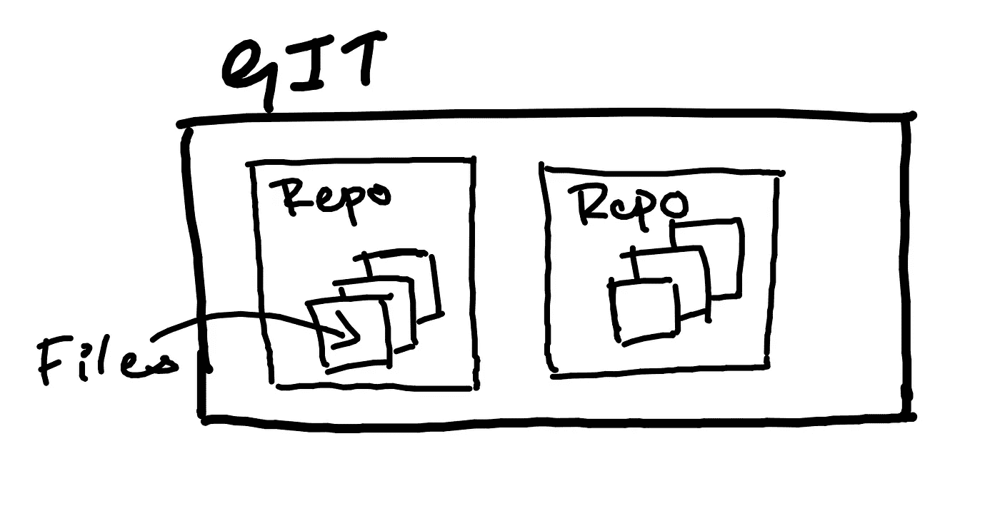
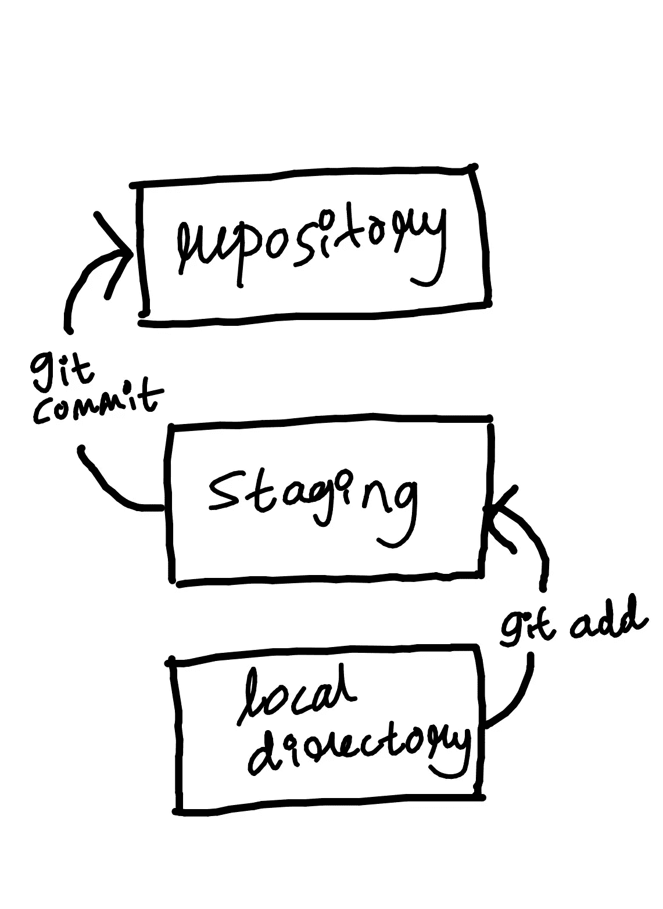
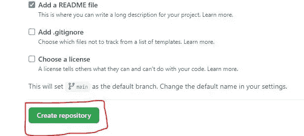
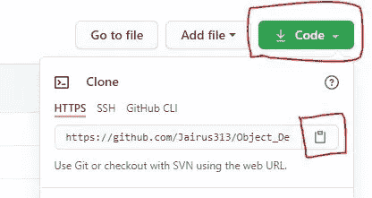

# 每个 IT 人员都必须知道的最低限度的 GIT 知识。！

> 原文：<https://medium.com/analytics-vidhya/minimum-git-knowledge-that-every-it-guy-must-know-a6ce2e52e33c?source=collection_archive---------11----------------------->

所以 GIT 在当今的 IT 世界变得如此重要，以至于一个没有 GIT 知识的人被认为是个笑话(无意冒犯🤫).但是没错。你知道要点了，GIT 被全世界所有的公司大量使用，从实习生到开发团队的领导、主管和副总裁。GIT 也让整个 IT 世界比 2005 年的 IT 世界更加容易。因此，在本文中，我们将介绍一些基本但必要的 GIT 概念以及 GitHub。


# 那么 GIT 是什么？🤔

GIT 是一个开源的分布式版本控制系统，为你的团队中的项目编码而设计。简而言之，在你和你的队友之间会分配一个项目，你和你的队友会将你的部分源代码分享给某种分布式系统，然后这些完整的源代码会被运送到现实世界。简单。！

# **GIT 如何工作？🤓**

让我们假设你有一个项目要做，你会写一些 4-5 个脚本来完成所有的任务，并将其保存在一个目录或文件夹中，这被称为 **GIT 库。** git 存储库将简单地在一个文件夹下拥有项目所需的所有脚本和配置文件，同样地，多个项目将在 Git 中拥有多个 repos(“repos”是 Git 存储库的缩写，听起来很酷😂).



抱歉，我画得不好

你也可以在文件夹里有文件夹。例如，如果您完成了项目，稍后您想添加一些额外的功能，但您不确定新的更改是否会中断或生成项目。在这种情况下，我们将在一个文件夹中制作一个现有代码的副本，将文件夹名称命名为“main ”,将复制的文件夹名称命名为“extras ”,如果“extras”文件夹中的代码有效，您只需将“main”替换为“extra”文件夹即可。所以 git 中的这个功能我们称之为**分支**。分支是一个过程，其中现有的代码被进一步复制用于新的开发，留下现有的代码作为备份以防失败。这里的“主”文件夹被称为**主**或**主**分支,“附加”文件夹可以像 dev1、dev2 等那样随意调用。并且替换文件夹将被称为**合并分支。**


对于修订版，**库**是项目的文件夹，**分支**是每个构建的文件夹，其中主工作代码文件夹被称为 **Master** 或 **Main** ，其余的只是您将赋予其名称的分支，用当前工作文件夹替换新的工作文件夹被称为**合并分支。**

要使用 git，将您的代码从本地目录获取到 git repo 总共需要三个阶段，即**本地** **目录**、**暂存**和**存储库。本地** **目录(您的 pc)** 是您编辑代码的文件夹，您可以进一步将代码推送至**暂存(推送前决定)**，这意味着代码将被暂存，但不会被推送至任何回购，在此阶段，您将决定需要将代码推送至哪个分支，将代码推送至 git 称为**存储库(推送)。**



将代码从本地目录推送到暂存阶段称为**Git**Add，将代码从暂存阶段推送到存储库阶段称为**Git**Commit。

现在，足够的理论知识和这么多的概念对于任何 IT 人员来说都是必要的或足够的，是的，还有更多要学习，我们只是扩展了表面，但对于任何初学者来说，这已经足够了。现在是时候动手做点什么了。GIT now-a-days 有许多服务，即 [**Github**](https://docs.github.com/en) ， [**GitLab**](https://docs.gitlab.com/) ， [**Bitbucket**](https://bitbucket.org/product?&aceid=&adposition=&adgroup=92542402455&campaign=7370823350&creative=414680909237&device=c&keyword=%2Bbitbucket&matchtype=b&network=g&placement=&ds_kids=p51241750009&ds_e=GOOGLE&ds_eid=700000001551985&ds_e1=GOOGLE&gclid=CjwKCAiAkan9BRAqEiwAP9X6UQVEUeFt2iOxc_qDNptMLKdCd-Mr1anstrqIvVjpQXRtQZwH8NZKKxoC6EcQAvD_BwE&gclsrc=aw.ds) 以及新添加的 AWS 的 [**CodeCommit**](https://docs.aws.amazon.com/codecommit/index.html) 和 Google 的 [**云源**](https://cloud.google.com/source-repositories/docs) 等等，所有工具的工作原理都非常相似。这里我们用 GitHub，我也推荐先用 Github。用 GitHub 的理由有很多，这里我就提一些。

*   与其他 git 服务相比，GitHub 拥有最大的社区，在全球拥有 4000 万用户。
*   由于 GitHub 社区很大，大多数开源项目都发生在这里，这很酷。
*   GitHub 还拥有 [**GitHub 页面**](https://pages.github.com/) ，这使得 GitHub 脱颖而出，使用它你基本上可以免费托管网站。
*   而且大部分的服务，像 Heroku 等等，都是兼容的。

现在，在你使用它之前，你需要为它创建一个 GitHub 帐户，所以先完成它，然后安装它。

创建帐户后，将被定向到仪表板，您需要转到“您的存储库”，在那里您将按“新建”按钮创建新的存储库。


下一步，你需要命名仓库，然后点击“创建仓库”,这将创建你的仓库。



在这之后，你需要打开命令提示符和直接到你的代码目录，或者你也可以去图形用户界面，但我建议你是一个专业人士，并使用 Cmd 或终端。进入 Cmd 或终端后，只需键入:

```
git init
```

这基本上是为你创建一个 git 文件，你需要存储 github 远程地址，要添加新的远程地址，你只需重新输入命令。现在，您需要添加远程地址，这是第一次通过单击“代码”从回购复制链接，并进一步单击复制或写字板图标，这将复制您的 git 地址。



然后把它添加到你的 git 文件中，只需要粘贴或者右击下面的命令。这将在您的本地目录和 github repo 之间添加连接。

```
git remote add <link>
```

此外，您需要通过发出 add 命令将您的文件添加到暂存阶段，请参考上图进行说明。您可以通过给出特定文件的名称来添加文件，或者如果您想添加所有文件，只需键入点。

```
git add <filename> or < . >
```

现在你的文件已经暂存，你需要做的就是把它推到你想要的分支，这可以通过下面的命令来完成。

```
git push origin <branchname>
```

这就是你刚刚创建并把你的代码推送到 github，甚至你也在网站上查看。这样做 4-5 次回购，然后你就可以自信地在简历中添加 GitHub 技能了。感谢阅读，继续学习..！😀

> **注意**:关于 Git 和 GitHub(中级)还有更多概念需要了解，也试着学习一下吧..！