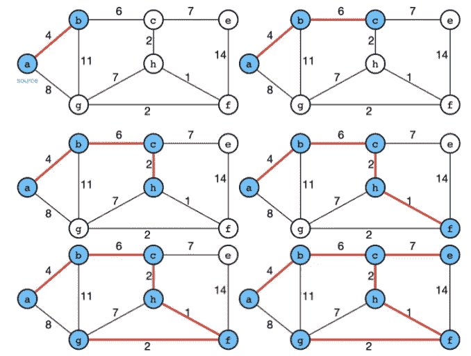

# 最小生成树

> 原文：<https://medium.com/analytics-vidhya/minimum-spanning-tree-prim-3f32445ce854?source=collection_archive---------15----------------------->

来源:[https://shawnlyu.com/algorithms/minimum-spanning-tree-prim/](https://shawnlyu.com/algorithms/minimum-spanning-tree-prim/)

*一棵* ***最小生成树****(****MST****)或* ***最小权重生成树*** *是一棵* [*连接*](https://en.wikipedia.org/wiki/Connected_graph) *的边的子集，是连接所有* [*顶点的边加权无向图*](https://en.wikipedia.org/wiki/Vertex_(graph_theory))

本帖将介绍其中一个寻找 MST 的算法: **Prim** 。将提供逻辑、时间/空间复杂性和实现。壮举。Leetcode 挑战 [1584。连接所有点的最小成本](https://leetcode.com/problems/min-cost-to-connect-all-points/)。

# 逻辑

Prim 的逻辑与 [Dijkstra 的算法](https://shawnlyu.com/algorithms/shortest-path-algorithms-i-dijkstra/)颇为相似，同样是贪婪地寻找最轻的边缘。它从任意顶点`v`开始，以一组跨越所有顶点的边`A`结束。在每一步，它都会寻找连接`A`和图中孤立顶点的边。伪代码如下所示。

```
MST-PRIM(G,w,r)
'''
G: the connected graph
w: weights
r: the root vertex
Q: a min-priority queue based on a key field
key: for each vertex v, key[v] is the minimum weight \
     of any edge connecting to a vertex in the MST
π: for each vertex v, π[v] names the parent of v in the MST
'''
for each u in V[G]
    key[u] = inf
    π[u] = NIL
key[r] = 0
Q = V[G]
while Q:
    u = EXTRACT_MIN(Q)
    for each v in Adj[u]
        if v in Q and w(u,v)<key[v]
            π[v] = u
            key[v] = w(u,v)
```

这是普里姆的一个例子:



来源:[https://shawnlyu.com/algorithms/minimum-spanning-tree-prim/](https://shawnlyu.com/algorithms/minimum-spanning-tree-prim/)

# 复杂性

**线 17** 有两种实现方式。

*   使用邻接矩阵，使 EXTRACT_MIN 取*O*(*V*)；
*   使用二进制堆，以便 EXTRACT_MIN 取 *O* ( *logV* )。

## 邻接矩阵

*   初始化需要 *O* ( *V* )(第 11–15 行)。
*   第 16 行将执行 *O* ( *V* )次，所以 EXTRACT_MIN 总共需要*O*(*V*∫*V*)。
*   由于第 16 行的 while 循环将针对每个顶点执行，第 18 行的 for 循环将针对顶点的每个边执行，因此第 18 行的 for 循环将执行 *O* ( *E* )次。

因此，总的时间复杂度将是*o*(*v*+*v^*2+*e*)=*o*(*v^*2)。空间复杂度为*O*(*V*+*E*)。

## 二元堆

*   初始化需要 *O* ( *V* )(第 11–15 行)。
*   第 16 行将执行 *O* ( *V* )次，所以 EXTRACT_MIN 总共需要*O*(*V*∫*logV*)。
*   由于第 16 行的 while 循环将针对每个顶点执行，第 18 行的 for 循环将针对顶点的每个边执行，因此第 18 行的 for 循环将执行 *O* ( *E* )次。
*   第 21 行表示堆上的更新操作，因此取 *logV* 。

因此，总时间复杂度将为*O*(*V*+*VlogV*+*ElogV*)=*O*(*ElogV*)。空间复杂度为*O*(*V*+*E*)。

# 实现— [1584。连接所有点的最小成本](https://leetcode.com/problems/min-cost-to-connect-all-points/)

将提供使用二进制堆和邻接矩阵的两种实现。注意到这个图是一个密集图，因此使用二进制堆带来了*o*(*elogv*)=*o*(*v^*2*logv*)并且使用邻接矩阵带来了 *O* ( *V^* 2)。因此，后一种方法将提供更有效的解决方案。

## 二元堆

```
class Solution:
    def minCostConnectPoints(self, points: List[List[int]]) -> int:
        dist = collections.defaultdict(list)
        n = len(points)
        for i in range(n):
            for j in range(i+1,n):
                d = abs(points[i][0]-points[j][0])+abs(points[i][1]-points[j][1])
                dist[i].append((j,d))
                dist[j].append((i,d))
        ret = 0
        visited = set([])
        pq = [(0,0)]
        while pq:
            w,u = heapq.heappop(pq)
            if u not in visited:
                ret += w
                visited.add(u)
                for v,d in dist[u]:
                    if v not in visited: heapq.heappush(pq,(d,v))
        return ret
```

## 邻接矩阵

```
class Solution:
    def minCostConnectPoints(self, points: List[List[int]]) -> int:
        def dist(u,v):
            return abs(points[u][0]-points[v][0])+abs(points[u][1]-points[v][1])
        n = len(points)
        ret = 0
        visited = [False]*n
        visited[0] = True
        closest = [0]*n
        for i in range(1,n): closest[i] = dist(0,i)
        for _ in range(n-1):
            mini = float('inf')
            node = -1
            for i in range(n):
                if not visited[i] and closest[i] < mini:
                    mini = closest[i]
                    node = i
            ret += mini
            visited[node] = True
            for i in range(n):
                if not visited[i]: closest[i] = min(closest[i],dist(i,node))
        return ret
```

# 参考

*   [https://Shawn lyu . com/algorithms/shortest-path-algorithms-I-Dijkstra/](https://shawnlyu.com/algorithms/shortest-path-algorithms-i-dijkstra/)
*   [https://leet code . com/problems/min-cost-to-connect-all-points/](https://leetcode.com/problems/min-cost-to-connect-all-points/)
*   [https://IQ . open genus . org/prim-minimum-spanning-tree-algorithm/](https://iq.opengenus.org/prim-minimum-spanning-tree-algorithm/)
*   [https://en.wikipedia.org/wiki/Prim%27s_algorithm](https://en.wikipedia.org/wiki/Prim%27s_algorithm)