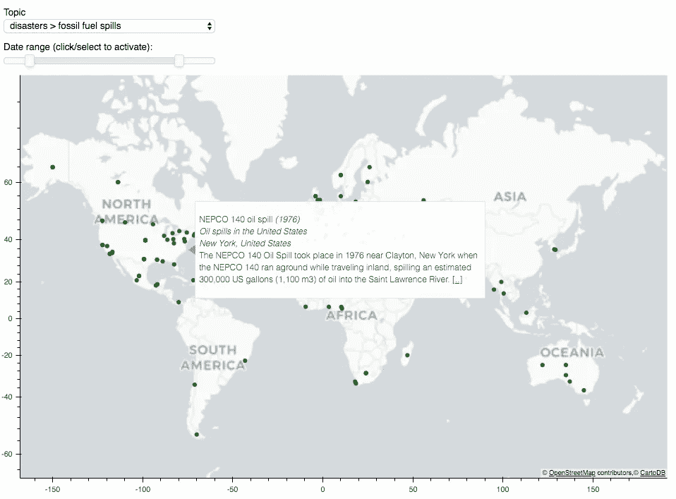
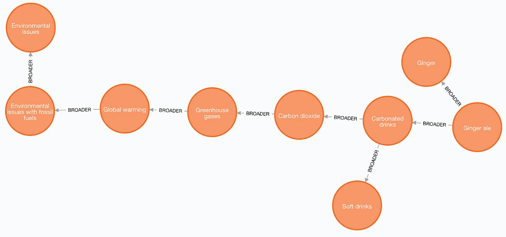
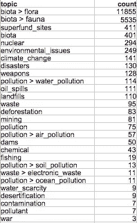

# 特定领域 DBPedia 概念的挖掘和地理可视化

> 原文：<https://medium.com/analytics-vidhya/mining-and-visualizing-dbpedia-environmental-issues-6ecc31ce6a26?source=collection_archive---------11----------------------->

# TL；速度三角形定位法(dead reckoning)

在本文中，我介绍了我从 DBPedia 中提取特定领域概念并在交互式世界地图上显示它们的一些工作。

领域是“环境问题”。你可以在这里玩地图，选择一个主题、一个日期，然后将鼠标悬停在地图上的点上，查看问题、它们的类别、位置和简短摘要。

主要成分:

*   DBPedia 和 Geonames triplestores 上的 SPARQL 查询，
*   一些与 DBPedia Spotlight API 链接的实体，
*   一盎司的地理可视化与 Python Bokeh 可视化库。

现在来看看食谱，请跟着读…



# 动机

在你自己的领域中发展一个术语、概念或主题的分类法可能是帮助你做生意的关键。例如，您可能希望用特定主题来标记文档内容，以帮助搜索和导航。

您可以询问领域专家，或者您可以利用领域中的文档或用户查询来归纳这些概念，以及特定于领域的本体来将文本中的概念和实体链接到您自己的领域。然而，你能达到的覆盖程度将取决于你拥有的文本数量和你的领域的具体情况。

或者你也可以在现有的本体中更系统地获取这些概念。

一个这样的知识库是 [DBPedia](https://wiki.dbpedia.org/) ，可用的最大的开源知识库之一，描述了来自 IT、名人或环境的[超过 400 万](https://wiki.dbpedia.org/about/facts-figures)件事情。DBPedia 中的每个概念通常都与一个维基百科页面相关联。此外，这些概念中的大部分都被组织到一个本体中，这样人们就可以使用 [SPARQL](https://en.wikipedia.org/wiki/SPARQL#Example) 查询语言搜索 DBPedia，比如说，某个特定概念的后代。


在这篇文章中，我收集了 DBPedia 中关于环境事件和问题的专业术语。然后使用 Geonames 对其进行过滤、分类和地理定位，然后显示在交互式地图中。

# 资料组

为了收集信息，首先需要在本地 Virtuoso triplestore 上安装必要的 DBPedia 和 Geonames 转储。这个在这个[短帖](/@nadjetba/how-to-setup-dbpedia-and-geonames-on-openlink-virtuoso-f203321fd0fe)里有解释。

对于 DBPedia，使用了时间戳为 2019 年 8 月 30 日的[转储](https://wiki.dbpedia.org/Datasets)，更具体地说是类别、类型和传递类型、标签和更广泛的关系。

在进行这项工作时，简短摘要和 *sameAs* 关系不可用于该转储，因此该信息从最新的 2016 年转储中获得。对于 2016 年至 2019 年之间添加的概念，通过查询 [live dbpedia sparql 端点](https://live.dbpedia.org/sparql)获得简短摘要。

# 提取环境概念

环境问题可以是特定时间的灾难，如[福岛核灾难](http://dbpedia.org/page/Fukushima_Daiichi_nuclear_disaster)，也可以是更普遍的长期情况，如[尼日利亚的森林砍伐](http://dbpedia.org/page/Deforestation_in_Nigeria)或[太平洋大垃圾带](http://dbpedia.org/page/Great_Pacific_garbage_patch)。通过使用 DBPedia SKOS 更广泛的分类关系，我发现这些概念属于[环境问题](http://dbpedia.org/page/Category:Environmental_issues)类别。

那么，我们是否可以反复查询包含在[环境问题](http://dbpedia.org/page/Category:Environmental_issues)类别中的概念，然后就大功告成了？

## 松散的不可传递的层次结构

不幸的是，事情没有这么简单，因为类别之间的*更广泛的*关系非常松散且不可传递，如下图中的例子所示。



一些 DBPedia 类别之间更广泛关系的片段(Neo4j)

在这个例子中，类别“姜汁啤酒”具有更广泛的类别“姜”和“碳酸饮料”(但它不是姜)。而“碳酸饮料”与“软饮料”和“二氧化碳”有着更广泛的联系(它包含而非是一种)。我们可以从“二氧化碳”一直到“环境问题”这一更广泛的层次上去。然而，这并不意味着“姜汁汽水”是一种“环境问题”。

## 一种半自动迭代提取方法

一次性提取层次结构中的所有类别，然后手动过滤它们并不是解决方案，因为获得了太多的类别(+130 万)。更重要的是，一个类别可以包含数以千计的其他类别，所以通过删除它，我们会自动删除它下面的类别。

因此，为了获得相关的环境问题类别，我们迭代进行如下:

1.  从一组只包含“环境问题”的根类别开始，我们将所有类别提取到 N 的深度，
2.  我们手动审查这些新类别，以决定保留哪些类别，不保留哪些类别。
3.  回到第 1 步，设置根类别集等于我们在第 2 步中决定保留的类别。当没有获得新的类别时停止。

使用 N=2 的这种方法，我们在 6 轮中收集了 2679 个类别，其中只有 1363 个被保留。这些允许我们检索 27765 个环境问题候选，即 DBPedia 概念，其主题是 1363 个类别之一。

筛选+27k 候选人的最后阶段目前是手动的，尽管按主题类别或候选人姓名分组有助于加快这一过程(参见本文末尾关于如何使用文本挖掘自动化这一过程的未来工作)。保留或不保留一个概念的决定是基于它的标签、类别和简短摘要。

我们最终得到了超过 19k 的概念。这些按类别分为 28 个主题，如下表所示。该表显示，90%的概念与生物区系(动物和植物保护状况)有关。

请注意，表中的概念数高于概念总数，因为一个概念可以分配给多个主题。例如，福岛灾难的主题是“核”和“灾难”。



概念主题

# 地理定位

现在我们有了概念、它们的类别和主题，我们可以提取概念位置和地理坐标。

## 我们在哪里找到这个概念的位置？

位置信息从概念的简短摘要中提取。如果做不到这一点，就使用概念的分类标签，例如“澳大利亚濒危植物”。

简短摘要可以由多个句子组成。所以我们迭代每一句话，从第一句开始，找到一个位置就停止。这背后的直觉是，概念的主要位置在文本中是突出的，因此倾向于首先出现。

例如，对于概念 [Julie_N._oil_spill](http://dbpedia.org/page/Julie_N._oil_spill) ，我们仅在简短摘要的第一句中选择“波特兰，缅因州”，而不在第二句中选择“南波特兰，缅因州”:

> “1996 年 9 月 27 日，在缅因州**波特兰**的福尔河上，一艘利比里亚油轮发生漏油事故。这艘 560 英尺(170 米)长的船装载了超过 200，000 桶(27800 吨)的取暖油，正驶向南波特兰**的一个停靠站，卸下里面的东西**

## 通过实体链接查找 Geoname 位置

为了将文本中的一些短语识别为位置，我们使用 [DBPedia Spotlight API](https://www.dbpedia-spotlight.org/api) 执行实体链接。这个工具用 DBPedia 概念自动注释文本。例如，我们可能会查询:

```
curl [http://localhost:2222/rest/candidates](http://localhost:2222/rest/candidates) --data-urlencode "text=The president of United States" --data "confidence=0.7"
```

这将输出以下内容:

```
<surfaceForm name="United States" offset="17"><resource 
label="United States" 
uri="United_States" contextualScore="0.12995535973599495" percentageOfSecondRank="5.591384938510379E-5" 
support="563995" 
priorScore="0.0028691179552717944" 
finalScore="0.9998957005362644" 
types="Wikidata:Q6256, Schema:Place, Schema:Country, DBpedia:PopulatedPlace, DBpedia:Place, DBpedia:Location, DBpedia:Country"
/></surfaceForm>
```

因为我们已经将置信度设置为 0.7，所以我们只获得最终得分高于该阈值的命名实体。

注释表明，索引 17 处的表面形式“美国”偏移对应于 DBPedia 概念“美国”。

对于每个命名实体概念，我们通过 sameAs 关系查找它的 Geonames 标识符。

通过 Geonames 标识符，我们可以使用 Geonames SPARQL 端点获得概念的地理坐标和国家代码。

## 选择最具体的 Geoname 位置

对于一个给定的概念，我们可能会得到不止一组地理坐标。我们必须排除包含更具体的内容的内容，例如，我们可能同时拥有“圣地亚哥”和“加利福尼亚”的地理坐标，因此我们可以删除“加利福尼亚”的坐标，从而获得更精确的地理可视化。

这是使用 SPARQL 查询完成的，该查询查找两个标识符之间是否存在 Geonames 父关系。如果是，父标识符被消除。

# 日期戳

我们使用 [Spacy](https://spacy.io/) 的 NER 来检测简短摘要中的时间和日期表达。由于检测到的日期数量相对较少，我们执行手动清理来指定每个概念的开始和结束日期，主要集中在有日期的事件上，如灾难或核试验。例如，概念“1949-51 苏联核试验”的开始日期是 1949，结束日期是 1951。我们最终得到了一些带有时间戳的概念(+400)。

# 交互式可视化

我们在下拉列表中显示主题。用户还可以移动日期滑块，只显示指定范围内的问题。提交选择后，与所选主题相关的所有问题都会显示在地图上。用户可以悬停在小点上，阅读问题，其类别和位置，如果感兴趣，它的摘要。如果进一步感兴趣，在摘要的结尾还提供了维基百科页面链接。

可视化是使用[散景](https://docs.bokeh.org/en/latest/) Python 可视化库实现的，并使用 Flask 部署为 web 应用程序。

交互式可视化的短片

# 未来的工作

这是一个初步的概念验证应用程序，使用环境领域的 DBPedia 和 Geonames 中的概念挖掘。

作为今后的工作，我想做以下几点:

1.  挖掘维基百科文章中与环境问题相关的具体文本内容。
2.  改善可视化体验。
3.  新概念的自动化集成。
4.  将该方法应用于其他领域。

## 挖掘维基百科文章中特定领域的内容

在维基百科的文章中找到关于该领域的章节、段落或句子有三个主要优势:

1.  寻找不在领域层次结构中但仍然与主题相关的概念。例如，我们可能会发现一些文章谈论受环境问题影响的企业、城镇或河流。
2.  自动决定一个概念是否与领域相关。目前的方法涉及相当多的人工监管，检查文章。我们可以开发一套分类器来确定维基百科文章中的某个部分、段落或句子是否与感兴趣的主题有关。
3.  将概念与更细粒度的内容关联起来。目前，用户能够通过标签、类别和简短摘要来掌握概念与领域的相关性。但是通过挖掘特定领域的文本片段，我们可以为用户提供更多相关信息。

## 改善可视化体验

可以做很多事情来改善可视化:

*   我们可以使用不同大小的点:每个位置的概念越多，或者从这个概念到其他环境概念的维基页面链接越多，点就越大。
*   我们可以根据类别给点着色(尽管目前存在一个点可以代表多个概念的问题)。
*   我们可以将概念与维基百科页面中可用的图片相关联，以使可视化更有趣。
*   我们可以利用 Wikipedia/DBPedia 的多语言性来提供不同语言的页面和概念。
*   我们可以允许搜索和放大每个位置。
*   我们可以用维基链接展示概念之间的联系。

## 连续自动更新

一个重要的功能是自动化新概念的集成。例如，我们可能希望包含每月更新，或者我们可能包括通过挖掘维基百科文章发现的主题(我们未来工作的第一点)。决定一个新概念是否是一个环境问题，以及它是什么样的问题，可以通过使用已经分类的概念训练一个监督模型来自动完成。我们可以使用图形和文本嵌入来做到这一点。

## 从 DBPedia 开发其他领域分类法和可视化

使用类似的方法，我们可以从 DBPedia 和其他链接的开放数据中为其他领域开发分类法和可视化，例如民权或疾病。有人吗？