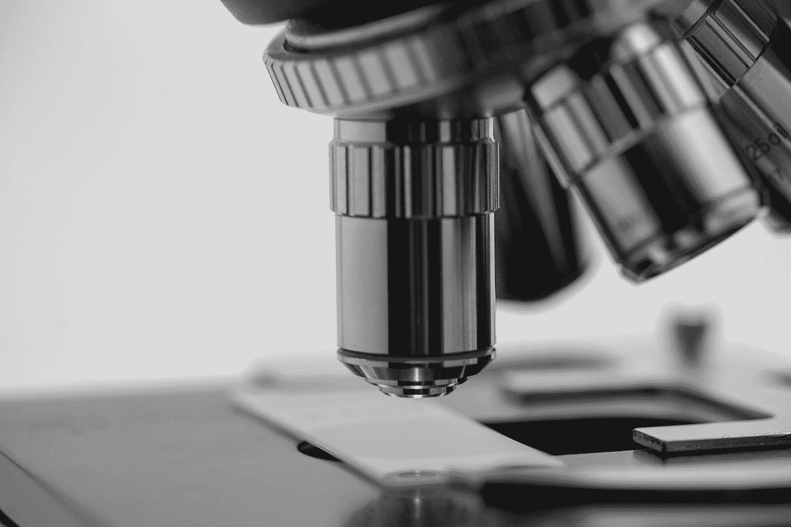

# 采矿生物数据库:完好无损

> 原文：<https://medium.com/analytics-vidhya/mining-biological-databases-intact-287ed40aba58?source=collection_archive---------12----------------------->

迈克尔·朗米尔在 [Unsplash](https://unsplash.com?utm_source=medium&utm_medium=referral) 上的照片

# 概观

两种蛋白质之间的相互作用是实验中可以获得的最重要的信息之一。两种蛋白质的物理结合可能导致构象重排，从而改变细胞生理学。然而，蛋白质的多重相互作用正在发生，一系列蛋白质相互作用可能涉及一种现象。为了获得更好的…