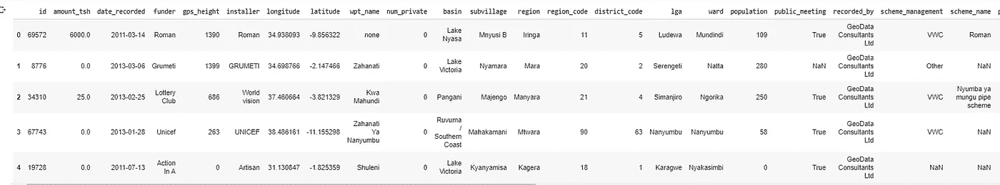
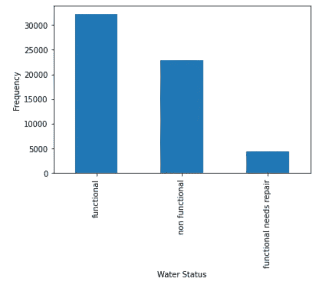
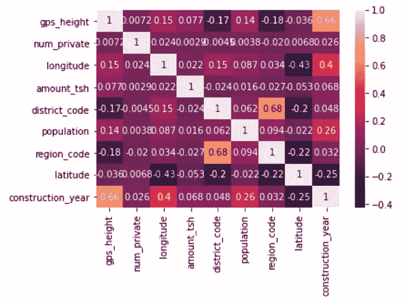
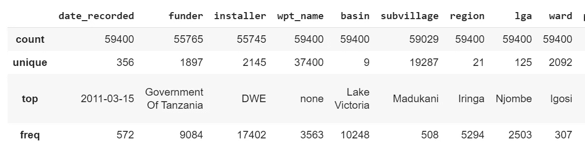
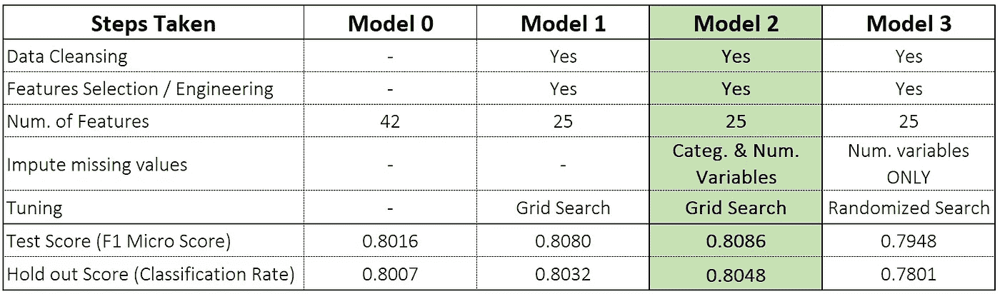

# 使用 Catboost 的水泵分类

> 原文：<https://medium.com/analytics-vidhya/mining-the-water-table-water-pump-classification-5644c7b2635c?source=collection_archive---------14----------------------->


由 [Unsplash](https://unsplash.com?utm_source=medium&utm_medium=referral) 上的 [mrjn 摄影](https://unsplash.com/@_mrjn_esf?utm_source=medium&utm_medium=referral)拍摄

在这篇文章中，我使用 CatBoost 分类模型来预测水泵的运行状况。根据[塔里法](http://taarifa.org/) & [坦桑尼亚水利部](http://maji.go.tz/)提供的数据，这些水泵要么可以使用，需要维修，要么根本不工作。问题由[数据驱动](https://www.drivendata.org)主持。

对于这个问题，我使用了 CatBoost 算法，因为数据中有大量的分类变量。其他(失败的)尝试包括尝试一键编码+用截断 SVD 降维。考虑到某些分类特征的高基数，这些结果是意料之中的。对于这个限制，CatBoost 提供了一个解决方案，因为它能够更轻松地处理分类变量。模型评估基于 f1 分数、准确性和在数据驱动网站上托管的最终测试集的性能。

# **探索数据**

有 3 个数据文件用于分析:

*   labels.csv:描述滨水区是功能性的、非功能性的还是功能性的需要修复。这是分析的目标变量
*   values.csv:包含水泵所有特性的字段
*   competition_test.csv:用于预测地下水位状态的功能，在数据驱动网站上提交预测

每个记录或滨水区都有 30 多个相关联的要素，有些要素缺少值。

```
# Reading in the data
labels = pd.read_csv(“labels.csv”)
values = pd.read_csv(“values.csv”)
df = pd.merge(labels, values, on= “id”)
y = df[[‘status_group’]]
X = df.drop([‘status_group’,’id’], axis = 1)**X.info()***Data columns (total 39 columns):
 #   Column                 Non-Null Count  Dtype  
---  ------                 --------------  -----  
 0   amount_tsh             59400 non-null  float64
 1   date_recorded          59400 non-null  object 
 2   funder                 55765 non-null  object 
 3   gps_height             59400 non-null  int64  
 4   installer              55745 non-null  object 
 5   longitude              59400 non-null  float64
 6   latitude               59400 non-null  float64
 7   wpt_name               59400 non-null  object 
 8   num_private            59400 non-null  int64  
 9   basin                  59400 non-null  object 
 10  subvillage             59029 non-null  object 
 11  region                 59400 non-null  object 
 12  region_code            59400 non-null  int64  
 13  district_code          59400 non-null  int64  
 14  lga                    59400 non-null  object 
 15  ward                   59400 non-null  object 
 16  population             59400 non-null  int64  
 17  public_meeting         56066 non-null  object 
 18  recorded_by            59400 non-null  object 
 19  scheme_management      55523 non-null  object 
 20  scheme_name            31234 non-null  object 
 21  permit                 56344 non-null  object 
 22  construction_year      59400 non-null  int64  
 23  extraction_type        59400 non-null  object 
 24  extraction_type_group  59400 non-null  object 
 25  extraction_type_class  59400 non-null  object 
 26  management             59400 non-null  object 
 27  management_group       59400 non-null  object 
 28  payment                59400 non-null  object 
 29  payment_type           59400 non-null  object 
 30  water_quality          59400 non-null  object 
 31  quality_group          59400 non-null  object 
 32  quantity               59400 non-null  object 
 33  quantity_group         59400 non-null  object 
 34  source                 59400 non-null  object 
 35  source_type            59400 non-null  object 
 36  source_class           59400 non-null  object 
 37  waterpoint_type        59400 non-null  object 
 38  waterpoint_type_group  59400 non-null  object*
```

下面是数据集中前 5 个泵的样本数据片段。



```
# Frequency plot of target values
y[‘status_group’].value_counts().plot(kind=’bar’)
plt.xlabel(‘Water Status’)
plt.ylabel(‘Frequency’)
```



目标可变频率图

快速查看目标变量显示，大多数泵都在运行，需要维修的泵较少。这种阶级不平衡将在稍后的建模中触及。

我将 X 变量分为分类数据和数字数据，以研究关系和缺失值。

```
X_categ = X.select_dtypes(include=[‘object’])
X_num_list = list(set(X.columns)-set(X_categ.columns))
X_num = X[X_num_list]
```

数字特征的快速绘图显示了变量之间的一些初始相关性。粗略地看一下变量的值计数， ***构造 _ 年份*** 和***GPS _ 高度*** 具有大量的 0 值，导致高度相关，如下图所示。

```
sns.heatmap(X_num.corr(), annot=True)
```



数值变量的相关图

**地区代码**和 ***地区代码*** 也显示正相关，因为两者也基于地理位置。

0 值被编码为缺失值，因为它们是真正缺失的，而不是显示为欺骗模型的 0。

```
X_categ.describe()
```



一些分类变量有很高的基数，如图所示。有些有超过 19，000 个唯一值。这使得我最初的 One-Hot-Encoding 管道在失败的尝试中变成了一场噩梦。因此，CatBoost 的特征重要性功能被用于识别解释数据中大部分方差的变量。

# **方法学&结果**

下表总结了模型尝试和每个尝试所采取的步骤。



模型比较和评估

**根据微观 F1 评分和数据驱动网站上的持续评分，车型 2 得分最高**。还使用来自 sklearn 的分类报告来评估模型上每个预测类别的精确度和召回率。

下面是获得模型 2 设置的步骤总结，从用于数据清理的 **clean_x** 函数和用于输入缺失值的 **ColumnTransformer** 开始&缩放数值变量。
[*全部代码发布在 GitHub*](https://github.com/AdetomiwaO/Mining_the_water_table) 上

```
#Create a clean_x function to prepare X variablesdef clean_x(df):

 df = df[feat_selected]
 #replace 0 values as true NaN
 # replace 0 values with np.NaN so they appear as missing rather than 0df.gps_height.replace(0, np.NaN, inplace = True)
df.construction_year.replace(0, np.NaN, inplace = True)
df.population.replace(0, np.NaN, inplace = True)
df.longitude.replace(0, np.NaN, inplace = True)
df.latitude.replace(-0.00000002, np.NaN, inplace = True)

 # create new column for the year the waterpoint was constructed
 df[‘year_recorded’] = pd.to_datetime(df[‘date_recorded’]).dt.year #Add new column denoting the estimated age of the waterpoint
 df[‘age’] = df[‘year_recorded’] — df[‘construction_year’] #drop date recorded column since we have a new measure for the estimated age of the water source
 df = df.drop([‘date_recorded’], axis = 1)

 # Convert Categorical features to str values
 categorical_features = list(df.select_dtypes(include=[‘object’]).columns) df[categorical_features] = df[categorical_features].astype(str, copy=False)

 return df
```

缺失的数值用平均值代替，缺失的分类值用最频繁出现的值代替。

```
# Create column transformer pipelines for X variables:
# transforming numeric features
numerics = [‘int16’, ‘int32’, ‘int64’, ‘float16’, ‘float32’, ‘float64’]
numeric_features = list(X_train_m1.select_dtypes(include=numerics).columns)numeric_pipe = Pipeline(steps=[
 (‘num_imputer’, IterativeImputer(initial_strategy =’mean’, 
 imputation_order = ‘descending’)),
 (‘scaler’, StandardScaler())])# transforming categorical features 
categorical_features = list(X_train_m1.select_dtypes(include=[‘object’]).columns)categ_pipe = Pipeline(steps=[
 (‘cat_imputer’, SimpleImputer(strategy=’most_frequent’))
 ])# column transformer
preprocessor = ColumnTransformer(transformers=[
 (‘num’, numeric_pipe, numeric_features),
 (‘cat’, categ_pipe, categorical_features)
 ])
```

我使用列转换器创建了一个函数来准备输入数据。

```
def impute_x_m2(X_train_m1, X_test_m1, X_comp_m1): X_train_m2 = pd.DataFrame(preprocessor.fit_transform(X_train_m1), columns= numeric_features+categorical_features) X_test_m2 = pd.DataFrame(preprocessor.transform(X_test_m1), columns = numeric_features+categorical_features) X_comp_m2 = pd.DataFrame(preprocessor.transform(X_comp_m1), columns = numeric_features+categorical_features)

 return X_train_m2, X_test_m2, X_comp_m2X_train_m2, X_test_m2, X_comp_m2 = impute_x_m2(X_train_m1, X_test_m1, X_comp_m1)
```

接下来，启动 CatBoost 算法并设置训练和评估集。损失函数设置为“多类”,所有模型都通过 Google Collab 在 GPU 上运行。

```
#Initiate cb2 model
cbm2 = CatBoostClassifier(cat_features = cat_features2, 
 loss_function = ‘MultiClass’,
 random_seed=42,
 task_type = ‘GPU’)#Prepare input & eval data
train_dataset_m2 = Pool(data=X_train_m2.astype(str),
                     label=y_train,
                     cat_features=cat_features2)eval_dataset_m2 = Pool(data=X_test_m2.astype(str),
                    label=y_test,
                    cat_features=cat_features2)
```

对一些参数进行了网格搜索。最佳搜索返回{'depth': 10，' iterations': 3000，' l2_leaf_reg': 3，' learning_rate': 0.03}搜索在 GPU 上运行了大约 30 分钟。 ***注:*** *该模型不解决数据集的类不平衡问题，因为默认设置将所有类权重设置为 1 进行训练。*

```
#Setting up Parameters for model 2
grid2 = {‘depth’: [3,10],
         ‘iterations’: [1000,3000],
         ‘l2_leaf_reg’: [3,5],
         ‘learning_rate’: [0.1, 0.03, 0.05]}gs_catb_m2 = cbm2.grid_search(grid2, 
 X = X_train_m2, 
 y = y_train, 
 plot=True,
 cv=3)
```

最佳参数适用于模型 2 并生成分类报告

```
# Fit best parameters on Model 2
cbm2_best.fit(train_dataset_m2)
y_pred_catb_m2 = cbm2_best.predict(eval_dataset_m2, prediction_type = 'Class')#Classification report of model 2 
print(classification_report(y_test, y_pred_catb_m2, digits = 5)) precision  recall    f1-score   support

             functional    0.80015   0.90539   0.84952      9724
functional needs repair    0.63077   0.28538   0.39297      1293
         non functional    0.84034   0.76981   0.80353      6803

               accuracy                        0.80864     17820
              macro avg    0.75708   0.65353   0.68201     17820
           weighted avg    0.80320   0.80864   0.79884     17820
```

模型 2 使用的关键特征解释了数据中 90%的差异。与其他模型相比，缺失值的插补似乎有助于模型得分。

对持有数据进行了单独的预测，其表现也优于其他模型。

# W **关于阶级失衡的帽子？**

回到阶级不平衡的话题(因为数据不平衡)。模型 2 将所有等级视为具有相同的重量，但是模型 3 实际上对于需要修理的未被充分代表的泵等级具有更好的分数。在一个目标集中在需要修理的泵上的世界里。模型 3 有最好的 f1 分数，因为它平衡了培训期间对班级的支持。模型 3 的精度是 43%,而模型 2 是 63%,但是召回率是 46%,而模型 2 是 29%。这意味着模型 2 更有可能不会将需要维修的泵贴错标签，模型 3 更有可能找到更多需要维修的泵。

```
**#Best Parameters for Model 3**
{'auto_class_weights': 'Balanced',
 'depth': 10,
 'iterations': 3000,
 'l2_leaf_reg': 3,
 'learning_rate': 0.03}**# Classification report for Model 3**
                           precision recall    f1-score   support

             functional    0.82045   0.85006   0.83499      9724
f**unctional needs repair    0.42857   0.45940   0.44345      1293**
         non functional    0.83409   0.77966   0.80596      6803

               accuracy                        0.79484     17820
              macro avg    0.69437   0.69637   0.69480     17820
           weighted avg    0.79722   0.79484   0.79550     17820
```

# **结论**

基于 f1 微分数，模型 2 在所有模型中表现最佳。虽然改进不是很大，但似乎插补、特征选择和一些数据清理使该模型比基于默认参数和无预处理的基本模型更可信。

鉴于一次性编码和降维的失败尝试，建模的设置最初是一个挑战。数据探索相当有趣，因为许多领域都是相似的，并且有相似的漏洞。现实世界数据和建模前所需清理的非常清晰的例子。

还有探索其他特征选择方法的空间，如卡方特征选择或互信息特征选择，因为它们都属于分类变量。

我还想象可以有进一步的功能工程，特别是地理位置功能(经度，纬度)。它们可用于计算离主要城市/水体的距离，这可以提供对泵的状态的更多了解。

未来的探索还可能包括其他处理分类变量的模型，如 LightGBM 和 H2oGBM。我还在下面加入了一些完成这个项目时用到的参考工具和文章。特别感谢 [DataDriven](https://www.drivendata.org/) 主持并创建了具有社会影响力的数据科学平台。

# **参考文献**

[](https://catboost.ai/docs/%5C) [## CatBoost 概述。证明文件

### CatBoost 是一种机器学习算法，在决策树上使用梯度推进。它是作为一个开放的…

catboost.ai](https://catboost.ai/docs/%5C) [](https://stackoverflow.com/questions/48507651/multiple-classification-models-in-a-scikit-pipeline-python) [## scikit 管道 python 中的多个分类模型

### 考虑在这里查看类似问题:用 sklearn pipeline Pipeline 比较多个算法:多个…

stackoverflow.com](https://stackoverflow.com/questions/48507651/multiple-classification-models-in-a-scikit-pipeline-python) [](https://datascience.stackexchange.com/questions/53181/large-no-of-categorical-variables-with-large-no-of-categories) [## 具有大量类别的大量分类变量

### begingroup$对分类变量进行编码，这样就不会丢失信息，也不会添加不存在的…

datascience.stackexchange.com](https://datascience.stackexchange.com/questions/53181/large-no-of-categorical-variables-with-large-no-of-categories) [](https://towardsdatascience.com/feature-selection-techniques-in-machine-learning-with-python-f24e7da3f36e) [## Python 机器学习中的特征选择技术

### 新的一天带来新的力量和新的思想——艾拉诺·罗斯福

towardsdatascience.com](https://towardsdatascience.com/feature-selection-techniques-in-machine-learning-with-python-f24e7da3f36e) [](https://scikit-learn.org/stable/auto_examples/compose/plot_column_transformer_mixed_types.html) [## 混合类型的色谱柱变压器-sci kit-了解 0.23.2 文档

### sci kit-learn:Python 中的机器学习

scikit-learn.org](https://scikit-learn.org/stable/auto_examples/compose/plot_column_transformer_mixed_types.html) [](https://colab.research.google.com/) [## 谷歌联合实验室

### 编辑描述

colab.research.google.com](https://colab.research.google.com/)