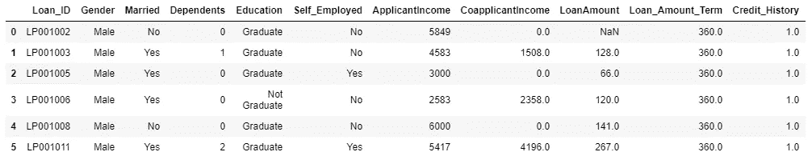
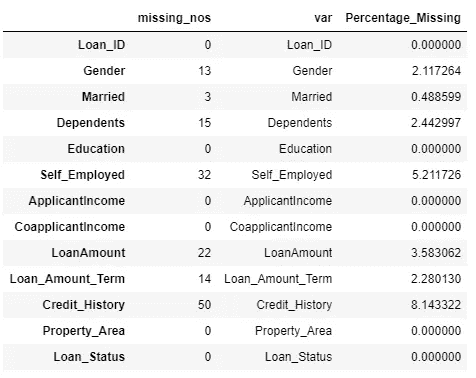
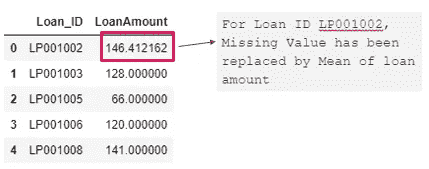
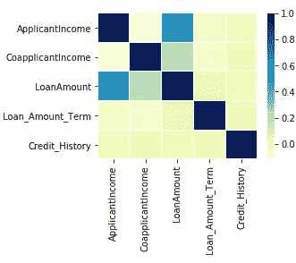
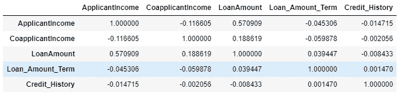
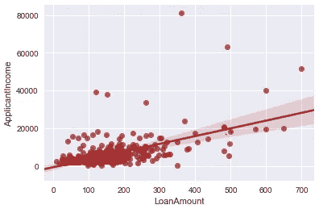

# 缺失值处理

> 原文：<https://medium.com/analytics-vidhya/missing-value-treatment-b72c770355a6?source=collection_archive---------3----------------------->

本文将讨论缺失值的以下几个方面:

1)什么是缺失值

2)理解缺失值处理的重要性

Python 中处理缺失值的方法

D 数据收集过程从来都不是完全证明，尤其是当我们使用物理表单时。在这个过程中，我们有时会忘记或故意不收集一些属性/字段。这可能是因为时间限制，或者我们觉得它们不太重要。因此，不定期收集的属性往往会有缺失值或不可用的数据。

**例子**:100 个填写调查的人中，只有 75 人给出了他们的婚姻状况。所以 25 个人没有婚姻状况。

为了分析数据，我们要么跳过有缺失值的记录，要么对它们进行估算。

M 缺失值处理不仅是建模过程中最重要的一步，对于任何用于决策的数据分析也是如此。

如果没有正确解释，缺失的值可能会导致糟糕的决策，从而导致严重的业务损失。例如，如果“婚姻状况”对于向客户发送个性化信息非常重要，让我们假设 20%的记录没有婚姻状况，我们要么不瞄准这些客户，要么尝试预测该变量的值。如果预测方法不够好，那么我们最终可能会向客户发送不正确的信息。因此，如果决策要按预期进行，对它的解读就非常重要。

随着数据分析的出现，许多组织开始关注数据可用性，这已经成为数据治理系统的一个关键部分。

刚刚开始运营的组织比其他组织更有优势，因为他们已经做好了迎接这一挑战的充分准备。

数据不可用并不总是问题。申请表或调查中有些字段不是必填的。组织认为字段或属性不会增加多少价值，可以忽略。这一假设可以很容易地通过检查这一变量的趋势(可用数据)与所需的结果来验证。如果没有趋势，那么这些变量的数据不可用就不是问题。但是，如果看到任何趋势，那么企业应该做出明智的决定，将它作为一个强制字段，并开始收集它。

有时，额外的字段可以帮助为客户开发个性化的活动，从而提高参与度，或者可以提高转化率。

这里有很多处理缺失值的方法。这完全取决于你想在这上面花多少时间。显然，复杂的方法在您第一次使用时确实需要时间，但是当您根据分析或模型执行的频率定期使用时也需要时间。因此，在最终确定方法时，应该考虑到这一点。这里有各种可以探索的技术。如果我错过了什么，请在评论区写下来。

1.  删除至少有一个值缺失的记录
2.  删除最不重要且大部分值缺失的列
3.  用平均值、中值和众数替换缺失值，或将缺失值视为不同的类别
4.  相关性-根据相关性的强度，可以估算缺失值
5.  使用回归技术预测缺失值

在我们开始上述技术之前，让我简单介绍一下已经考虑过的数据集。这是一个住房贷款数据集，包含公司为了决定是否发放贷款而获取的所有客户详细信息。摘自分析 Vidhya 的练习练习，可在此处找到:[https://data hack . analyticsvidhya . com/contest/practice-problem-loan-prediction-iii/](https://datahack.analyticsvidhya.com/contest/practice-problem-loan-prediction-iii/)

```
# Importing another dataset
loan = pd.read_csv(‘D:\\Hackathon\\Loan Prediction\\train.csv’)
loan.head(6)
```



让我们逐一详细了解上述技术:

1.  **删除至少有一个缺失值的记录:**这仅仅意味着删除所有至少有一个缺失值的记录。

```
#Drop rows even with one missing value
loan_drop = loan.dropna()
loan_drop.shape
Output - (480, 13)
```

当我们删除甚至只有一个缺失值的记录时，数据集中的记录数量减少了 21.7%(从 614 减少到 480)。这可能会导致 21.7%的重大信息损失。

这是去掉丢失值的最简单的方法，但同时也有很高的信息损失。因此，在删除缺失值后所做决策的可信度不会很高。

**2。删除最不重要且丢失大部分值的列:**在这里，有了一些业务/领域知识，您可以很容易地决定最不重要的列，如果它们丢失值的百分比很高，就删除它们。

```
# Getting No. of Missing values and % of Missing values in each column - 
loan_missing_values = pd.DataFrame(loan.isnull().sum())
loan_missing_values[‘var’] = loan_missing_values.indexloan_missing_values = loan_missing_values.rename(columns={0:’missing_nos’})loan_missing_values[‘Percentage_Missing’] = loan_missing_values[‘missing_nos’] *100/ len(loan)loan_missing_values
Output - 
```



```
## Assuming Self_Employed being least Significant or insignificant and deleting the column
loan_drop_Self_Employed = loan.drop(“Self_Employed”, axis=1)# Checking no of records removed from the dataset
loan_drop_Self_Employed.dropna().shape
Output - (505, 12)
```

通过删除最不重要的列，记录的数量减少了 17%(从 614 减少到 505)。所以信息损失是 17%。虽然不是处理缺失值的最佳方法，但比第一种要好。

3.**用平均值、中值和众数替换缺失值，或将缺失值视为不同类别:**这里的第一步是计算可用的特定变量值的平均值、中值或众数(非缺失值)。第二步也是最后一步是用这样计算的平均值/中值或众数替换缺失值。另一个技巧是将缺失值视为一个不同的类别。例如，婚姻状况变量有 10%的缺失值。对于这 10%的记录，我们可以将其硬编码为“其他”。

```
## Considering loan amount as the variable
## First checking the mean of LoanAmount variable
loan[“LoanAmount”].mean()
Output - 146.41216216216216#Replace missing value with Mean of the column
loan_amount_mean = loan.fillna(loan["LoanAmount"].mean())#checking first 6 rows of the table
loan_amount_mean[["Loan_ID", "LoanAmount"]].head() 
Output -
```



同样，我们可以用中位数和众数来代替缺失值。

```
#Replace missing value with Median of the column
loan_amount_median = loan.fillna(loan[“LoanAmount”].median())#Replace missing value with Modeof the column
loan_amount_mode = loan.fillna(loan["LoanAmount"].mode()[0])
```

这是我们讨论过的三种技术中最好的一种。因为我们在数据分析或模型构建练习中考虑所有记录，所以没有信息损失。这里唯一的缺点是我们用相同的值来处理所有丢失的值。示例—45 岁客户的贷款金额要求将不同于 25 岁的客户。与 25 岁的客户相比，45 岁的客户可能会要求较低的贷款金额。

4.**相关性**:根据相关性的强弱，可以估算缺失值。它的范围从-1 到 1，取决于相关的类型。-1 和 1 表示完全相关；一个变量可以被另一个变量代替，因为它们可以完全解释对方。以下是各种相关值的定义:

1–0.8→非常强
0.799–0.6→强
0.599–0.4→中等
0.399–0.2→弱
0.199–0→非常弱

```
## Importing required libraries
import seaborn as sns 
import matplotlib.pyplot as plt 
from scipy.stats import norm## Correlation Matrix
corrmat = loan.corr()f, ax = plt.subplots(figsize =(4, 3)) 
sns.heatmap(corrmat, ax = ax, cmap ="YlGnBu", linewidths = 0.01)
```



从上面的图可以清楚地看出，申请人的收入和贷款金额是相互关联的。让我们绘制一个相关表来了解相关程度:

```
loan.corr(method =’pearson’)
```



相关性为 0.57，虽然中等，但偏高(中等)。我们也可以有一个散点图，这是一个视觉上吸引人的更好的方法来表示两个连续变量之间的相关性。

```
# Scatter Plot between Loan Amount and Applicant Income
import seaborn as sns
import matplotlib.pyplot as pltsns.set(color_codes=True)sns.regplot(x="LoanAmount", y="ApplicantIncome", data=loan, color = 'brown');
```



这是迄今为止我们讨论过的所有技术中最好的。尽管这种技术也有缺点。如果数据集没有高度相关的变量，你将处于一个棘手的境地。还会有两个相关变量的值都不存在的情况。

但是，这可以通过运行回归模型来克服。

5.**使用回归技术预测缺失值:**该技术是估算缺失值的最佳方法，但同时也是最复杂和耗时的。这种方法的选择取决于时间和手头的问题。在这里，您可以统计地预测缺失值，这些值又可以用于预测其他变量。我不会在这里讨论 python 代码，因为这需要一篇新的文章，应该在 2020 年 2 月或 2020 年 3 月结束。

# **推荐:**

根据手头的时间和你能坚持的复杂性，你可以评估这些技术并选择一个你觉得舒服的。人们应该始终考虑的一个重要方面是将业务/领域知识与这些技术一起应用。有时你可能会觉得均值比中值好，但是一旦你应用了领域知识，你就能更好地决定考虑哪一个。