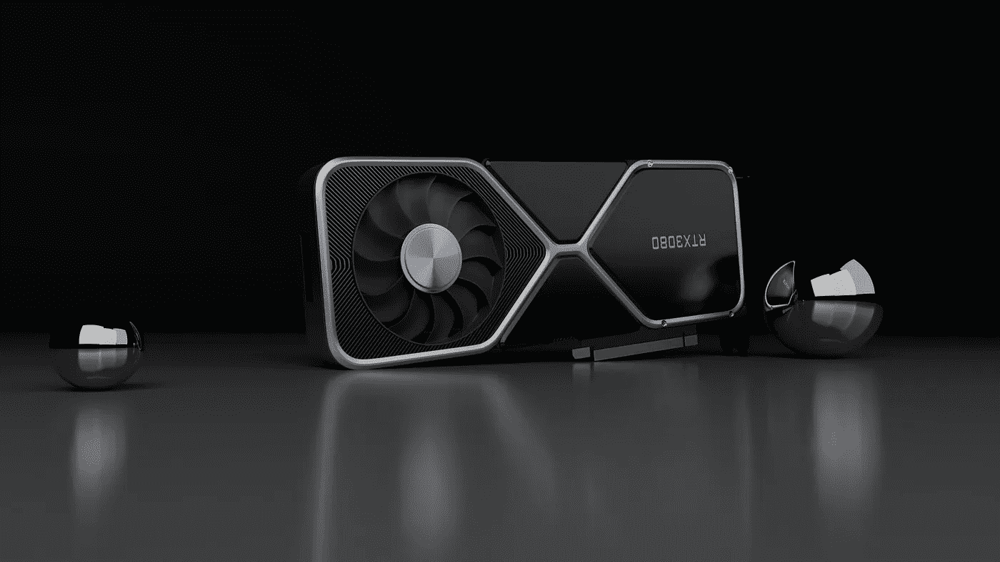

# 混合精确训练

> 原文：<https://medium.com/analytics-vidhya/mixed-precision-training-fd08f4c8e72d?source=collection_archive---------5----------------------->

## 浮动 16 超过浮动 32！

[NVIDIA GeForce RTX 3080 显卡](https://wccftech.com/nvidia-geforce-rtx-30-ampere-gaming-graphics-cards-new-power-connector-rumor/)

在这篇博客文章中，我们将讨论混合精度训练，如何有效地在数据类型之间移动，如从 float32 到 float16，以减少每个变量或参数占用的空间。令人惊讶的是，通过简单的精度改变就可以减少内存量🤩。

## 什么是混合精确训练