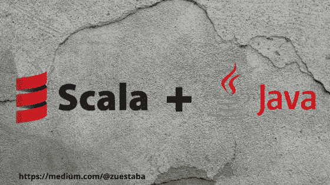

# 在软件中混合 Java 和 Scala 代码

> 原文：<https://medium.com/analytics-vidhya/mixing-java-and-scala-code-in-the-software-a079fd5c991c?source=collection_archive---------2----------------------->

在本文中，我将展示一些如何在同一软件中混合 Scala 和 Java 代码的例子，但是首先，我们将定义每种语言的用途



> Java 是一种以面向对象(OO)为主要特征的编程语言。这是指一种语言可以拥有的编程和设计方法。
> 
> 尽管对什么是面向对象有许多解释，但第一个想法是设计软件，使它们使用的不同类型的数据与它们的操作相联系。因此，数据和代码(函数或方法)被组合成称为对象的实体。
> 
> 至于 Scala，这是一种函数式编程语言(FP)，所以函数也是可变的，你可以把它们传递给其他函数。你可以用 OO，FP 或者混合风格来编写你的代码。Scala 的源代码编译成”。运行在 JVM 上的“class”文件。

对于一些开发人员来说，Scala 最初可能是一种复杂的语言，但我相信它值得学习，因为可伸缩性提供了能够以不同方式解决同一类型问题的巨大优势。

# 有没有可能混合 Scala 和 Java 代码？

是的，有能力混合两种类型的代码。可以创建一个 SBT 项目，将 Scala 代码放在 src/main/scala 中，将 java 代码放在 src/main/java 中，然后让它工作。

当我不得不与两种语言交互时，最大的问题是它们的集合和库之间的差异，通常这可以通过 JavaConversions 对象来解决。我们总能找到在 Scala 中可以实现而在 Java 中不能实现的特性，所以 Java 在 Scala 方面有一定的局限性。

## Scala 应用程序的 Java 类中使用的集合

> 您在 Scala 应用程序中使用 Java 类，这些类要么返回 Java 集合，要么在其方法调用中需要 Java 集合。
> 
> 使用 Scala 的 JavaConversions 对象的方法来实现转换。例如，java.util.ArrayList 类通常在 java 应用程序中使用，您可以模拟从 REPL 中的方法接收 ArrayList，如下所示

```
def nums = {
var list = new java.util.ArrayList[Int]()list.add(1)
list.add(2)
list} 
```

尽管这个方法在被调用时是用 Scala 编写的，但它的行为就好像是从 Java 方法返回一个 ArrayList 一样:

```
val list = nums
java.util.ArrayList[Int] = [1, 2]
```

但是，因为是 Java 集合，所以我不能调用 foreach 方法:
**list . foreach(println)**

**错误:值 foreach 不是 Java . util . ArrayList[Int]list . foreach(println)**的成员

通过导入 JavaConversions 对象可以修复此错误。这样，上面的 ArrayList 获得了它需要执行的 foreach 方法，生成了以下输出:

```
scala> import scala.colletion.JavaConversions._import scala.colletion.JavaConversions._scala> list.foreach(println)
1
2
```

# JavaConversions 方法的示例:

下面是一个 getNumbers()方法的例子，我们可以想象它是在一个 Java 类中创建的

接下来，假设我们想通过以下方式从 Scala 代码中调用 getNumbers()方法:

```
val numbers = JavaExamples.getNumbers()
numbers.foreach(println) // this won’t work//What will happen is that the compiler will generate the following **error:**
value ‘foreach’ is not a member of java.util.List[Integer]
```

这是因为我们必须在再次运行它之前导入 JavaConversions.asScalaBuffer。当我们这样做时，我们显式地调用 asScalaBuffer 方法

# **显式调用**

```
import scala.collection.JavaConversions.asScalaBufferval numbers = asScalaBuffer(JavaExamples.getNumbers)
numbers.foreach(println)// prints ‘scala.collection.convert.Wrappers$JListWrapper’
println(numbers.getClass)
```

# **隐含称呼**

```
import scala.collection.JavaConversions.asScalaBuffer
val numbers = JavaExamples.getNumbersnumbers.foreach(println)// prints ‘java.util.ArrayList’
println(numbers.getClass)
```

println 调用**(numbers . getclass***)*表明显式和隐式使用的结果略有不同。

使用对显式方法 **asScalaBuffer** 的调用将 number 对象转换成一个**collection . convert . wrappers****$ jlist wrapper**的实例，而隐式使用则显示 numbers 是 ArrayList。

实际上，您可以使用这两种方法中的任何一种，这取决于您对使用隐式转换的偏好；两者都允许你调用 foreach、map 和其他 Scala 顺序方法。

# 您可以使用 Java map 和 HashMap 重复同样的例子。首先，在 JavaExamples 类中创建此方法:

```
// java public static Map getPeeps() {
Map peeps = new HashMap();peeps.put(“captain”, “Kirk”);
peeps.put(“doctor”, “McCoy”);return peeps; }
```

然后，在从 Scala 代码中调用这个方法之前，导入相应的 JavaConversions 方法:

**导入 Scala . collection . javaconversions . mapasscalamap**

然后，您可以显式调用 **mapAsScalaMap** 方法，或者允许隐式调用它:

```
// explicit call val peeps1 = mapAsScalaMap(JavaExamples.getPeeps)
// implicit conversion val peeps2 = JavaExamples.getPeeps
```

同样，地图上的对象类型也有所不同。在这种情况下，使用显式方法调用的 **peeps1** 具有集合类型**. convert . wrappers＄jmap wrapper**，而 **peeps2** 具有 java 类型 **.util.HashMap.**

> 请注意，JavaConversions 类已经经历了几次更改，尽管您将在 IDE 中看到大量转换方法，但其中许多方法已被弃用。有关更新的信息，请参见 JavaConversions 对象的最新 Scaladoc
> 
> Scala JavaConverters 对象允许您执行与示例相似的转换，尽管它们不提供隐式转换。相反，它们要求您显式调用 asJava 或 asScala 方法来执行转换。请小心，因为该对象还包含许多过时的方法。

# 下面是 Scala 和 Java 集合之间的互操作性列表:

```
scala.collection.Iterable <**=>** java.lang.Iterablescala.collection.Iterable <**=>** java.util.Collectionscala.collection.Iterator <**=>** java.util.{ Iterator, Enumeration }scala.collection.mutable.Buffer <**=>** java.util.Listscala.collection.mutable.Set <**=>** java.util.Setscala.collection.mutable.Map <**=>** java.util.{ Map, Dictionary }scala.collection.mutable.ConcurrentMap <**=>** java.util.concurrent.ConcurrentMap
```

# 在所有情况下，从源类型到目标类型的转换将返回原始的源对象，例如。

```
**import** scala.collection.JavaConversions._**val** sl = **new** scala.collection.mutable.ListBuffer[Int]
**val** jl : java.util.List[Int] = sl
**val** sl2 : scala.collection.mutable.Buffer[Int] = jlassert(sl eq sl2)
```

此外，还提供以下单向转换:

```
scala.collection.Seq **=>** java.util.Listscala.collection.mutable.Seq **=>** java.util.Listscala.collection.Set **=>** java.util.Setscala.collection.Map **=>** java.util.Mapjava.util.Properties **=>** scala.collection.mutable.Map[String, String]
```

我希望这篇文章是有帮助的。

最后，我们建议访问 Scala api 的以下部分，了解更多关于对象转换的细节。

# **参考文献**

(Java conversions)[https://www . Scala-lang . org/API/2 . 9 . 3/Scala/collection/Java conversions $。html](https://www.scala-lang.org/api/2.9.3/scala/collection/JavaConversions$.html)

((Java conversions)[https://www . Scala-lang . org/API/current/index . html # Scala . collection . Java conversions $](https://www.scala-lang.org/api/current/index.html#scala.collection.JavaConversions$)

(Java converters)[https://www . Scala-lang . org/API/current/index . html # Scala . collection . Java converters $](https://www.scala-lang.org/api/current/index.html#scala.collection.JavaConverters$)