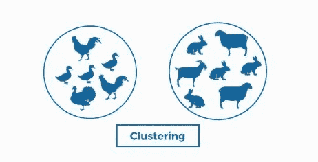

# 简化的 ML 算法

> 原文：<https://medium.com/analytics-vidhya/ml-algorithms-simplified-606bea73d7ac?source=collection_archive---------25----------------------->

简单来说，什么是机器学习算法？这是一个电脑程序。你知道每一个程序都需要输入，而它能提供想要的输出。

函数是 ML 中的算法，Y 是输入 X 的预测输出

到目前为止，我们知道在传统的编程中，我们用代码编写逻辑来给出答案！但是在机器学习中，我们要么传递已知的答案，要么有时甚至不传递答案，我们期望 ML 模型由算法组成，我们向其传递数据，反过来，ML 模型学习输出(Y)和输入数据(X)之间的关系，然后 ML 模型预测未知数据的输出。

传统编程与机器学习

当我们考虑机器学习时，ML 模型主要使用两种方式:监督学习和非监督学习。

在监督学习中，我们传递答案来训练模型。

在无监督学习中——我们不向模型传递任何答案。

因此，我们所说的输入现在被称为要素，而输出被称为标注。

请放心，所有算法都是建立在数学和统计概念基础上的。因此，要理解算法——它是如何工作的——你需要获得一些相关的数学和统计学知识。

这并不意味着你应该在进行机器学习之前先学习完数学和统计学。

在监督学习中，我们使用回归技术来预测输出值，使用分类技术将记录分类到不同的已知类别中。

在无监督学习中，我们使用聚类技术来创建类别未知的相似对象的聚类。

在下一篇文章中，我们将提出线性回归(监督学习风格中最简单的算法之一)