# ML 辅助图像标记

> 原文：<https://medium.com/analytics-vidhya/ml-assisted-image-tagging-f0f755f0ac91?source=collection_archive---------19----------------------->

图像分类多类、图像分类多标签、对象识别(包围盒)

# 用例

要对任何基于图像或视觉的项目应用机器学习或深度学习，首先必须标记图像。标记图像是劳动密集型工作，需要很长时间。我们如何能让它更有成效是我们将要看到的。

为了解决上述问题，我们将使用 Azure 机器学习服务——具有手动和 ML 辅助标记的数据标记功能。

什么是 ML 辅助标注？

例如，我们可以拍摄 2000 张图片和两个标签，或者 1000 张图片和一个标签，比如面膜。在下面的教程中，我只使用了一些图片，但是为了让 ML assit 发挥作用，我们需要更多的图片。一旦你收集了图片，然后手工标记 1000 张图片中的 100 张。可供选择的多个人可以标记图像。

一旦图像被标记，然后等待，直到 ML assit 做它的工作。对于 ML assit，我们需要基于 GPU 的集群，并确保选择基于 GPU 的虚拟机可用的区域。

要做的步骤

*   收集图像
*   创建 Blob 存储
*   创建一个容器
*   上传图片
*   创建 Azure 机器学习服务——我选择 WEST US 2，因为 GPU 可用
*   创建数据标注项目
*   从数据存储创建数据集
*   创建项目
*   图像标记
*   ML 辅助标记

为下面的示例收集图像，从公共域搜索引擎下载图像。
创建一个 Blob 存储器
创建一个容器
上传图片

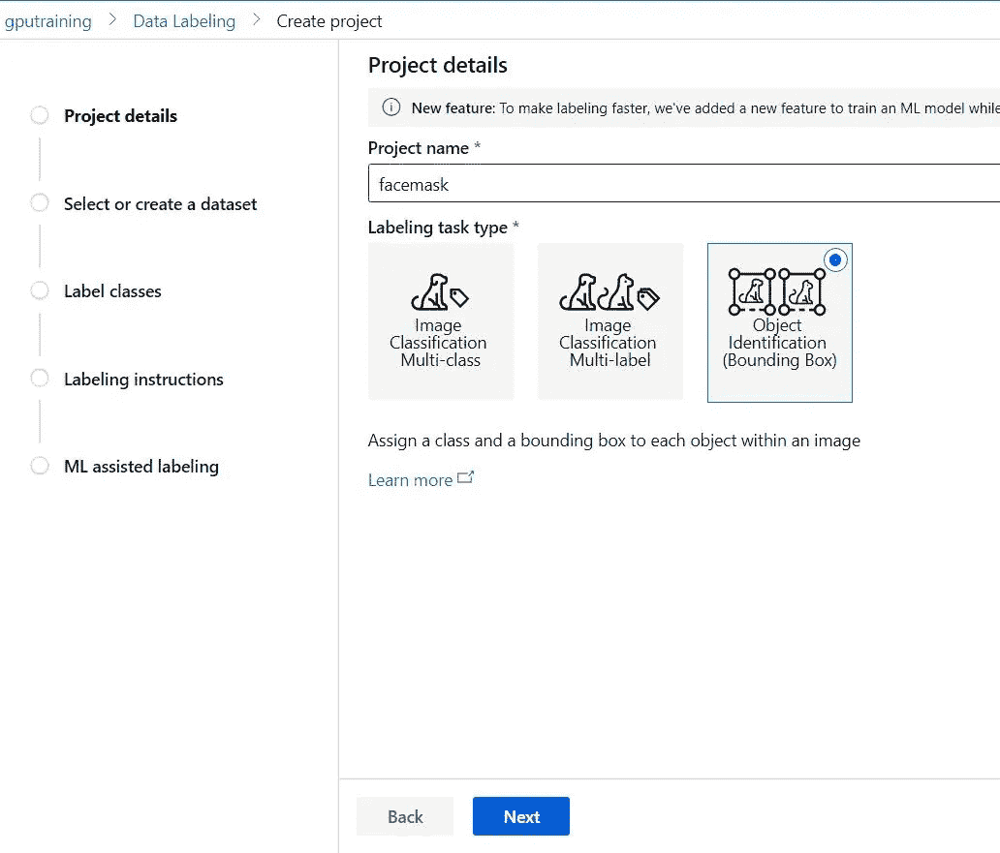

创建一个 Azure 机器学习服务——我选择 WEST US 2，因为 GPU 可以创建一个数据标签项目

从数据存储创建数据集

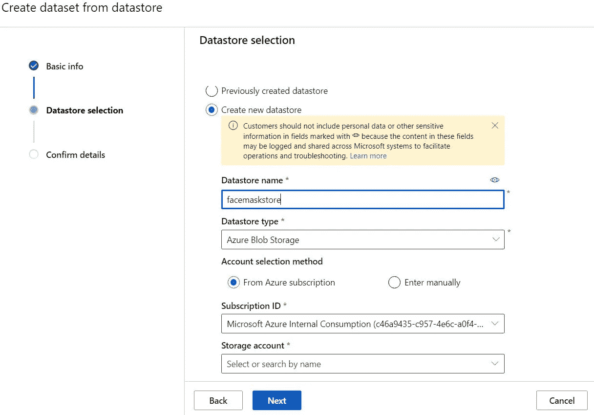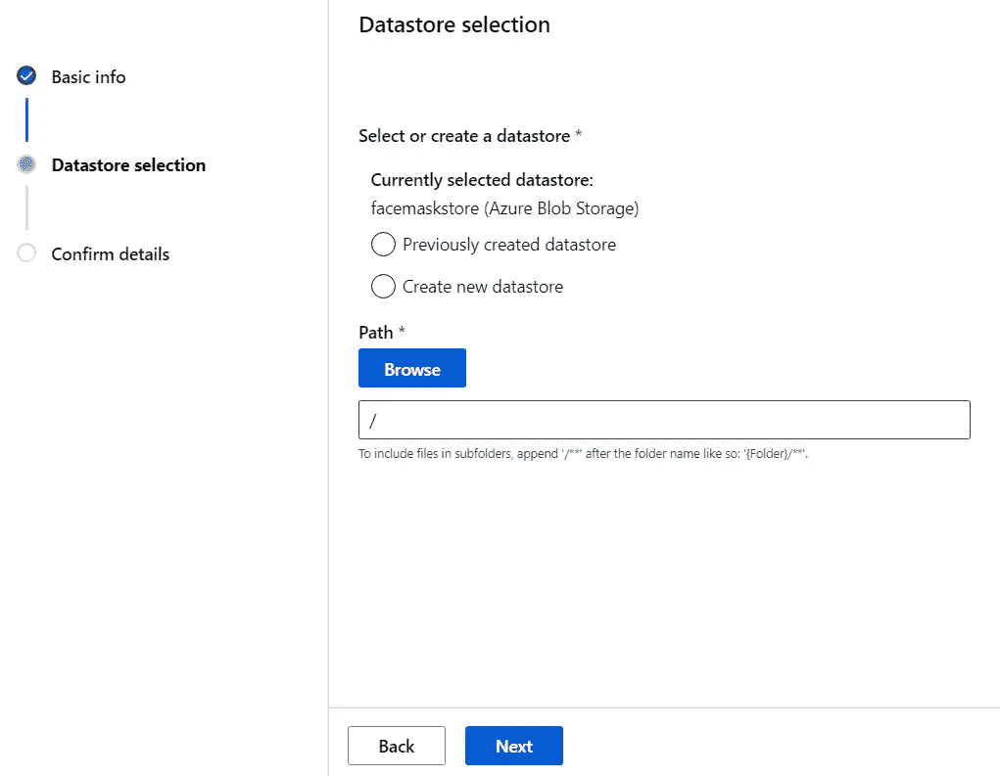

添加类别或标签

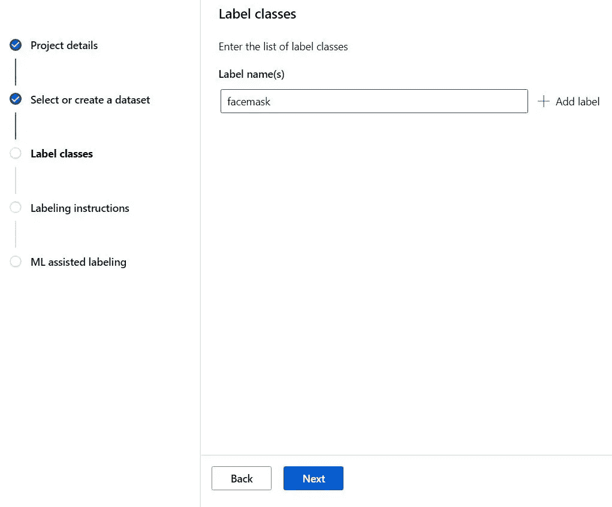

标签说明

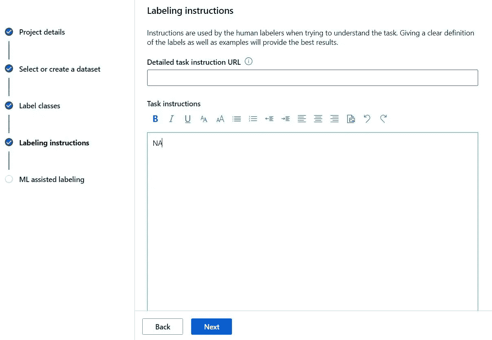

创建项目

选择 ML Assit

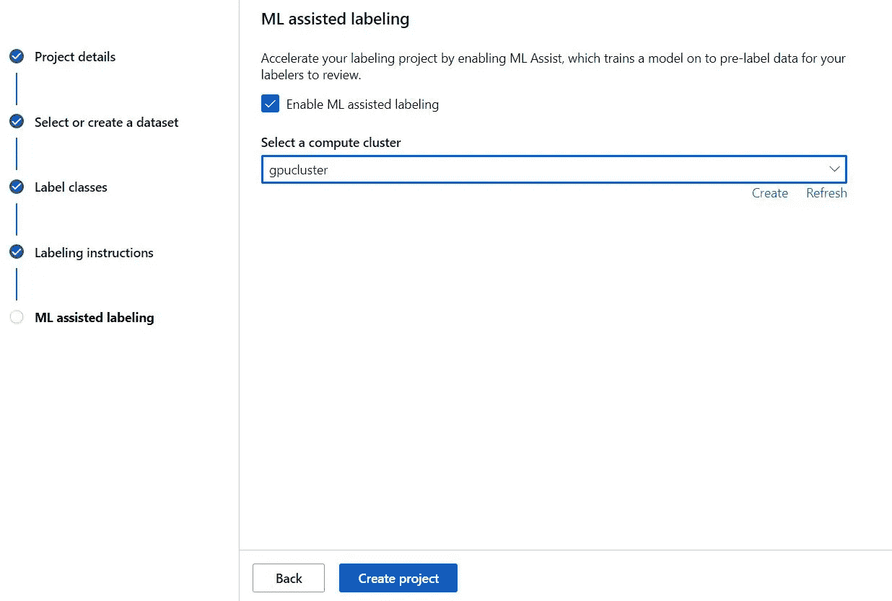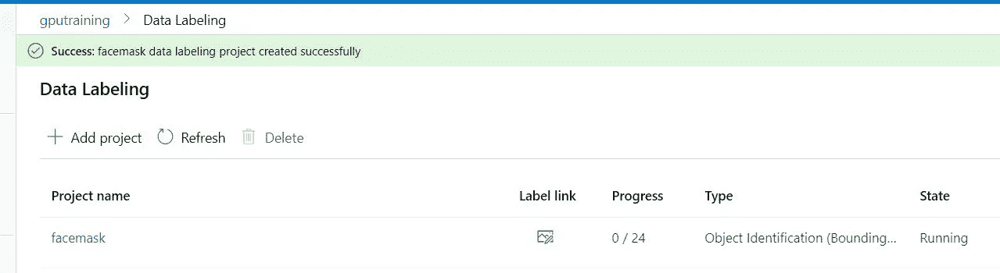

图像标记

选择项目

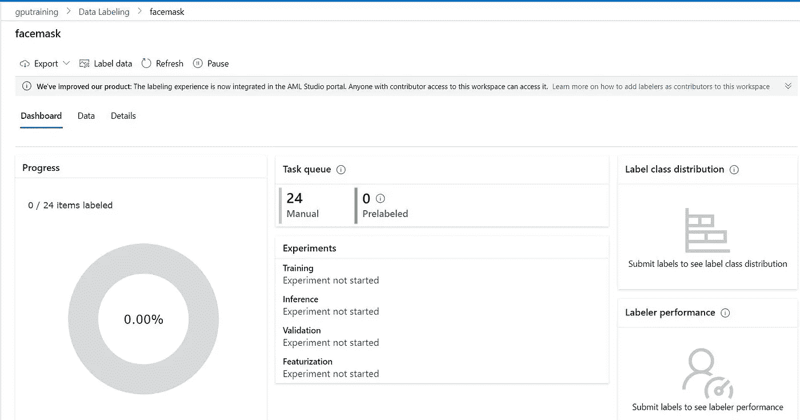

单击数据标签

开始标记

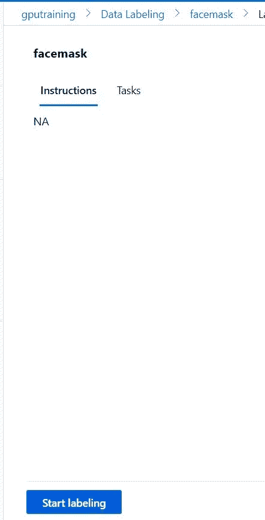

ML 辅助标记

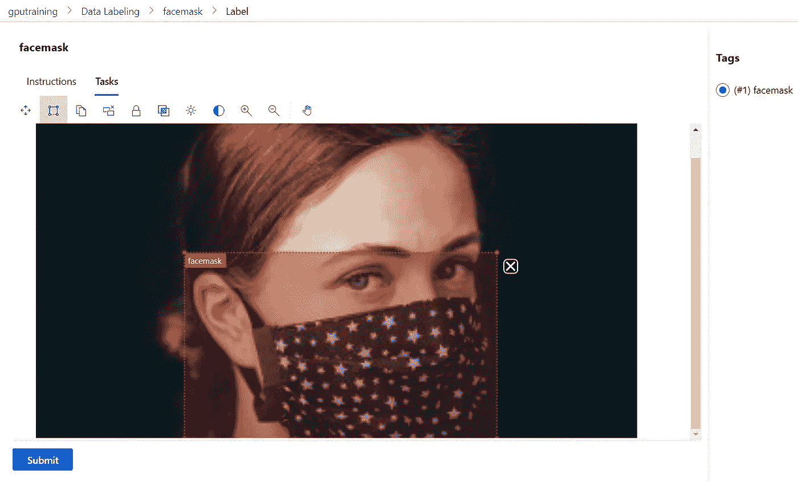

标记所有图像，直到 UI 显示没有任务

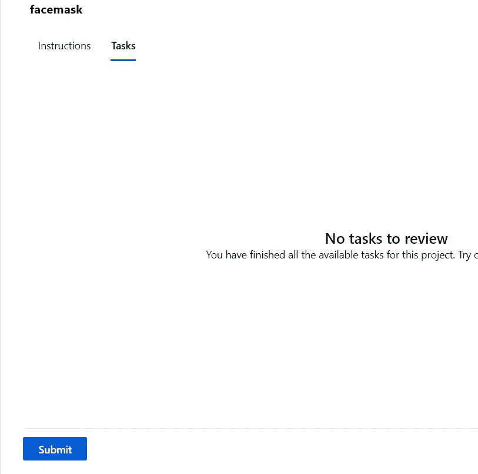

返回项目屏幕

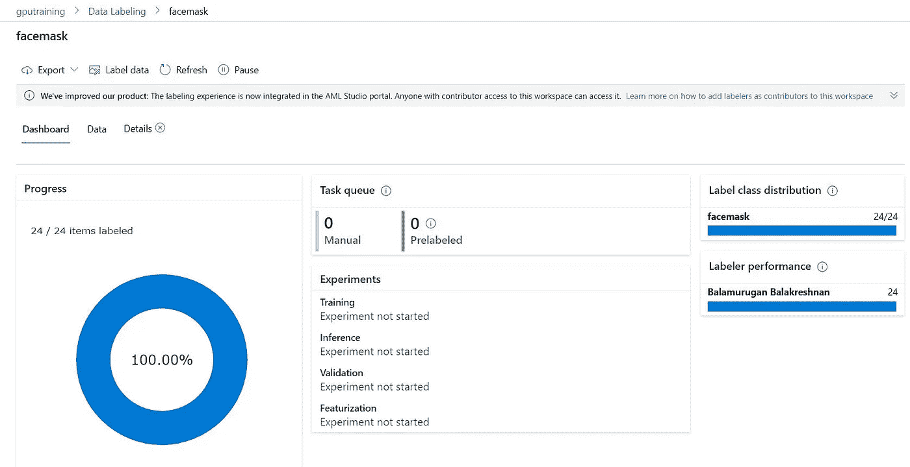

点击详细信息

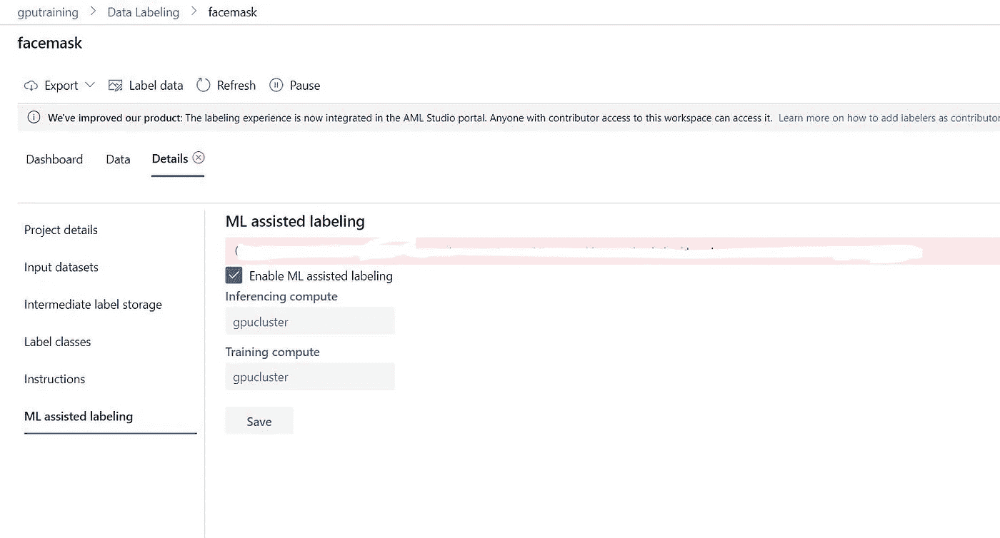

等到剩下的都完成了。

在我们看来，如果你有 1000 张图片，你需要标记 100 张，然后花时间做 ML 辅助标记。

*最初发表于***。**