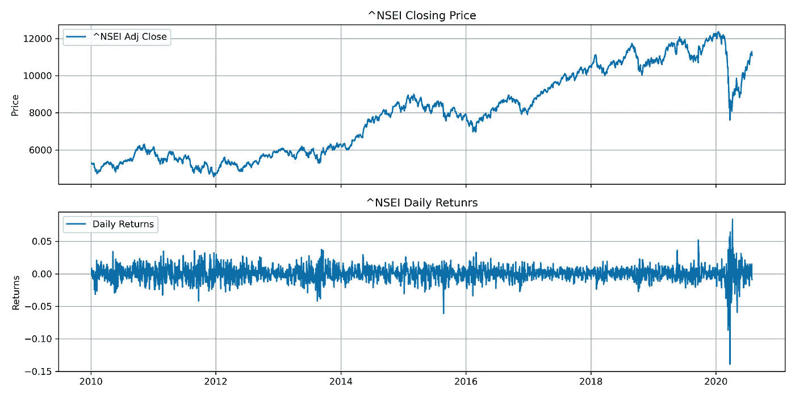
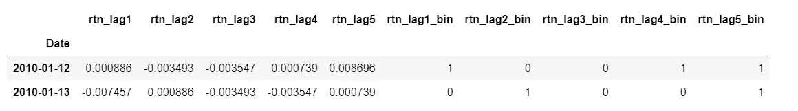
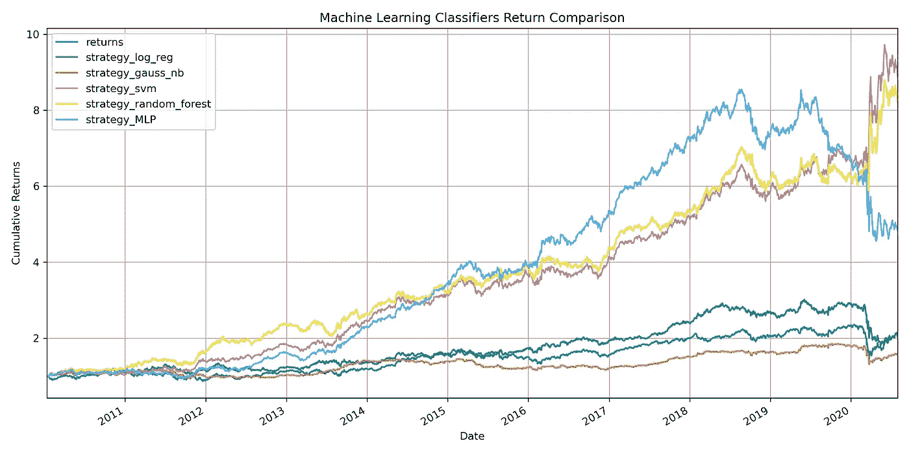
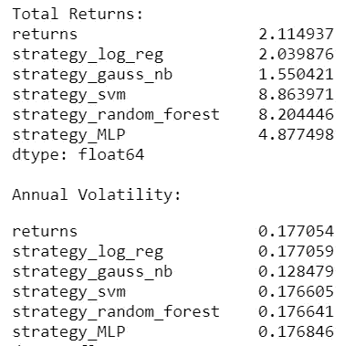
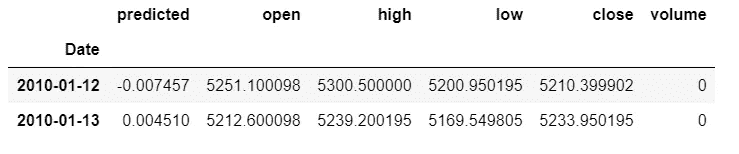
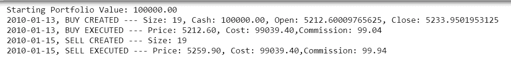
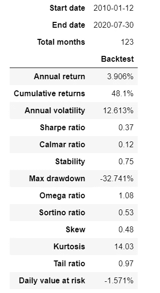
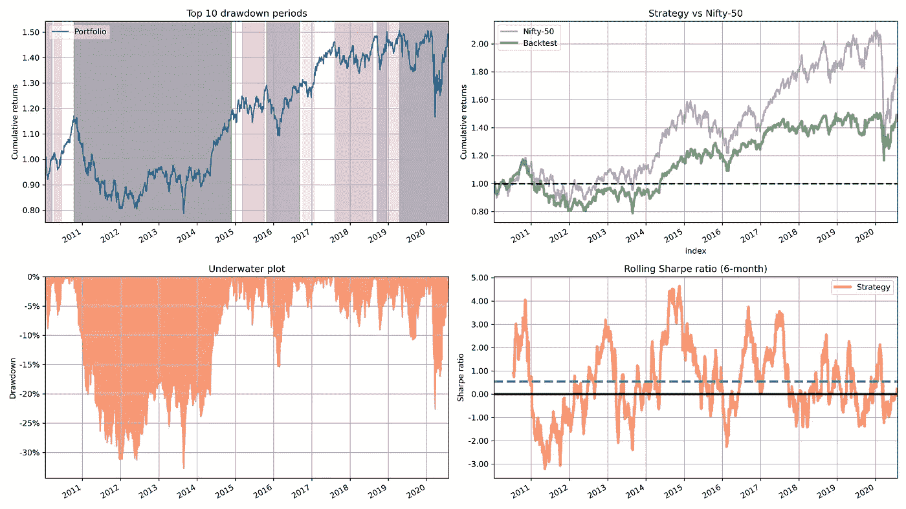

# 预测市场运动和回溯测试的 ML 分类算法

> 原文：<https://medium.com/analytics-vidhya/ml-classification-algorithms-to-predict-market-movements-and-backtesting-2382fdaf7a32?source=collection_archive---------1----------------------->

在本文中，我们将使用基于多种机器学习分类算法的股票交易策略来预测市场运动。为了分析性能，我们将执行简单的矢量化回溯测试，然后使用 Backtrader 测试最佳性能策略，以获得更真实的情况。你可以在我的 [Github](https://github.com/sabirjana/blog/tree/master/Classification_ML) 页面上找到本文使用的相关 Jupyter 笔记本。总体方法如下:

1.  收集历史定价数据。
2.  特征工程。
3.  建立和应用分类机器学习算法。
4.  使用 Backtrader 对所选策略进行回溯测试。
5.  回溯测试的性能分析。

**收集历史定价数据**

我们将使用 Nifty-50 指数进行分析。我们将借助`[yfinance](https://github.com/ranaroussi/yfinance)` python 库下载每日收盘价格数据，计算每日日志回报，并在此基础上得出市场方向。我们将可视化收盘价和每日回报，以快速检查我们的数据。让我们看一下代码:

```
# make the necessary imports 
import numpy as np
from matplotlib import pyplot as plt
import pandas as pd
import seaborn as sns
import yfinance as yf
import warnings
from sklearn import linear_model
from sklearn.naive_bayes import GaussianNB
from sklearn.svm import SVC
from sklearn.ensemble import RandomForestClassifier
from sklearn.neural_network import MLPClassifier
import datetime
import pyfolio as pf
import backtrader as bt
from backtrader.feeds import PandasData
import warnings# set the style and ignore warnings
plt.style.use(‘seaborn-colorblind’)
warnings.simplefilter(action=’ignore’, category=FutureWarning)
warnings.filterwarnings(‘ignore’)# this is to display images in notebook
%matplotlib inline
%config InlineBackend.figure_format = 'retina'# ticker and the start and end dates for testing
ticker =  '^NSEI' # Nifty 50 benchmark
start = datetime.datetime(2010, 1, 1)
end = datetime.datetime(2020, 7, 31)# download ticker ‘Adj Close’ price from yahoo finance
stock =  yf.download(ticker, progress=True, actions=True,start=start, end=end)['Adj Close']
stock = pd.DataFrame(stock)
stock.rename(columns = {'Adj Close':ticker}, inplace=True)
stock.head(2)# calculate daily log returns and market direction
stock['returns'] = np.log(stock / stock.shift(1))
stock.dropna(inplace=True)
stock['direction'] = np.sign(stock['returns']).astype(int)
stock.head(3)# visualize the closing price and daily returns
fig, ax = plt.subplots(2, 1, sharex=True, figsize = (12,6))
ax[0].plot(stock[ticker], label = f'{ticker} Adj Close')
ax[0].set(title = f'{ticker} Closing Price', ylabel = 'Price')
ax[0].grid(True)
ax[0].legend()ax[1].plot(stock['returns'], label = 'Daily Returns')
ax[1].set(title = f'{ticker} Daily Retunrs', ylabel = 'Returns')
ax[1].grid(True)
plt.legend()plt.tight_layout();
plt.savefig('images/chart1', dpi=300)
```



每日收盘价和日志回报

代码注释:

1.  进行必要的进口。
2.  将股票代码设置为 index Nifty-50，开始和结束日期分别为 2010 年 1 月 1 日和 2020 年 7 月 31 日。
3.  在雅虎财经`yfinance`的帮助下下载每日`Adj Close`数据。
4.  使用`np.sign().astype(int)`计算每日日志回报和市场方向。
5.  可视化每日收盘价和日志回报。

**特征工程**

在本节中，我们将创建特征变量来预测市场方向。作为第一步，我们将使用对数收益序列的五个滞后，然后将其数字化为二进制(0，1)，以预测向上和向下市场运动的概率为(+1，-1)。python 代码如下:

```
# define the number of lags
lags = [1, 2, 3, 4, 5]# compute lagged log returns
cols = []
for lag in lags:
    col = f'rtn_lag{lag}'
    stock[col] = stock['returns'].shift(lag)
    cols.append(col)stock.dropna(inplace=True)
stock.head(2)# function to transform the lag returns to binary values (0,+1)
def create_bins(data, bins=[0]):
    global cols_bin
    cols_bin = []
    for col in cols:
        col_bin = col + '_bin'
        data[col_bin] = np.digitize(data[col], bins=bins)  
        cols_bin.append(col_bin)create_bins(stock)
stock[cols+cols_bin].head(2)
```



滞后返回和相应的二进制值(0，+1)

代码注释:

1.  计算五天的滞后回报，并将回报序列转换为滞后数，使其与一天的远期回报一致。
2.  使用函数`np.digitize().`定义将滞后返回转换为二进制值(0，1)的函数

**建立并应用分类机器学习算法**

现在我们将使用逻辑回归、高斯朴素贝叶斯、支持向量机(SVM)、随机森林和 MLP 分类器方法来预测市场方向为(+1，-1)。请参考 [sklearn 文档](https://scikit-learn.org/stable/index.html)了解这些和其他算法的详细信息。然后，我们将使用矢量化回溯测试来评估每个模型的性能，并可视化累积回报。让我们看一下 python 代码:

```
# create a dictionary of selected algorithms
models = {
 ‘log_reg’: linear_model.LogisticRegression(),
 ‘gauss_nb’: GaussianNB(),
 ‘svm’: SVC(),
 ‘random_forest’: RandomForestClassifier(max_depth=10, n_estimators=100),
 ‘MLP’ : MLPClassifier(max_iter=500),
}# function that fits all models.
def fit_models(data):  
    mfit = {model: models[model].fit(data[cols_bin], data['direction']) for model in models.keys()}# function that predicts (derives all position values) from the fitted models
def derive_positions(data):  
    for model in models.keys():
        data['pos_' + model] = models[model].predict(data[cols_bin])# function to evaluate all trading strategies
def evaluate_strats(data):  
    global strategy_rtn
    strategy_rtn = []
    for model in models.keys():
        col = 'strategy_' + model 
        data[col] = data['pos_' + model] * data['returns']
        strategy_rtn.append(col)
    strategy_rtn.insert(0, 'returns')# fit the models
fit_models(stock)# derives all position values
derive_positions(stock)# evaluate all trading strategies by multiplying predicted directions to actual daily returns
evaluate_strats(stock)# calculate total return and std. deviation of each strategy
print('\nTotal Returns: \n')
print(stock[strategy_rtn].sum().apply(np.exp))
print('\nAnnual Volitility:')
stock[strategy_rtn].std() * 252 ** 0.5# number of trades over time for highest and second highest return strategy
print('Number of trades SVM = ', (stock['pos_svm'].diff()!=0).sum())
print('Number of trades Ramdom Forest = ',(stock['pos_random_forest'].diff()!=0).sum())# vectorized backtesting of the resulting trading strategies and visualize the performance over time
ax = stock[strategy_rtn].cumsum().apply(np.exp).plot(figsize=(12, 6), 
                                                     title = 'Machine Learning Classifiers Return Comparison')
ax.set_ylabel("Cumulative Returns")
ax.grid(True);
plt.tight_layout();
plt.savefig('images/chart2', dpi=300)
```

代码注释:

1.  创建所选算法的字典。
2.  定义一个适合所有模型的函数，将`direction` 列作为因变量，将`_bin` 列作为特征变量。
3.  定义一个从拟合模型预测所有位置值的函数。
4.  定义一个函数来评估所有的交易策略。
5.  接下来，我们拟合模型，预测头寸，并通过将预测方向乘以实际日收益来评估所有交易策略。
6.  计算每个策略的总收益和标准差。
7.  计算最高和第二高回报策略的超时交易次数。
8.  对最终的交易策略进行向量化回溯测试，并可视化一段时间内的表现。



机器学习分类器返回比较



总回报和年度波动

我们可以看到，支持向量机模型已经给出了最大的总回报随着时间的推移与可比的年度波动与其他模型。然而，基于向量化的回溯测试结果部署任何这样的策略都是非常不成熟的。下面列出了一些原因:

1.  交易的数量非常多，而且矢量化回溯测试没有考虑交易和市场滑点等成本。
2.  该策略考虑了多头和空头头寸，但由于多种原因，卖空可能不可行。

因此，我们的回溯测试需要更加现实和事件驱动，以解决上述差距。

**使用 Backtrader 对所选策略进行回溯测试**

在本节中，我们将采用我们性能最好的模型，即支持向量机(SVM)，并使用 python 库 [Backtrader](https://www.backtrader.com/docu/) 执行回溯测试。回溯测试策略如下:

1.  我们从 100，000 英镑的初始资本和 0.1%的交易佣金开始。
2.  当`predicted`值为+1 时，我们买入，当预测值为-1 时，我们卖出(仅当持有股票时)。
3.  全进策略——在创建买入订单时，尽可能多地买入股票。
4.  不允许卖空。

让我们看一下 python 代码:

```
# fetch the daily pricing data from yahoo finance
prices = yf.download(ticker, progress=True, actions=True, start=start, end=end)
prices.head(2)# rename the columns as needed for Backtrader
prices.drop(['Close','Dividends','Stock Splits'], inplace=True, axis=1)
prices.rename(columns = {'Open':'open','High':'high','Low':'low','Adj Close':'close','Volume':'volume',
                         }, inplace=True)
prices.head(3)# add the predicted column to prices dataframe. This will be used as signal for buy or sell
predictions = stock['strategy_svm']
predictions = pd.DataFrame(predictions)
predictions.rename(columns = {'strategy_svm':'predicted'}, inplace=True)
prices = predictions.join(prices, how='right').dropna()
prices.head(2)OHLCV = ['open', 'high', 'low', 'close', 'volume']# class to define the columns we will provide
class SignalData(PandasData):
    """
    Define pandas DataFrame structure
    """
    cols = OHLCV + ['predicted']# create lines
    lines = tuple(cols)# define parameters
    params = {c: -1 for c in cols}
    params.update({'datetime': None})
    params = tuple(params.items())
```



具有预测列的数据框架

代码注释:

1.  从 yahoo finance 获取每日定价数据，并将这些列重命名为 Backtrader 所需的 OHLCV 格式。
2.  从`stock` 数据框架中提取 SVM 策略收益，并将其加入到`prices` 数据框架中。该列的值将是下单时买入或卖出的信号。
3.  为要提供给 Backtrader 的 dataframe 列定义一个自定义的`SignalData`类。

现在，我们为回溯测试策略定义`MLStrategy`类。它需要继承自`bt.Strategy`。由于我们已经预测了当天收盘价的市场方向，因此我们将在创建`bt.Cerebro`对象时使用`cheat_on_open=True` 。这意味着我们想要购买的股票数量将基于 t+1 日的开盘价。因此，我们还在策略类中定义了`next_open`方法，而不是`next`。

```
# define backtesting strategy class
class MLStrategy(bt.Strategy):
    params = dict(
    )

    def __init__(self):
        # keep track of open, close prices and predicted value in the series
        self.data_predicted = self.datas[0].predicted
        self.data_open = self.datas[0].open
        self.data_close = self.datas[0].close

        # keep track of pending orders/buy price/buy commission
        self.order = None
        self.price = None
        self.comm = None # logging function
    def log(self, txt):
        '''Logging function'''
        dt = self.datas[0].datetime.date(0).isoformat()
        print(f'{dt}, {txt}') def notify_order(self, order):
        if order.status in [order.Submitted, order.Accepted]:
            # order already submitted/accepted - no action required
            return # report executed order
        if order.status in [order.Completed]:
            if order.isbuy():
                self.log(f'BUY EXECUTED --- Price: {order.executed.price:.2f}, Cost: {order.executed.value:.2f},Commission: {order.executed.comm:.2f}'
                )
                self.price = order.executed.price
                self.comm = order.executed.comm
            else:
                self.log(f'SELL EXECUTED --- Price: {order.executed.price:.2f}, Cost: {order.executed.value:.2f},Commission: {order.executed.comm:.2f}'
                ) # report failed order
        elif order.status in [order.Canceled, order.Margin, 
                              order.Rejected]:
            self.log('Order Failed') # set no pending order
        self.order = None def notify_trade(self, trade):
        if not trade.isclosed:
            return
        self.log(f'OPERATION RESULT --- Gross: {trade.pnl:.2f}, Net: {trade.pnlcomm:.2f}') # We have set cheat_on_open = True.This means that we calculated the signals on day t's close price, 
    # but calculated the number of shares we wanted to buy based on day t+1's open price.
    def next_open(self):
        if not self.position:
            if self.data_predicted > 0:
                # calculate the max number of shares ('all-in')
                size = int(self.broker.getcash() / self.datas[0].open)
                # buy order
                self.log(f'BUY CREATED --- Size: {size}, Cash: {self.broker.getcash():.2f}, Open: {self.data_open[0]}, Close: {self.data_close[0]}')
                self.buy(size=size)
        else:
            if self.data_predicted < 0:
                # sell order
                self.log(f'SELL CREATED --- Size: {self.position.size}')
                self.sell(size=self.position.size)
```

代码注释:

1.  功能`__init__`跟踪打开、关闭、预测和未决订单。
2.  功能`notify_order`跟踪订单状态。
3.  如果订单完成，则触发功能`notify_trade`并记录交易的损益。
4.  函数`next_open`检查可用现金，并计算可以购买的最大股票数量。如果我们不持有任何头寸，并且`predicted` 值大于零，它就会发出买入订单。否则，如果`predicted`值小于零，则发出卖出指令。

接下来，我们实例化`SignalData` 和`Cerebro`对象，并添加`prices`数据帧、`MLStrategy`、初始资本、佣金和`pyfolio` 分析器。最后，我们运行回溯测试并获取结果。

```
# instantiate SignalData class
data = SignalData(dataname=prices)# instantiate Cerebro, add strategy, data, initial cash, commission and pyfolio for performance analysis
cerebro = bt.Cerebro(stdstats = False, cheat_on_open=True)
cerebro.addstrategy(MLStrategy)
cerebro.adddata(data, name=ticker)
cerebro.broker.setcash(100000.0)
cerebro.broker.setcommission(commission=0.001)
cerebro.addanalyzer(bt.analyzers.PyFolio, _name='pyfolio')# run the backtest
print('Starting Portfolio Value: %.2f' % cerebro.broker.getvalue())
backtest_result = cerebro.run()
print('Final Portfolio Value: %.2f' % cerebro.broker.getvalue()) 
```



回溯测试日志

**回测性能分析**

我们将使用`[pyfolio](https://github.com/quantopian/pyfolio)`来分析性能统计数据。pyfolio 是一个 Python 库，用于金融投资组合的性能和风险分析，由 Quantopian 公司开发。

```
# Extract inputs for pyfolio
strat = backtest_result[0]
pyfoliozer = strat.analyzers.getbyname(‘pyfolio’)
returns, positions, transactions, gross_lev = pyfoliozer.get_pf_items()
returns.name = ‘Strategy’
returns.head(2)# get benchmark returns
benchmark_rets= stock['returns']
benchmark_rets.index = benchmark_rets.index.tz_localize('UTC') 
benchmark_rets = benchmark_rets.filter(returns.index)
benchmark_rets.name = 'Nifty-50'
benchmark_rets.head(2)# get performance statistics for strategy
pf.show_perf_stats(returns)# plot performance for strategy vs benchmark
fig, ax = plt.subplots(nrows=2, ncols=2, figsize=(16, 9),constrained_layout=True)
axes = ax.flatten()pf.plot_drawdown_periods(returns=returns, ax=axes[0])
axes[0].grid(True)
pf.plot_rolling_returns(returns=returns,
                        factor_returns=benchmark_rets,
                        ax=axes[1], title='Strategy vs Nifty-50')
axes[1].grid(True)
pf.plot_drawdown_underwater(returns=returns, ax=axes[2])
axes[2].grid(True)
pf.plot_rolling_sharpe(returns=returns, ax=axes[3])
axes[3].grid(True)
# fig.suptitle('Strategy vs Nifty-50 (Buy and Hold)', fontsize=16, y=0.990)plt.grid(True)
plt.legend()
plt.tight_layout()
plt.savefig('images/chart3', dpi=300)
```

代码注释:

1.  我们从回溯测试结果中提取投资组合所需的输入。
2.  获取基准日回报率，与策略进行比较和对比。
3.  使用 pyfolio `show_perf_stats`获取策略的性能统计数据。
4.  可视化下降，累积回报，水下图，滚动夏普比率。



战略绩效

让我们分析一下我们策略的性能。年回报率仅为 3.9%，累计回报率为 48%，相比之下，我们在向量化回测期间观察到的总回报率为 8.86 倍。如果我们将一些其他性能参数与基准进行比较，我们可以看到我们的策略无法击败简单的买入并持有策略。

所以显而易见的问题是为什么？这是因为我们为大量交易支付了巨额佣金。第二个原因；在使用 Backtrader 进行回溯测试时，我们不允许卖空。



战略与基准

总之，通常矢量化的回溯测试结果在纸面上看起来很棒，但是在我们决定实施这种策略之前，我们需要考虑实施不足和可行性的所有方面。此外，请记住，资本市场不仅仅是机器学习，否则所有的数据科学家现在都已经成为超级富豪了。

祝投资愉快，请在文章中留下您的评论！

请注意:此分析仅用于教育目的，作者不对您的任何投资决策负责。

参考资料:

1.  [Python for Finance 2e:掌握数据驱动的金融](https://www.amazon.in/Python-Finance-2e-Yves-Hilpisch/dp/1492024333)作者 Yves Hilpisch
2.  [Python for Finance 食谱:将现代 Python 库应用于金融数据分析的 50 多个食谱](https://www.amazon.in/Python-Finance-Cookbook-libraries-financial-ebook/dp/B083KG9DC7/ref=sr_1_2?dchild=1&keywords=Python+for+Finance+Cookbook&qid=1597938216&s=books&sr=1-2)，作者 Eryk Lewinson
3.  Stefan Jansen 的《算法交易的机器学习》
4.  请在我的 [Linkedin](https://www.linkedin.com/in/sabirjana/detail/recent-activity/shares/) 页面或 [Medium](/@sabirh.jana) 查看我关于量化金融的其他文章/帖子。