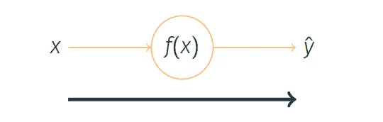
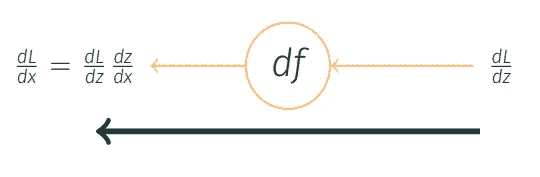

# ML & DL —线性回归(第二部分)

> 原文：<https://medium.com/analytics-vidhya/ml-dl-linear-regression-part-2-14f114f2d62a?source=collection_archive---------19----------------------->

线性回归定义了两个变量之间的关系，但是如何找到参数的“*最佳*”组合？

照片由 [Atharva Tulsi](https://unsplash.com/@atharva_tulsi?utm_source=medium&utm_medium=referral) 在 [Unsplash](https://unsplash.com?utm_source=medium&utm_medium=referral) 上拍摄

在这篇文章中，你会发现:

*   **线性回归简介，**
*   **成本函数**和**优化**问题，
*   **梯度下降**和学习率、
*   **反向传播**和**优化器，**
*   用 *Jupyter 笔记本*中的 *Keras* 实现**线性回归**
*   部分总结。

# 线性回归

**线性回归**是一个简单的机器学习算法，它解决了一个*回归问题*【1】。

在**统计**中，*线性回归*是一种建模因变量 *y* 与一个或多个自变量 *x* 之间关系的技术。

输出是输入的线性函数[1]

*   `ŷ= Wx + b`，*线性回归。*
*   **假设** `ŷ`是模型预测的值，
*   **参数**

## 因素

参数是控制系统*行为*的值。

*   目标是找到描述数据的*【最佳】*可能的参数集`W`和`b`。
*   然而，首先，我们需要定义**误差/成本。**

## 价值函数

定义模型*绩效评估*。

测量模型性能的一种方法是计算测试集[1]中的**均方误差** (MSE)。

*   在**统计**中，MSE 测量误差或偏差的均方值。
*   `L = 1/n ∑(y⒤ — ŷ⒤)²` *，均方误差(MSE)。*

假设值`ŷ`与真实值`y`之差。

## 优化问题

然而，我们需要*基于
模型参数`W`和`b`最小化假设`ŷ`的成本*。

*   `min(L) = min(1/n ∑(y⒤ — ŷ⒤)²`，*最小化成本函数。*

可能的解决方案:

*   分析或
*   **数值**:迭代数据集的优化算法，例如*梯度下降*。

## 梯度下降

在**微积分**中，*梯度下降*是一种寻找函数【1】的*最小值的一阶迭代优化算法。*

*   **梯度**是一个采用多变量函数的运算，返回一个*向量，方向为原函数图形中最大斜率*的方向。
*   `∇L=[𝜕L/𝜕W, 𝜕L/𝜕b]ᵀ`，*梯度下降。*

如果我们想从*往下走*，我们要做的就是从*往*的相反方向走。这将是最小化成本函数的*策略。*

## ϵ学习率

学习率是确定步长[1]的正比例`ϵ`。

*   `[W’, b’]ᵀ = [W, b]ᵀ — ϵ∇L`、*学习率*。

学习率`ϵ` 在两个方面可能是个问题:

*   如果步长*太小*，我们将缓慢移动到最小值，
*   如果步长*太大*，我们可能会跳过最小值。

## 反向传播

*计算*坡度的方法。

而*另一个*算法，例如*梯度下降*，用于使用该梯度[1]执行**学习** ( *优化*)。

两个短语，*正向传播，*和*反向传播*。

*   **正向传播**

输入`x`提供初始信息*传播*并最终产生`ŷ`。

由[马正向传播。费尔南达·罗德里格斯](https://medium.com/u/d83c82313ee1?source=post_page-----14f114f2d62a--------------------------------)

*   **反向传播**

我们使用*成本函数值来计算误差*。误差值被向后传播，以便计算相对于权重的梯度。

使用 [*链规则*](https://en.wikipedia.org/wiki/Chain_rule) 计算梯度。

通过 [ma 进行反向传播。费尔南达·罗德里格斯](https://medium.com/u/d83c82313ee1?source=post_page-----14f114f2d62a--------------------------------)

## **反向传播算法**

*   在*前向传播*之后，我们获得一个输出值，即预测值。
*   我们使用一个*损失函数* `L`来计算误差值。
*   我们计算每个重量的误差梯度，
*   我们从权重值中减去梯度值。

这样，我们就接近了*局部最小值*。

## 梯度下降的问题

*梯度下降的传统方法*计算整个数据集的梯度，但是*将仅执行升级*。

因此，对于不适合内存的非常大的数据集，控制起来会非常缓慢和困难。

作为一个解决方案，对原来的方法*优化器*进行了*修改*。

## 优化者

有*扩展*(对原方法的修改)试图解决*梯度下降*的问题。

基本[1]:

*   **SGD** :随机梯度下降。

适应性学习率[1]:

*   **阿达格拉德**【2】。
*   rms prop【3】。
*   **亚当**【4】。

# Github 代码

在这个库中，你会发现一个**线性回归**的一步一步的实现与 *Keras* 在 *Jupyter 笔记本*中。

 [## MAF da/深度学习 _101

### permalink dissolve GitHub 是超过 5000 万开发人员的家园，他们一起工作来托管和审查代码，管理…

github.com](https://github.com/mafda/deep_learning_101/blob/master/src/01-linear-regression.ipynb) 

# 部分摘要

**线性回归**定义两个变量之间的*关系*。

如何找到“*最佳的*参数组合？

*   *成本函数*:均方差
*   *梯度下降*
    *反向传播*计算梯度
    *优化器*(向下梯度扩展)

寻找参数最佳组合(优化)的过程称为**训练**。

所有理论和实际实现: [*线性回归*](/@mafdarr/ml-dl-linear-regression-part-2-14f114f2d62a) *，* [*逻辑回归*](/@mafdarr/ml-dl-logistic-regression-part-3-fe6aca8f01b) *，* [*人工神经网络*](/@mafdarr/ml-dl-artificial-neural-networks-part-4-619350a93ef1) *，* [*深度神经网络*](/@mafdarr/ml-dl-deep-artificial-neural-networks-part-5-568ad05be712) *，以及* [*卷积神经网络*](/@mafdarr/ml-dl-convolutional-neural-networks-part-6-97357db58165) 。

对于那些寻找我们 **ML & DL 系列**所有文章的人来说。以下是链接。

 [## ML & DL —机器学习和深度学习 101

### 介绍涉及机器学习和深度学习概念的基本概念。

medium.com](/@mafdarr/ml-dl-machine-learning-and-deep-learning-101-2686d93d70d) 

# 参考

[1]古德费勒，I .，本吉奥，y .，和库维尔，A. (2016)。 [*深度学习*](https://www.deeplearningbook.org/) 。麻省理工出版社。

[2]杜奇、哈赞和辛格(2011 年)。*在线学习和随机优化的自适应次梯度方法*。机器学习研究杂志，12(7 月):2121–2159。

[3]辛顿·g .(2012 年)。*机器学习的神经网络*。Coursera，视频讲座

[4]金马博士和巴律师(2014 年)。*亚当:一种随机优化的方法*。abs/1412.6980。

 [## 关于神经网络你需要知道的一切

### 感谢:Kailash ahir war(Mate Labs 联合创始人兼首席技术官)

hackernoon.com](https://hackernoon.com/everything-you-need-to-know-about-neural-networks-8988c3ee4491)