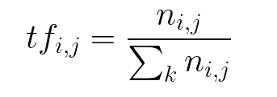
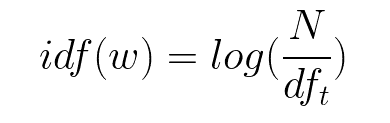
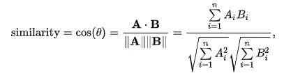

# ML:文档比较变得简单

> 原文：<https://medium.com/analytics-vidhya/ml-document-comparison-made-simple-8b7e38c661df?source=collection_archive---------11----------------------->

在学习机器学习的过程中，我开始遇到许多使用 ML 可以轻松解决的问题。所以当我开始研究自然语言处理时，我想到了建立一个比较文档的模型。这是一个简单的模型，当我遇到一些先进的模型时，我打算改进这个模型。说得够多了，让我们开始构建模型。

我们必须安装几个 python 包才能让我们的模型工作。在命令提示符或终端中，给出以下命令来安装所需的软件包。您可以使用 pip 或 conda 进行安装。我正在使用 pip 来安装它。

我们的简历可以是 pdf 或 Docx 格式。所以安装各自的包来处理文档。在这个项目中，我们将文档文本保存在 excel 表格中。所以我们需要将 excel 读取到 panda 的数据帧中，所以我们必须安装 python 包 xlrd 和 pandas。

```
pip install xlrd 
pip install pandas 
pip install PyPDF2
pip install python-docx
pip install nltk 
```

现在，我们导入熊猫，从 excel 中获取数据并存储在 dataframe 中。我将 excel 文件命名为 docs.xlsx。

```
**import** pandas **as** pddataframe = pd.read_excel(**'docs.xlsx'**)
```

现在我们有了数据帧中的数据，我们计算 tf-idf，这是进一步计算余弦相似性所需要的。简单介绍一下 tf-idf，它是对数据进行矢量化的方法之一，因为我们的模型都是数学模型，不能理解英语，我们需要将它们转换成向量，这些向量可以进一步馈送到 ML 模型来进行预测。在转换为向量之前，我们需要对数据进行预处理，以便减少停用词，从而使我们的模型变得健壮。因此，为了对数据进行预处理，我们需要执行一些已经存在于名为 nltk 的库中的操作。如您所见，我们已经安装了 nltk 包。我们只需要导入一些用于预处理数据的子包，这通常被称为规范化文本数据。下面是代码:

```
 **from** nltk.util **import** ngrams
**from** nltk.corpus **import** stopwords 
```

分析下面几行代码来理解 ngrams，基本上你的 n 可以是你想要的数字，应该相应地选择。因此，我们决定在这种情况下，n 的值对我们的任务来说是什么，2 是恢复预测情况下 n 的值

```
>>> from nltk import ngrams
>>> sentence = 'this is a foo bar sentences and i want to ngramize it'
>>> list(ngrams(sentence.split(),1))[('this',), ('is',), ('a',), ('foo',), ('bar',), ('sentences',), ('and',), ('i',), ('want',), ('to',), ('ngramize',), ('it',)]>>> list(ngrams(sentence.split(),2))
[('this', 'is'), ('is', 'a'), ('a', 'foo'), ('foo', 'bar'), ('bar', 'sentences'), ('sentences', 'and'), ('and', 'i'), ('i', 'want'), ('want', 'to'), ('to', 'ngramize'), ('ngramize', 'it')]>>> list(ngrams(sentence.split(),3))
[('this', 'is', 'a'), ('is', 'a', 'foo'), ('a', 'foo', 'bar'), ('foo', 'bar', 'sentences'), ('bar', 'sentences', 'and'), ('sentences', 'and', 'i'), ('and', 'i', 'want'), ('i', 'want', 'to'), ('want', 'to', 'ngramize'), ('to', 'ngramize', 'it')]
```

可以通过下面几行代码获得停用词。停用词是那些对文档的语义没有太大影响的词

```
**from** nltk.corpus **import** stopwords
stopwords.words(**'english'**)
```

词汇化和词干化是获取词根的过程。比如说。这两种方法都用来获取词根。比如吃，吃，被吃，吃了会导致吃。有不同的算法可用于词干分析，这里我们使用波特词干分析器。如果我们想要严格的词干，我们可以使用 LancerStemmer，它是迭代词干。为了对单词进行词干处理，我们需要将单词单独传递给词干分析器，因此我们必须首先将文档转换成标记

```
**from** nltk.stem **import** PorterStemmer
**from** nltk.tokenize **import** sent_tokenize, word_tokenizewords = nltk.word_tokenize(sentence)
porter = PorterStemmer()
words = []
**for** word **in** token_words:
    words.append(porter.stem(word))
**print(words)**
```

小写字母和删除单个字符单词也是文本预处理的一部分。完成这些之后，我们的数据就可以建模了。

```
def lowerCaseWords(token_words):
   words = []
   for word in token_words:
       if len(word) > 1:
           words.append(word.lower())
return words 
```

接下来是使用 sklearn 库将我们的文本转换为 tf-idf 向量。tf-idf 缩写为 term frequency —逆文档频率。也就是说，它给出了一个单词对于一个文档有多重要。

数学上 tf-idf 定义为:



```
from sklearn.feature_extraction.text import TfidfVectorizervectorizer = TfidfVectorizer(stop_words="english", ngram_range=(1,2))tfidf = vectorizer.fit_transform(raw_data)
```

现在我们计算文档之间的余弦相似度。余弦相似性在数学上定义为:



维基百科图片

这里 A 和 B 是向量，在我们的例子中是 doc a 和 doc b 的 tfids，所以在 python 中我们有许多实现余弦相似性的库，这里我使用 sklearn 的实现。以下是相同的代码:

```
from sklearn.metrics.pairwise import cosine_similaritycosine_similarity(query_tfidf, docs_tfidf).flatten()
```

我故意忽略了一些让读者理解的步骤。。有任何问题请留下评论。很快将会在我的 git hub 个人资料上发布全部代码。[https://github.com/ams1234](https://github.com/ams1234)

# **快乐学习**

问候，

阿尔皮塔