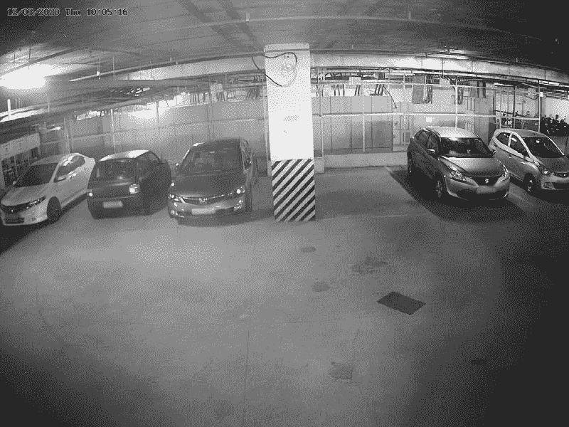
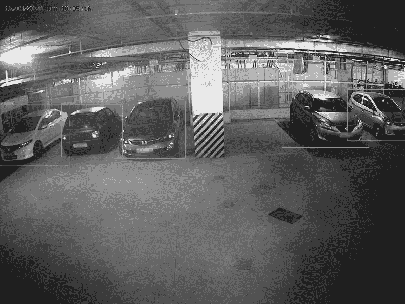
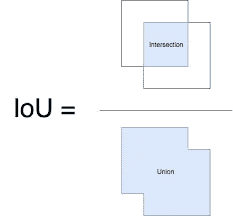
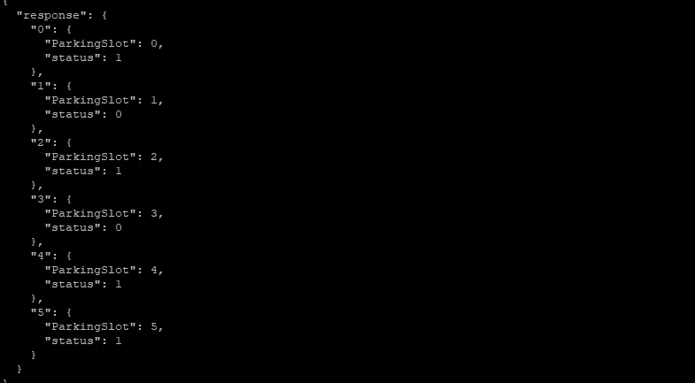
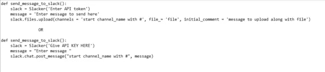
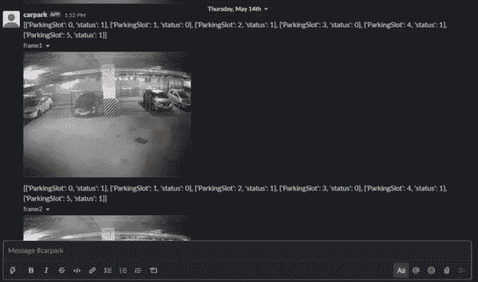

# 支持 ML 的停车场:自动化日常任务

> 原文：<https://medium.com/analytics-vidhya/ml-enabled-car-parking-automating-mundane-tasks-433430c64c2f?source=collection_archive---------20----------------------->

在商业建筑中找到一个空的停车位是一个挑战。汽车停车系统可以用来显示建筑物中每个停车位的状态。这将节省用户的时间，并通知他们可用的停车位，从而节省开车四处寻找停车位的时间和精力。

我在浦那的科里奥利技术公司实习时实施了这个项目。该项目的目的是处理来自安装在停车场的闭路电视的实时视频流，并使用机器学习(ML)来识别和提醒用户已占用和可用的停车位。

让我把整个过程分成几个步骤:

1.  **从视频流中检测汽车并将其存储在帧中**

这是停车场闭路电视的真实图像:

第一步是装备系统，从视频流中检测汽车。在比较了 SSD、Masked R-CNN、YOLO(一种深度学习方法)等各种模型后，证明在速度和准确性方面对该应用程序最有效。

YOLO 是解决当前问题的完美算法。它将单个神经网络应用于图像，并通过将图像划分为多个区域来预测边界框和概率。然后，它将非极大值抑制(NMS)应用于图像，以确保每个对象只被检测一次。输出图像是考虑了图像中所有边界框的预测..

为了与 YOLO 合作，三个文件是必不可少的:

1.  [yolo.weights](https://pjreddie.com/media/files/yolov3.weights) —预训练的重量
2.  [yolo.cfg](https://github.com/pjreddie/darknet/blob/master/cfg/yolov3.cfg) —配置文件
3.  [可可名](https://github.com/pjreddie/darknet/blob/master/data/coco.names) — 80 类标签

这三个文件是算法、其配置和标签，对象检测器针对这些文件进行预训练。

YOLO 启用了以下输出图像，其中每个蓝色框代表一个边界框:

**2。标记停车槽坐标**

与在程序中硬编码停车位坐标不同，保存在配置文件中减少了修改代码的需要。配置文件保存 Python 脚本的所有变量，并保持代码完整。所有更改都可以直接在配置文件中进行。使用[鼠标点击事件](https://github.com/olgarose/ParkingLot/blob/master/parking_lot/coordinates_generator.py)可以捕获停车位的坐标。这些坐标与汽车的边界框一起用于计算并集上的交集(IoU)。

**3。检测停车位的状态，已占用或可用**

很可能在摄像机视图中，一辆车将与另一个槽重叠。为了评估停车位的状态，使用的测量方法是[交叉点对联合](https://www.pyimagesearch.com/2016/11/07/intersection-over-union-iou-for-object-detection/)。它的计算方法是找出它们重叠的面积，然后除以两个对象覆盖的总面积，如下所示:

并集上的交集

该值有助于确定轿厢是否占用了特定的位置。如果该值小于 0.2，则表示停车位是空的，因此最有可能是可用的。高于 0.6 的值表示汽车占据了大部分停车位，因此可以安全地假设它被占用了。

**4。与 Flask 服务器集成，使用 JSON 格式**

Flask 是 Python 的一个轻量级 web 框架。它为用户提供了库、模块和工具来帮助构建 Web 应用程序。将相关数据与 Flask API 集成。

可以使用下面的命令行安装它: **pip install flask**

JSON (JavaScript Object Notation)是一种基于文本的数据存储格式，旨在方便人类和机器阅读。JSON 通常是通过 API 返回数据的最常见格式，XML 是第二常见的格式。使用 curl 命令的输出可以在命令行上看到如下内容:

JSON 格式的 Curl 输出

**5。** **使用 Slack app 在频道上发送消息**

Slack 是一个受组织青睐的流行的商业交流平台，它允许团队远程工作以保持交流和工作效率。公司使用 Slack 进行内部沟通，使其成为这个项目的首选平台，我使用 Slack 应用程序发送警报。

要在 Slack 上发送消息，首先要安装一个名为“Slacker”的模块。下一步是[创建一个 Slack 应用程序](https://api.slack.com/start/overview)，它将支持使用认证令牌发送消息。此令牌将允许应用程序在添加到松弛通道后发送消息。

安装模块“懒鬼”

一旦创建了应用程序并集成了必要的权限和功能，以下功能就可以在 Slack 上发送消息:

在空闲信道上发送警报的功能

这是应用程序发送的消息在 Slack 上的显示方式:

除了 Slack 应用程序，发送消息的其他可能选项是使用 Slack bot 或传统令牌。机器人有一些安全问题，因为它能够在它不是成员的频道上发布消息。使用传统令牌的问题是它们是一个过时的选项，Slack 建议使用 Slack 应用程序。

选择这个应用程序中的应用程序的另一个主要原因是限制消息发送的渠道。Slack 应用程序允许创建者添加各种权限，如写、读、上传文件和许多其他权限。这使得用户可以选择将应用添加到哪个频道，从而确保其他公共和私人频道的隐私。

**6。** **训练和测试图像分类器**

我决定给这个应用程序添加一个额外的特性，训练一个图像分类器来识别车主。Keras ImageDataGenerator 模块用于数据扩充，因为它对图像执行各种变换，如放大、缩小、水平(或垂直翻转)、从各种角度查看图像等。

在这个项目中，[训练图像分类器](https://www.pyimagesearch.com/2019/07/08/keras-imagedatagenerator-and-data-augmentation/)有三个步骤:

a.通过执行数据扩充来生成图像数据集

b.使用 ImageDataGenerator 获得的数据集训练 CNN (ResNet)

c.测试生成的模型以识别汽车的所有者

识别车主的一种方法是看车牌。然而，由于光线不足，溪流处于夜间视野中，所以号码牌是反光的，因此很难从远处看清。因此，该模型被训练成基于汽车的特征来识别车主。

我的实习让我有机会开发一个解决员工停车问题的系统。该公司目前在每个停车位上都安装了超声波传感器，用于检测汽车的存在与否。该项目的目的是取代旧系统，并建立一种新的方式来帮助用户。

我在这个项目中提到的链接是:

1.  **计算并集上的交集:**[https://www . pyimagesearch . com/2016/11/07/Intersection-over-Union-iou-for-object-detection/](https://www.pyimagesearch.com/2016/11/07/intersection-over-union-iou-for-object-detection/)
2.  **使用 YOLO 和 OpenCV 的物体检测:**[https://www . pyimagesearch . com/2018/11/12/yolo-Object-detection-with-OpenCV/](https://www.pyimagesearch.com/2018/11/12/yolo-object-detection-with-opencv/)
3.  **SSD MobileNet 代码:**[https://honing ds . com/blog/SSD-single-shot-object-detection-MobileNet-opencv/](https://honingds.com/blog/ssd-single-shot-object-detection-mobilenet-opencv/)
4.  **数据增强和图像分类器:**[https://www . pyimagesearch . com/2019/07/08/keras-imagedata generator-and-Data-augmentation/](https://www.pyimagesearch.com/2019/07/08/keras-imagedatagenerator-and-data-augmentation/)[https://www . pyimagesearch . com/2017/12/11/Image-class ification-with-keras-and-deep-learning/](https://www.pyimagesearch.com/2017/12/11/image-classification-with-keras-and-deep-learning/)