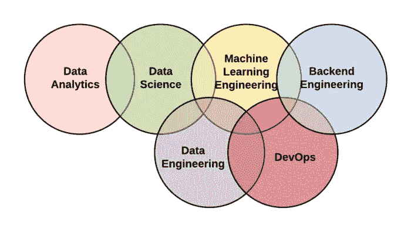

# ML 工程

> 原文：<https://medium.com/analytics-vidhya/ml-engineering-3b21801c4083?source=collection_archive---------12----------------------->

最近一个新的工作描述已经出现了不少，ML 工程师的称号。这个神秘的生物是谁，为什么这些天他获得了如此多的关注，让我们来寻找答案。

在现实世界的 ML 系统中，一个非常小的组件由 ML 代码组成。所需的周围元素是巨大而复杂的。ML 工程师是围绕 ML 代码构建系统的人。

[现实世界的 ML 系统](https://cloud.google.com/solutions/machine-learning/mlops-continuous-delivery-and-automation-pipelines-in-machine-learning)

我们有数据工程师、后端工程师，最后是开发运营人员。嗯，一个 ML 工程师是这三者的混合体。基本上，他围绕数据科学家建立了一个系统。从创建数据接收管道以获取所需格式的数据(数据工程)，到创建数据科学家可以进行实验的分布式引擎框架(后端)，以及最后在创建模型时如何以可扩展的方式将其部署为业务服务(开发运营)。

**数据摄取管道**

ML 系统最基本的组成部分是数据。没有数据，你就没有模型。数据接收有两种方式

流媒体:卡夫卡

批处理:BigQuery、Spark、Dask

**分布式系统框架**

数据科学家需要一个平台来编写模型生成代码。您的模型的数据量可能非常大，可能比单台机器的数据量还要大。在这种情况下，您需要为您的模型训练准备一个分布式系统，该系统可以使用

火花

达斯克

张量流

**模型跟踪和版本控制**

很少会出现第一次尝试就得到完美模型的情况。数据科学家必须调整超参数，无数次地运行实验，才能得到所需的模型。为了跟踪模型元数据，需要捕获这些运行和相关的超参数。这可以通过以下工具实现

MLFlow

ModelDb

**按比例部署模型**

现在模型创建完毕，可以进行预测了。我们将如何向最终用户公开 it 即服务。模型部署可以通过以下方式完成

在 tornado、flask 或 Django 服务器上部署模型，并公开一个 REST API 端点

在边缘设备的情况下嵌入应用的模型(例如特斯拉汽车上的自动驾驶模型)

使用无服务器模式可以实现纵向扩展。如果请求的数量增长超过了服务器的能力，那么在单个服务器上托管的模型可能无法处理所有的请求。我们可以使用无服务器容器来根据请求自动伸缩，如果没有请求，就缩小到零。我们可以通过各种方式在 kubernetes 上使用无服务器

1.托管:托管 kubernetes 服务，几乎不需要用户端进行开发。例如 Google Cloud Run

2.非托管:手动设置 kubernetes 集群并处理 devops。kubernetes 豆荚的自动秤通过 Knative 和 Istio 处理。

在生产中部署模型是一件非常棘手的事情，它已经产生了自己的规程，称为 MlOps。它将 devops 和 CI/CD 的原则引入到模型的部署中。

自己建立一个端到端的 ML 系统不是一件容易的事情。但是为您的用例选择正确的工具会对您有很大的帮助。在那之前，值得思考。

[https://xkcd.com/1838/](https://xkcd.com/1838/)