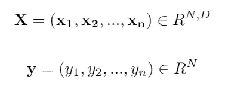
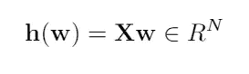
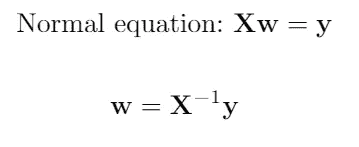
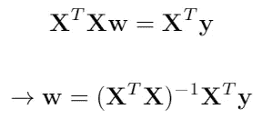
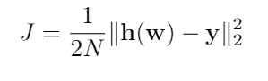
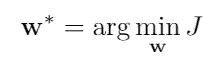
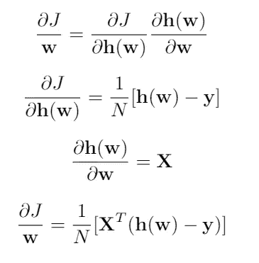
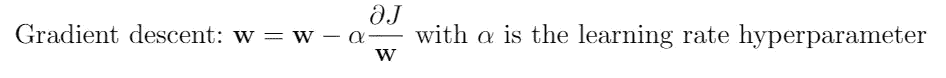
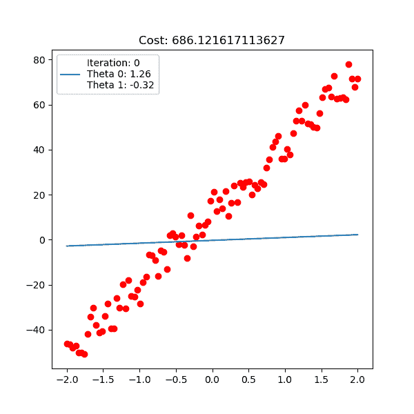
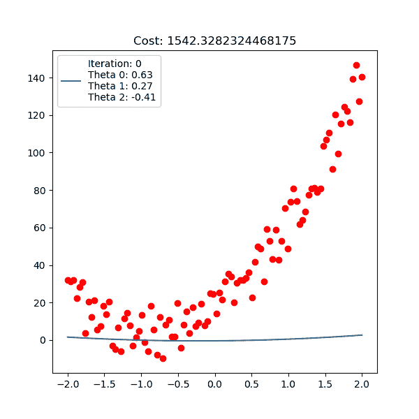

# 线性回归

> 原文：<https://medium.com/analytics-vidhya/ml-from-scrach-linear-regression-normal-equation-gradient-descent-1af26b542c28?source=collection_archive---------10----------------------->

## 正规方程和梯度下降

当我们开始学习时，第一个机器学习模型是线性回归。

在本文中，我将深入解释解决线性回归问题的两种流行方法:**正规方程**和**梯度下降。**

为了达到最佳效果，线性回归必须遵循以下假设:

*   **特征和目标之间的线性关系。**
*   **特征之间很少或没有多重共线性。**
*   **误差项的正态分布。**
*   **同方差假设(又名恒定方差假设)。**
*   **误差项的正态分布。**
*   **残差中很少或没有自相关。**

我不会在这里讨论这些假设的细节。更多信息，请查看此[帖子](https://towardsdatascience.com/assumptions-of-linear-regression-algorithm-ed9ea32224e1)。

线性回归的思想很简单。我们给定一个具有一组特征的数据，并且输出范围是连续的。我们的任务是找到一条最佳直线(3D 中的平面和多维中的超平面),该直线与输出之间的误差尽可能接近。

假设我们有一个特征矩阵和一个相应目标的向量:

其中 N 是数据点数，D 是每个数据点的维数。

线性回归最简单的形式是通过参数 **w** 从 **X** 映射到 **y** 的线性变换 **h** :

# **1。正规方程:**

使用一点线性代数知识，我们可以找到 **w** 的封闭形式:

然而，在实践中 **X** 很少是方阵，所以我们通常不能对 **X 求逆，**概括的方法是将其转置为方阵，然后求逆:

这种方法有两个缺点:

*   首先，X 转置 X 是非常昂贵的计算。假设 x 有 shape = (60000，20)那么 x 转置 x 有 2⁰ * 60000 计算。或者更糟糕的是，如果 X 维数很高，计算机内存会爆炸。
*   第二，不是每个 X 转置 X 都是可逆的。并且可逆计算也很昂贵。

这就是**梯度下降**算法的用武之地。

# 2.梯度下降:

算法的思想是在任何一点上我们移动一小步作为它的导数的向后方向。该算法始终确保以适当的**学习速率**在有限的步骤中接近全局最小值(这适用于线性回归，但不适用于其他高级模型)。

最常见的回归损失是均方误差(MSE ),其形式为:

我们现在的任务是找到使 **y** 和 **h(w)** 误差最小的参数 **w** 。那么我们如何找到最好的 **w** ？正如我们从高中学到的，在使函数 **f(x)** 有导数**f(x)’**为零的点 **x** 处，要么是最小值，要么是最大值，因为我们知道 MSE 的形状像一个碗(凸函数)，那么我们可以确定该点是最小值。

**J** 相对于 **w** 的导数为:

对于每一步，使用梯度下降算法优化 **w:**

如果学习率太大，我们对导数的更新就会爆炸，而且永远不会收敛。

如果学习太小，收敛那么慢，或者很可能永远卡在 1 点。

线性回归梯度下降。

下面是多项式线性回归，虽然它是一条曲线，但我们的优化仍然是关于线性的 **w** 。

对于线性回归实施，在此处检查[。](https://github.com/giangtranml/ml-from-scratch/tree/master/linear_regression)