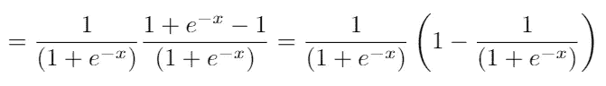
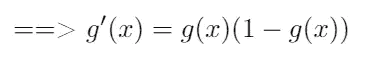

# [ML 从零开始]逻辑回归—梯度下降

> 原文：<https://medium.com/analytics-vidhya/ml-from-scratch-logistic-regression-gradient-descent-63b6beb1664c?source=collection_archive---------5----------------------->

在本文中，我们将深入研究逻辑回归背后的数学，以及它与经典分类器支持向量机的不同之处。

逻辑回归是用于分类问题的模型。虽然“回归”在其名称中，但逻辑回归主要用于分类问题，尤其是二元分类。

对于二分类问题，目标是{0，1}个向量，分别对应负类和正类。

逻辑回归使用 sigmoid 函数作为输出，这是神经网络中常用的激活函数。它可以理解为给定[线性函数](/@giangtran240896/ml-from-scrach-linear-regression-normal-equation-gradient-descent-1af26b542c28)的真类的条件概率。它具有以下形式:

以及 sigmoid 函数的图形:

sigmoid 函数的图形。

我们可以看到它的上界是 1，下界是 0，这个性质确保我们输出一个概率。

乙状结肠的导数:

直观地说，给定一个数据集，其中 **X** 是一个特征矩阵，而 **y** 是正类或负类的矢量标签，我们想要对数据点 **Xi** 属于哪个数据点进行分类。这意味着，从视觉上，我们发现一条线/平面/超平面(决策边界)将我们的数据分成两个区域。这种直觉大多用于 SVM 的[算法。](https://en.wikipedia.org/wiki/Support-vector_machine)

SVM: best line 将数据分为两个区域。

但是，逻辑回归直觉不同。它将数据点映射到一个更高的维度，例如:2 维-> 3 维，新增加的维度对应类别的概率。默认情况下，数据点概率≥ 0.5 的阈值为 1 级，否则为 0 级。

logistic 回归映射的形状来自 2D -> 3D。

从自上而下的角度看。

假设我们有一个特征矩阵和一个相应目标的向量:

其中 N 是数据点数，D 是每个数据点的维数。

通过参数 **w** 从 **X** 映射到 **y** 的线性变换 **h** :

将 s 形函数 **z** 的元素应用到 **h** :

由于 sigmoid 输出概率，我们使用负对数似然来表示误差:

其中 N 是数据点的数量，yi 是真实标签，zi 是 sigmoid 的预测概率。我们希望将参数 **w** 的损失降至最低。

令人惊讶的是，逻辑回归的 **J** 相对于**T5 的 **w** 的导数与线性回归的导数相同。唯一不同的是，线性回归的输出是 **h** 是线性函数，而在 logistic 中是 **z** 是 sigmoid 函数。**

找到导数后，我们使用梯度下降来更新参数:

我们确信它会在有限的步骤中收敛。

训练逻辑回归可视化。

对于逻辑回归实现，请在此处检查。