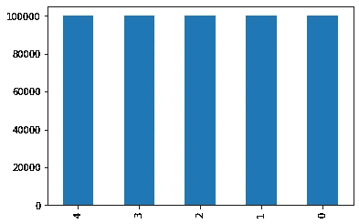
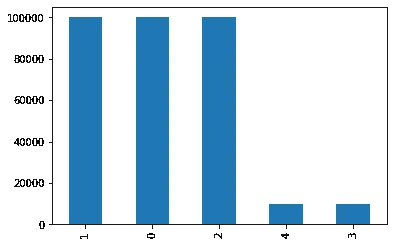
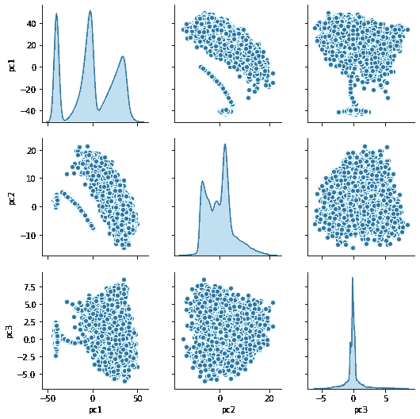
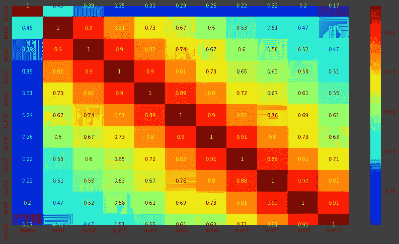
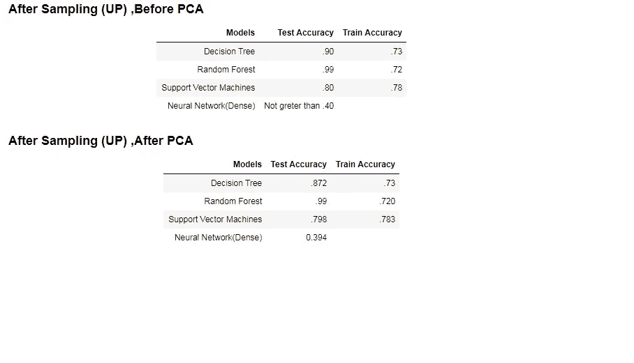

# 从 EDA 到模型创建的端到端流程

> 原文：<https://medium.com/analytics-vidhya/ml-machine-learning-model-that-classify-the-robot-from-their-sequence-3383bfa71a18?source=collection_archive---------24----------------------->

问题陈述:

5 个机器人的名字出人意料地被命名为 0，1，2，3，4，它们正在进行一场统一的对话，每个机器人以循环的方式一次吐出 10 个数字。如果你选择接受它，你的任务是训练一个模型，当给定机器人说出的 10 个数字时，它可以准确地预测机器人。这 5 个机器人之间的长时间对话日志已经给出，这是你的[数据集](https://www.kaggle.com/msk1097/classification-of-robots-from-their-conversation)。

# 目标:开发一个最大似然模型，从机器人的序列中准确预测机器人

## 建模前采取了以下步骤:

# 1.数据探索和预处理

a)。五点汇总(最小值、最大值、分位数(0.25.0.75)、平均值)以了解特性和值分布。

b)。数据集中存在数据分布(偏离正态分布)。

c)。检查空值/缺失值/模糊值

d)。检查并删除导致数据中类别分布不平衡的重复值。

e)。使用 Shapiro 测试检查特征的正态性(统计分析/假设(alpha=0.05 时数据是正态的))

f)。检查极值和异常值(z 得分和分位数值)

g)。类(目标)分布，无论它是平衡的还是不平衡的。

h)。不平衡类别 3 和 4 的上采样为其他类别增加了数据点数量。

不平衡类的采样前后

我)。使用 pairplots 关联和绘制数据点。

j)。在 k-均值和聚类分析之后，存在不同的 3 个聚类，这告诉我们两个类(3，1)之间的分离少得多。它们具有几乎相同或重叠的数据点。

我)。由于数据是完整的数值和非常大的值(le12 的数量级),并且最小值低至零，因此有必要进行数据转换，以减少这种严重右偏的数据，其中少数值非常大，而大多数值很低。

j)。日志转换:在这种情况下是最好的，但是由于引入了-inf 和 inf 而没有使用。

h)。BoxCox 转换:因为 boxcox 只取非常正的值(即> 0 而不是 0 ),所以所有为零的数据行都被删除。

# 2.特征选择和工程

k)。数据在转换之前已经被拆分，因此测试数据不应该暴露给 even transform 方法，因为它会导致数据泄漏，从而导致过度拟合。

l)使用协方差和绘制热图发现了非常高的多重共线性..= 0.8)-与-目标特征

显示共线性的热图

(n)高相关性过滤器可用于特征选择，但是它们显示所有特征彼此相关(> =0.8)并且与目标特征(<0.8).m)

Two major reasons to adopt PCA for our process are **非常高的相关性和特征选择问题。**

# 迭代次数

## 迭代 1:

a)分割数据后，由于数据不符合正态分布，并且在未转换的数据集中也存在不平衡，因此使用了树算法。[占用太多时间和内存，准确率非常低]

## 迭代 2:

a)分割数据后，由于数据不符合正态分布，且数据集中存在不平衡，因此使用了树算法。[精确度高，但测试数据集中缺少类别]

## 迭代 3:

a)分割数据后，由于数据不符合正态分布，且数据集中存在转换不平衡，聚类(k-means)数据输入模型后，[列车数据精度高，而测试数据精度低。(过度拟合)]

## 迭代 4:

a)分割数据后，由于数据不符合正态分布，且数据集中也存在不平衡，因此使用了不同的非参数模型。[树算法和 SVM]

## 迭代 5:

a)分割数据后，由于数据不符合正态分布，且数据集中也存在不平衡，因此使用了不同的非参数模型。【深度学习 Keras，基础神经网络。]

## 所有这些迭代还涉及超参数调整

## 模型比较(PCA 前后)

## 最终模型:SVM，测试精度为 78.3%

如果我们看到不同的评估指标，如召回率、精确度和 f1 评分，他们在 SVM 也表现良好。

# 最终意见:

1.  我们可以看到，即使在 PCA 之后，模型的准确度分数也没有太大的变化。说到这里，为了模型的通用性和稳健性，我们应该考虑 PCA。
2.  由于我们可以看到数据集中存在线性不可分的数据点，因此 PCA 对于减少数据集中的多重共线性是必要的。
3.  引入 PCA 后，精确度(主要)、召回率和 f 值都有所提高，这些也是可以考虑的评估指标，但目前我们的目标是获得最高的精确度。

## 即兴创作和风险

1.  数据集中的多重共线性。
2.  PCA 降低了维度空间，有留下一些点的风险
3.  此外，统计分析的变量与类。
4.  可以增加神经网络层和纪元。
5.  可以使用更多的模型(助推器、系综)。例如:XGBoost
6.  [https://github.com/amitfire/EDA-for-Data-Science-Projects](https://github.com/amitfire/EDA-for-Data-Science-Projects)