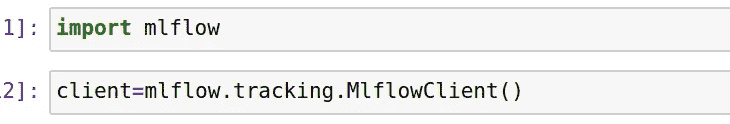
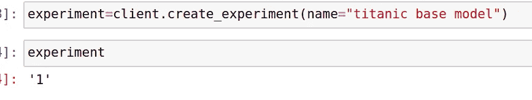
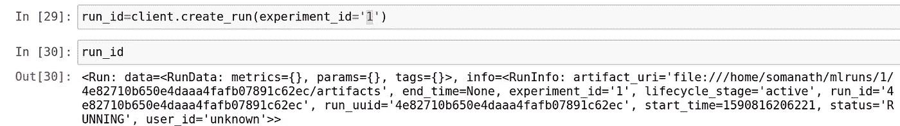
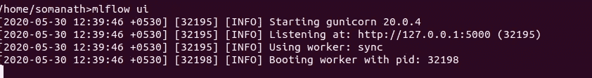
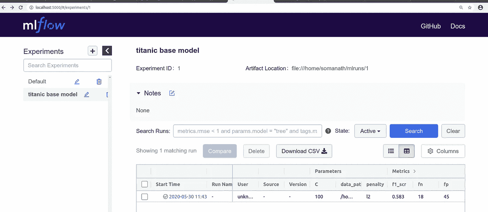
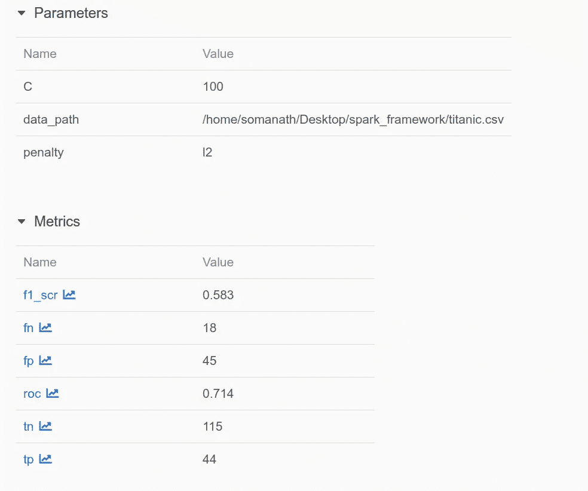
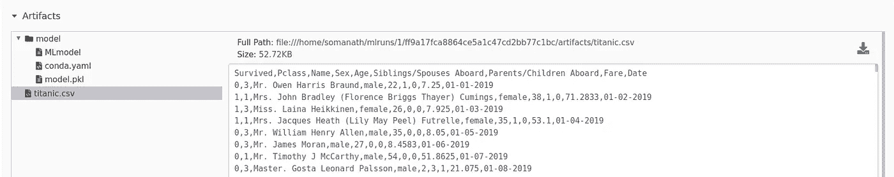

# MLFLOW 简化了 ML 模型跟踪和问责

> 原文：<https://medium.com/analytics-vidhya/ml-model-tracking-and-accountability-made-easy-with-mlflow-4e2ebf3e457a?source=collection_archive---------17----------------------->

数据科学项目中的一个常见问题是模型实验的跟踪。比方说，一个月前，模型在某些参数和数据的某些版本下运行良好，而突然您得到通知，模型运行不佳。

因此，我们可能不得不回去，重新访问这些步骤，你可能已经做了 5 个月。我同意人们可能会检查在 git 中进行的最新实验，而不是进行的每一次跟踪

**MLFLOW 前来救援！！！！**

什么是 MLFOW？

MLFLOW 是一个开源项目，用于跟踪 ML 端到端的生命周期项目管理。

**物流的组成**

MLFlow 由 4 个组件组成

*   跟踪实验以记录和比较参数和结果( [MLflow Tracking](https://www.mlflow.org/docs/latest/tracking.html#tracking) )。
*   以可重用、可复制的形式包装 ML 代码，以便与其他数据科学家共享或转移到生产中( [MLflow 项目](https://www.mlflow.org/docs/latest/projects.html#projects))。
*   从各种 ML 库中管理和部署模型到各种模型服务和推理平台( [MLflow 模型](https://www.mlflow.org/docs/latest/models.html#models))。
*   提供一个中央模型库来协作管理 MLflow 模型的整个生命周期，包括模型版本化、阶段转换和注释( [MLflow 模型注册中心](https://www.mlflow.org/docs/latest/model-registry.html#registry))。

**安装 MLFLOW**

mlflow 以 python 包的形式提供，我们可以使用

**pip 安装 mlflow**

**物流跟踪入门:**

物流跟踪可分为以下层次

1.  实验
2.  奔跑
3.  记录参数

4.日志记录指标

5.记录工件

6.可视化实验和记录人工制品

**步骤 1:创建物流跟踪客户端**

MLFLOW 提供了一个跟踪模块`[mlflow.tracking.MlflowClient](https://www.mlflow.org/docs/latest/python_api/mlflow.tracking.html#mlflow.tracking.MlflowClient)` ，我们必须创建一个客户端对象来提供一个有组织的跟踪 api

正在创建客户端对象

**第二步:创建一个实验**

我们可以使用 create experiment 方法创建一个实验，实验名称将返回一个可用于组织的实验 id，mlflow 提供了一个搜索选项，我们可以使用这些来查找实验

**第三步:创建运行**

我们可以为一个实验创建不同的运行，我们可以创建多个运行，并使用 run 跟踪实验

创建运行后，使用 log_params 和 log_metrics 创建的所有日志记录都组织在下面

**第四步:创建辅助功能**

我正在创建一个简单的逻辑回归，我正在记录参数，并创建一个简单的度量函数来捕获度量

**第五步:开始运行**

使用-context manager 启动运行，并传递上面返回的运行 id 和实验 id

一旦我们创建了如上所示的 mlflow 运行，

我们可以记录

1.  params 模型中使用的超参数
2.  度量——从上述函数中得出的度量
3.  工件——用于模型的数据和其他工件
4.  记录模型-记录创建的模型，可用于将来的预测

Mlflow 模型

**第六步:可视化实验**

通过启动 mlflow us，我们可以从 ui 中看到上面记录的数据，如下所示

正在启动 MLFlow UI

我们可以使用 localhost:5000 并单击实验和运行来查看实验结果，我们还可以下载数据

在单击运行时探索参数和模型工件

运行参数详细信息

史前古器物

结论

MLFLow 是一个很好的工具，用于跟踪 MLflow 模型和维护在 ml flow 中进行的实验的责任。

今天就到这里吧！！:)

Github 链接:[https://github . com/SomanathSankaran/spark _ medium/tree/master/spark _ CSV](https://github.com/SomanathSankaran/spark_medium/tree/master/spark_csv)