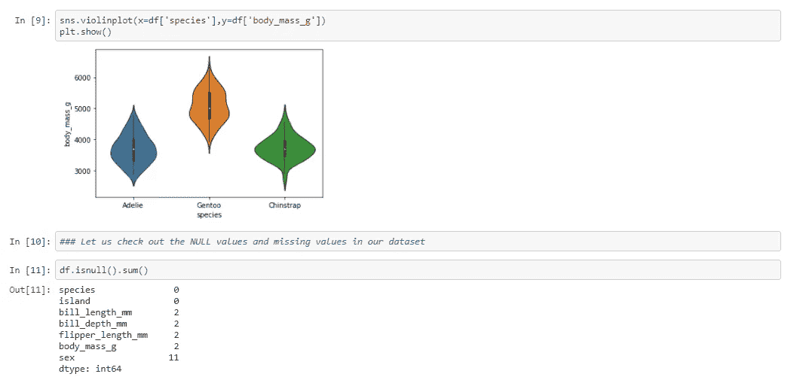
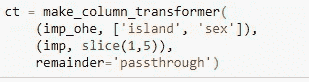

# ML 管道

> 原文：<https://medium.com/analytics-vidhya/ml-pipeline-59f0252ff85?source=collection_archive---------8----------------------->

创建工作流程并保持数据的可重复性


图片来源:gifer.com

在本帖中，我们将了解什么是管道，为什么它是必不可少的，以及有哪些可用的管道版本。

> 什么是**管道**，为什么在 ml 中有必要？

对于任何机器学习模型，都有必要维护工作流和数据集。对于任何需要重复的过程，比如缺失值的插补、连续变量的缩放、分类变量的编码或文本的计数矢量器。


图片来源:gify.com

**流水线**——它帮助我们简化过程，维护我们机器学习模型的执行顺序。该管道可用于将多个步骤整合为一个步骤，以便数据可以通过一系列步骤。因此，流水线将所有步骤连接成一个特定的系统，而不是分别调用上述步骤，增强了可读性和可再现性。

## 根据 sk learn——管道的定义:

> 顺序应用变换列表和最终估计器。管道的中间步骤必须是“转换”，也就是说，它们必须实现 fit 和 transform 方法。最终的估计器只需要实现 fit。

为了创建上述管道，我们可以使用 *make_pipeline* 函数，该函数在最新版本的 **sklearn** 库中可用，以前被称为*管道*(在早期版本中)

*为什么要走管道*？

1.  每当未知或测试数据进入时，必须以系统的方式执行一系列转换。

2.当一个不期望的类别进入测试集时。

3.当数据集中有缺失值时(测试集和训练集)。

如果您想要处理不同的数据类型，并使它们同步，并且始终遵循顺序，管道是更好的选择。

我们将每个转换称为管道中一个名为步骤的**。**

让我们来看看 make_pipeline 和 pipeline 之间的一些细微差别


管道和 make_pipeline 的区别

# Pipeline 和 make_pipeline 的结构:都是元组的形式。

让我们用一个随机的例子来看看他们的符号:


如果你看到上面的截图，你将能够区分这两者。

现在让我们进入管道及其转换的更多细节。


转型的时候到了——Pic 片酬:giphy.com

Pipeline 引入了它的一个子部分，称为*列变压器*


## [管道中的柱形变压器](https://scikit-learn.org/stable/auto_examples/compose/plot_column_transformer_mixed_types.html)结构

> (“转换的名称”，Some_transformer(参数-如果有)，column_name)


仅举一个例子来说明该结构

在上面的定义中，如果我们决定使用 Pipeline 及其列转换(它需要是显式的),那么转换的名称是强制性的，但是对于 make_pipeline 及其列转换器(它不是强制性的——它是隐式的)。

## [柱式变压器](https://scikit-learn.org/stable/modules/generated/sklearn.compose.make_column_transformer.html)make _ pipeline 结构

> (Some_transformer(参数-如果有)，column_name)


仅举一个例子来说明该结构

*列转换器*:这对于包含*异构*数据类型的数据集来说特别方便，因为我们可能想要缩放数字特征并一次性编码分类特征。在这里，您可以具体说明哪一列需要什么转换，区分分类列和连续列，以及相应地需要做什么转换。

这会将转换器应用于数组或 pandas 数据框的列。

*列变压器符号*:

通常它是一个元组的形式

## 符号:

`sklearn.compose.**make_column_transformer**`(**变形金刚*，** *夸格斯*)

以上语法取自 sklearn 库

柱式变压器的一般流程:


柱式变压器的典型流程

我们也可以通过管道连接到列转换器。

如果涉及到多个流程，我们可以将列转换器传递到管道中，然后将其与列转换器集成，再次将它们与模型管道以及 ML 算法集成。

对于上述内容，考虑一个场景，其中我们将考虑一个分类列(名义类型),假设此列有缺失值，它需要一个热编码，因此这里通常我们可以首先使用列转换器进行估算，然后传递到管道——再次将此管道对象用于主列转换器(对于一个热编码),然后将其馈送到模型的管道中。(即)


将列变压器集成到管道，然后再集成到主模型管道

现在，您一定会想到一个问题，为什么我们需要遵循上述场景:

问题是，当我们在列转换器中同时进行插补和热编码时，输出将有多个列(包括插补和非插补的列),这对于最终管道来说并不理想。因此，遵循上面提到的步骤总是更好的。在我们的示例问题中，我们也会看到这种类型。

*需要注意的一点是，除了最后一个步骤之外，管道中包含的所有步骤都应该始终是一个转换器。*

最后一步可以是一个转换器或一个模型，但更有可能是一个模型。

## 柱式变压器的规格:

也可以从列转换器中检索特征名称。所有的变压器都存储在*named _ transformers*dictionary 属性中。

现在，我们将借助 penguin 数据集，详细探讨管道和列转换器。

以下数据集引用自:

[阿里森霍斯特-帕尔默彭金斯](https://github.com/allisonhorst/palmerpenguins/blob/master/README.md)

这也可以安装在 python3 中，或者使用


Pip 安装上面的企鹅数据集库。

[https://sci kit-Lego . readthedocs . io/en/latest/API/datasets . html #](https://scikit-lego.readthedocs.io/en/latest/api/datasets.html#)


palmerpenguins art——由@allison_horst 创作的艺术品

在本文中，我们将只看到 make_pipeline。确保您的 sklearn 库已更新。

确保您的版本是最新的—推荐版本为 0.22.1 以上


我们这里的目标变量是**物种**，它是多类的。

现在让我们在使用管道进入逻辑回归之前做一个快速的 EDA



从上面可以明显看出，我们的数据集中存在缺失值


在上面的→这里，我们为目标(一个标签编码器)定义了一个函数

现在让我们进入列转换器部分


在上面的示例数据集中，我们将在传递到一个热编码和一个简单的估算器(数值变量的平均值)之前，为我们的名义变量(岛屿和性别)估算常量值


在上面 imp_ohe →的场景中，里面是什么？？

我们已经建立了一个管道的变压器，首先估算缺失值，然后应用一个热点。现在，我们将该管道添加到 *make_column_transformer* ，添加到我们需要估算缺失值并对其进行一次性编码的列中。

在上面给出的数据集中， *—* 列*性别*有缺失值，而*岛*没有，应用将缺失值归入两者的管道没有关系，因为*岛*列没有缺失值，我们的目标是对两个标称列进行热编码。

这里对于上述*make _ column _ transformer*，对于参数*余数*我们有以下选项:


pro tip for one hot encoder for the parameter—handle _ unknown:


如果你的模型包含新的类别，用数据重新训练它总是更好

需要注意的另一点是，您还可以通过切片和切块或者使用 regex 模式或数据类型来选择列:



用于选择数字列的切片选项


这种颜色可以用在我们的 ct 中


在上述步骤中使用了上述 reg 表达模式。

上面的快照只是为了解释——您可以尝试这些选项并看看。


大部分管道都遵循上述步骤

*何时使用 fit()和 fit_transform():*

一般而言

I)当使用以模型结束的管道时，fit()方法用于拟合管道，而 predict()用于对未知数据进行预测

ii)当管道以变压器结束时。建议使用 fit_transform() [对训练数据]，并且只使用 transform() [对测试或未知数据]

*总结:*

当管道以模型结束时，使用 pipe.fit()，当管道以转换器本身结束时，使用 pipe.fit_transform()。


如果您想查看管道内部的对象，您可以只输入管道，然后查看它由什么组成


让我们分开数字和分类来确定重要的特征

到目前为止，我们已经了解了如何构建和使用管道和柱形变压器，但是突然之间，如果有人想了解模型管道是由什么组成的，那么图表表示将真正有助于最终用户理解。


鸣谢:谷歌图片

让我们看看里面是什么！！⊙▃⊙

sklearn 版本 0.23.2 中提供了以下模块


它将显示我们的管道经历的整个步骤，当我们点击这些 SimpleImputer 或 OneHotEncoder 或 LogisticRegression 时，我们将看到完整的定义及其参数


通过使用名为 *eli5* 的库，我们还可以看到重要的变量或特性


上面的代码将给出我们已经构建的管道的重要特性


*网格搜索 CV* 和*交叉验证*来评估我们的模型:

像任何其他 ML 对象一样，GridSearchCV 和交叉验证也可以在管道上执行。让我们看看如何进行:

```
*# For parameters to be used in GridSearchCV:
# Create a dictionary of all the parameter options* 
*# Note that: you can access the parameters of steps of a pipeline by using '__’*
```


在将参数输入 GridSearchCV 之前，请注意参数调整的要点


打印 GridSearchCV 的最佳参数


在上面的屏幕截图中，我们可以看到 cross_val_score 中如何利用管道(因为我们的类是多类的，所以我们没有具体给出任何评分)

如何使用 pickle 库导出或保存该模型:

比较 **pickle** 和 **joblib** 。我建议对 scikit-learn 对象使用 joblib(它对 sklearn 对象在效率方面更有优势)


代替 X_test ->任何新的数据集都可以用 X_train 的相同结构来传递

以上。 *joblib* 可以在任何其他文件中调用，以便根据其他列值预测企鹅的种类(即预测全新的数据集)。

到目前为止，我们所看到的用图解描述如下


***imb learn 管道快速概述:***

还有另一个库可供 pipeline 使用( **imblearn** )

我们不禁会问,*我们已经有了 sklearn 渠道，那为什么还要选择 imblearn 呢？*

关于 sklearn 管道有一个限制，sklearn 的管道只允许将其中的一行转换到另一行(具有不同的或添加的功能)。如果您想要对更多行进行采样(比如增加或减少(过采样、欠采样或 SMOTE))，使用 sklearn 管道是不可能的。

要取消采样，我们需要增加行数。*不平衡学习概括了管道*，但是试图保持语法和函数名相同:

> **从****imb learn . Pipeline****导入**管道，make_pipeline

[imblearn](https://imbalanced-learn.readthedocs.io/en/stable/generated/imblearn.pipeline.make_pipeline.html) 包包含许多不同的采样器，便于数据的过采样或欠采样。这些采样器**不能**放置在标准 *sklearn* 管道中。为了允许这些采样器使用管道，imblearn 包还实现了一个扩展管道。这个管道非常类似于 sklearn 管道，只是增加了允许采样器。

简而言之——如果你想*在管道中包含采样器*,那么就选择 **imblearn** 管道，否则就选择 **sklearn** 管道。

注意`make_pipeline`只是一个创建新管道的方便方法，这里的区别实际上在于管道本身。

**总结一下**:

a)管道通常可以有多个步骤。

b)它不能有多个算法，一个管道中只允许有一个算法。

c)可以对管道进行网格搜索、交叉验证和超参数调整，但不能在管道中包含这些项目。

> 您可以在这里找到本文中使用的全部代码库— [Github](https://github.com/NallaperumalK/Data-science-Projects/tree/master/ML%20Pipelines) repo，数据集也可以在那里找到。


图片来源:Giphy.com

希望本文能帮助您对管道及其功能有一个全面的了解。

如果你喜欢这篇文章，别忘了鼓掌，并在评论中告诉我你对 pipeline 的看法。

快乐学习！！！◕ ◡ ◕