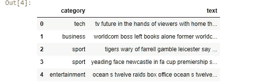
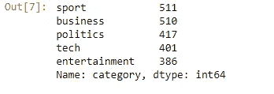
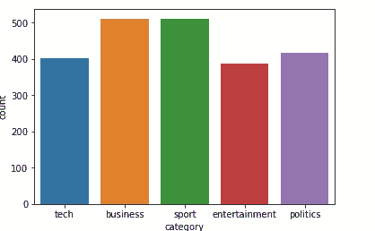
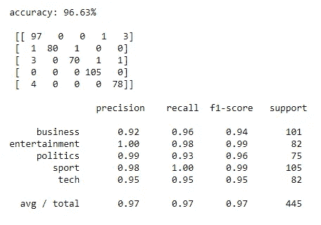
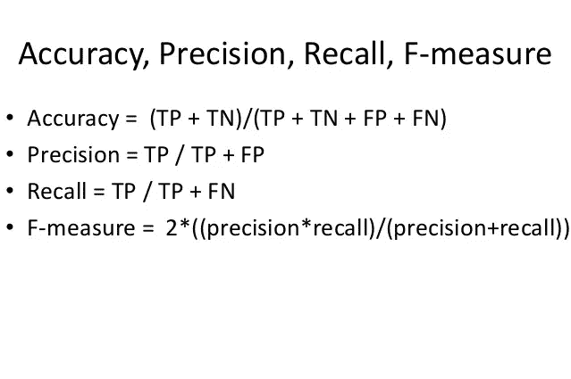

# 使用 scikit-learn 和 GridSearchCV 的 ML 管道

> 原文：<https://medium.com/analytics-vidhya/ml-pipelines-using-scikit-learn-and-gridsearchcv-fe605a7f9e05?source=collection_archive---------3----------------------->

## sci kit-学习管道和交叉验证

## 使用管道管理 ML 工作流并使用 GridSearch 交叉验证技术进行参数调整


图片来自 U[n flash](http://www.unsplash.com)

> ML 计算和算法通常处理大量信息。管道是一种按照需要以有组织的方式链接那些信息处理企业的方法。不仅如此，它同样有助于制作令人难以置信的工作流程和可复制的代码。

# 什么是 ML 管道？

管道是信息更改的一系列步骤。它源于“管道和过滤器”计划设计。通过这种方式，您可以为每个过滤器创建一个类，然后创建另一个类来将这些方法连接到管道中，形成一个完整的最终管道。

# Scikit-Learn 管道的方法

管道**必须有那两种方法**:

*   “适合”一词是指对数据进行学习并获取其状态
*   单词“transform”(或“predict”)实际处理数据并生成预测。

也可以调用这个方法或者将两者都链接起来:

*   单词“fit_transform”是拟合然后转换数据，但这一切都是一步完成的，当这两种方法必须同时进行时，这允许很好的代码优化。

首先，我们将定义模型管道，然后我们进行网格搜索交叉验证技术，为我们的问题陈述找到最佳模型。

```
import pandas as pd
import numpy as np
import seaborn as sns
import matplotlib.pyplot as plt
from sklearn.feature_extraction.text import CountVectorizer
from sklearn import feature_extraction, linear_model, model_selection, preprocessing
from sklearn.metrics import accuracy_score
from sklearn.model_selection import train_test_split
from sklearn.linear_model import LogisticRegression 
```

在这里，我使用来自 kaggle 的 bbc 新闻数据集来建造管道。

```
news=pd.read_csv(‘bbc-text.csv’)
news.head()
```



抽样资料

```
news[‘category’].value_counts()
```



每个类别的值计数

```
sns.countplot(x=”category”, data=news)
```



每个类别的绘图

# 逻辑回归分类器

```
x_train,x_test,y_train,y_test = train_test_split(news[‘text’], news.category, test_size=0.2, random_state=2020)pipe_lr = Pipeline([(‘vect’, CountVectorizer()),
 (‘tfidf’, TfidfTransformer()),
 (‘model’, LogisticRegression())])model = pipe_lr.fit(x_train, y_train)
prediction = model.predict(x_test)
print(“\naccuracy: {}%”.format(round(accuracy_score(y_test, prediction)*100,2)))print('\n',confusion_matrix(y_test, prediction))print('\n',classification_report(y_test, prediction))
```



模型的完整报告

我们从 scikit-learn 库导入了管道。在流水线中，我们可以定义必须按顺序执行的功能。在这里，我们首先将我们的数据分成 train，使用 train_test_split 进行测试。

然后，我们在管道中按顺序定义了计数矢量器、Tf-Idf、逻辑回归。这种方式减少了代码量，并且将模型流水线化有助于将它与不同的模型进行比较，并获得我们选择的最佳模型。

同样，让我们用相同的数据作为输入，为不同的模型创建管道，并从所有模型中选择最佳模型。

**创建不同的管道:**

在上面的代码中，我为四个不同的模型构建了四个管道。

1.  逻辑回归
2.  决策图表
3.  随机森林
4.  支持向量机

您完全可以改变单一管道的架构。例如，在逻辑回归中，如果您觉得目标值需要缩放，您可以使用标准缩放器，或者您完全可以使用一些预处理技术。

让我们假设一种需要预处理的情况，以及如何处理这种情况。

```
from sklearn.pipeline import Pipeline
from sklearn.impute import SimpleImputer
from sklearn.preprocessing import StandardScaler, OneHotEncodernum_transformer = Pipeline([('imputer',SimpleImputer(strategy='mean')),
    ('scaler', StandardScaler())])cat_transformer = Pipeline([
    ('imputer', SimpleImputer(strategy='constant', fill_value='missing')),('onehot',OneHotEncoder(handle_unknown='ignore'))])
```

因此，我创建了两个单独的管道来处理不同类型的数据，即 num_transformer 使用简单的估算器处理缺失的数字，而标准缩放器将转换您的数据，使其分布的平均值为 0，标准差为 1。

在 cat_transformer 中，我使用了简单的输入器和一个热编码器来对类别进行编码。

现在让我们采用数字特征以及分类特征的列，并应用上述预处理步骤的流水线。为此，我采用 train_data 并选择特定的列，如下所示。

```
num_features = train_data.select_dtypes(include=[‘int64’).columns
cat_features = train_data.select_dtypes(include=[‘object’]).columns
```

一旦我们准备好了，我们现在可以把所有的东西都推到我们的列转换器中，它可以从 sklearn.compose 导入

```
 from sklearn.compose import ColumnTransformerpreprocessor = ColumnTransformer([
        ('num', num_transformer, num_features),
        ('cat', cat_transformer, cat_features)])
```

与上面不同的是，我在一个步骤中完成了所有的预处理，可以用于多个模型。

```
pipe_rf = Pipeline([(‘preprocess’,preprocessor),
 (‘clf’, RandomForestClassifier(random_state=42))])
```

现在让我们使用 GridSearchCV 来拟合模型，GridSearchCV 通过为每个管道传递许多不同的参数来帮助我们进行模型选择，并获得最佳模型以及模型拟合使用的最佳参数。因此，让我们从定义网格搜索的一些参数开始。

线性回归默认采用 l2 罚分，所以我想用 l1 罚分进行实验。类似地，对于选择标准中的随机森林，我可能想对“基尼”和“熵”进行实验。所以我将这两个值都传递给了 clf_criterion

您还可以针对特定的问题陈述和用例，在您选择的不同内核上进行实验。

输出:

```
Performing model optimizations...

Estimator: Logistic Regression
Best params: {'clf__C': 1.0, 'clf__penalty': 'l2', 'clf__solver': 'liblinear'}
Best training accuracy: 0.969
Test set accuracy score for best params: 0.966 

Estimator: Random Forest
Best params: {'clf__criterion': 'gini', 'clf__max_depth': 10, 'clf__min_samples_split': 10}
Best training accuracy: 0.844
Test set accuracy score for best params: 0.836 

Estimator: Support Vector Machine
Best params: {'clf__C': 9, 'clf__kernel': 'linear'}
Best training accuracy: 0.978
Test set accuracy score for best params: 0.971 

Classifier with best test set accuracy: Support Vector Machine

Saved Support Vector Machine grid search pipeline to file: best_grid_search_pipeline.pkl
```

现在，我比较了逻辑回归、随机森林和 SVM，我可以肯定地看到，SVM 是最好的模型，精确度为 0.978。我们还通过网格搜索交叉验证获得了最佳参数。

所以我把准确率作为一个评分参数。完全基于问题陈述。您可以将评分参数作为完全来自混淆矩阵的回忆或 f1 分数或精确度

最后，网格搜索为指定的每个超参数组合建立一个模型，并评估每个模型。另一种有效的超参数调整技术是随机搜索，其中超参数的随机组合用于找到最佳解决方案。

混淆矩阵和评分参数可以从下图中理解。


困惑矩阵(图片由作者提供)



评分参数(图片由作者提供)

您可以定义自己的自定义转换器，其中应该明确包含 fit 和 transform 方法。

瞧，给你。现在，您可以尝试构建自己的机器学习管道，并且不要忘记尝试定制转换器。还要更改网格搜索中的参数并运行实验。学习任何东西的最好方法是通过实验。

我希望这篇文章能增强你的知识。继续支持，快乐学习。

[](https://www.linkedin.com/in/nikhil-pentapalli-5744bb18b/) [## Nikhil Pentapalli -数据科学家||机器学习工程师- Jio 平台有限公司| LinkedIn

### 真实世界人工智能产品制造经验。->在将实际问题转化为需求和解决方案方面经验丰富…

www.linkedin.com](https://www.linkedin.com/in/nikhil-pentapalli-5744bb18b/)