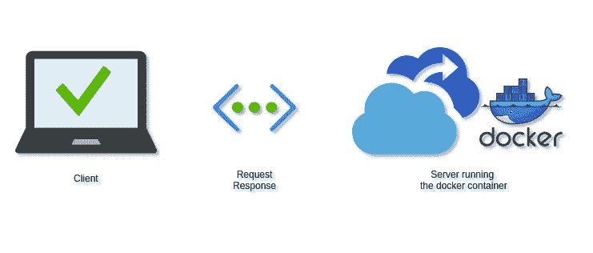
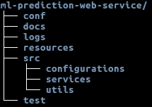
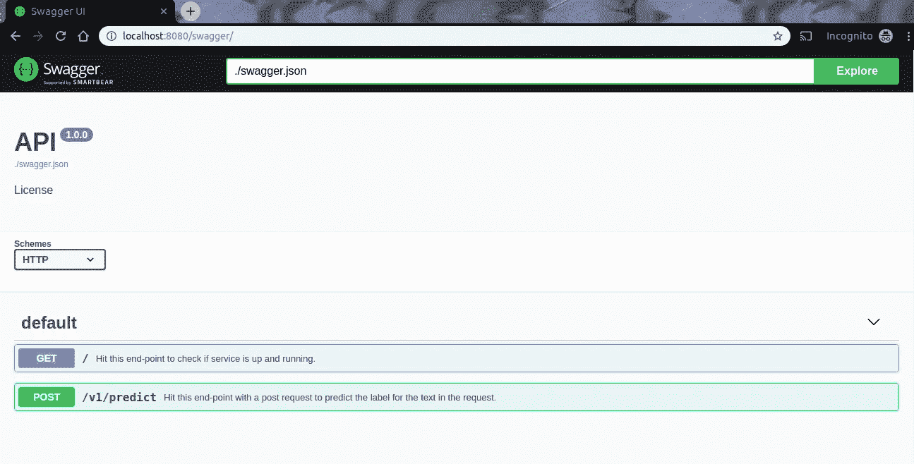

# 作为 RESTful Web 服务的机器学习预测

> 原文：<https://medium.com/analytics-vidhya/ml-prediction-as-a-restful-web-service-9fa33d01566f?source=collection_archive---------2----------------------->

作为 RESTful Web 服务的 ML 预测

> 对此类话题感兴趣或需要一些帮助？
> 
> **取得联系—**[**【https://linktr.ee/pranaychandekar】**](https://linktr.ee/pranaychandekar)

请仅参考**演示**部分(包括在内)。这篇文章是旧的，在**演示**部分之后的组件已经过时。 [**GitHub**](https://github.com/pranaychandekar/ml-prediction-web-service) 仓库中的 master 分支用最新的框架— [**FastAPI**](https://fastapi.tiangolo.com/) 更新。在**简介**部分可以找到更新后的存储库的链接。由于项目是容器化的，您仍然可以用相同的步骤托管 web 服务。

# 介绍

通常我们会花很多时间在数据处理和微调机器学习模型上。但是假设我们令人满意地训练了一个 ML 模型。接下来呢？然后我们想用这个模型来预测生产。怎么会？

我们可以通过两种方式做到这一点:

1.  我们可以将该模型集成到所有需要该模型预测的下游服务中。
2.  我们可以在 web 服务中托管 ML 模型，并公开一个 [REST API](/extend/what-is-rest-a-simple-explanation-for-beginners-part-1-introduction-b4a072f8740f) ，所有下游服务都可以调用它来进行预测。

> **注意**:没有理想的方法去做。根据不同的需求，一种方法可能比另一种更好。

在本文中，我们将尝试第二种方法，即 **ML 预测 Web 服务。**

作为开源贡献，我最近在 GitHub 上创建了一个项目，可以用作模板。

 [## pranaychandekar/ml-预测-网络-服务

### 一个简单的 python web 服务，以 REST API 的形式托管用于预测的机器学习模型。集装箱火车…

github.com](https://github.com/pranaychandekar/ml-prediction-web-service) 

我们将使用这个模板，而不是从头开始编写整个 web 服务，并且只关注那些需要根据个人需要来定制这个项目的组件。

# 演示

通常，我们先实施，然后进行演示。但是我觉得我们应该通过演示来感受一下。然后，我们可以深入研究实现细节。所以在这一点上，我会推荐你尝试使用一个 [Docker 引擎](https://docs.docker.com/install/)来构建和运行[这个项目](https://github.com/pranaychandekar/ml-prediction-web-service)。

从演示开始，请参考[这个库](https://github.com/pranaychandekar/ml-prediction-web-service)的主页文档。

# 履行

需求: [Docker 引擎](https://docs.docker.com/install/)和一个文本编辑器

该项目包括一个 ***Dockerfile*** 并使用*[Sanic 框架](https://sanic.readthedocs.io/en/latest/)构建。以下是该项目的目录结构:*

**

*项目目录结构*

*目录的一些详细信息:*

1.  ***conf** :该目录包含两个文件 I)****app . conf***——包含服务配置和 ii) ***日志。配置*** —包含记录器配置。**
2.  **文档:这个目录包含了所有与项目相关的文档。**
3.  ****logs** :服务被配置为将所有日志文件写入该目录。**
4.  ****资源**:该目录包含了我们服务所需的所有资源，如模型、数据等。**
5.  **src :这个目录包含了我们 web 服务的全部源代码，包括获取配置、解析请求、预测、准备响应、写日志等等。**
6.  **这个文件夹包含了我们的 web 服务的测试用例。**

***有关单个文件的更多详细信息，请参考其中的源代码文档。***

**每当我们启动 docker 容器时，它将运行***start-server . sh***脚本，该脚本在内部运行 ***train.py*** (为预测训练模型)和***prediction . py***(启动我们的 web 服务)。**

> ****注**:文件 **train.py** 为**可选**。我没有包含模型，这个模型很大，而是包含了数据和一个训练脚本来训练运行演示服务的模型。在创建您自己的定制 web 服务时，请删除 start-server.sh 中调用 train.py 的行，并将您自己的模型包含在 **resource- > model** 中。**

*****prediction . py***是我们定义所有端点和相应逻辑的控制器。**

**预测. py**

**运行上述脚本将公开两个基于 web 的 API。正如我们在演示中已经体验过的， *sanic-openapi* 集成允许我们直接从[浏览器](http://localhost:8080/swagger/)访问这些 api。**

****

**Swagger UI**

**要更改以使用此模板托管您的自定义模型的文件:**

1.  **[***app.conf***](https://github.com/pranaychandekar/ml-prediction-web-service/blob/master/conf/app.conf) :根据您的业务需求添加配置，如数据库连接详情等。**
2.  **[***classifier . py***](https://github.com/pranaychandekar/ml-prediction-web-service/blob/master/src/services/classifier.py):添加一个 singleton 类来加载你的 ML 模型。**
3.  **[***prediction _ service . py***](https://github.com/pranaychandekar/ml-prediction-web-service/blob/master/src/services/prediction_service.py):调用分类器实例，执行预测任务。准备要发回的响应。**
4.  **[***request _ parser . py***](https://github.com/pranaychandekar/ml-prediction-web-service/blob/master/src/utils/request_parser.py):添加解析自定义请求的逻辑。**
5.  **[***test _ prediction . py***](https://github.com/pranaychandekar/ml-prediction-web-service/blob/master/test/test_inference.py):添加您的业务逻辑对应的测试用例。**
6.  **[***start-server . sh***](https://github.com/pranaychandekar/ml-prediction-web-service/blob/master/start-server.sh):移除第二行调用[***train . py***](https://github.com/pranaychandekar/ml-prediction-web-service/blob/master/train.py)**并将其从项目中移除。要托管 web 服务，我们只需要运行[***prediction . py***](https://github.com/pranaychandekar/ml-prediction-web-service/blob/master/prediction.py)。****
7.  ****[***docker file***](https://github.com/pranaychandekar/ml-prediction-web-service/blob/master/Dockerfile):需要时更新。****
8.  ****更新代码文档。****

****经过这些最小的改动，我们现在可以托管我们的自定义预测服务了。****

# ****外卖食品****

****经过训练的 ML 模型可以通过直接将模型与下游服务集成来用于预测，或者我们可以将它作为 RESTful web 服务托管。在本教程中，我们探索了一个开源项目，我们可以使用它作为模板，只需稍作调整，就可以在 docker 容器中将我们的定制 ML 模型作为 web 服务托管。****

****为了保持有趣，我建议通过调整项目来集成您的定制模型。 ***分享你的经验和反馈*** 。****

> ****对此类话题感兴趣或需要一些帮助？****
> 
> ****【联系方式】——[**https://linktr.ee/pranaychandekar**](https://linktr.ee/pranaychandekar)****

# ****引文****

1.  ****[ml-预测-web-服务](https://github.com/pranaychandekar/ml-prediction-web-service)项目。****
2.  ****[API 介绍](https://www.analyticsvidhya.com/blog/2016/11/an-introduction-to-apis-application-programming-interfaces-5-apis-a-data-scientist-must-know/)****
3.  ****[REST API](/extend/what-is-rest-a-simple-explanation-for-beginners-part-1-introduction-b4a072f8740f)****
4.  ****[码头工人](https://docs.docker.com/engine/reference/commandline/docker/)****
5.  ****[模特培训](https://fasttext.cc/docs/en/supervised-tutorial.html)****