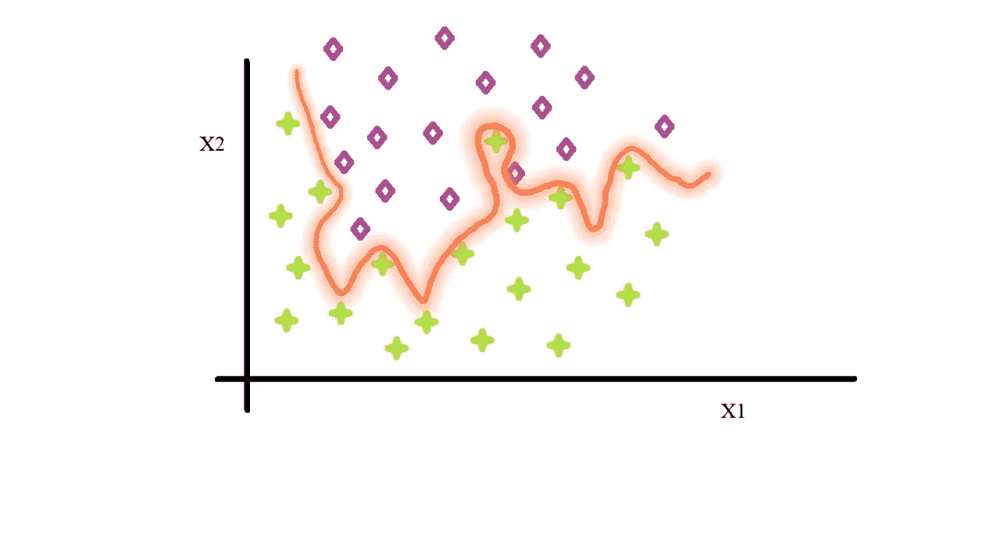
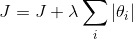
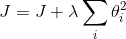
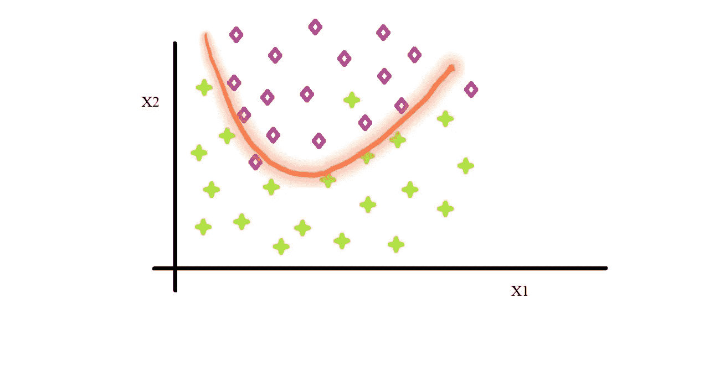

# ML 系列:第 1 集-正规化的需要

> 原文：<https://medium.com/analytics-vidhya/ml-series-episode-1-the-need-for-regularization-fedcfe445d31?source=collection_archive---------31----------------------->

约翰已经完成了他的“深度”神经网络的设置，将超参数的丛林调整到“无限和更远”，并像它不能再被训练一样训练该模型，哇…，训练集精度为 **99.9%** (他似乎在机器学习的天堂)。但是，随着**开发**集(他有很多名字，交叉验证集是其中之一)的出现，带来了 60%的模型准确性。对约翰来说，一切都很顺利…

【https://pixabay.com/illustrations/neural-network-3637503/ 

那么是什么给了 dev 在他的游行上下雨的权力呢？

那么，让我们来看看约翰的模型决策边界是什么样子的，好吗？

关于两个特征 X1 和 X2 以及约翰模型的学习决策边界的数据点

我的天啊。这看起来肯定不对。让我们看看这里出了什么问题。

# 过度拟合的问题

只有当模型有能力时，它才会过度拟合数据集。由于对自己的模型过于热衷，约翰添加了一层又一层，每层都添加了几十个隐藏单元。现在，这样的深度神经网络对于上面显示的数据类型来说是多余的，其中数据点之间的关系可以由简单的决策边界(例如，多项式)来表示。约翰训练的巨大神经网络做着它最擅长的事情:尽可能好地拟合训练数据，并将误差降至最低。但是在这样做的时候，它导致了过多的**摆动**决策边界。最终的结果是，这种过度适应训练集**的学习决策边界无法将**推广到测试集(或开发集),从而也无法推广到真实世界的例子。这就是为什么这个模型在开发集上有高达 40%的错误。

# 对此我们能做些什么？

显而易见的第一个答案是使用合理的**神经网络规模**。但是为了保持一个好的训练误差，应该小到什么程度呢？这个没有明确的答案。一个可能的解决方案是从尽可能小的网络规模(有一个隐藏层)开始，逐步添加层和隐藏单元。绘制模型的训练误差与网络大小的关系图。当该曲线变平时停止，即当添加更多层停止有助于通过任何有意义的值减少训练误差时停止。现在，你可以看到这个模型很可能仍然过拟合数据。为了有意义地解决这一问题，我们来谈谈后正规化这一专题。

# 正规化的需要

找到合适的网络规模后，现在我们必须面对似乎永远困扰我们的过度拟合问题——解决方案是正则化。正则化有许多形状和大小，但最常用的正则化版本是" **L1 正则化"**和" **L2 正则化"。**

假设 **J** 是你设计的成本指标，最小化它可以转化为现实生活中的性能。上述两种正则化方法都包括将正则化项添加到该成本函数中。

对于 **L1** 正则化，你向成本函数 **J** 添加一个乘以网络所有参数绝对值的常数。

L1 正则化

在 **L2** 正则化的情况下，您可以通过添加一个乘以参数平方的常数来稍微改变这一点。

L2 正则化

注意:这个常数λ称为“**正则化参数”。**

## 这是如何工作的？

由于网络旨在最小化误差，因此参数可以取的值的范围受到参数λ的限制和控制。在增加λ时，网络的参数被迫变小，因此不能像以前一样适合训练集，从而减少过拟合。因此，可以相应地调整参数λ，以获得一个“完美的”模型，该模型可以很好地推广到开发和测试集。

让我们来看看用适当的λ应用正则化后的模型。

正则化模型决策边界

您可以立即看到改进。

# 结论

这就结束了我对正则化在构建神经网络模型中的重要性的简要分析。在本系列的下一篇文章中，我们将看看众多类型的正则化方法，以及每种方法在效果和应用案例上的不同。