# 深度学习时间序列建模

> 原文：<https://medium.com/analytics-vidhya/ml-times-series-modeling-2f39f914adc8?source=collection_archive---------17----------------------->

## 用静态数据创建模型的重要性


在 [Unsplash](https://unsplash.com?utm_source=medium&utm_medium=referral) 上由 [Carlos Muza](https://unsplash.com/@kmuza?utm_source=medium&utm_medium=referral) 拍摄的照片

在我的数据科学之旅中，我学到了许多不同的建模技术，但我还没有找到自己的位置，我一直耐心地等待正确的机器学习模型的出现，并让我神魂颠倒。过去几年，我一直在商业、金融和金融科技领域工作，我对商业预测和帮助股东财富最大化的预测的热爱必须保持在舞台中央。

然后有一天，我发现了机器学习时间序列模型！第一天我就被迷住了。事实上，我可以创建一个模型来测试/训练过去的表现，以帮助预测未来，这对我来说非常有趣。一个人如何结合 ML、深度学习、神经网络和自动回归建模来解决业务问题，这绝对是天才！

所以最大的问题是，到底什么是时间序列建模？简单来说，就是利用一个模型，根据以前观察到的值来预测未来的值。您可以在以下行业中使用时间序列:

1.零售业

2.能源工业

3.政府

4.财政机关

5.农业

# 时间序列模型 ARIMA

最流行的模型之一是 ARIMA 模型，它代表自回归综合移动平均。ARIMA 模型旨在描述数据中的自相关，并包含以下概念:

AR =自回归

I =整合

MA =移动平均值

# **平稳性**

在进行任何类型的时间序列建模之前，您必须确保您的数据具有平稳性。这意味着你的数据没有趋势或季节性。如果数据的统计属性(如均值、方差和协方差)随时间保持不变，则认为数据是稳定的。

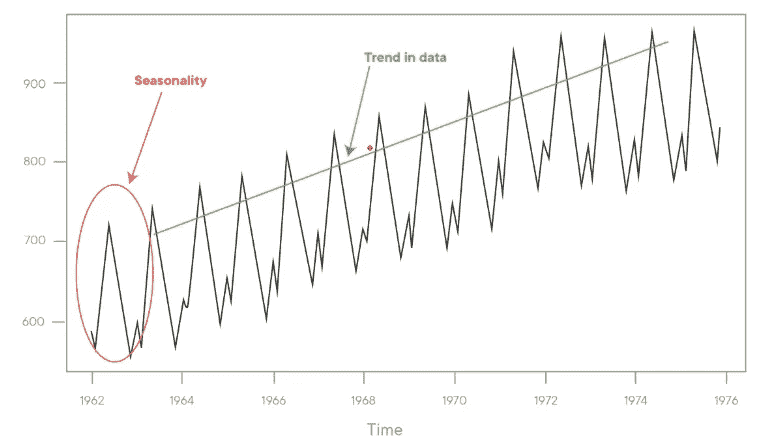

如果您不知道您的数据是否是稳定的，您可以进行以下两个测试:

1.  滚动统计-绘制移动平均值或移动方差，并查看它是否随时间变化。
2.  Dickey-Fuller 测试是一种用于测试平稳性的统计测试。

下面我构建了一个函数来同时创建滚动平均值和 Dickey-Fuller 测试。

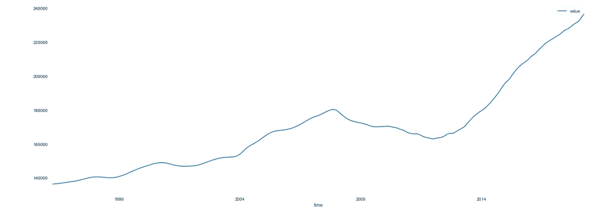

原始时间序列图

```
from statsmodels.tsa.stattools import adfuller def stationarity_testing(timeseries):

        movingAverage = timeseries.rolling(window=12, center=False).mean()
        movingSTD = timeseries.rolling(window=12, center=False).std()

        fig = plt.figure(figsize=(12,7))
        plt.plot(timeseries, color='blue', label='Original')
        plt.plot(movingAverage, color='red', label='Rolling Mean')
        plt.plot(movingSTD, color='black', label = 'Rolling Std')
        plt.legend(loc='best')
        plt.title('Rolling Mean & Standard Deviation')
        plt.show(block=False)

        print ('Results of Dickey-Fuller Test: \n')
        dftest = adfuller(timeseries['value'], autolag='AIC')dfoutput = pd.Series(dftest[0:4], index=['Test Statistic', 'p-value', '#Lags Used', 'Number of Observations Used'])
        for key,value in dftest[4].items():
            dfoutput['Critical Value (%s)'%key] = value
        print(dfoutput) stationarity_testing(h_mean)
```

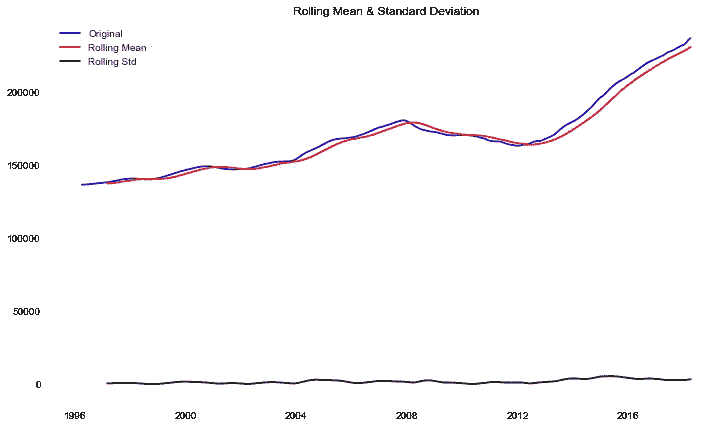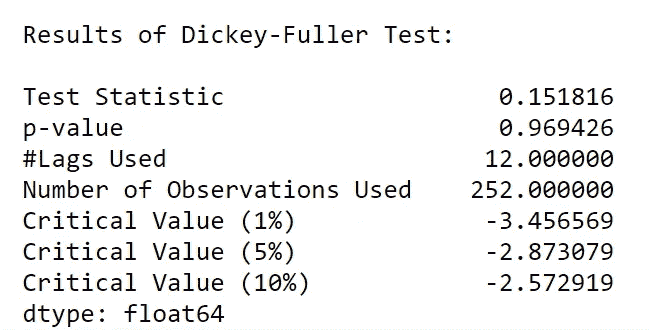

有两种方法可以确定您的数据是否是静态的。如果您的“检验统计”小于您的“临界值”或您的 p 值大于 0.05，这清楚地表明您的数据不是稳定的。正如您在上面的测试中看到的，该数据有很多不稳定因素，我们需要在开始预测模型之前将其删除。

# **如何去除平稳性**

摆脱趋势的一个方法是进行以下过程:

1.  采用对数变换

2.差异(简单移动平均线和指数移动平均线)

3.用减去前一个值。shift()

在我进行每个测试后，我将通过滚动方法和 Dickey-Fuller 测试函数重新运行，看看它是否表现得更好。我会选择一个预制最好的，并在我最终的 ARIMA 模型中使用它。

## **日志**

使用对数变换可以使时间序列在一段时间内更加一致。你可以看出对数变换测试看起来比我们最初的测试好很多，但是 Dickey-Fuller 测试显示了很多静态的东西。

```
h_mean_logScale = np.log(h_mean)stationarity_testing(h_mean_logScale)
```

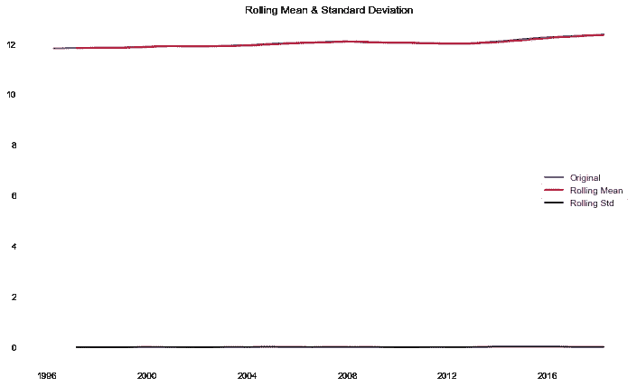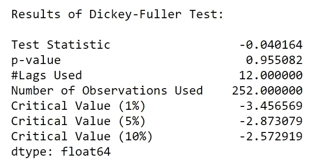

## **差分(简单移动平均线)**

使用简单移动平均线，也称为滚动平均值，您可以直观地查看平均值是否随时间变化。“测试统计”结果现在低于“临界值”，但 p 值仍然有点高。我想再做几个测试，看看能不能把 p 值再降低一点。

```
movingAverage = h_mean_logScale.rolling(window=12).mean()
datasetLogScale_movingaverage = h_mean_logScale - movingAverage
datasetLogScale_movingaverage.head(12)datasetLogScale_movingaverage.dropna(inplace=True)
datasetLogScale_movingaverage.head(12) stationarity_testing(datasetLogScale_movingaverage)
```

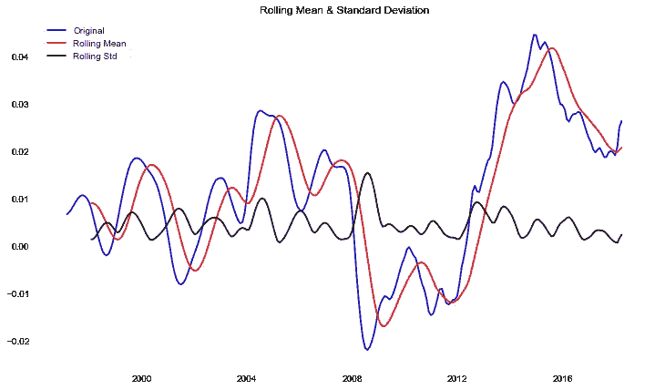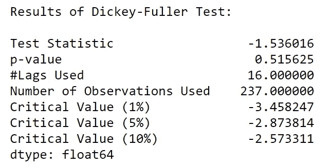

## 差分指数移动平均

差异指数移动平均，也称为加权滚动平均，使用指数衰减因子为所有以前的值分配权重。在这次测试中，p 值下降了很多。我将再进行一次测试，然后根据我的所有结果做出决定。

```
exponentialmovingaverage = h_mean_logScale.ewm(halflife=12, min_periods=0, adjust=True).mean()
plt.plot(h_mean_logScale)
plt.plot(exponentialmovingaverage, color='red')
plt.show() datasetLogScale_ex_movingaverage = h_mean_logScale - exponentialmovingaverage
stationarity_testing(datasetLogScale_ex_movingaverage)
```

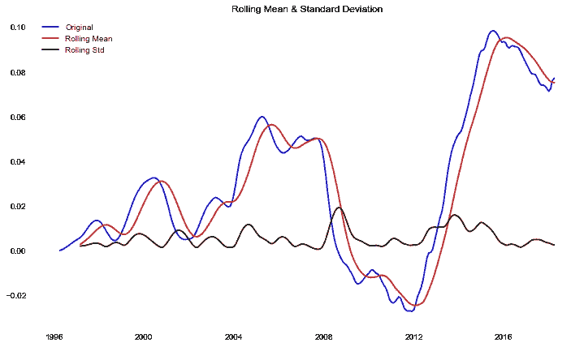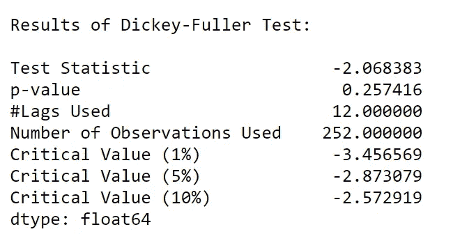

# 减去前一个值。Shift()

当您使用。shift()方法，您将流程的标称值从一个级别转移到另一个级别。一些值会周期性地偏离过程平均值，导致异常值。这是进行 ARIMA 时间序列建模时最常用的平稳方法。我的结果证明这一个非常好。p 值不是 0.05，但它最接近 0.156593。“测试统计”也低于临界值，这表明我的数据现在是稳定的。

```
datasetLogDiffShifting = h_mean_logScale - h_mean_logScale.shift()
plt.plot(datasetLogDiffShifting)
plt.show() datasetLogDiffShifting.dropna(inplace=True)
stationarity_testing(datasetLogDiffShifting)
```

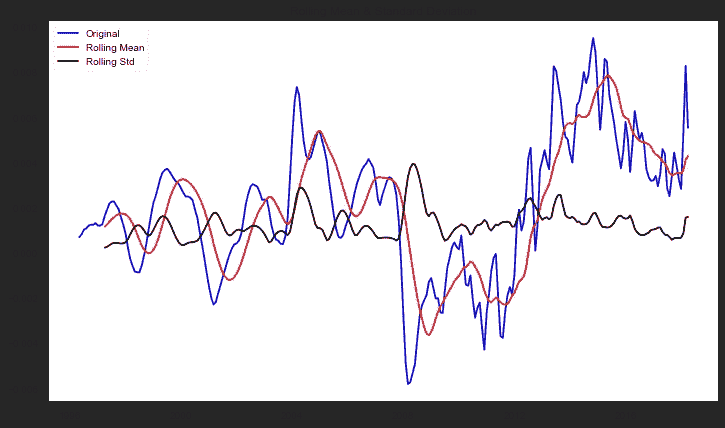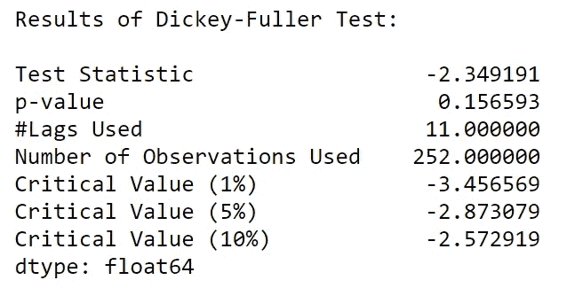

## **ARIMA 成绩**

我决定使用上面提到的最后一种平稳性方法。shift()。一旦我将我的数据应用于 ARIMA 模型，我得到了非常准确的结果。我的原始值几乎直接在我的预测值之上。RSS 代表残差平方和。它测量数据和预测模型之间的差异，其中我的模型的 RSS 得分为 0.0001。

*   我想用这篇博客来解释平稳性，但是在你开始你的 ARIMA 模型之前，还有一些其他的初步模型需要建立，比如:

1.  自相关建模
2.  部分自相关建模

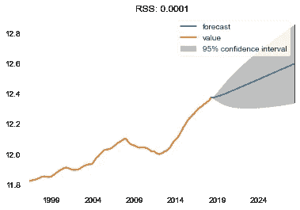

我还想展示我的预测房屋价值与原始房屋价值的对比，以说明您的预测建模有多准确。

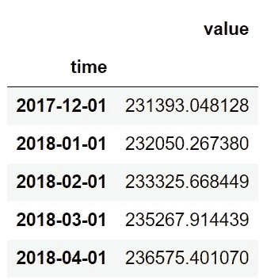

原始值

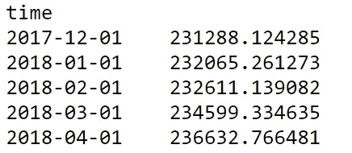

预测值

非常感谢你阅读我的博客！请到我的 github 查看我的整个项目。