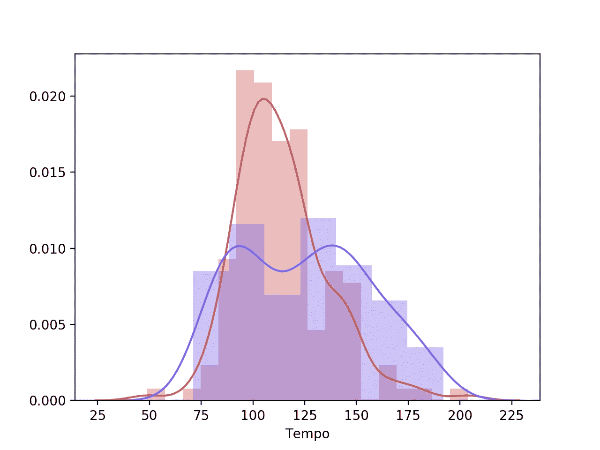
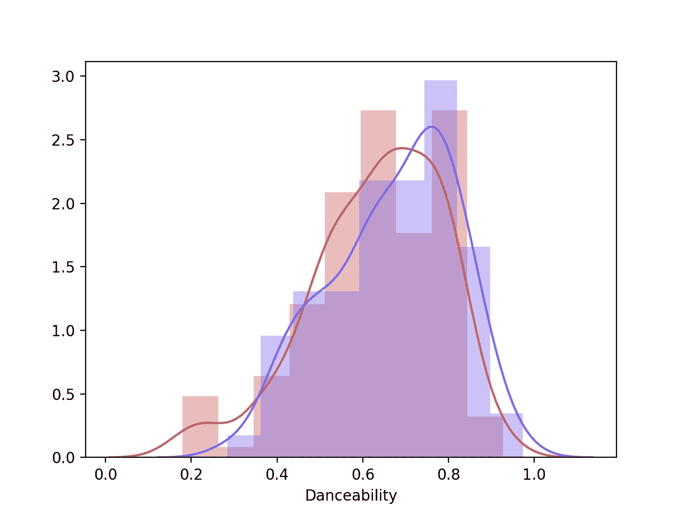

# 带点的 ML(p)y

> 原文：<https://medium.com/analytics-vidhya/ml-with-spotif-p-y-fc27f0099a35?source=collection_archive---------8----------------------->

## 具有音频特征的 Python 机器学习

## 介绍

我开始这个项目时不得不谷歌“什么是机器学习”。然后，我继续学习传统的 ml 教程，使用 *Iris* 数据集。现在，在这里我试图根据一首歌的音频特征来预测我是否会喜欢这首歌。

## 数据采集

显而易见的事实是，机器学习依赖于数据。因此，让我们从从 Spotify 检索数据开始。

获取数据的第一步是向 Spotify 注册一个访问令牌。

[](https://developer.spotify.com/documentation/web-api/) [## Web API |面向开发者的 Spotify

### 注意:使用 Spotify 开发者工具，即表示您接受 Spotify 开发者服务条款。基于简单的休息…

developer.spotify.com](https://developer.spotify.com/documentation/web-api/) 

到目前为止，有三个关键部分:客户机 ID、客户机密钥和用户名。前两个将在获得访问令牌后给出。最后一个是用户 ID，您可以从您的个人资料设置中获得。一旦解决了这个问题，我们就可以直接从 Spotify 数据目录中访问 Spotify 的专辑、曲目和艺术家数据。

```
import spotipy
import spotipy.util as util
from spotipy.oauth2 import SpotifyClientCredentials#initialise a client credentials managercid = ""
secret = ""
username = ""
client_credentials_manager = SpotifyClientCredentials(client_id=cid, client_secret=secret)
sp = spotipy.Spotify(client_credentials_manager=client_credentials_manager)
playlists = sp.user_playlists(username)
```

此时，我们有了一个 Spotify 对象来在线收集数据。下一步是使用追踪 URIs 创建数据框。URIs 是统一的资源指示器——把它当作获取播放列表或歌曲详细信息的神奇门户。

```
def get_playlist_tracks(username, playlist_id):
  tracks_list= []
  results = sp.user_playlist(username, playlist_id,
  fields="tracks,next")
  tracks = results['tracks']
  while tracks:
     tracks_list += [ item['track'] for (i, item) in
     enumerate(tracks['items']) ]
     tracks = sp.next(tracks)
  return tracks_listdef get_playlist_URIs(username, playlist_id):
  return [t["uri"] for t in get_playlist_tracks(username,
  playlist_id)]
```

## 使数据可用

使用 URIs 列表，我们可以获取歌曲的音频特征。在这种情况下，我创建了两个播放列表:我喜欢的歌曲和我不喜欢的歌曲——因此，有两个 URI 列表。因为每个列表的长度超过 50，并且 *sp.audio_features* 一次处理 50 个元素，我们必须创建一个 *splitlist* 函数，将一个列表拆分成一个包含 50 个元素的列表。完成后，我遍历这个列表，并将音频特征保存到数据帧中。

```
#modified get features functiondef get_audio_features (track_URIs) :
  features = []
  r = splitlist(track_URIs,50)
  for pack in range(len(r)):
     features = features + (sp.audio_features(r[pack]))
  df = pd.DataFrame.from_dict(features)
  df["uri"] = track_URIs
  return df
```

值得注意的是，该函数返回一系列音频特性，我只选择我认为与我的项目相关的特性。有关每项功能的详细说明，请访问:

[https://developer . Spotify . com/documentation/we b-API/reference/tracks/get-something-audio-features/](https://developer.spotify.com/documentation/web-api/reference/tracks/get-several-audio-features/)

```
[‘danceability’,’acousticness’,’energy’,’instrumentalness’,’speechiness’,’tempo’,’valence’]
```

另一个重要的组成部分是标签。一旦我有了两个数据帧——一个包含我喜欢的歌曲的音频特征，另一个包含我不喜欢的歌曲的音频特征——我就向两个数据帧添加一列*‘target’*，并用 1 填充我喜欢的歌曲，用 0 填充我不喜欢的歌曲。这样，一旦两个数据帧被连接，两类歌曲之间就有了区别。

```
training_data = pd.concat([good_features_x,bad_features_x], axis=0, join='outer', ignore_index=True)
```

## 可视化数据

之前，我会查看特征，并选择我认为相关的特征。现在，我想以某种方式验证这两个播放列表之间的哪些功能实际上有显著差异。所以，我把它们画在同一个图上:如果我看不出太大的区别，我就不在我的 ML 模型中使用这个特性。例如，在绘制了节奏之后，我看到了两种分布的显著差异。

```
sns.distplot(good_features_df[['tempo']],color='indianred',axlabel='Tempo')
sns.distplot(bad_features_df[['tempo']],color='mediumslateblue')
plt.show()
```



另一方面，在可跳舞性曲线上，我认为这种差异可以忽略不计。



毕竟，我解决了以下问题:

```
features = ['tempo','acousticness','energy','instrumentalness','speechiness']
```

## 将数据分为训练和测试

我选择 80/20 分割我的数据:80%用于训练模型，20%用于测试模型。

```
train, test = train_test_split(training_data, test_size = 0.2)
x_train = train[features]
y_train = train['target']
x_test = test[features]
y_test = test['target']
```

## 决策树分类器

这个模型适合我的目的，因为我正试图将歌曲分为两类。这本质上是一个两步走的过程:学习和预测。换句话说，必须有训练模型的数据和测试模型的数据。更详细地说，每个节点代表一个带有“决策规则”的音频特征，节点中的每个叶子是基于该规则的决策。在这种情况下，Decision 是与将用于将歌曲分成类别的每个特征相关的数字。

```
dtc = DecisionTreeClassifier()
dt = dtc.fit(x_train,y_train)
y_pred = dtc.predict(x_test)
score = accuracy_score(y_test, y_pred) * 100
```

## k 近邻分类器

在这个模型中，点是缓慢聚集的。给定点 A，模型找到最近的邻居。然后，这个邻居“投票”决定在哪里对点 a 进行分类。这是最简单的情况；在另一种情况下，票数可以改变，并且由于投票的性质，应该是奇数。

```
knc = KNeighborsClassifier(5)
knc.fit(x_train,y_train)
knn_pred = knc.predict(x_test)
score = accuracy_score(y_test, knn_pred) * 100
```

## 主成分分析

这种无监督学习技术通过分析特征方差并选择方差最大的特征，将多维数据转换为低维数据。早些时候，我通过查看单个图来手动完成。这个分析替我做了。因此，模型调整的输入之一是用于训练它的组件的数量。经过一些试验，我发现我的场景的理想数字是 3。

```
sc = StandardScaler()
X_train = sc.fit_transform(x_train)
X_test = sc.transform(x_test)
pca = PCA(n_components=3)
classifier = RandomForestClassifier(max_depth=2, random_state=0)
classifier.fit(X_train, y_train)y_pred = classifier.predict(X_test)print("Accuracy using the PCA model is: ", accuracy_score(y_test, y_pred), "%")
```

## 挑战

第一个挑战是坐下来编辑一个我喜欢的歌曲列表。即便如此，我的播放列表也只有 150 首歌曲——但越多越好。同样，人们应该努力创建一个不喜欢的歌曲的播放列表，而不是像我做的那样随意添加歌曲。

另一个挑战是从我的帐户中提取数据，然后从我的播放列表中提取数据，并决定哪些功能值得使用。

我花了一段时间才意识到，在连接两个数据帧之前，我需要以某种方式标记我喜欢和不喜欢的歌曲。

令人惊讶的是，在我的数据上运行各种模型是这个项目最容易的部分之一。然而，我承认我的模型调得很差，因为(1)我对机器学习总体上没有很好的理解，以及(2)我没有掌握模型中的组件。

## 结论

我可以用主成分分析达到最高的准确率- 86.6%。树分类器产生了平均 82%的准确度，而 KNN 模型产生了平均 73%的准确度。

可以通过以下方式提高准确性:(1)在调整模型上花费更多时间，(2)努力创建两个播放列表，以及(3)拥有总共超过 300 个数据点。