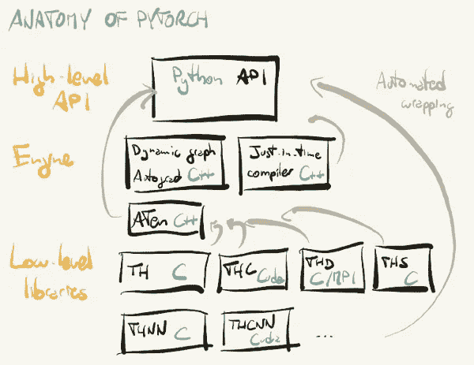
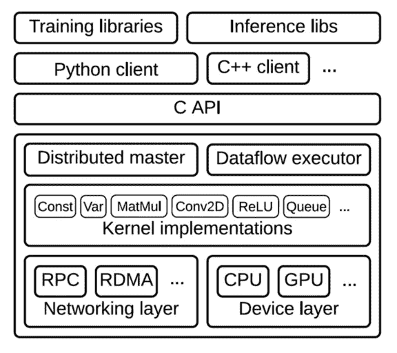
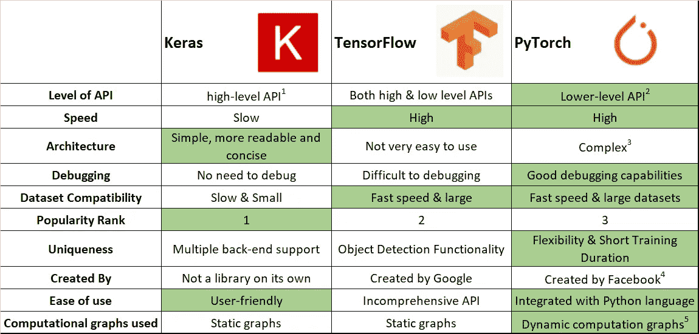
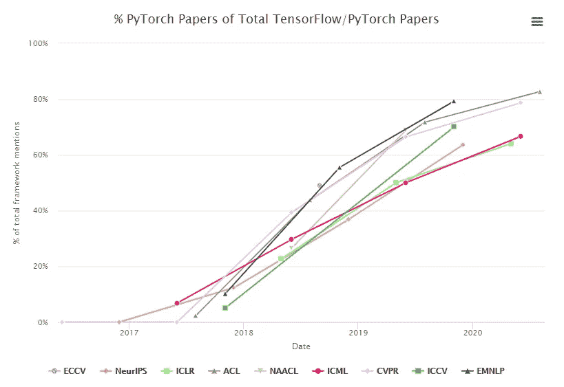
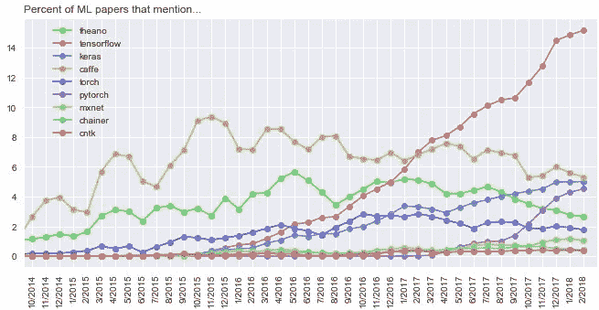
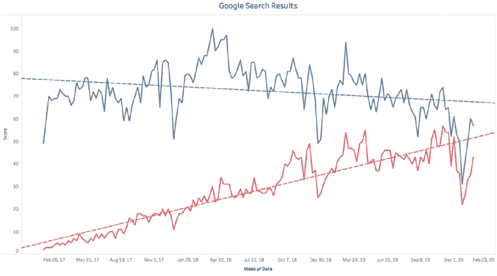

# ML03: PyTorch vs. TensorFlow

> 原文：<https://medium.com/analytics-vidhya/ml03-9de2f0dbd62d?source=collection_archive---------7----------------------->

## py troch——一个有前途的数字图书馆框架

```
Read time: 3 minThis is a part my mid-term report of the course PyTorch and Machine Learning in NCCU. The original report: [https://bit.ly/2UZftXq](https://bit.ly/2UZftXq)
```

## PyTroch 的优势

*   PyTorch 比 TensorFlow 更 Pyhonic。
*   TensorFlow 在速度上并不比 PyTorch 强。
*   PyTorch 用户数量激增。

## PyTroch 的缺点

*   与关于 TensorFlow 的资源相比，关于 PyTorch 的资源(包括书籍和在线讨论)很少。

> ***概述*** *(1)*[*py torch 的架构&tensor flow*](#ba7f) *(2)*[*py torch 的性能&*](#e05b) *(3)*[*py torch 的人气&tensor flow*](#ea44)

# (PyTorch & TensorFlow 的架构

我们来看看 PyTorch & TensorFlow 的架构(或者所谓的解剖学)。



图 PyTorch 的解剖[1]



图 2:分层张量流架构[2]

图 2:分层张量流架构

PyTorch 和 TensorFlow 的*引擎*和*低级库*非常相似，基本都是用 C & C++构建的，所以理论上应该速度差不多。然后，让我们把注意力转移到 PyTorch 和 TensorFlow 在各个维度上的对比。

# (PyTorch & TensorFlow 的性能



表 Keras、TensorFlow 和 PyTorch 的比较[3]

表 1 中的绿色单元格代表明显的优势。此外，因为我们知道 PyTorch 的*动态计算图*会使**比 TensorFlow 更灵活**和**更容易调试**。PyTorch 拥有的*动态计算图*使得 PyTorch **比拥有*静态计算图*的**张量流更加 Pythonic 化。

图中的一些事实很容易猜测。但是，就像 Python 比 C/C++有更多的灵活性和调试能力，但是 Python 在速度上输了。PyTorch 会有更慢的速度吗？令人惊讶的是，PyTorch 的性能 ***在**速度**和**数据集兼容性**等维度上等同于*** TensorFlow！

# (PyTorch & TensorFlow 的流行



图 3:py torch 论文占全部 TensorFlow / PyTorch 论文的百分比[4]



图 4:ML 论文中提到的框架的百分比[5]



图 TensorFlow & PyTorch((蓝色，红色)= (TensorFlow，PyTorch)) [6]

此外，上面这三个数字显示 PyTorch 最近有多受欢迎，越来越多的人采用 PyTroch 表明 PyTroch 的前景看好。

# (4)结论

## PyTroch 的优势

*   PyTorch 比 TensorFlow 更 Pyhonic。
*   TensorFlow 在速度上并不比 PyTorch 强。
*   PyTorch 用户数量激增。

## PyTroch 的缺点

*   与关于 TensorFlow 的资源相比，关于 PyTorch 的资源(包括书籍和在线讨论)很少。

# (5)参考文献

[1]史蒂文斯，e .，安提卡，l .和托马斯，V. (2020 年)。用 PyTorch 进行深度学习。纽约州纽约市:曼宁。

[2]阿巴迪，m .等人(2016 年 11 月)。TensorFlow:大规模机器学习系统。论文发表于第 12 届 USENIX 操作系统设计和实现研讨会(OSDI '16)，萨凡纳，佐治亚州。摘要检索自[https://www . usenix . org/system/files/conference/osdi 16/osdi 16-abadi . pdf](https://www.usenix.org/system/files/conference/osdi16/osdi16-abadi.pdf)

[3]饶，中国社会科学院(2020)。计算机视觉的第一步:用 PyTorch 举例。检索自

[](https://www.mygreatlearning.com/blog/computer-vision-using-pytorch/) [## Pytorch 在计算机视觉中的应用

### 供稿:C. S. Jyothirmayee 博士 LinkedIn 简介:https://www . LinkedIn . com/in/Dr-c-s-Jyothirmayee-Rao-396 b 3715/…

www.mygreatlearning.com](https://www.mygreatlearning.com/blog/computer-vision-using-pytorch/) 

[4]何，H.(2020)。PyTorch vs TensorFlow。从 https://chillee.github.io/pytorch-vs-tensorflow/[取回](https://chillee.github.io/pytorch-vs-tensorflow/)

[5]米格达尔，p .，& Jakubanis，R. (2018 年)。Keras 或者 PyTorch 作为你的第一个深度学习框架。检索自

[](https://deepsense.ai/keras-or-pytorch/) [## Keras 或者 PyTorch 作为你的第一个深度学习框架——deep sense . ai

### 所以，你想学深度学习？无论您是否想开始将它应用到您的业务中，都要以您的下一面为基础…

deepsense.ai](https://deepsense.ai/keras-or-pytorch/) 

[6]伟大的学习团队(2020)。PyTorch vs TensorFlow —解释| py torch 和 TensorFlow 有什么区别？。检索自

[](https://www.mygreatlearning.com/blog/pytorch-vs-tensorflow-explained/) [## PyTorch 和 TensorFlow 的区别| TensorFlow 与 PyTorch

### 在开始深度学习(也称为神经网络)的旅程时，人们会发现许多框架和…

www.mygreatlearning.com](https://www.mygreatlearning.com/blog/pytorch-vs-tensorflow-explained/)