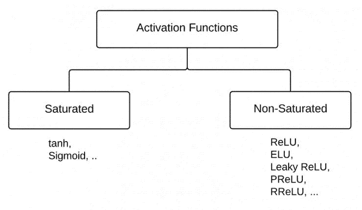
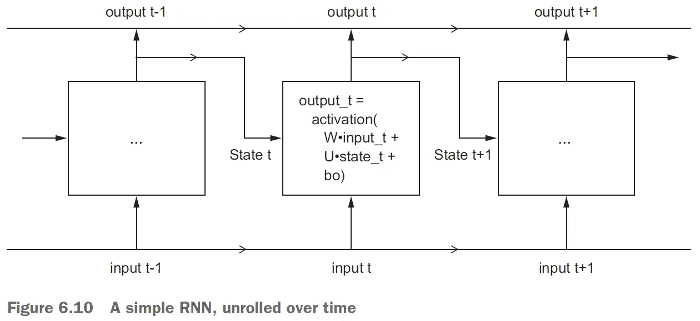

# ML04:从 ML 到 DL 再到 NLP

> 原文：<https://medium.com/analytics-vidhya/ml04-ce0b172deb2b?source=collection_archive---------13----------------------->

## 简明概念图

```
Read time: 20 minThis article is a part my mid-term report of the course *PyTorch and Machine Learning* in NCCU. Original report: [https://bit.ly/2UZftXq](https://bit.ly/2UZftXq)
```

这篇文章就像一张从 ML 到 ANN 再到 NLP 的简明概念图。我不会太关注 ML、DL 和 NLP 背后复杂的数学。相反，我试着浏览所有的概念，把细节留给读者。

> ***概述*
> *(1)***[***机器学习基础知识***](#ec74)1–1 监督学习
> 1–2 无监督学习
> 1–3 强化学习
> 1–4 模型评估
> 1–5 数据拆分
> 交叉验证
> 1–6 数据预处理和特征工程
> 1–7 过拟合和欠拟合【t27 [***神经网络基础知识***](#9e74)
> NN 的 2-1 可视化
> 2–2 激活函数
> 2–3 损失函数
> 2–4 优化器
> 2–5 批量学习
> 2–6 批量归一化
> 2–7 丢失
> 2–8 超参数
> 2–9 数据拆分&交叉验证
> [***NLP 中的神经网络***](#8ab8)
> 4-1 数据预处理
> 4–2 弓逼近
> 4–3 CNN
> 4–4 RNN
> 4–5 LSTM
> ***(5)***[***参考文献***](#428f)

# (1) **机器学习基础知识**

## 1-1 监督学习

回归问题
分类问题
图像分割
语音分割
语言分割

## 1–2 无监督学习

聚类
降维(如奇异值分解、主成分分析)

## 1–3 强化学习

## 1–4 模型评估

对于数字目标，我们有:
MSE
RMSE
MAPE
对于分类目标，我们有:
准确度
精度
回忆
F1-分数

## 1–5 数据分割和交叉验证

**三路数据拆分**:将数据集拆分成三部分——训练、验证和测试数据集。它比双向数据拆分更严格，性能也更好-只将数据集拆分为训练数据集和测试数据集。*三路数据拆分*也叫“拆分数据机器学习验证”，*这个名词奇怪的是没有统一的名字*。

[](https://stats.stackexchange.com/questions/303836/whats-the-more-common-name-of-three-way-data-splits) [## “三向数据拆分”更常见的名称是什么？

### begingroup$我正在使用 Libsvm 训练模型，但结果总是不太好。现在我正在读这个讲座的…

stats.stackexchange.com](https://stats.stackexchange.com/questions/303836/whats-the-more-common-name-of-three-way-data-splits) 

**K 重交叉验证**:防止过拟合，使模型更加稳定。


图 1:三路数据分割[2]


图 2:四重交叉验证和三重数据分割[2]

## 1–6 数据预处理和特征工程

**矢量化**:文本、声音、图像、视频等格式数据的必经过程。
**处理缺失值**:删除或输入。一个月前，我在我的媒体博客[1]上写了一篇关于缺失值插补的非常详细的文章，结论是:

> 1.一般而言，缺失值插补的复杂方法(随机森林、贝叶斯线性回归等)不会比简单方法(如仅插补平均值或中位数)表现更差，这与一些著名和流行的 ML 书籍相反。
> 2。理论上，随机森林拥有比 kNN 更好的速度和相似的准确性，这与一些著名和流行的 ML 书籍相矛盾。
> 3。贝叶斯线性回归(Python 中的 BayesianRidge)和随机森林模型(Python 中的 ExtraTreesRegressor)可能比其他模型具有更好的准确性。

## 1–7 过度配合和欠配合

获取更多数据
缩小网络规模(即降低 ML 模型的复杂性)
应用权重正则化
剔除(仅适用于 ANN 模型，不适用于 SVM、RF 等)
欠拟合

## ML 项目的 1–8 个工作流程

问题定义和数据集创建
成功的衡量标准
评估协议
数据准备
基线模型
足够大以至于过拟合
应用正则化
学习率选取策略

# **(2)神经网络基础知识**

## 神经网络的 2–1 可视化


图 3:感知机的可视化[3]


图 4:神经网络的可视化[3]


图 5:低级操作和 DL 算法[2]

我们可以看到，[NN](https://becominghuman.ai/making-a-simple-neural-network-2ea1de81ec20)—**权重**、**激活函数**(在感知器中)、**损失函数**、**优化器**、**权重更新**几个主要概念。那么，让我们来探讨一下这些概念。

## 2–2 个激活功能

乙状结肠
Tanh
ReLU
PReLU(漏 ReLU 是 PReLU 的一种):消除 ReLU 中的“垂死 ReLU”。
Softmax:用于分类。


图 PReLU 和泄漏 ReLU 之间的关系[4]


图 7:常见激活函数图[5]



图 8:饱和与非饱和活化剂[6]

## 2–3 个损失函数

L1 损耗
MSE 损耗
交叉熵损耗:用于分类
NLL 损耗
NLL 损耗 2d

## 2–4 个优化器

SGD:随机梯度下降
动量
阿达格拉德
RMSprop (=阿达格拉德+动量)
亚当(=高级 RMSprop)


图 9:优化器比较— SGD，Momentum，AdaGrad，Adam [7]


图 10:MNIST 的优化者比较:SGD，Momentum，AdaGrad，Adam [7]

一般来说，**亚当** >阿达格拉德>气势> SGD ( >代表“胜过”)，但在前面的 MNIST 案例中，阿达格拉德> **亚当** >气势> SGD。对于大多数用例，一个 **Adam** 或 **RMSprop** 优化算法*工作得更好*。

## 2–5 批次学习

小批量:接近*自举*的概念。

## 2–6 批次标准化

归一化是神经网络的一个基本步骤。

## 2-7 岁辍学

这对避免过度拟合很重要。

## 2–8 个超参数

调谐参数如:
每层感知器的数量
批量
学习率
权重衰减

## 2–9 数据分割和交叉验证

最好采用三向数据分割和 k 倍交叉验证。

# **(3)神经网络模型**

## 3–1 感知器

神经元是神经网络的最小单位。感知器是单层神经网络。

## 3–2 FNN

前馈神经网络(FNN)，一种人工神经网络，其中节点之间的连接不形成循环。

## 3–3 MLP

多层感知器(MLP)是一类前馈神经网络。

## 3–4 美国有线电视新闻网

CNN，卷积神经网络，是一种 FNN。*全连接层*(或线性层) ***太复杂******丢失所有空间信息*** ，而 CNN 避免了上述问题，并利用卷积层和池层来产生计算机视觉中出色的真实世界结果。[2]

CNN 在计算机视觉方面有两个主要优点:[8]
平移不变量
模式的空间层次

大众 CNN 的网络架构:[7][9]
LeNet
AlexNet
ResNet
GoogLeNet
VGGNet
ImageNet

而且，CNN 的其他主要概念:[6]
Conv2d(Conv2d)
Pooling(MaxPooling2D)
非线性激活器— ReLU
迁移学习
预卷积特性


图 11:完全连接的层[2]


图 12:CNN 的简化版本[2]


图 13:卷积如何工作[8]

关于 CNN 的更多详细信息，请查看:

[](/@taposhdr/medical-image-analysis-with-deep-learning-ii-166532e964e6) [## 基于深度学习的医学图像分析——ⅱ

### 在上一篇文章中，我们介绍了使用 OpenCV 进行图像处理的一些基础知识和 DICOM 图像的基础知识。在这个…

medium.com](/@taposhdr/medical-image-analysis-with-deep-learning-ii-166532e964e6) 

# **(4)NLP 中的神经网络**

NLP(自然语言处理)在 ANN(人工神经网络)可行之前就已经发展起来了，尽管直到 ANN 被加入 NLP 之后，它才繁荣起来。2009 年出版的经典 NLP 书籍“使用 Python 的自然语言处理”[11]仅阐述了统计语言建模，而没有提及任何 ANN 方法。

## 4–1 数据预处理

在进入神经网络之前将文本转换为矩阵:
使用收缩字典
标记化
删除停用词
词干

## 4–2 个船首引桥

然后，我们可以将文本视为单词包(BOW)并进行**矢量化**，或者是*一键编码*或者是*单词嵌入*。

> **:一种传统的 NLP 方法，通常与 TF-IDF 一起使用。这里的数据过于稀疏，面临着*维数灾难*问题，因此*很少用于深度学习*。还有，它经常附带 n-gram 模型。* ***字嵌入*** *:将数据转换成密集矩阵。Word2vec 是一个受欢迎的衡量标准。**

*但是，弓接近 ***就失去了文字*** 的顺序性。所以，我们转向 RNN，来充分利用文本的顺序性。[2]*

## *4–3 CNN*

*CNN 通过从图像中学习特征来解决计算机视觉中的问题。在图像中，CNN 通过在高度和宽度上进行卷积来工作。同样，时间可以被视为卷积特征。一维 CNN 有时比 rnn 执行得更好，并且计算成本更低。CNN 在 NLP 中的另一个用法是*文本分类*。[2]*

## *4–4 RNN*

*递归神经网络(RNN)，它不是 FNN，旨在解决序列数据。RNN 可以解决自然语言理解、文档分类、情感分类等问题。RNN 使用通过时间的反向传播(BPTT)而不是反向传播(BP)。[11]*

**

*图 14:简单的 RNN [8]*

*实际上，简单版本的 RNN 发现 ***很难记住在*** 序列的前几部分发生的上下文。LSTMs 和 RNN 的其他不同变体通过在 LSTM 内部添加不同的神经网络来解决这个问题，这些神经网络随后决定要记住多少或哪些数据。[2]*

## *4–5 LSTM*

*长短期记忆网络(LSTM)是一种 RNN，能够学习长期依赖。简单的 RNN 在处理大序列 时会出现*渐变消失*和*渐变爆炸* ***的问题。LSTMs 被设计成 ***避免长期依赖问题*** 通过一种自然地长时间记忆信息的设计。[2]****

*LSTM 有 5 个部分——单元状态、隐藏状态、输入门、遗忘门和输出门。[12]*

**

*图 15:LSTM 的解剖图[8]*

# ***(5)参考文献***

*[1] Kuo, M. (2020)。ML02: 初探遺失值(missing value)處理。取自 [https://merscliche.medium.com/ml02-na-f2072615158e](https://merscliche.medium.com/ml02-na-f2072615158e)
[2] Subramanian, V. (2018). Deep Learning with PyTorch. Birmingham, UK: Packt Publishing.
[3] Bre, F. et al. (2020). An efficient metamodel-based method to carry out multi-objective building performance optimizations. Energy and Buildings, 206, (unknown).
[4] Guo, H. (2017). How do I implement the PReLU on Tensorflow?. Retrieved from [https://www.quora.com/How-do-I-implement-the-PReLU-on-Tensorflow](https://www.quora.com/How-do-I-implement-the-PReLU-on-Tensorflow)
[5] Endicott, S. (2017). Game Applications of Deep Neural Networks. Retrieved from [https://bit.ly/2G8nUIQ](https://bit.ly/2G8nUIQ)
[6] Taposh Dutta-Roy (2017). Medical Image Analysis with Deep Learning — II. Retrieved from
[https://medium.com/@taposhdr/medical-image-analysis-with-deep-learning-ii-166532e964e6](/@taposhdr/medical-image-analysis-with-deep-learning-ii-166532e964e6)
[7] 斎藤康毅 (2016). ゼロから作るDeep Learning ―Pythonで学ぶディープラーニングの理論と実装 (中譯：Deep Learning：用 Python 進行深度學習的基礎理論實作). Japan, JP: O’Reilly Japan.
[8] Chollet, F. (2018). Deep learning with Python. New York, NY: Manning Publications.
[9] 邢夢來等人 (2018)。PyTorch 深度學習與自然語言處理。新北市，台灣：博碩文化。
[10] Bird, S. et al. (2009). Natural Language Processing with Python. California, CA: O’Reilly Media.
[11] Rao, D., & McMahan, B. (2019). Natural Language Processing with PyTorch. California, CA: O’Reilly Media.
[12] Ganegedara, T. (2018). Natural Language Processing with TensorFlow. Birmingham, UK: Packt Publishing.*