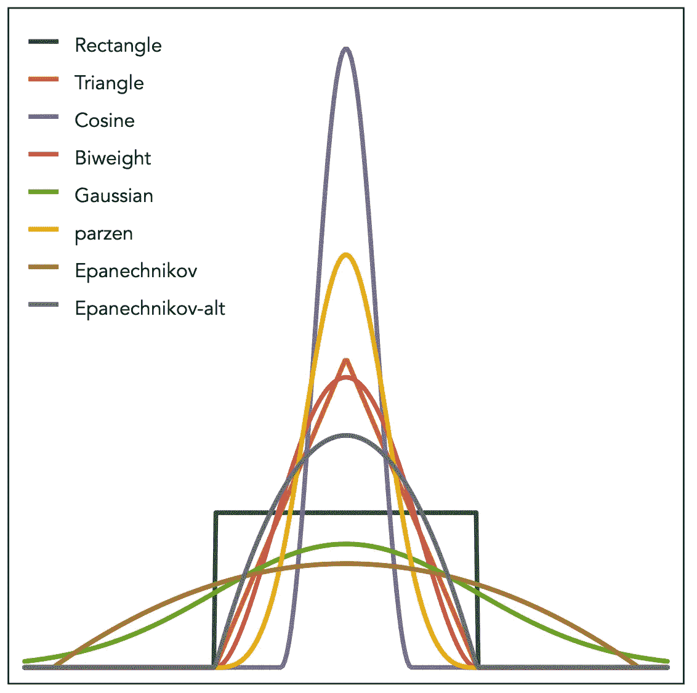
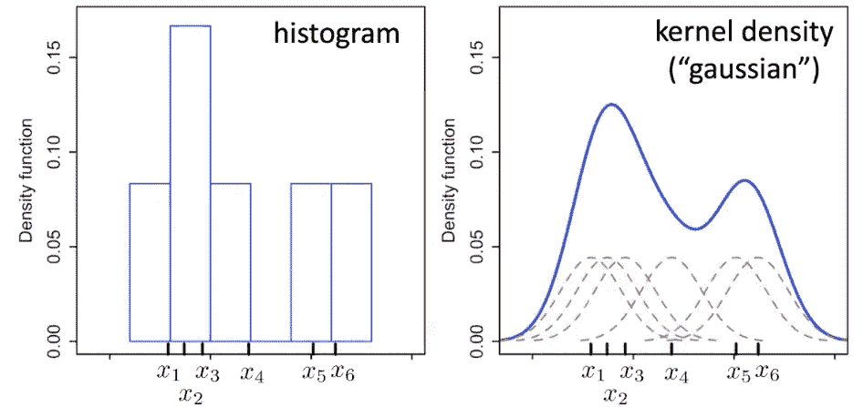
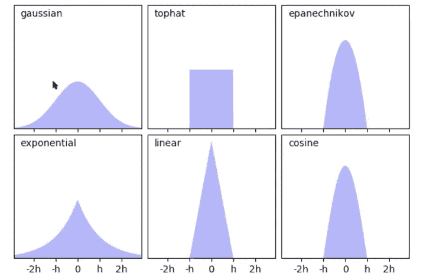
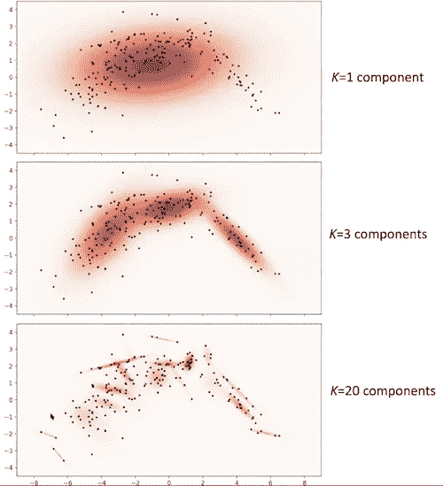

# ML04:核密度估计

> 原文：<https://medium.com/analytics-vidhya/ml04-kernel-density-estimation-ee29a1578d0c?source=collection_archive---------3----------------------->

这是机器学习系列背后的[数学的延续。](https://malhotravaibhav.medium.com/maths-behind-machine-learning-15e8ad8267c)

核密度估计是一种**非参数**模型，也被称为 **KDE** ，这是一种让你在给定一组数据的情况下创建平滑曲线的技术。KDE 基本上在每个数据点集中一个核函数，并平滑它以得到一个命运估计。



[https://graphworkflow.com/eda/distributional-form/](https://graphworkflow.com/eda/distributional-form/)

创建 KDM 的动机是直方图 ***不平滑*** *，它们依赖于条柱的宽度和条柱的端点，kdm 通过提供更平滑的曲线来减少问题。[1]* 如果您想直观显示某些数据的“形状”，作为离散直方图的一种连续替代，这可能很有用。

# 让我们更深入地了解 KDE

> **参数模型**具有固定数量的自适应参数，与数据量无关。例如:逻辑回归，K-均值聚类。
> 
> **非参数模型**的参数数量可变，即参数根据数据量而变化。简而言之，为了做出预测，模型会查看一些(大部分是所有)数据点，以便做出决策。例如:核密度估计，支持向量机，决策树。

D **密度估计**是基于观测数据对不可观测的潜在[概率密度函数](https://en.wikipedia.org/wiki/Probability_density_function)【2】的估计。所以我们对于新点 x 的目标是估计 p(x)，其中 p(x)是 x 成为密度函数一部分的概率。

K **内核密度估计**通过[用一些“内核”卷积](https://en.wikipedia.org/wiki/Convolution)每个点 x 来平滑数据。每个点表示为核密度函数的中心，最终曲线是该点所有核的归一化卷积(和)。



来源:维基百科

使用相同数据构建的直方图和核密度估计的比较。六个单独的核是红色虚线，核密度通过简单地将红色曲线相加来估计蓝色曲线。

# 内核参数

1.  **内核函数:**这是最重要的参数，因为它决定了数据将如何表示。最常用的核是“高斯”和“指数”。



来源: **scikit-learn**

2.**内核函数带宽(h)** :改变带宽会改变内核的形状，即要么扩展要么压缩函数。较低的带宽意味着只有非常接近当前位置的点被赋予任何权重，这导致估计看起来不规则；更高的带宽意味着更浅的内核，其中远处的点可以做出贡献。

3.**组件数量(k):** 这不是一个与核函数直接相关的参数，而是与我们的模型相关的参数。k 基本上是将我们的数据分成的箱或桶的数量。



在 scikit-learn 中使用**核密度估计器**也非常简单。

```
import sklearn
kde = sklearn.neighbours.KernelDensity(kernel='gaussian', bandwidth=1.0)
```

我希望这篇文章能为 KDE 的工作方式提供一些直觉。它们对于理解下一课要讲的支持向量机很重要。希望你喜欢学习它！

有关问题/反馈，您可以通过我的 [LinkedIn](https://www.linkedin.com/in/vm3/) 或我的[网站](https://malhotravaibhav.com)联系我。

快乐学习！

## 参考

[1][http://home pages . INF . ed . AC . uk/RBF/cv online/LOCAL _ COPIES/av 0405/mis HRA/kde . html](http://homepages.inf.ed.ac.uk/rbf/CVonline/LOCAL_COPIES/AV0405/MISHRA/kde.html)

[2]维基百科:[https://en.wikipedia.org/wiki/Density_estimation](https://en.wikipedia.org/wiki/Density_estimation)