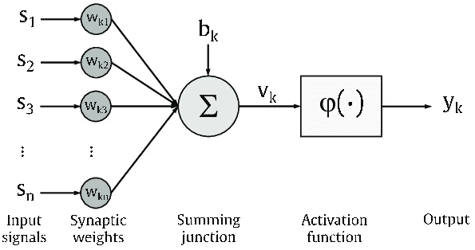
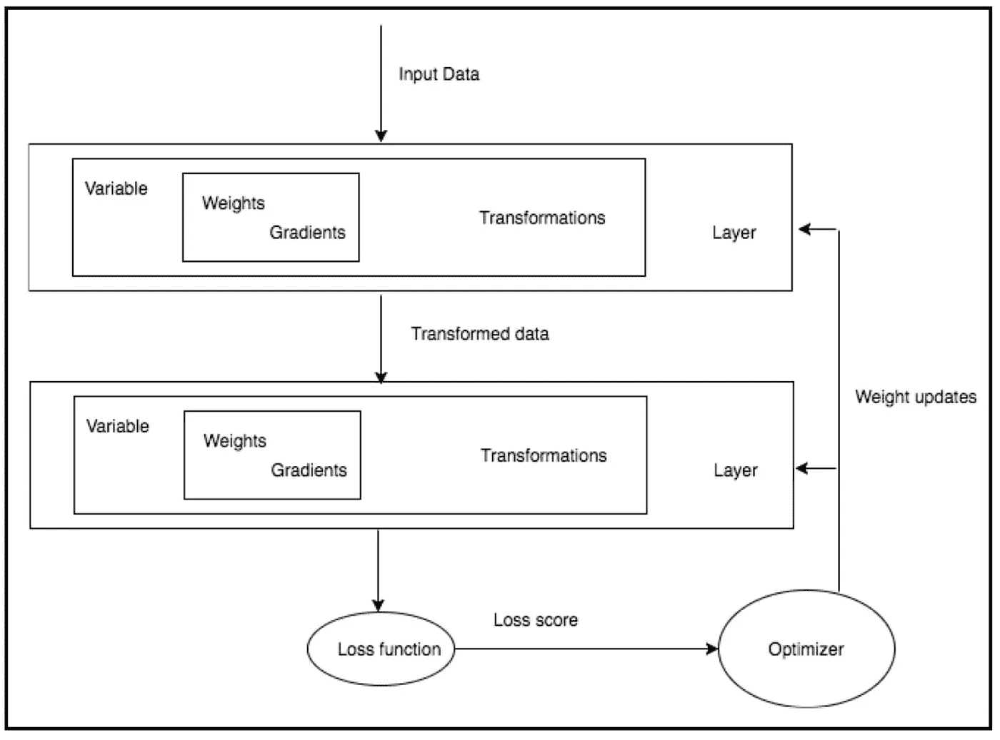

# ML05:Numpy 的 iris 上的神经网络

> 原文：<https://medium.com/analytics-vidhya/ml05-8771620a2023?source=collection_archive---------1----------------------->

## 由感知器从零开始发现神经网络元素

```
Read time: 10~12 minComplete Python code: [https://bit.ly/2UZftXq](https://bit.ly/2UZftXq)
```

神经网络的初学者往往第一眼就被复杂的数学和复杂的模型吓倒，所以我想在 iris 上分享一个相当简单的神经网络玩具示例，不利用任何 DL 框架，如日本人写的书[1]中的 PyTorch 或 Tensorflow，只使用 NumPy — —也就是说，我们需要自己创建损失函数、激活器和调整权重。

神经元是神经网络的最小单位。感知器是单层神经网络。让我们尝试用感知器对虹膜进行二进制分类。

> ***大纲*** *(1)* [*数据集*](#0ecf) *(2)*[*神经网络复习*](#6ad1) *(3)*[*输入*](#6c15) *(4)*[*数据拆分*](#f709) *【5】*

# (1)数据集

著名的 iris 来自:
[https://archive . ics . UCI . edu/ml/machine-learning-databases/iris/iris . data](https://archive.ics.uci.edu/ml/machine-learning-databases/iris/iris.data)

# **(2)神经网络复习**



图 1:感知机的可视化[2]


图 2:神经网络的可视化[2]



图 3:低级操作和 DL 算法[3]

# (3)输入

```
import numpy as np
import pandas as pd
import os
os.chdir("D:\\Python\\Numpy_JP\\ch04-3") 
# Choose your own working directorydf = pd.read_csv('iris.data', header=None)
print(df)
```

iris 的数据帧如下:


图 iris 的数据帧

```
x = df.iloc[0:100,[0, 1, 2, 3]].values
y = df.iloc[0:100,4].values
y = np.where(y=='Iris-setosa', 0, 1)
```

我们取前 100 行，将数据集分成 *x* (特征)& *y* (目标)。然后 *np.where* 将名义数据 *y* 从文本转换为数字。

# (4)数据拆分

```
x_train = np.empty((80, 4))
x_test = np.empty((20, 4))
y_train = np.empty(80)
y_test = np.empty(20)x_train[:40],x_train[40:] = x[:40],x[50:90]
x_test[:10],x_test[10:] = x[40:50],x[90:100]
y_train[:40],y_train[40:] = y[:40],y[50:90]
y_test[:10],y_test[10:] = y[40:50],y[90:100]
```

第 1~50 行为“*鸢尾-刚毛鸢尾*”，第 51~100 行为“*鸢尾-海滨鸢尾*”所以我们收集的第 1~40 行和第 51~90 行作为训练集，其余行作为测试集。

# (5)定义功能

```
def sigmoid(x):
    return 1/(1+np.exp(-x))def activation(x, w, b):
    return sigmoid(np.dot(x, w)+b)def update(x, y_train, w, b, eta): 
    y_pred = activation(x, w, b) 
    # activator
    a = (y_pred - y_train) * y_pred * (1- y_pred) 
    # partial derivative loss function for i in range(4):
        w[i] -= eta * 1/float(len(y)) * np.sum(a*x[:,i])
    b -= eta * 1/float(len(y))*np.sum(a)
    return w, b
```

让我们探究一下上述代码背后的数学原理:


图 5:神经网络函数和损失函数[4]


图 6:偏导数和 sigmoid 激活器


图 7:权重更新-1


图 8:权重更新-2

*   **激活器**:乙状结肠功能
*   **损失函数** : MSE(均方差)
*   **优化器**:梯度下降
*   **权重更新**:令人厌烦的数学工作

# (6)培训

```
weights = np.ones(4)/10 
bias = np.ones(1)/10 
eta = 0.1
for _ in range(15): # Run both epoch=15 & epoch=100 
 weights, bias = update(x_train, y_train, weights, bias, eta=0.1)
```

*   **初始权重**:设 wi & b 均为 0.1
*   **学习率**:设定 eta= 1
*   **历元**:运行两个历元= 15 &历元= 100

# (7)测试

```
print("Epochs = 15") # Run both epoch=15 & epoch=100
print('weights = ', weights, 'bias = ', bias)
print("y_test = {}".format(y_test))
activation(x_test, weights, bias)
```


图 9:纪元= 15 的测试结果


图 10:epochs = 100 的测试结果

如果我们将决策边界设置为 0.5，那么我们在 15 和 100 这两个时期都获得了 100%的准确性。

纪元= 15 的前 10 次预测在 0.46~0.49 之间，纪元= 100 的前 10 次预测在 0.23~0.30 之间。纪元= 15 的最近 10 次预测在 0.57~0.63 之间，纪元= 100 的最近 10 次预测在 0.64~0.81 之间。随着时代的上升，两个花团的价值观越来越远。

# (8)总结

*没有任何 NN 框架*，我们搭建了一个单层神经网络！我们发现了像**激活器**(*s 形* **)** 、**损失函数** ( *MSE* )、**优化器** ( *梯度下降*)、**权重更新** ( *令人厌烦的数学工作*)、**初始权重** ( *wi = b= 1* )这样的概念

# (9)参考文献

[1]吉田，t .和 Ohata，S. (2018 年)。艮巴·德·冢原！数据科学。日本，JP: SHOEISHA。

[2]英国建筑研究所，f .等人(2020 年)。一种有效的基于元模型的方法来执行多目标建筑性能优化。能源与建筑，206，(未知)。

[3] Subramanian，V. (2018)。用 PyTorch 进行深度学习。英国伯明翰:Packt 出版公司。

[4]拉夫加登，t .和瓦兰特，G.(2015 年)。现代算法工具箱第 15 讲:梯度下降基础。从
[http://theory.stanford.edu/~tim/s15/l/l15.pdf](http://theory.stanford.edu/~tim/s15/l/l15.pdf)检索