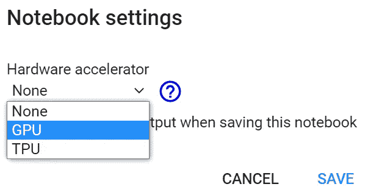

# ML06:谷歌 Colab 上的 PyTorch

> 原文：<https://medium.com/analytics-vidhya/ml06-893e4cb389c6?source=collection_archive---------8----------------------->

## 免费访问英伟达特斯拉 T4

```
Read time: 5 minThe time of this writing is 2020/11/01\. The GPU Google Colab provided may change over time [1]. Complete setup codes on Colab (for installing PyTorch & CUDA on PC or laptop):
[https://bit.ly/3pS3Trv](https://bit.ly/3pS3Trv)Simplified setup codes on Colab (acutally Colab has PyTorch & CUDA already):
[https://bit.ly/3axxJes](https://bit.ly/3axxJes)
```

> ***概要*** *(1)DL 中的 GPU&Google 协同实验室
> (2)安装 PyTorch 和 CUDA
> (3)在 Colab 上初始化 PyTorch 中的 CUDA
> (4)Colab 的 GPU:NVIDIA Tesla T4
> (5)简化的设置代码
> (6)总结
> (7)参考*

# (1)DL 和 Google 联合实验室中的 GPU

在获取神经网络(NN)或深度学习(DL)时，我们从神经元、感知、MLP(多层感知器)到 CNN(卷积神经网络)进行学习。然而，在训练复杂的神经网络模型时，GPU 在减少计算时间方面起着主要作用。因此，像 Google Colaboratory 这样的免费 GPU 源代码可以拯救无助的初学者。


图 Colab 的官方介绍

Colab 的环境看起来很像 Jupyter 笔记本。我们不仅可以在 Colab 中运行正常的 Python 代码(不涉及 NN)，还可以通过 Google 提供的 NVIDIA GPU 运行 NN 模型。

现在(2020/11/01) Colab 提供 **NVIDIA Tesla T4** (我们稍后会确认)，这是一个我这样的学生绝对买不起的 GPU。NVIDIA Tesla T4 在亚马逊的惠普商店售价**2200 美元**，在戴尔台湾网站售价**93867 TWD**(=**3250 美元**)！(本文写于 2020/11/01，GPU Goolge 提供的和 NVIDIA Tesla T4 的价格可能会随着时间的推移而变化。)


图 2:亚马逊惠普商店的英伟达特斯拉 T4[2]


图 3:戴尔台湾网站上的英伟达特斯拉 T4(TWD = NTD)[3]

# (2)在 Colab 上安装 PyTorch 和 CUDA

首先，让我们在 Colab 中打开一个新的笔记本，运行下面的代码。

## 1.操作系统信息

```
!cat /etc/*-release
```


图 4:检查操作系统

要安装 PyTroch & CUDA，我们必须获得操作系统的信息。这里是 Ubuntu 18.04。

## 2.安装 PyTorch

py torch:https://pytorch.org/get-started/locally/[当地
开始](https://pytorch.org/get-started/locally/)

查看上面的 PyTorch 安装网页，并选择适合您机器的安装。在这里，我们得到以下代码并运行它们。


图 5:使用 CUDA=11.0 的 PyTorch 的安装代码

```
pip install torch torchvision
```

我们先尝试了 CUDA 10.2 的命令，在这一步得到了已经满足的*需求，所以 Colab 已经有 PyTorch 了！那么让我们试试这个命令:*

```
pip uninstall torch
```

请稍等，请不要键入“y”继续。我们在这里只是为了检查 Colab 固有的 PyTorch 版本。


图 6:检查 Colab 中固有的 PyTorch 版本

```
pip install torch==1.7.1+cu110 torchvision==0.8.2+cu110 torchaudio===0.7.2 -f https://download.pytorch.org/whl/torch_stable.html
```


图 7:安装 PyTorch

请注意，我们选择了 PyTorch 和 CUDA=11.0，因为我们将在以后安装 CUDA 11.1。看来 Colab 已经有 PyTorch 了！很好。

## 3.安装 CUDA

CUDA 工具包 11.1 更新 1 下载
[https://developer.nvidia.com/cuda-downloads](https://developer.nvidia.com/cuda-downloads)

CUDA 是一种特殊的 API，允许在 GPU 上进行计算。CUDA 是英伟达建立的，只能在英伟达的 GPU 上使用。

查看上面的 CUDA 安装网页，选择适合您机器的安装。在这里，我们得到以下代码并运行它们。


图 CUDA 11.1 的安装代码

```
!wget [https://developer.download.nvidia.com/compute/cuda/repos/ubuntu1804/x86_64/cuda-ubuntu1804.pin](https://developer.download.nvidia.com/compute/cuda/repos/ubuntu1804/x86_64/cuda-ubuntu1804.pin)
!sudo mv cuda-ubuntu1804.pin /etc/apt/preferences.d/cuda-repository-pin-600
!wget [https://developer.download.nvidia.com/compute/cuda/11.1.1/local_installers/cuda-repo-ubuntu1804-11-1-local_11.1.1-455.32.00-1_amd64.deb](https://developer.download.nvidia.com/compute/cuda/11.1.1/local_installers/cuda-repo-ubuntu1804-11-1-local_11.1.1-455.32.00-1_amd64.deb)
!sudo dpkg -i cuda-repo-ubuntu1804-11-1-local_11.1.1-455.32.00-1_amd64.deb
!sudo apt-key add /var/cuda-repo-ubuntu1804-11-1-local/7fa2af80.pub
!sudo apt-get update
!sudo apt-get -y install cuda
```


图 9:安装 CUDA 11.1

需要一段时间，比如 2 分钟。

# (3)在 Colab 上的 PyTorch 中初始化 CUDA

现在，让我们检查一下 CUDA 现在是否可用。

```
import torch
torch.cuda.is_available()
```


图 10: CUDA 对 PyTorch 不可用

那么…有什么问题呢？走吧“运行时”->“更改运行时类型”->“硬件加速器”->选择“GPU”。正如下图。



图 11:选择 GPU 作为硬件加速器


图 PyTorch 可以使用 CUDA

CUDA 可用，现在可以尝试复杂的 DL 模型。

# **(4)**Colab 的 GPU:英伟达特斯拉 T4

我们来看看 GPU 类型。

```
!nvidia-smi
```


图 13: GPU 信息

正是**英伟达特斯拉 T4** ！

# (5)简化的设置代码

其实 Colab 已经有 PyTorch & CUDA 了，所以上面的安装程序是*多余的*。然而，上面的**安装步骤对于在 PC 或笔记本电脑上设置 PyTorch & CUDA 是不可或缺的！**

所以我们可以简单地这样做:

```
#### (1) Check if PyTorch and CUDA are available
import torch
torch.cuda.is_available()#### (2) Inspect GPU
!nvidia-smi#### (3) Test PyTorch
import torch
print(torch.ones(3,2))
```

# (6)总结

我们在 Google Colab 上安装了 PyTorch 和 CUDA，然后在 PyTorch 中初始化 CUDA。最后我们查了一下 Colab 的 GPU 是**NVIDIA Tesla T4**(2020/11/01)，在亚马逊上要**2200 美金**对于我这样的学生来说太贵了。

```
Check here for complete setup codes (for installing PyTorch & CUDA on PC or laptop):
[https://bit.ly/2WfovwS](https://bit.ly/2WfovwS)Check here for simplified setup codes (acutally Colab has PyTorch & CUDA already):
[https://bit.ly/3mhyNH9](https://bit.ly/3mhyNH9)
```

# (7)参考文献

[1]合作推特(2019/04/24)。从亚马逊惠普商店的
[https://twitter.com/googlecolab/status/1120777276503683072](https://twitter.com/googlecolab/status/1120777276503683072)
【2】英伟达特斯拉 T4 取回。检索自戴尔台湾网站上的
[https://amzn.to/320aiqK](https://amzn.to/320aiqK)
【3】英伟达特斯拉 T4。检索自
【https://dell.to/3efH7VA】
【4】Rao，d .和 McMahan，B. (2019)。用 PyTroch 进行自然语言处理。加利福尼亚州:奥赖利媒体。

## (中文)

[5] 邢夢來等人 (2018)。深度学习框架 PyTorch 快速开发与实战。北京，中國：電子工業。