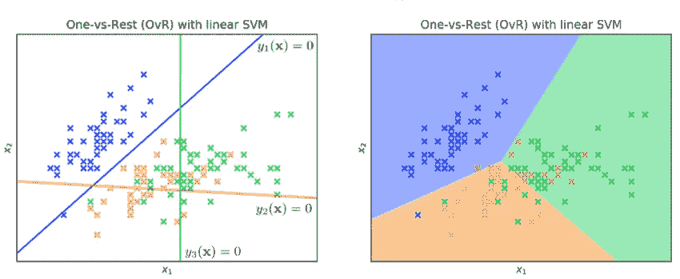

# ML06:多类分类介绍

> 原文：<https://medium.com/analytics-vidhya/ml06-intro-to-multi-class-classification-e61eb7492ffd?source=collection_archive---------18----------------------->

这是机器学习系列背后的[数学的延续。](https://malhotravaibhav.medium.com/maths-behind-machine-learning-15e8ad8267c)

在上一篇文章中，我们看到了最大间隔原则是如何优雅地解决二元分类任务的。

> B 但是对于多类来说，最大利润的概念更难表述。所以问题是，我们怎样才能把 2 类公式重新用于 k 类。

**One-vs-Rest (OvR):** 对于每一个类 k，训练一个 SVM，该是分类 k (one)对非 k(Rest)的专家，这意味着我们必须为每一个类 k 创建一个二元分类器，该分类器是将该类(k)从所有其他类中分离出来的专家。

**一对一(OvO):** 对于每一对类(k，k’)，训练一个擅长对 k 与 k’进行分类的 SVM。

无论是哪种情况，都可以通过组合单个二元预测来进行多类预测。

# 一对多

让我们以一个 3 类分类器为例，对于 OvR，我们需要 3 个 SVM，每个 SVM 都是将一个类从另两个类中分离出来的专家。让我们看一个直观的例子如下:

线性核的 OvR SVM

我们可以有 3 个支持向量机，一个用于蓝色，一个用于橙色，一个用于绿色。每个 SVM 都接受二进制数据的训练，这意味着它的任务是将自己的类与所有其他类分开。下面的热图显示了单个 SVM 的热图。

培训 OvR 热图

# 一对一

对于上面的同一个例子，让我们看看 OvO 是如何工作的。对于这个 3 个类的例子，我们不是为每个类训练一个 SVM，而是为每对类训练一个 SVM。因此，在训练 SVM 时，它只关注这一对职业，而忽略了其他职业。

线性核卵

对于上面的例子，我们训练一个 SVM 来分离蓝色和绿色，一个分离蓝色和橙色，一个分离橙色和绿色。下面的热图显示了培训过程，我们可以看到，在为一对学员进行培训时，它完全忽略了其他班级。

OvO 培训热图

为了对点 x 进行预测，我们选择具有最高票数的类 k。

> 这两种方法都有一个问题，那就是训练起来可能会非常慢。
> 
> OvR:训练 k 个支持向量机，每个都在完整的数据集上。
> 
> **OvO:训练 k 个支持向量机，但每个支持向量机只训练数据集的一部分。**

# 多类分类的逻辑回归。

理解逻辑回归是很重要的，如果你需要一点修改，请参考这篇文章。

我们也可以将 OvR 和 OvO 的概念用于逻辑回归，但是结果表明 LR 具有自然的多类最大似然公式。

## 来自多输出线性回归的多输出逻辑回归

我们可以训练一个线性回归模型来生成一个 k 维向量作为多输出数据集的输出，如下所示:

现在，如果我们将元素式 sigmoid 捕捉到输出上，并独立预测每个标签的输出，我们将收到如下多标签输出:

实际和预测标签的示例

对于分类，属于每个类别的实际概率不能独立预测。它们的总和必须是 1。

理想情况下，我们需要预测所有类的联合概率。谢天谢地，我们有 Softmax 功能来拯救我们。

**直觉**:放大向量 a 中的最大值，然后归一化，保证应用 softmax 后所有值之和等于 1。因此，我们实现了我们的多类分类器。

让我们用我们在 SVM 看到的同一个例子来看看它的实际应用:

三类多分类的 Logistic 回归

# 奖金部分:

## 多类与多标签分类与标记

> 多类:给定 *x* 预测 K 个类中的一个唯一类(一个“类标签”)。
> 
> 多标签:给定 *x* ，预测应该关联到 x 的 K 个标签的子集
> 
> 标签:通常是图像的多标签分类。

还有许多多类分类器可用，如 **k-NN** 、**朴素贝叶斯分类器**，我将在后面讨论。

我希望这篇文章为你提供了多类分类的直觉。它们对于处理现实世界的问题很重要，并且有广泛的应用。希望你喜欢学习它！

有关问题/反馈，您可以通过我的 [LinkedIn](https://www.linkedin.com/in/vm3/) 或我的[网站](https://malhotravaibhav.com/)联系我。

快乐学习！