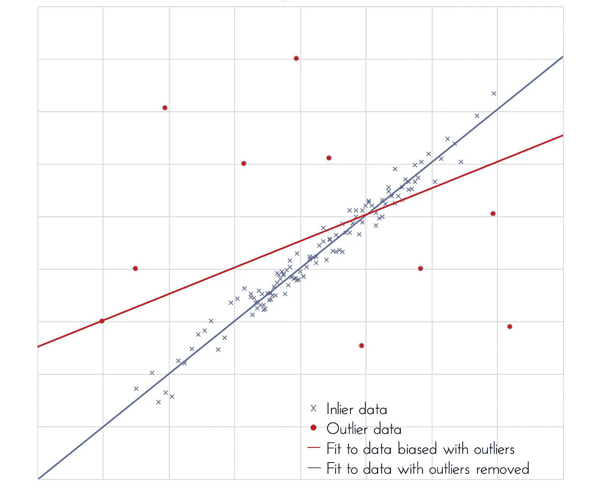

# ML07:什么是“稳健”？

> 原文：<https://medium.com/analytics-vidhya/ml07-f899675ed237?source=collection_archive---------22----------------------->

## 稳健统计/稳健模型/稳健性

Robust/robustness 是统计学/机器学习中一个常用但经常不详细说明的概念。我们从一些实例开始:
1。**稳健**:中位数、IQR、切尾均值、Winsorized 均值
2。**非稳健**:均值、标准差、范围

> ***概述*** *(1)*[*【稳健】*](#e708) *(2)*[*处理错误和离群值*](#5943)1 .将异常值视为错误，然后删除它们
> 2。使用领域知识并找到可能的离群值
> 3。使用健壮方法 *(3)* [*另一个实例*](#04c4) *(4)*[*参数化、非参数化和健壮方法*](#d0f5)1。参数方法
> 2。稳健方法
> 3。非参数化方法 *(5)* [*另一种稳健的方法:重采样*](#4873)1。重采样
> 2。折叠
> 3。自举 *(6)* [*参考文献*](#b1ae)

> “所有的模型都是错误的，但有些是有用的”——例如，E. P. Box

图 1:拟合有无异常值的数据[1]

# (1)“稳健”的定义

让我们仔细看看各种来源的“稳健/稳健性”的定义:

> 1.稳健统计是对从大范围概率分布中提取的数据具有良好性能的统计，特别是对于非正态分布。[2]
> 
> 2.一个健壮的概念将在各种条件下无故障地运行并产生积极的结果。对于统计学来说，如果一个测试尽管其假设被改变或违反了，但仍然提供了对问题**的洞察，那么这个测试就是健壮的。在经济学中，稳健性归因于金融市场**在市场条件**发生变化的情况下继续运行。一般来说，如果一个系统能够**处理可变性并保持有效**，那么它就是健壮的。[3]**
> 
> 3.因此，稳健统计是指当数据从大范围的概率分布中提取时产生良好性能的任何统计，这些概率分布**在很大程度上不受异常值或给定数据集中模型假设**的微小偏差的影响。换句话说，稳健的统计数据可以抵抗结果中的错误。[4]

然后，我们转向 1988 年出版的一本经典统计学书籍*问题解决:统计学家指南*:

> 4.一个不受微小偏差影响的**统计程序被认为是稳健的，幸运的是许多程序都具有这种性质。例如， **t 检验对偏离正态分布是稳健的**。[5]**

# (2)处理错误和异常值

既然我们已经讨论了几乎没有变化的各种定义，让我们看看**为什么我们需要稳健统计/稳健模型**。

在处理异常值时，我们手头有两种方法:

## 1.将异常值视为错误，然后删除它们

未经充分考虑，经常采用一种直截了当的方法。这里，我们可以删除异常值，留下缺少值的数据点。

## 2.使用领域知识并尽可能发现异常值

> 将异常值视为缺失观察值可能是明智的，但如果分布是重尾的，这可能是不合适的。
> 
> 极端的观察结果可能是错误，也可能不是错误，但却更难处理。决定哪些异常值是“显著”的测试，但是**它们没有** **来自“现场”人员的建议**重要，关于哪些可疑值明显是愚蠢的或不可能的，应该谨慎看待。[5]

## 3.使用稳健的方法

> 另一种方法是使用稳健的估计方法，该方法**自动降低极端观测值**的权重。例如，单变量数据的一种可能性是**使用 Winsorization，通过 winsor ization 将极端观察值向总体平均值**调整，可能调整到第二或第三个最极端值(适当的大或小)。然而，许多分析家更喜欢一种诊断参数方法，这种方法可以分离出不寻常的观察结果以供进一步研究。[5]

> 当没有证据表明异常观测值是错误时，我推荐的处理异常观测值的程序是**在有和没有可疑值的情况下重复分析**。如果结论相似，那么嫌疑人的价值观就是“无所谓”。如果结论大相径庭，那么人们就应该警惕仅仅依靠一两个观察(称为有影响的观察)就做出如此关键的判断。[5]

# (3)另一个例子

LDA(线性判别分析)的假设是特征是*独立、连续、正态分布*。如果违反了前面的假设，LDA 表现很差；那么，**在这种情况下，回归比 LDA** 更稳健，**神经网络比回归**更稳健。[6]

理解了这个例子之后，我们将进入一个更大的范围。

# (4)参数、非参数和稳健方法[5]

现在我们知道模型只是对现实的近似。以下情况可能会破坏模型:

*偶然的重大误差*。(重大误差是由 e *实验者的粗心大意*或*设备故障*造成的。这些“异常值”远远高于或低于真实值，因此在评估数据时通常会被丢弃。“Q-检验”是一种确定一个数据点是否应该丢弃的系统方法。[7])

(b) *偏离次要假设，即分布假设*，例如数据不正常或不独立。

(c) *偏离主要假设*。

“传统”统计学家通常进行诊断性检查，通常的观察结果被隔离或“标记”以供进一步研究。这可以看作是向稳健性迈进了一步。

我们可以采用以下三种方法来解决上述问题:

## 1.参数方法

我们首先想到的是经典的参数模型拟合方法。参数方法有 4 个主要假设[8]:

{1}数据的正态分布
{2}方差的均匀性
{3}区间数据
{4}独立性

## 2.稳健的方法

稳健方法可能涉及拟合参数模型，但采用的程序**并不严格依赖于模型中隐含的假设**。特别是，外围观测值通常会自动降低权重。**因此，稳健方法可以被视为介于经典方法和非参数方法之间**。

一些统计学家更喜欢对大多数问题采取稳健的方法，理由是没有异常值时损失很小，但如果有异常值，则收益很大。离群值可能会完全破坏分析，因此一些稳健的程序可能会成为例行公事。

## 3.非参数方法

非参数(或无分布)方法**尽可能对数据的分布**做出很少假设。它被广泛用于分析社会科学数据，这些数据通常不是正态分布的，但是**可能会严重扭曲**。

非参数方法避开了上面的问题(b ),或许在某种程度上也避开了问题(a)。它们的吸引力在于(根据定义)它们在最小假设下是有效的，并且通常具有令人满意的效率和鲁棒性。一些方法在计算上是**乏味的**，尽管这在可用的计算机上不是问题。然而，**非参数结果并不总是像参数分析的结果那样容易解释**。因此，非参数分析应保留给特殊类型的数据，特别是**有序数据或来自严重偏斜或非正态分布的数据。**

让我们进一步探讨“非参数检验与参数检验”[9]，展示各自的优势:

## 参数测试的优势

1.参数测试可以提供具有偏斜和非正态分布的可信结果
2。当各组具有不同的可变性
3 时，参数测试可以提供可信的结果。参数检验有更强的统计能力

## 非参数检验的优势

1.非参数检验评估中位数，这对某些研究领域可能更好
2。当我们的样本量很小，并且您的数据可能是非正态分布时，非参数检验是有效的
3。非参数检验可以分析有序数据、分级数据和异常值

> 最初的数据分析可能有助于指明采用哪种方法。然而，如果仍然不确定，可能值得尝试多种方法**。例如，如果参数测试和非参数测试都表明影响是显著的，那么人们可以对结果有信心。然而，如果结论不同，那么必须更加注意次要假设的真实性。**

# (5)另一种稳健的方法:重采样[5]

## 1.重采样

有许多估计技术依赖于*对观测数据进行重采样*来评估给定估计器的特性。当抽样分布难以找到或参数假设难以证明时，它们有助于提供估计量**的偏差和标准误差的非参数估计量。**

## *2。折叠*

*重叠*的常见形式是重采样的扩展。给定 n 个观测值的样本，一次丢弃一个观测值，给出 n(n-1)个观测值的 n(重叠)组。(参见留一法交叉验证，LOOCV)为每组计算估计量，这些值提供总体估计量的偏差和标准误差的估计值。

## **3。引导程序**

重用样本的另一种可行方法是*自举*。其思想是通过从观察到的经验分布中抽取大小为 n **的重复样本并替换**来模拟给定估计量的特性，其中 X1、X2、…、Xn 均为给定的概率质量 1/n。(参见*“刀切”*抽取样本大小(n-1) **而不替换**。)每个样本给出未知总体参数的估计。

这些值的平均值称为 *bootstrap 估计量*，它们的方差称为 *bootstrap 方差*。*的近亲*，被称为交叉验证(CV)，主要关注的不是估计，而是**评估不同模型的预测误差**。一次省去一个(或多个)观察值(即，省去一个交叉验证，LOOCV)，将模型拟合到剩余的点，并用于预测被删除的点。

# (6)参考文献

[1]阿德莱德大学(身份不明)。稳健的统计数据。检索自

 [## 稳健统计

### 机器学习算法依赖于将理想的数学模型与现实生活中的数据相协调的能力

www.adelaide.edu.au](https://www.adelaide.edu.au/aiml/our-research/machine-learning/robust-statistics) 

[2]维基百科(身份不明)。稳健的统计数据。检索自

 [## 稳健统计

### 稳健统计是对来自大范围概率分布的数据具有良好性能的统计…

en.wikipedia.org](https://en.wikipedia.org/wiki/Robust_statistics) 

[3]w .肯顿(2020 年)。健壮。检索自

 [## 粗野的

### 在投资领域，稳健是描述模型、测试或系统执行能力的特征

www.investopedia.com](https://www.investopedia.com/terms/r/robust.asp) 

[4]泰勒，C. (2019)。统计的稳健性。检索自

 [## 稳健性:统计模型的优势

### 在统计学中，术语稳健是指统计模型、测试和程序的强度…

www.thoughtco.com](https://www.thoughtco.com/what-is-robustness-in-statistics-3126323) 

[5]查特菲尔德，C. (1988 年)。解决问题:统计学家指南。英国伦敦:查普曼&大厅。

[6]刘易斯博士(2016 年)。*利用 R 轻松学习数据:数据科学简介*。【发布地点未确定】:CreateSpace 独立发布平台。

[7]加州大学(身份不明)。错误分析。检索自
[http://faculty . sites . UCI . edu/chem1l/files/2013/11/rdgerroranal . pdf](http://faculty.sites.uci.edu/chem1l/files/2013/11/RDGerroranal.pdf)

[8]j . h . k lopper(身份不明)。参数测试的假设。检索自

 [## RPubs

### 编辑描述

rpubs.com](https://rpubs.com/juanhklopper/assumptions_for_parametric_tests) 

[9]弗罗斯特，j .(身份不明)。非参数检验与参数检验。检索自

 [## 非参数检验与参数检验-统计学

### 非参数检验不要求您的数据遵循正态分布。他们也被称为…

statisticsbyjim.com](https://statisticsbyjim.com/hypothesis-testing/nonparametric-parametric-tests/)