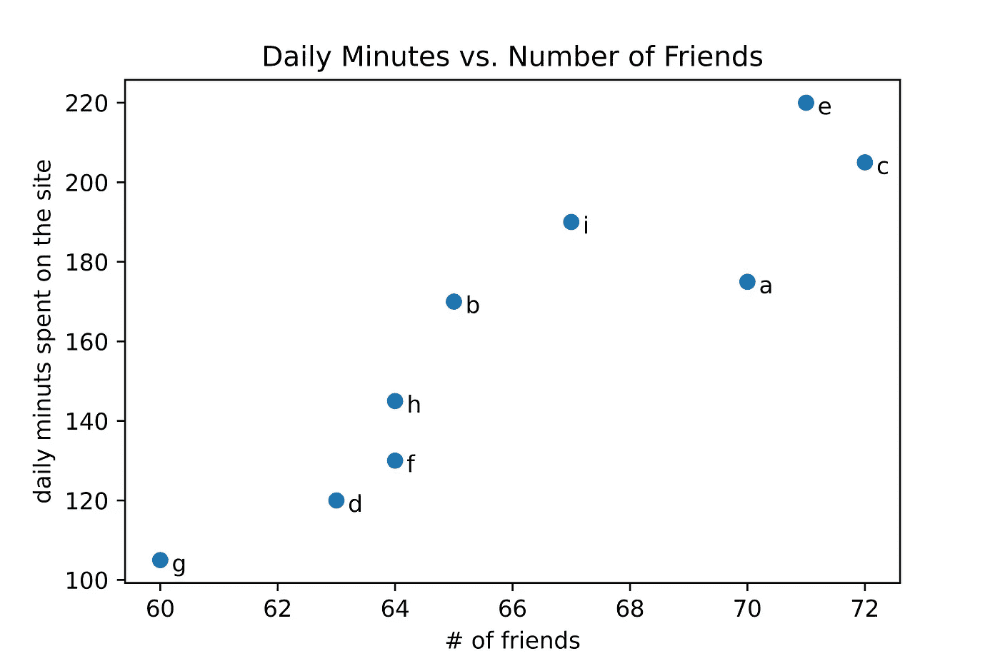

# ML10:R & Python 的独占方法

> 原文：<https://medium.com/analytics-vidhya/ml10-344aaaf3235d?source=collection_archive---------22----------------------->

## %in%，ifelse()，1 < x < y < 10, *for + else* ，lambda()，list comprehension，zip()

```
Read time:  12 minPython code on Colab: [https://bit.ly/34vRv87](https://bit.ly/34vRv87)
```

r 和 Python 都有各自的比较优势和独有的方法。

r 以其内置的矢量化而闻名，而 Python 的矢量化存在于 NumPy 中。Python 也拥有自己的特性，比如 for + else、list comprehension、zip、map、lambda 等等。

> ***概述*** *①R:*[*否决化— %in%，其中， 匹配*](#70e2) *(2)R:*[*if else()*](#3216) *(3)Py:*[*(真)if a > b else(假)*](#b9da) *(4)Py:*[*x<y<10* Py:](#9bca) [*列表理解*](#f3a6) *(8)Py:*[*枚举( )，zip()，map()*](#fae7) *(9)*[*将 R 和 Python 一起使用*](#e43f) *【10】*[*引用*](#ba67)


图 1: R & Python。[(来源)](https://www.youtube.com/watch?app=desktop&v=js6C2mLXEDw&ab_channel=edureka%21)

# (1) R:否决化— %in%，匹配

```
#### **R: vetocrization -- which, match, %in%**## **1\. which( ) gives indexes**
x = c(2,3,5,8,11,14)
which(x %% 2 != 0 & x %% 3 != 0)
# [1] 3 5
x[which(x %% 2 != 0 & x %% 3 != 0)]
# [1]  5 11## **2\. match( ) gives indexes**
match(3, c(1,2,8,3))
# [1] 4## **3\. %in% gives True or False**
3 %in% c(1,2,8,3)
# [1] TRUE
c(1,2,8,3) %in% c(1,3)
# [1]  TRUE FALSE FALSE  TRUE
v1 = c(1,2,0,3) 
v1[!v1 %in% 0]
# [1] 1 2 3
```

# (2) R: ifelse()

```
#### **R: ifelse**
x <- 5
ifelse(x > 0, 'x is positive', 'x is non-positive')
# [1] "x is positive"#### **R: ifelse + vectorization**
a <- c(1,1,0,1)
b <- c(2,1,0,1)
ifelse(a==1 & b==1, "Yes", "No")
# [1] "No" "Yes" "No" "Yes"
```

# (3) Py: (True)如果 a > b 否则(False)

```
#### **Py: if-else 1st version**
a, b = 5, 0
if a > b :
    print("x is positive")
else:
    print("x is non-positive")
# [1] "x is positive"#### **Py: if-else 2nd version**
a, b = 5, 0
print("x is positive") if a > b else print("x is non-positive")
# [1] "x is positive"
```

# (4) Py: 1 < x < y < 10

```
#### **Py: 1 < x < y < 10 (exclusive comparison form)** x = 5; y = 20
1 < x and x < 10
# True
1 < x < 10
# True
1 < x < y < 10
# Falseif 1 < x < 10:
    print("1 < x < 10 is True")
else:
    print("1 < x < 10 is False")
# 1 < x < 10 is True
```

# (5) Py: while + else / for + else

```
#### **Py: while + else / for + else**
'''
If the *while/for* loop ends normally (no break call), control passes to an optional else. This use of else might seem nonintuitive. Consider it as a break checker.
'''## **1\. while + else**
numbers = [1, 3, 5]
position = 0
while position < len(numbers):
    number = numbers[position]
    if number % 2 == 0:
        print("Found even number", number)
        break
    position += 1
else:
    print("No even number found")
# No even number found## **2\. for + else**
cheeses= []
for cheese in cheeses:
    print('This shop has some lovely', cheese)
    break
else:
    print('This is not much of a cheese shop, is it?')
# This is not much of a cheese shop, is it?## **3\. Alternative of "for + else"**
cheeses= []
found_one = False
for cheese in cheeses:
    found_one = True
    print('This shop has some lovely', cheese)
    breakif not found_one:
    print('This is not much of a cheese shop, is it?')
# This is not much of a cheese shop, is it?
```

# (6) Py: lambda( )

```
#### **Py: Anonymous Functions: the lambda() Function**
'''
In Python, a lambda function is an anonymous function expressed as a single statement. You can use it instead of a normal tiny function.1\. lambda arg1[, arg2,..., argn]: expression
'''product = lambda x, y: x * y; print(product(5, 10))
# 50def func(b):
    return lambda x : 2 * x + b
linear = func(5)
print(linear(10))
# 25li = [-8,5,9,-2,-11,12,1,10,-5]
sorted_li = sorted(li, key = lambda x:(x<0, abs(x))); print(sorted_li)
# [1, 5, 9, 10, 12, -2, -5, -8, -11]mylist = [5, 10, 15, 20, 25, 30]
squarelist = list(map(lambda x: x **2, mylist))
print(squarelist)
# [25, 100, 225, 400, 625, 900]
```

# *(7) Py:列表理解*

```
#### **Py: list comprehension**
'''
A comprehension is a compact way of creating a Python data structure from one or more iterators. Comprehensions make it possible for you to combine loops and conditional tests with a less verbose syntax. Using a comprehension is sometimes taken as **a sign that you know Python at more than a beginner’s level**. In other words, it’s more **Pythonic**.1\. [ *expression* for *item* in *iterable* ]
2\. [ *expression* for *item* in *iterable* if *condition* ]
3\. { *key_expression* : *value_expression* for *expression* in *iterable* }
4\. { expression for expression in iterable }
'''## **1\. list comprehension** number_list = [number for number in range(1,6)]; print(number_list)
# [1, 2, 3, 4, 5]
print([number for number in range(1,6)])
# [1, 2, 3, 4, 5]
a_list = [num for num in range(1,6) if num % 2 ==1]; print(a_list)
# [1, 3, 5]rows = range(1,4)
cols = range(1,3)
cells = [(row, col) for row in rows for col in cols]; print(cells)
# [(1, 1), (1, 2), (2, 1), (2, 2), (3, 1), (3, 2)]## **2\. dictionary comprehension** word = 'letters'
letter_counts = {letter: word.count(letter) for letter in set(word)}; print(letter_counts)
# {'r': 1, 't': 2, 'l': 1, 's': 1, 'e': 2}## **3\. set comprehension** a_set = {number for number in range(1,6) if number % 3 == 1}; print(a_set)
# {1, 4}
```

由于 Py 有*列表理解*，很直观的 Py 也有*词典理解*和*集合理解*。然后，在调用函数时，我们尝试“理解”概念的另一个细微变化。

```
# **Py: Another variation of "comprehension"**
'''
counter( ) is a handy *dictionary* type function. 
'''from collections import Counter
c = Counter("hello world"); print(c)
# Counter({'l': 3, 'o': 2, 'h': 1, 'e': 1, ' ': 1, 'w': 1, 'r': 1, 'd': 1})grades = [60,83,95,91,60]**## Note the difference between these functions**
add_score_0 = lambda grades: (grades **  0.5) * 10
add_score_1 = lambda grades: format((grades **  0.5) * 10, '.2f')
add_score_2 = lambda grades: int(((grades **  0.5) * 10)*100)/100
add_score_3 = lambda grades: float(format((grades **  0.5) * 10, '.2f'))print([add_score_0(k) for k in grades])
# [77.45966692414834, 91.10433579144299, 97.46794344808963, 95.39392014169457, 77.45966692414834]
print([add_score_1(k) for k in grades])
# ['77.46', '91.10', '97.47', '95.39', '77.46']
print([add_score_2(k) for k in grades])
# [77.45, 91.1, 97.46, 95.39, 77.45]
print([add_score_3(k) for k in grades])
# [77.46, 91.1, 97.47, 95.39, 77.46]
**print(add_score_3(k) for k in grades)**
# <generator object <genexpr> at 0x0000023B354B5510>c1 = Counter([add_score_3(k) for k in grades]); print(c1)
# Counter({77.46: 2, 91.1: 1, 97.47: 1, 95.39: 1})
**c2 = Counter(add_score_3(k) for k in grades); print(c2)**
# Counter({77.46: 2, 91.1: 1, 97.47: 1, 95.39: 1})
[x for x in c2.keys()]
# [77.46, 91.1, 97.47, 95.39]'''
print(add_score_3(k) for k in grades) yields weird output, while print(c1) and print(c1) offer the same outcomes.
'''
```

# **(8) Py: enumerate()，** zip()， **map( )**

```
#### **Py: the power of enumerate( )--Python code VS. Pythonic code**## **1\. merely Python code**
from nltk.tokenize import word_tokenize
documents = ["Max Caulfield", "Chloe Price", "Rachel Amber"]
new_doc = []for i in range(len(documents)):
    document = documents[i]
    new_doc.append(word_tokenize(document)[0])
print(new_doc)
# ['Max', 'Chloe', 'Rachel']## **2\. Pythonic code**
from nltk.tokenize import word_tokenize
documents = ["Max Caulfield", "Chloe Price", "Rachel Amber"]
new_doc = []for i, document in enumerate(documents):
    new_doc.append(word_tokenize(document)[0])
print(new_doc)
# ['Max', 'Chloe', 'Rachel']
```

我们从演示 *enumerate( )* 如何减少工作量开始这一部分，并希望读者理解"*Python*"的思想，编写"*Python*"代码，而不仅仅是 Python 代码。

```
#### **Py: enumerate( ), zip( ), map( )**
'''
1\. zip( ) is just a more flexible version of enumerate( ). 
2\. enumerate(iterable[,start = 0])
3\. zip(iterator1, iterator2, iterator3 ...)
3\. map(func, iterable)
'''## **1\. enumerate( )** french = 'Lundi', 'Mardi', 'Mercredi'
list( enumerate(french) )
# [(0, 'Lundi'), (1, 'Mardi'), (2, 'Mercredi')]
dict( enumerate(french) )
# {0: 'Lundi', 1: 'Mardi', 2: 'Mercredi'}scores = [21,29,18,33,12,17]
for count, score in enumerate(scores, 1): # Try enumerate(scores)
    if score >= 25:
        print("Game {}: Score {}".format(count, score))
# Game 1: Score 29
# Game 3: Score 33## **2\. zip( )**
english = 'Monday', 'Tuesday', 'Wednesday'
french = 'Lundi', 'Mardi', 'Mercredi'
list( zip(english, french) )
# [('Monday', 'Lundi'), ('Tuesday', 'Mardi'), ('Wednesday', 'Mercredi')]
dict( zip(english, french) )
# {'Monday': 'Lundi', 'Tuesday': 'Mardi', 'Wednesday': 'Mercredi'}li = [90, 80, 75, 61, 72]
li2 = [-5, 6, -10, 5, 7]
result=[]
for a, b in zip(li, li2):
    result.append(a+b)
print(result)
# [85, 86, 65, 66, 79]days = ['Monday', 'Tuesday', 'Wednesday']
fruits = ['banana', 'orange', 'peach']
drinks = ['coffee', 'tea', 'beer']
desserts = ['tiramisu', 'ice cream', 'pie', 'pudding']
for day, fruit, drink, dessert in zip(days, fruits, drinks, desserts):
    print(day, ": drink", drink, "- eat", fruit, "- enjoy", dessert)
# Monday : drink coffee - eat banana - enjoy tiramisu
# Tuesday : drink tea - eat orange - enjoy ice cream
# Wednesday : drink beer - eat peach - enjoy pie## Use zip( ) to quickly generate a dictionary
mydict = dict(zip('abcde', range(5))); print(mydict)
# {'a': 0, 'b': 1, 'c': 2, 'd': 3, 'e': 4}
mydict = dict(zip(['a','b','c'], range(3))); print(mydict)
# {'a': 0, 'b': 1, 'c': 2}
## cf. enumerate( )
mydict = dict(enumerate(['a','b','c'])); print(mydict)
# {0: 'a', 1: 'b', 2: 'c'}
mydict = dict(enumerate(['a','b','c'], 1)); print(mydict)
# {1: 'a', 2: 'b', 3: 'c'}## **3\. map( )**
def addition(n): 
    return n + n 

numbers = (1, 2, 3, 4) 
result = map(addition, numbers) 
print(list(result))
# [2, 4, 6, 8]mylist = [5, 10, 15, 20, 25, 30]
squarelist = list(map(lambda x: x **2, mylist))
print(squarelist)
# [25, 100, 225, 400, 625, 900]
```

既然我们已经熟悉了 *enumerate( )* 、 *zip( )* 、 *map( )* ，那我们就来看看 *enumerate( )* 的一个真实案例吧。

```
#### **Py: a real-world case of enumerate( )**
import re
import numpy as np
numlist = [‘$1000’,’$2,000',’$3,000',4000,’5000 ‘]for i, value in enumerate(numlist):
 numlist[i] = re.sub(r”([$,])”, “”, str(value))
 numlist[i] = int(numlist[i])print(numlist)
# [1000, 2000, 3000, 4000, 5000]
print(np.mean(numlist))
# 3000.0
```

我们看到 *enumerate( )* 是多么的得心应手，那么 *zip( )* 呢？

```
**#### Py: a real-world case of zip( )**
'''
import os
os.chdir('D:\\G03_1\\visualization') # Set your own directory
os.getcwd()
'''from matplotlib import pyplot as plt 
friends = [70, 65, 72, 63, 71, 64, 60, 64, 67]
minutes = [175, 170, 205, 120, 220, 130, 105, 145, 190]
labels = ['a', 'b', 'c', 'd', 'e', 'f', 'g', 'h', 'i']plt.figure(figsize=(10,5))
plt.scatter(friends, minutes)for label, friend_count, minute_count in zip(labels, friends, minutes):
    plt.annotate(label,
                 xy = (friend_count, minute_count),
                 xytext = (5, -5),
                 textcoords = 'offset points',
                 fontsize = 'xx-large')plt.title("Daily Minutes vs. Number of Friends", fontsize = 'xx-large')
plt.xlabel("# of friends", fontsize = 'xx-large')
plt.ylabel("daily minuts spent on the site", fontsize = 'xx-large')
plt.show()print("-----")
'''
plt.savefig('sample.png',dpi=1000) 
# get high-resolution picture by adjusting dpi
'''
```



图 2:朋友和花在网站上的时间的散点图

# (9)将 R 和 Python 结合使用

我们已经走了这么远，也许读者们不会再往前走了。

## **1。rpy2**

> RPy2 有助于将 R 和 Python 结合使用。rpy2.robjects 中的对象 R 代表正在运行的嵌入式 R 进程。如果熟悉 R 和 R 控制台，R 有点像从 Python 到 R 的通信通道[3]

我在一本熟悉 R & Python 的酷哥写的书上看到 *rpy2* ，然后**我试了一下这个工具 *rpy2* 发现一点用都没有**。

## 2.我的观点

虽然在 Python 中调用 R 和编写 R 的梦想失败了，但我仍然认为在数据科学项目中同时使用 R 和 Python 可能是一个好主意，因为它们共享相似的语法和概念，并且它们各有优点。

Python 在**深度学习**方面明显更胜一筹，而 R 在**线性回归**方面则略胜一筹，因为 Python 没有 R 那么好用的 ***逐步回归*** 函数。

```
#### R: dealing with dataframe
rownames(df)
colnames(df)
head(df,x)
tail(df,x)
dim(df)
length(df)
```

上面的 R 代码对应下面的 Python 代码。

```
#### Py: dealing with dataframe (by the *pandas* module)
df.index
df.columns
df.head(x)
df.tail(x)
df.shape
len(df)
```

读者可以查看 ML20 和 ML21，分别使用 R & Python 进行实际的线性回归实现。

[](https://merscliche.medium.com/ml20-abb54a435b3) [## ML20:使用 R 的逐步线性回归

### 从预处理、可视化到逐步线性回归

merscliche.medium.com](https://merscliche.medium.com/ml20-abb54a435b3) [](https://merscliche.medium.com/ml21-8fb43cc5082d) [## ML21:使用 Python 的线性回归

### 从预处理、可视化到线性回归

merscliche.medium.com](https://merscliche.medium.com/ml21-8fb43cc5082d) 

# (10)参考文献

1.Ohri，A. (2018)。面向 R 用户的 Python:一种数据科学方法。新泽西州，约翰·威利父子公司。

2.兰德公司 J.P. (2017)。人人共享:高级分析和图形(第 2 版。).马萨诸塞州:艾迪生-韦斯利专业公司。

3.卢巴诺维奇(2015 年)。Python 简介。加利福尼亚州:奥赖利媒体。

4.Grus，J. (2015 年)。从零开始的数据科学。加利福尼亚州:奥赖利媒体。

## (中文)

5\. 洪錦魁 (2020)。Python 面試題目與解答：邁向高薪之路。台北：深智數位。

6\. 洪錦魁 (2019)。Python 最強入門：邁向數據科學之路。台北：深智數位。

7\. 葉難 (2015)。Python 程式設計入門。台北：博碩文化。

## (互联网)

8.莱维斯基大学(2013 年)。Python if-else 简写[重复]。检索自
[https://stack overflow . com/questions/14461905/python-if-else-short-hand](https://stackoverflow.com/questions/14461905/python-if-else-short-hand)

9.Python 软件基金会(身份不明)。内置函数。从
[https://docs.python.org/3/library/functions.html#zip](https://docs.python.org/3/library/functions.html#zip)取回