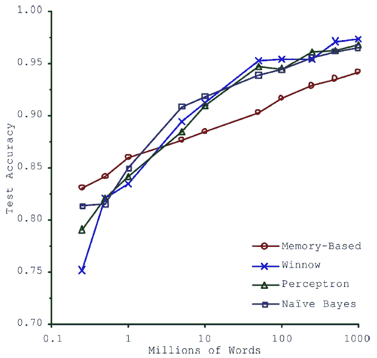
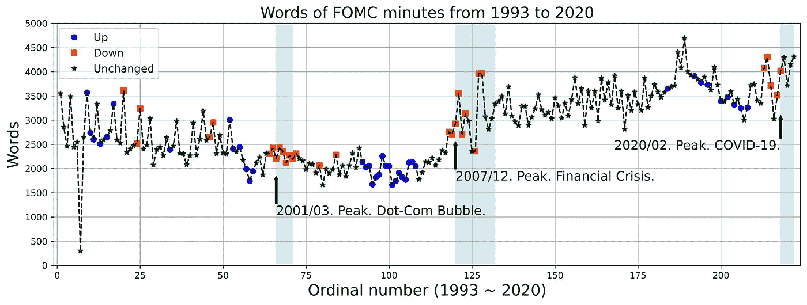
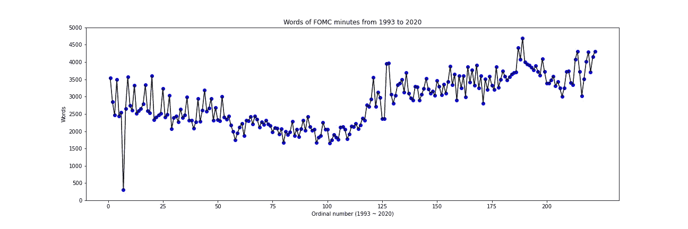
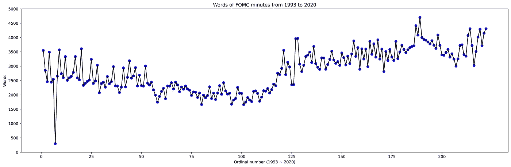
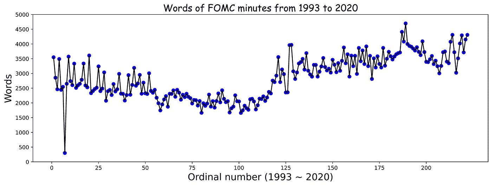
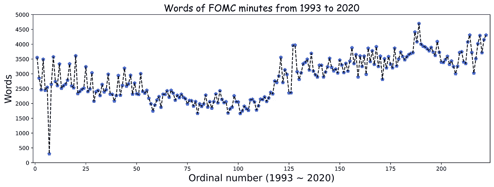
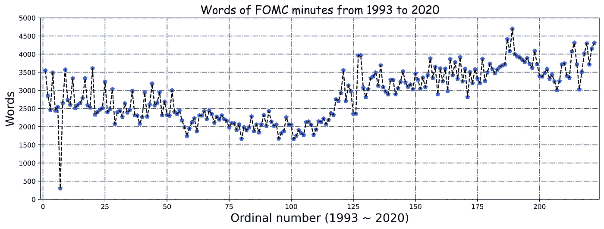
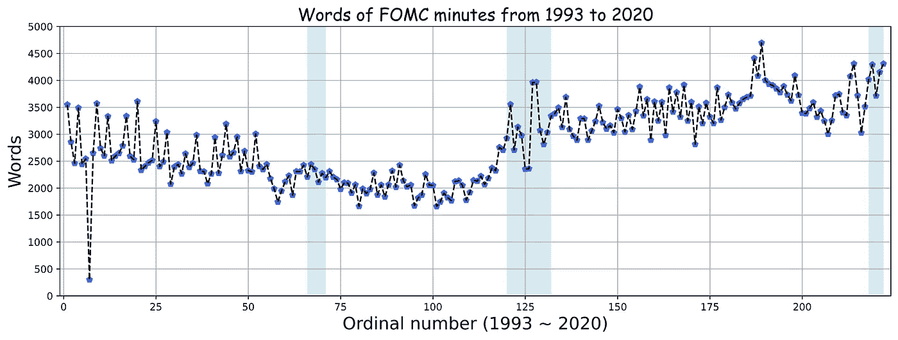
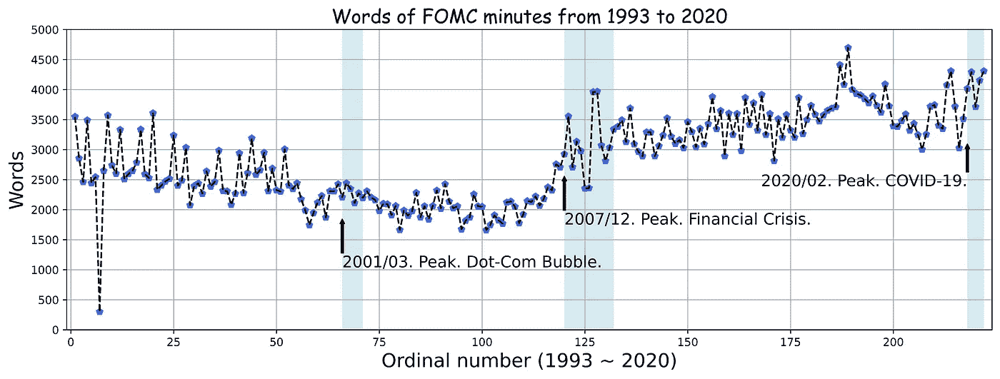
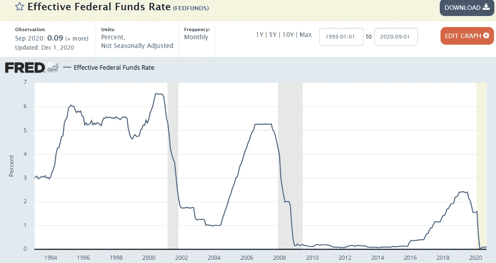

# ML11:使用 Python 实际操作折线图

> 原文：<https://medium.com/analytics-vidhya/ml11-16baa318c73b?source=collection_archive---------16----------------------->

## 用 matplotlib.pyplot 绘制满意的折线图

```
Read time: 15 minPics, data & Python code: [https://bit.ly/2UZftXq](https://bit.ly/2UZftXq)
```

当涉及到 ML/DS 项目时，可视化总是放在第一位。**可视化有助于获得给定数据集**的洞察力，通过 EDA(探索性数据分析),我们依靠可视化和其他方式为构建高性能模型做准备。

这个数据是 1993/01 ~ 2020/09 *经过数据选择和数据预处理*(由我)后的 FOMC 纪要字数，以及每次 FOMC 后的联邦基金利率变化。FOMC 会议纪要在每次 FOMC 会议后三周发布。数据来源于 [FOMC 纪要](https://www.fedsearch.org/fomc-docs/?advanced_search=true) & F [OMC 联邦基金目标利率或区间、变动(基点)和水平](https://www.federalreserve.gov/monetarypolicy/openmarket.htm)。

> ***大纲*** *(1)*[*可视化在 ML/DS 项目中的重要性*](#e365) *(2)*[*我们的目标:真实案例*](#55e8) *(3)*[*起点:原始线图*](#4ce1) *(4)* [*轴&*](#637a) *【7】*[*网格*](#c375) *【8】*[*更多信息:阴影*](#fa5a)[*更多信息:注释*](#145c)

# (1)可视化在 ML/DS 项目中的重要性

> *…非常不同的机器学习算法，包括相当简单的算法，* ***在一个复杂的自然语言歧义消除问题上表现几乎相同*******一旦给定足够的数据。****

*机器学习有几个主要的挑战如下:[1]*

1.  *训练数据数量不足*
2.  *非代表性训练数据*
3.  *质量差的数据*
4.  *无关的特征*
5.  *过度拟合训练数据*
6.  *欠拟合训练数据*

**

*图 1:给定足够数据的算法性能*

> **在 2001 年发表的一篇著名论文中，微软研究人员 Michele Banko 和 Eric Brill 表明，非常不同的机器学习算法，包括相当简单的算法，* ***在一个复杂的自然语言歧义消除问题上表现几乎相同*******，一旦他们获得足够的数据*** *(如图 1 所示)。***
> 
> ***正如作者所说:“这些结果表明，我们可能需要重新考虑*在算法开发上花费时间和金钱*与*在语料库开发上花费时间和金钱*之间的权衡。”***
> 
> ***Peter nor vig 等人在 2009 年发表的题为“数据的不合理有效性”的论文中进一步推广了数据比复杂问题的算法更重要的观点。10 然而，应该注意的是，中小型数据集仍然非常普遍，并且获得额外的训练数据并不总是容易或便宜的，所以不要放弃算法。***
> 
> **然而，应该注意的是，中小型数据集仍然非常普遍，并且获得额外的训练数据并不总是容易或便宜的，所以现在还不要放弃算法。[1]**

**既然我们已经看到了足够数量的数据对 ML/DS 项目的影响有多大，那么其他挑战，如“无代表性的训练数据”、“低质量的数据”、“不相关的特征”**可能会显著影响 ML/DS 项目的性能**也就不足为奇了。**

**因此，可视化是帮助解决这三个挑战的正确工具——“非代表性的训练数据”、“低质量的数据”、“不相关的特征。”**

# **(2)我们的目标:真实世界的案例**

**让我们直接看一个真实世界的案例——我们想要的折线图——然后我们会看到如何从头开始构建这个令人满意的折线图。“上调”、“下调”和“不变”代表每次 FOMC 会议后目标联邦基金利率的变化。**

****

**图 2:理想的折线图。在本文结尾还会再次出现。**

# **(3)起点:原始的折线图**

```
**#%% (2) Input & Setupimport os
os.chdir('D:\\G03_1\\Medium\\ML11') # Change it to desired directory
os.getcwd()import pickle # Python-specific data format
with open("ML11_FOMC.pickle", 'rb') as file: # 'rb': read & binary
    ML11_Morton_Kuo = pickle.load(file)import numpy as np
FOMC_words = np.array(ML11_Morton_Kuo[0])
up_index = np.array(ML11_Morton_Kuo[1])
down_index = np.array(ML11_Morton_Kuo[2])
unchanged_index = np.array(ML11_Morton_Kuo[3])import matplotlib.pyplot as plt #%% (3) Starting Point: A Primitive Line Chartplt.figure(figsize=(18, 6))
plt.plot(list(range(1,223)), FOMC_words, 'bo') 
**# Draw markers. 'b' is blue. 'o' is circle marker.**
plt.plot(list(range(1,223)), FOMC_words, 'k')
**# Draw a line. 'k' is black. No marker, the data will be a line without markers.**plt.xlabel('Ordinal number (1993 ~ 2020)')
plt.ylabel('Words')
plt.title('Words of FOMC minutes from 1993 to 2020')plt.xticks(range(0, 224, 25))  
plt.yticks(range(0, 5001, 500))plt.savefig('02_FOMC_Primitive.png') **# 54.8 kb. Pretty small.**
plt.close() **# Close the current figure****
```

**查看 matplotlib 的官方文档[了解 matplotlib.pyplot.plot](https://matplotlib.org/3.3.3/api/_as_gen/matplotlib.pyplot.plot.html#matplotlib.pyplot.plot) 的更多细节(设置标记、颜色)。此外，查看 matplotlib 的官方文档，了解命名颜色的完整[列表](https://matplotlib.org/3.1.0/gallery/color/named_colors.html)。注意 *Pickle* 是一种特定于 Python 的数据格式。**

****

**图 3:一个原始的折线图。**

# ****(4)高清&紧密布局****

```
**#%% (4) High Definition & Tight Layoutplt.figure(figsize=(18, 6))
plt.plot(list(range(1,223)), FOMC_words, 'bo') 
plt.plot(list(range(1,223)), FOMC_words, 'k')plt.xlabel('Ordinal number (1993 ~ 2020)')
plt.ylabel('Words')
plt.title('Words of FOMC minutes from 1993 to 2020')plt.xticks(range(0, 224, 25))  
plt.yticks(range(0, 5001, 500))plt.tight_layout() **# tight layout for plt.show()**
plt.savefig('03_FOMC_High_Definition_Tight_Layout.png', dpi= 800, bbox_inches= 'tight') 
**# 1.17 MB. High definition. By default, dpi= 100\. 
# bbox_inches= 'tight' makes to saved figure tight layout
plt.close()****
```

****

**图 4:高清晰度和紧凑的布局。**

# **(5)图形大小和字体大小**

```
**#%% (5) Figure Size & Font Size plt.figure(figsize=(15, 5)) **# Change figure size**
plt.plot(list(range(1,223)), FOMC_words, 'bo') 
plt.plot(list(range(1,223)), FOMC_words, 'k')plt.xlabel('Ordinal number (1993 ~ 2020)', fontsize = 'xx-large') **# Change font size**
plt.ylabel('Words', fontsize = 'xx-large') **# Change font size**
plt.title('Words of FOMC minutes from 1993 to 2020', fontname='Comic Sans MS', fontsize = 'xx-large') **# Change font size**
**'''
1\. family: A list of font names in decreasing order of priority. The items may include a generic font family name, 
either 'serif', 'sans-serif', 'cursive', 'fantasy', or 'monospace'. In that case, the actual font to be used will 
be looked up from the associated rcParam. Try fontname = 'Comic Sans MS' & fontname="Arial".****2\. fontsize: Either an relative value of 'xx-small', 'x-small', 'small', 'medium', 'large', 'x-large', 'xx-large' 
or an absolute font size, e.g., 12.
'''**plt.xticks(range(0, 224, 25))  
plt.yticks(range(0, 5001, 500))
plt.savefig('04_FOMC_Figure_Size_Font_Size.png', dpi= 800, bbox_inches= 'tight') 
plt.close()**
```

****

**图 5:图形大小和字体大小。**

**以下注释值得注意。**

**1.family:按优先级降序排列的字体名称列表。这些项目可能包括一个通用字体系列名称，可以是“衬线字体”、“无衬线字体”、“草书字体”、“幻想字体”或“等宽字体”。在这种情况下，将从关联的 rcParam 中查找要使用的实际字体。试试 font name = ' Comic Sans MS ' & font name = " Arial "。**

**2.fontsize:可以是“xx-small”、“x-small”、“small”、“medium”、“large”、“x-large”、“xx-large”的相对值，也可以是绝对字体大小，例如 12。**

# ****(6)轴&线和标记的类型****

```
**#%% (6) Axis & Type of Line and Markerplt.figure(figsize=(15, 5)) 
plt.plot(list(range(1,223)), FOMC_words, 'p', color= 'royalblue') 
**# Color changed**
plt.plot(list(range(1,223)), FOMC_words, '--k') **# Color changed**plt.xlabel('Ordinal number (1993 ~ 2020)', fontsize = 'xx-large') 
plt.ylabel('Words', fontsize = 'xx-large')
plt.title('Words of FOMC minutes from 1993 to 2020', fontname='Comic Sans MS', fontsize = 'xx-large')plt.axis([-1, 224, 0, 4800]) **# Adjust the scope**
plt.xticks(range(0, 224, 25))  
plt.yticks(range(0, 5001, 500))plt.savefig('05_FOMC_Axis_Line_Type.png', dpi= 800, bbox_inches= 'tight') 
plt.close()**
```

****

**图 6:轴&线条和标记的类型。**

# **(7)网格**

```
**#%% (7) Grid## Grid_1
plt.figure(figsize=(15, 5)) 
plt.plot(list(range(1,223)), FOMC_words, 'p', color= 'royalblue') 
plt.plot(list(range(1,223)), FOMC_words, '--k')plt.xlabel('Ordinal number (1993 ~ 2020)', fontsize = 'xx-large')
plt.ylabel('Words', fontsize = 'xx-large')
plt.title('Words of FOMC minutes from 1993 to 2020', fontname='Comic Sans MS', fontsize = 'xx-large')plt.axis([-1, 224, 0, 4800]) 
plt.xticks(range(0, 224, 25))  
plt.yticks(range(0, 5001, 500))
plt.grid() **# Simply add grid by default**plt.savefig('06_FOMC_Grid_1.png', dpi= 800, bbox_inches= 'tight') 
plt.close()**
```

****

**图 7:网格 _1。**

**然后，让我们看看我们能做些什么来创造非凡的网格。只需调整行 *plt.grid( )* 。**

```
**plt.grid(color='slategray', linestyle='-.', linewidth= 1.2, b=None, which='major', axis='both')
**# Try to adjust color, linestyl, and linewidth. By default, linestyle= '-', linewidth= 1\. 
# The default of color is not indicated by the official document; however, it is close to 'silver'.****
```

****

**图 8:网格 _2。**

**查看 matplotlib 的官方文档 [matplotlib.pyplot.grid](https://matplotlib.org/3.3.3/api/_as_gen/matplotlib.pyplot.grid.html#matplotlib.pyplot.grid) 。**

# **(8)更多信息:阴影**

```
**#%% (8) More Info: Shadowplt.figure(figsize=(15, 5)) 
plt.plot(list(range(1,223)), FOMC_words, 'p', color= 'royalblue') 
plt.plot(list(range(1,223)), FOMC_words, '--k')plt.xlabel('Ordinal number (1993 ~ 2020)', fontsize = 'xx-large')
plt.ylabel('Words', fontsize = 'xx-large')
plt.title('Words of FOMC minutes from 1993 to 2020', fontname='Comic Sans MS', fontsize = 'xx-large')plt.axis([-1, 224, 0, 4800]) 
plt.xticks(range(0, 224, 25))  
plt.yticks(range(0, 5001, 500))
plt.grid()**# Shadow**
plt.axvspan(66, 71, color='lightblue', alpha=0.5, lw=0)
plt.axvspan(120, 132, color='lightblue', alpha=0.5, lw=0)
plt.axvspan(218, 222, color='lightblue', alpha=0.5, lw=0)plt.savefig('08_FOMC_Shadow.png', dpi= 1000, bbox_inches= 'tight') **# dpi: 800 -> 1000**
plt.close()**
```

****

**图 9:更多信息:阴影。**

**浅蓝色的跨度是衰退。查看美国[国家经济研究局](https://www.nber.org/research/data/us-business-cycle-expansions-and-contractions)&[matplotlib . py plot . axvspan](https://matplotlib.org/3.3.3/api/_as_gen/matplotlib.pyplot.axvspan.html#matplotlib.pyplot.axvspan)。**

# **(9)更多信息:注释**

```
**#%% (9) More Info: Annotationplt.figure(figsize=(15, 5)) 
plt.plot(list(range(1,223)), FOMC_words, 'p', color= 'royalblue') 
plt.plot(list(range(1,223)), FOMC_words, '--k')plt.xlabel('Ordinal number (1993 ~ 2020)', fontsize = 'xx-large')
plt.ylabel('Words', fontsize = 'xx-large')
plt.title('Words of FOMC minutes from 1993 to 2020', fontname='Comic Sans MS', fontsize = 'xx-large')plt.axis([-1, 224, 0, 4800]) 
plt.xticks(range(0, 224, 25))  
plt.yticks(range(0, 5001, 500))
plt.grid()plt.axvspan(66, 71, color='lightblue', alpha=0.5, lw=0)
plt.axvspan(120, 132, color='lightblue', alpha=0.5, lw=0)
plt.axvspan(218, 222, color='lightblue', alpha=0.5, lw=0)**# Annotation** 
crisis_data = [
    (66, '2001/03\. Peak. Dot-Com Bubble.'),
    (120, '2007/12\. Peak. Financial Crisis.'),
    (218, '2020/02\. Peak. COVID-19.')]x, label = crisis_data[0]
plt.annotate(label, xy=(x, FOMC_words[x] - 600),
             xytext= (x, FOMC_words[x] - 1200),
             arrowprops= dict(facecolor='black', headwidth= 4, width=2, headlength= 4),
             horizontalalignment='left', verticalalignment= 'top', fontsize = 'x-large')x, label = crisis_data[1]
plt.annotate(label, xy=(x, FOMC_words[x] - 1000),
             xytext= (x, FOMC_words[x] - 1600),
             arrowprops= dict(facecolor='black', headwidth= 4, width=2, headlength= 4),
             horizontalalignment='left', verticalalignment= 'top', fontsize = 'x-large')x, label = crisis_data[2]
plt.annotate(label, xy=(x, FOMC_words[x] - 1200),
             xytext= (x, FOMC_words[x] - 1700),
             arrowprops= dict(facecolor='black', headwidth= 4, width=2, headlength= 4),
             horizontalalignment='right', verticalalignment= 'top', fontsize = 'x-large') plt.savefig('09_FOMC_Annotation.png', dpi= 1000, bbox_inches= 'tight') 
plt.close()**
```

****

**图 10:更多信息——注释。**

**查看[matplotlib . py plot . annotate](https://matplotlib.org/3.3.3/api/_as_gen/matplotlib.pyplot.annotate.html#matplotlib.pyplot.annotate)或 *Python 进行数据分析:与 Pandas、NumPy、IPython 的数据角力(第 2 版。)*。**

# **(10)更多信息:向上、向下或不变**

```
**#%% (10) More Info: Up, Down or Unchangedplt.figure(figsize=(15, 5))plt.plot(up_index+1 ,  FOMC_words[up_index], 'o', color= 'blue', label="Up")  # up_index 
plt.plot(down_index+1,  FOMC_words[down_index], 's', color= 'orangered', label="Down")  # down_index 
plt.plot(unchanged_index+1,  FOMC_words[unchanged_index], '*', color= 'darkgreen', label="Unchanged")  # unchanged_index 
**# Draw 3 kinds of markers and change their colors.
# 'o' is circle marker;'s' is square marker; '*' star marker. 
# Add labels and plt.legend() will catch them later**plt.plot(list(range(1,223)), FOMC_words, '--k')plt.xlabel('Ordinal number (1993 ~ 2020)', fontsize = 'xx-large')
plt.ylabel('Words', fontsize = 'xx-large')
plt.title('Words of FOMC minutes from 1993 to 2020', fontsize = 'xx-large')plt.axis([-1, 224, 0, 4800]) 
plt.xticks(range(0, 224, 25))  
plt.yticks(range(0, 5001, 500))
plt.grid()plt.axvspan(66, 71, color='lightblue', alpha=0.5, lw=0)
plt.axvspan(120, 132, color='lightblue', alpha=0.5, lw=0)
plt.axvspan(218, 222, color='lightblue', alpha=0.5, lw=0)crisis_data = [
    (66, '2001/03\. Peak. Dot-Com Bubble.'),
    (120, '2007/12\. Peak. Financial Crisis.'),
    (218, '2020/02\. Peak. COVID-19.')]x, label = crisis_data[0]
plt.annotate(label, xy=(x, FOMC_words[x] - 600),
             xytext= (x, FOMC_words[x] - 1200),
             arrowprops= dict(facecolor='black', headwidth= 4, width=2, headlength= 4),
             horizontalalignment='left', verticalalignment= 'top', fontsize = 'x-large')x, label = crisis_data[1]
plt.annotate(label, xy=(x, FOMC_words[x] - 1000),
             xytext= (x, FOMC_words[x] - 1600),
             arrowprops= dict(facecolor='black', headwidth= 4, width=2, headlength= 4),
             horizontalalignment='left', verticalalignment= 'top', fontsize = 'x-large')x, label = crisis_data[2]
plt.annotate(label, xy=(x, FOMC_words[x] - 1200),
             xytext= (x, FOMC_words[x] - 1700),
             arrowprops= dict(facecolor='black', headwidth= 4, width=2, headlength= 4),
             horizontalalignment='right', verticalalignment= 'top', fontsize = 'x-large') plt.legend(fontsize = 'large') **# Indicate the labed markers**
**'''
1\. fontsize: Either an relative value of 'xx-small', 'x-small', 'small', 'medium', 'large', 'x-large', 'xx-large' 
or an absolute font size, e.g., 12.
'''**plt.savefig('10_FOMC_Up_Down_Unchanged.png', dpi= 1000, bbox_inches= 'tight') 
plt.close()**
```

****

**图 11:更多信息:向上、向下或不变。**

**“上调”、“下调”和“不变”代表每次 FOMC 会议后目标联邦基金利率的变化。**

**最后，在这里我们再次看到这个令人满意的折线图！我们可以和下图对比一下。**

****

**图 12:有效联邦基金利率。[12]**

# **(11)参考文献**

**[1] Géron，A. (2019)。使用 Scikit-Learn、Keras 和 TensorFlow 进行机器学习(第二版。).加利福尼亚州:奥赖利媒体。**

**[2]麦金尼，W. (2017)。用于数据分析的 Python:与 Pandas、NumPy 和 IPython 的数据争论(第 2 版。).加利福尼亚州:奥赖利媒体。**

**[3]Matplotlib . py plot . plot—Matplotlib 3 . 3 . 3 文档。检索自**

**[](https://matplotlib.org/3.3.3/api/_as_gen/matplotlib.pyplot.plot.html#matplotlib.pyplot.plot) [## Matplotlib . py plot . plot-Matplotlib 3 . 3 . 3 文档

### 用线条和/或标记绘制 y 与 x 的关系。调用签名:点或线节点的坐标由 x…

matplotlib.org](https://matplotlib.org/3.3.3/api/_as_gen/matplotlib.pyplot.plot.html#matplotlib.pyplot.plot) 

[4] matplotlib.font_manager。检索自
[https://matplotlib.org/3.1.1/api/font_manager_api.html](https://matplotlib.org/3.1.1/api/font_manager_api.html)

[5] Soma，J. (2016)。在 matplotlib 中更改字体。检索自

 [## 在 matplotlib 中更改字体

### 默认字体是 BitstreamVeraSans Roman，但是我们想尝试其他字体。您可以将字体名称传递给…

jonathansoma.com](http://jonathansoma.com/lede/data-studio/matplotlib/changing-fonts-in-matplotlib/) 

[6]命名颜色列表— Matplotlib 3.1.0 文档。检索自

[](https://matplotlib.org/3.1.0/gallery/color/named_colors.html) [## 命名颜色列表- Matplotlib 3.1.0 文档

### 编辑描述

matplotlib.org](https://matplotlib.org/3.1.0/gallery/color/named_colors.html) 

[7]Matplotlib . py plot . grid—Matplotlib 3 . 3 . 3 文档。检索自

[](https://matplotlib.org/3.3.3/api/_as_gen/matplotlib.pyplot.grid.html#matplotlib.pyplot.grid) [## Matplotlib . py plot . grid-Matplotlib 3 . 3 . 3 文档

### 轴是作为一个单元画的，所以画网格的有效坐标是由每个轴的坐标决定的，而不是…

matplotlib.org](https://matplotlib.org/3.3.3/api/_as_gen/matplotlib.pyplot.grid.html#matplotlib.pyplot.grid) 

[8]Matplotlib . py plot . axvspan—Matplotlib 3 . 3 . 3 文档。检索自

 [## Matplotlib . py plot . axvspan-Matplotlib 3 . 3 . 3 文档

### 该矩形水平跨越 xmin 到 xmax，默认情况下，垂直跨越整个 y 轴。y 轴跨度可以设置…

matplotlib.org](https://matplotlib.org/3.3.3/api/_as_gen/matplotlib.pyplot.axvspan.html#matplotlib.pyplot.axvspan) 

[9]Matplotlib . py plot . annotate—Matplotlib 3 . 3 . 3 文档。检索自

[](https://matplotlib.org/3.3.3/api/_as_gen/matplotlib.pyplot.annotate.html#matplotlib.pyplot.annotate) [## Matplotlib . py plot . annotate-Matplotlib 3 . 3 . 3 文档

### 可选地，文本可以显示在另一个位置 xytext。从文本指向注释的箭头…

matplotlib.org](https://matplotlib.org/3.3.3/api/_as_gen/matplotlib.pyplot.annotate.html#matplotlib.pyplot.annotate) 

[10] FOMC 会议记录。检索自

[](https://www.fedsearch.org/fomc-docs/?advanced_search=true) [## 美联储:FOMC 搜索

### 华盛顿 DC 联邦储备理事会。

www.fedsearch.org](https://www.fedsearch.org/fomc-docs/?advanced_search=true) 

[11] FOMC 的目标联邦基金利率或区间，变化(基点)和水平。检索自

[](https://www.federalreserve.gov/monetarypolicy/openmarket.htm) [## 美联储委员会-公开市场操作

### 华盛顿 DC 联邦储备理事会。

www.federalreserve.gov](https://www.federalreserve.gov/monetarypolicy/openmarket.htm) 

[12]有效联邦基金利率。检索自

[](https://fred.stlouisfed.org/series/FEDFUNDS) [## 有效联邦基金利率

### 单位:频率:每日数字的平均值。更多历史联邦基金利率数据，请查看每日…

fred.stlouisfed.org](https://fred.stlouisfed.org/series/FEDFUNDS) 

[13]美国商业周期的扩张和收缩。检索自

 [## 美国商业周期扩张和收缩

### 除了工作论文，NBER 还通过一系列免费期刊传播附属机构的最新发现…

www.nber.org](https://www.nber.org/research/data/us-business-cycle-expansions-and-contractions)**