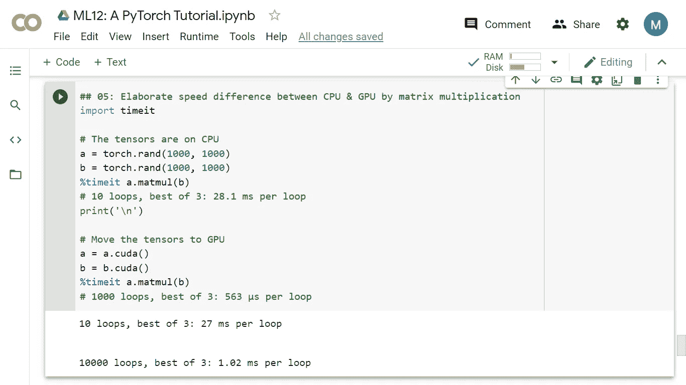

# ML12:详细的 PyTorch 教程

> 原文：<https://medium.com/analytics-vidhya/ml12-59d2a56737ac?source=collection_archive---------21----------------------->

## 关于张量运算的一切

```
Read time: 30 minComplete code on Colab: [https://bit.ly/3oWWYws](https://bit.ly/3oWWYws)
```

本文旨在面对 NN/DL 问题时，快速获取所需的代码。为了简化起见，我们只讨论代码的主要部分。

> ***概述***
> 
> ***(1)*** [***设置***](#2b94)
> 
> ***(2)***[***PyTorch 基础知识 01***](#f9d2) *# # 01:一个辅助函数— describe()
> ## 02: zeros()、one()、arange()
> ## 03: rand()、randn()、randint()
> ## 04:从 Python 列表到 py torch 张量
> ## 05:张量类型— float、long
> float()，。long()，。int()
> ## 07:张量类型--。类型()&。dtype
> ## 08: PyTorch 和 NumPy —from _ NumPy()
> # # 09:py torch 和 NumPy—。numpy()
> ## 10:张量大小--。size() &。形状
> ## 11:分度&切片— 1
> ## 12:分度&切片— 2
> ## 13:分度&切片— 3*
> 
> ***(3)***[***py torch 基础知识 02*** *# # 01:加法— add()，。add_()，。fill()，。zero_()
> ## 02:乘法— 1
> ## 03:乘法— 2
> ## 04:乘法— 3
> ## 05:更多数学函数— mean()、sum()、sqrt()、sqrt_()、abs()、acos()
> ## 06:更多数学函数— eq()、equal()、ge()、gt()
> ## 07:基于维度的张量运算:。view()，shape()，。t()，transpose()
> ## 08:基于维度的张量运算:squeeze() &。unsqueeze()
> ## 09:基于维度的张量运算:cat()
> # # 10:基于维度的张量运算:split()【chunk()
> # # 11:索引到存储器— 1
> ## 12:索引到存储器— 2
> ## 13:连续张量— 1
> ## 14:连续张量— 2
> ## 15:连续张量— 3
> ##normal()、非零()、expand()、expand_as()
> ## 17:其他函数:argmax()、max()、min()、sort()
> ## 18:其他函数:eye()、zeros_like()、ones_like()*](#2c25)
> 
> ***(4)***[***py torch 基础知识 03***](#a361) *# # 01:GPU 上的张量——。cuda() &。CPU()
> # # 02:GPU 上的张量—to(device = ' cuda ')
> # # 03:GPU 上的张量—一个错误
> # # 04:GPU 上的张量—to(torch . device(" CPU "))
> # # 05:CPU&GPU 之间通过矩阵乘法精心制作的速度差
> ## 06:计算图— 1
> ## 07:计算图— 2
> ## 08:计算图— 3*
> 
> ***(5)*** [***汇总***](#7f1c)
> 
> ***(6)***[***参考文献***](#3933)

我们已经在 ML03 和 ML06 中介绍了 PyTorch 和 Colab 的一些先决条件，现在是时候深入实施 PyTorch 了。

[](https://merscliche.medium.com/ml06-893e4cb389c6) [## ML06:谷歌 Colab 上的 PyTorch

### 免费访问英伟达特斯拉 T4

merscliche.medium.com](https://merscliche.medium.com/ml06-893e4cb389c6) [](https://becominghuman.ai/ml03-9de2f0dbd62d) [## ML03: PyTorch vs. Tensorflow

### py troch——一个有前途的人工神经网络框架

becominghuman.ai](https://becominghuman.ai/ml03-9de2f0dbd62d) 

读者可以浏览完整代码的整个大纲，但我们不会在本文中涵盖所有内容。在这里查看完整的代码:
【https://bit.ly/3oWWYws 

# ***(1)设置***

```
#### (1) Setup

import torch# "Runtime" -> "Change runtime type" -> "Hardware accelerator" -> Choose "GPU"print(torch.cuda.is_available()); print('\n')
!nvidia-smi
```

CUDA 是一种特殊的 API，允许在 GPU 上进行计算。CUDA 是英伟达建立的，只能在英伟达的 GPU 上使用。[3]

# ***(2) PyTorch 基础知识 01***

## *## 01:一个助手函数— describe()*

```
## 01: A helper function -- describe()def describe(x):
print("Type: {}".format(x.type()))
print("Dtype: {}".format(x.dtype))
print("Shape/size: {}".format(x.shape))
print("Values: \n{}".format(x))
```

从现在开始，我们创建的这个函数将对我们有很大帮助。

## ## 02:零()、一()、一个整数()

```
## 02: zeros(), ones(), arange()describe(torch.zeros(2,3)); print('\n')
describe(torch.ones(2,3)); print('\n')
describe(torch.ones(2,2,3)); print('-----')x = torch.arange(6)
describe(x)
```

## # 04:从 Python 列表到 PyTorch 张量

```
## 04: From Python lists to PyTorch tensorsimport numpy as npx = torch.tensor([[1,2,3],
                 [4,5,6]])
describe(x); print('-----')
# Type: torch.LongTensor (torch.int64)x = torch.Tensor([[1,2,3],
                 [4,5,6]])
describe(x); print('-----')
# Type: torch.FloatTensor (torch.float32)x = torch.Tensor(np.array([[1,2,3],
                 [4,5,6]]))
describe(x)
# Type: torch.FloatTensor (torch.float32)
```

稍后我们将看到将 NumPy 数组转换为 PyTorch 张量。

## ## 05:张量类型—浮点型，长整型

```
## 05: Tensor types -- float, long'''
1\. The default type of torch.Tensor() is torch.FloatTensor()
2\. The default type of torch.tensor() is torch.LongTensor()
3\. Type: float, long, double and so on
4\. Two ways to define types: like FloatTensor() and LongTensor() OR like dtype= torch.int64
'''
x = torch.ones(2,3)
describe(x); print('\n')
# Type: torch.FloatTensorx = torch.Tensor([[1,2,3],
                  [4,5,6]])
describe(x); print('\n')
# Type: torch.FloatTensorx = torch.FloatTensor([[1,2,3],
                       [4,5,6]])
describe(x); print('-----')
# Type: torch.FloatTensor# ---------------------------x = torch.arange(6)
describe(x); print('\n')
# Type: torch.FloatTensorx = torch.tensor([[1,2,3],
                  [4,5,6]])
describe(x); print('\n')
# Type: torch.LongTensorx = torch.LongTensor([[1,2,3],
                      [4,5,6]])
describe(x)
# Type: torch.LongTensor
```

弄清楚数据的类型很重要。

## ## 06:张量类型-。float()，。long()，。int()

```
## 06: Tensor types -- .float(), .long(), .int()x = torch.LongTensor([[1,2,3],
                      [4,5,6]])x = x.long()
describe(x)
print(x.dtype); print('-----')x = torch.tensor([[1,2,3],
                  [4,5,6]], dtype= torch.int64)
describe(x)
print(x.dtype); print('-----')x = x.float()
describe(x)
print(x.dtype); print('-----')p = torch.randn(3,3).to(torch.int)
q = torch.randint(0,5,(3,3)).to(torch.float)
print(p); print(q); print(q.dtype)
```

不同数据类型之间的转换。

## ## 08: PyTorch 和 NumPy — from_numpy()

```
## 08: PyTorch and NumPy -- from_numpy()
'''
1\. Tensor in PyTorch is pretty similar to matrix in Numpy!
2\. from_numpy()
'''
import numpy as np
def describe_numpy(x):
  print("Dtype: {}".format(x.dtype))
  print("Shape/size: {}".format(x.shape))
  print("Values: \n{}".format(x))x = torch.Tensor(np.array([[1,2,3],
                 [4,5,6]]))
describe(x); print('-----')
# Type: torch.FloatTensor (torch.float32)a = np.ones(5)
b = torch.from_numpy(a)
np.add(a, 1, out= a)
print(a)
print(b); print('\n')npy = np.random.rand(2,3)
describe(torch.from_numpy(npy)); print('\n')x = torch.tensor([1.0, 2.0, 3.0, 4.0]) 
y = torch.tensor(np.array([1.0, 2.0, 3.0, 4.0])) 
print(x.dtype); print(y.dtype)
```

PyTorch 中的 Tensor 的作用就像 NumPy 中的 array 一样，我们可以很容易地在这两种矢量化数据类型之间进行切换。

## # 09: PyTorch 和 NumPy。numpy()

```
## 09: PyTorch and NumPy -- .numpy()
'''
1\. .numpy() & from_numpy()
'''
x_tensor = torch.randn(2,3)
y_numpy = np.random.randn(2,3)x_numpy = x_tensor.numpy()
y_tensor = torch.from_numpy(y_numpy)describe(x_tensor); print('\n')
describe_numpy(x_numpy); print('-----')describe_numpy(y_numpy); print('\n')
describe(y_tensor)
```

## # 10:张量大小-。size() &。形状

```
## 10: Tensor size -- .size() & .shape
'''
1\. .shape & .size() are pretty much the same. 
2\. However, .shape must be used on immutable data type, like "tuple."
'''
x = torch.tensor([[1,2,3],
                  [4,5,6]], dtype= torch.int64)print(x.size()); print(x.shape)
print(x.size() == x.shape); print("-----")print(x.shape[0], x.shape[1])
```

每当我们得到一个张量时，看看张量的形状，不管它是一维的，二维的，三维的，四维的，甚至更高维的。

## ## 11:索引和切片— 1

```
## 11: Indexing and slicing -- 1
x1 = torch.ones(2,4,3)
print(x1[0]); print('\n')
x2 = torch.ones(4,3)y = torch.randn(4,3)
print(y); print('\n')
print(y[:,2])
```

## ## 12:索引和切片— 2

```
## 12: Indexing & slicing -- 2
a = torch.arange(6)
describe(a); print('-----')x = torch.arange(6).view(2,3)describe(x); print('\n')describe(x[:1,:2]); print('\n')describe(x[0,1])
```

# (3) PyTorch 基础知识 02

## ## 01:加法— add()，。add_()，。fill()，。零 _()

```
## 01: Addition -- add(), .add_(), .fill(), .zero_()
'''
1\. torch.add(input, value, out= None)
'''
x = torch.ones(2,3)
y = torch.randn(2,3)z1 = x + y
print(z1); print('-----')
z2 = torch.add(x, x)
z3 = torch.add(x, 2)
torch.add(x, 2, out= x)describe(z1); print('\n')
describe(z2); print('\n')
describe(z3); print('\n')
describe(x); print('-----')a = torch.Tensor([[1,2], [3,4]])
# For out-place addition
b = torch.add(a,5)
print(b); print('\n')
# For in-place addition
print(a.add_(5)); print('-----')# In-place filling
a.fill_(5)
describe(a); print('-----')a = torch.ones(3,2)
a.zero_()
print(a)
```

注意 ***出位*** 方法和 ***入位*** 方法差别很大。

## ## 02:乘法— 1

```
## 02: Multiplication -- 1
'''
1\. element-wise multiplication VS. matrix multiplication
2\. Element-wise multiplication methods: * , .mul(), .mul_(). They are all the same.
3\. Matrix multiplication methods: @, .matmul(), mm(), .mm(). They are all the same.
4\. Transpose function .t()
'''
a = torch.Tensor([[1,2], [3,4]])
b = torch.Tensor([[7,8], [5,6]])c1 = a * b
print(c1)# mul(b) for out-place multiplication
c2 = a.mul(b)
print(c2)# mul_(b) for in-place multiplication
a.mul_(b)
print(a); print('-----')a = torch.Tensor([[1,2], [3,4]])
b = torch.Tensor([[7,8], [5,6]])c3 = a @ b.t()
print(c3)
c4 = a.matmul(b.t())
print(c4)
c5 = torch.mm(a, b.t()); print('\n')
print(c5)
c6 = a.mm(b.t())
print(c6); print('-----')x = torch.Tensor([[1,2], [3,4], [5,6]]) # 3 x 2
y = torch.Tensor([[1,1], [4,3], [6,5]]) # 3 x 2
z = torch.Tensor([[3,1], [2,1]]) # 2 x 1
print(x * y)
print(x * y @ z)
```

*逐元素乘法* VS. *矩阵乘法*

## ## 03:乘法— 2

```
## 03: Multiplication -- 2
x1 = torch.arange(6).view(2,3)
describe(x1); print('\n')x2 = torch.ones(3,2)
x2[:, 1] += 1
describe(x2); print('-----')x1 = x1.float()
y = torch.mm(x1, x2)
describe(y); print('\n')x3 = torch.ones(2,3)
x3[1, :] += 1
y = torch.mm(x1, x3.t())
describe(y)
```

## ## 07:基于维度的张量运算:。view()，shape()，。t()，转置()，。转置()

```
## 07: Dimension based tensor operations: .view(), reshape(), .t(), transpose(), .transpose()
'''
1\. Changing the shape
'''
x = torch.arange(6)
describe(x); print('-----')y = x.view(2,3)
describe(y); print('\n')
z = x.reshape(2,3)
describe(z); print('-----')describe(y.t()); print('\n')
describe(torch.transpose(y,0,1)); print('-----')a = torch.ones(3, 2)
a_t = torch.transpose(a, 0, 1)
print(a.shape,a_t.shape)a = torch.ones(3, 2)
a_t = a.transpose(0, 1)
print(a.shape,a_t.shape)
```

## ## 08:基于维度的张量运算:squeeze() &。unsqueeze()

```
## 08: Dimension based tensor operations: squeeze() & .unsqueeze()
'''
1\. torch.squeeze(input, dim= None, out= None) 
2\. torch.squeeze() removes 1-D tensors.
3\. torch.unsqueeze() adds virtual 1-D tensors.
'''
x = torch.zeros(2,1,2,1,2)
print(x.size())y = torch.squeeze(x)
print(y.size()); print('\n')y = torch.squeeze(x,0)
print(y.size())
y = torch.squeeze(x,1)
print(y.size())
y = torch.squeeze(x,2)
print(y.size())
z1 = torch.squeeze(x,3)
print(z1.size()); print('\n')z2 = z1.unsqueeze(0)
print(z2.size())
z1.unsqueeze_(0)
print(z1.size())
```

## ## 09:基于维度的张量运算:cat()，stack()

```
## 09: Dimension based tensor operations: cat(), stack()
'''
1\. Joining
'''
x = torch.arange(6).view(2,3)
describe(x); print('-----')describe(torch.cat([x,x], dim= 0)); print('-----')describe(torch.cat([x,x], dim= 1)); print('-----')describe(torch.stack([x,x]))
```

## ## 10:基于维度的张量运算:split()，chunk()

```
## 10: Dimension based tensor operations: split(), chunk()
'''
1\. Splitting
'''
y = torch.rand(3,2)
print(y); print('-----')
splitted_1 = y.split(split_size= 1, dim= 0)
splitted_2 = y.chunk(chunks= 3, dim= 0)
print(splitted_1)
print(splitted_2)
```

## ## 11:存储索引— 1

```
## 11: Indexing into storage -- 1
'''
1\. .storage() & id(x.storage())
'''
points = torch.tensor([[4.0, 1.0], [5.0, 3.0], [2.0, 1.0]])
points_storage = points.storage()print(points_storage)
print(points_storage[0])
print(points.storage()[0]); print('-----')points_storage[0] = 2.0
print(points); print('-----')points = torch.tensor([[4.0, 1.0], [5.0, 3.0], [2.0, 1.0]])
print(points)
points_t = points.t()
print(points_t)print(id(points.storage()) == id(points_t.storage())) # storage ID
print(points.data_ptr() == points_t.data_ptr()) # data pointer
```

我们看*。t()* 只是在给定的内存空间上检索数据的不同方式，而不是创建新的内存空间。

# (4) PyTorch 基础 03

## # # 01:GPU 上的张量--。cuda() &。cpu()

```
## 01: Tensor on GPU -- .cuda() & .cpu()

print(torch.cuda.is_available()); print('\n')describe(torch.randn(2,3, device= "cuda:0")); print('\n')x = torch.ones(4,3); y = torch.randn(4,3)
x = x.cuda(); y = y.cuda()
print(x+y); print('\n')x = x.cpu()
print(x); print('-----')print(torch.cuda.is_available()); print('\n')# preferred method: device agnostic tensor instantiation
device = torch.device("cuda" if torch.cuda.is_available() else "cpu")
print(device); print('\n')x = torch.rand(3,3).to(device)
describe(x)
```

请记住，从 GPU 来回移动数据是很昂贵的。因此，典型的过程包括在 GPU 上进行许多可并行计算，然后 ***将最终结果传回***CPU。这将允许您充分利用 GPU。[3]

## ## 05:通过矩阵乘法精心设计 CPU 和 GPU 之间的速度差异

```
## 05: Elaborate speed difference between CPU & GPU by matrix multiplicationimport timeit# The tensors are on CPU
a = torch.rand(1000, 1000)
b = torch.rand(1000, 1000)
%timeit a.matmul(b)
# 10 loops, best of 3: 28.1 ms per loop
print('\n')# Move the tensors to GPU
a = a.cuda()
b = b.cuda()
%timeit a.matmul(b)
# 1000 loops, best of 3: 563 µs per loop
```



图 GPU 惊人的计算能力。

563 秒/ 28.1 毫秒= 2.0%

GPU 对 NN/DL 的贡献有多显著！

## ## 08:计算图表— 3

```
## 08: Computational graph -- 3
from torch.autograd import Variable
x = Variable(torch.ones(2,2), requires_grad= True)
print(x); print('\n')y = x + 2
print(y)
print(y.data)
print(y.grad_fn); print('\n')z = y * y
print(z.data)
print(z.grad_fn); print('\n')t = torch.mean(z)
print(t); print('\n')t.backward()
print(z.grad)
print(y.grad)
print(x.grad)
```

分解计算图有助于深入了解 PyTorch 的工作原理。PyTorch 使用*动态计算图*，而 TensorFlow 使用*静态计算图*。

# (5)总结

现在，我们已经讨论了开始用张量表示一切所需的大部分内容。

有了 PyTorch 的基本用例，下一步是探索构建 NN/DL 模型的模块，如 *torch.nn* ，然后在真实世界的数据上实现这些代码。

# (6)参考文献

[1]史蒂文斯，e .，安提卡，l .和托马斯，V. (2020 年)。用 PyTorch 进行深度学习。纽约州纽约市:曼宁出版公司。

[2]托马斯和帕西(2019 年)。PyTorch 深度学习动手。英国伯明翰:Packt 出版公司。

[3] Rao，d .和 McMahan，B. (2019 年)。用 PyTroch 进行自然语言处理。加利福尼亚州:奥赖利媒体。

[4] Subramanian，V. (2018)。用 PyTorch 进行深度学习。英国伯明翰:Packt 出版公司。

## (中文)

[5] 張校捷 (2020)。深入淺出 PyTorch：從模型到源碼。北京，中國：電子工業。

[6] 集智俱樂部 (2019)。深度學習原理與 PyTorch 實戰。北京，中國：人民郵電。

[7] 邢夢來等人 (2018)。深度学习框架 PyTorch 快速开发与实战。北京，中國：電子工業。