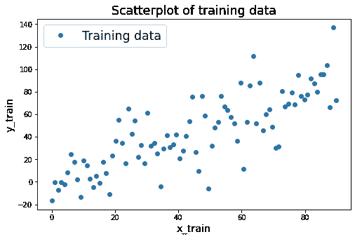
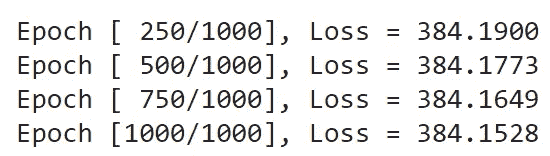
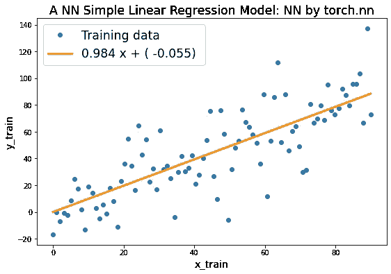
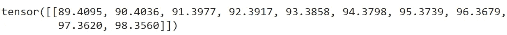
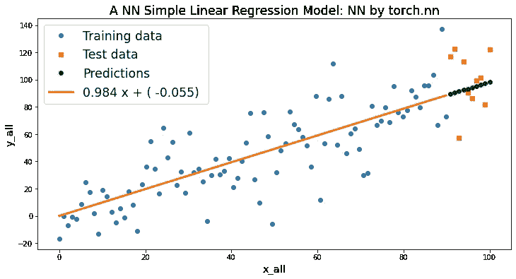
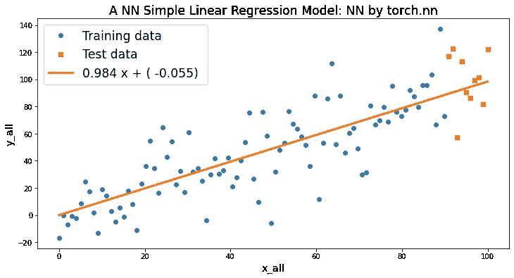

# ML13: PyTorch —简单线性回归

> 原文：<https://medium.com/analytics-vidhya/ml13-e52e251d41c5?source=collection_archive---------18----------------------->

## 使用 torch.nn 构建一个简单的用例

```
Read time: 25 minComplete code on Colab: [https://bit.ly/2J7d9YG](https://bit.ly/2J7d9YG)
```

我们从零开始建立两个非常相似的 NN 简单线性回归模型—**NN by torch . NN**&**NN**；尽管如此，我们将主要关注 torch 的**NN . NN**模型，因为它更适用于现实世界的场景，并将 **NN 从零开始**模型放在附录中。

> ***大纲*** *【1】*[*准备数据*](#07c6) *【2】*[*数据拆分*](#b13d) *【3】*[*训练数据散点图*](#3bb0)[*训练模型— NN*](#3d41) [*试验数据拟合线—1*](#57d8) *(8)*[*试验数据拟合线—2*](#fd85) *(9)*[*汇总*](#2078) *(10)*[*附录*](#9b40)

我们已经在 **ML05** 中仅仅通过 NumPy 建立了一个 NN 模型，并且在 **ML12** 中介绍了 PyTorch 中的一些张量运算。所以，是时候在 PyTorch 中建立 NN 模型了。

[](https://merscliche.medium.com/ml12-59d2a56737ac) [## ML12:详细的 PyTorch 教程

### 关于张量运算的一切

merscliche.medium.com](https://merscliche.medium.com/ml12-59d2a56737ac) [](https://merscliche.medium.com/ml05-8771620a2023) [## ML05:Numpy 的 iris 上的神经网络

### 由感知器从零开始发现神经网络元素

merscliche.medium.com](https://merscliche.medium.com/ml05-8771620a2023) 

# **(1)准备数据**

```
import torch
from torch.autograd import Variable# set seed
torch.manual_seed(20201217)
# create a straight line with a random term
x = Variable(torch.linspace(0,100).type(torch.FloatTensor))
rand = Variable(torch.randn(100)) * 20
y = x + rand
```

用随机项生成一条直线。

# (2) *数据拆分*

```
x_train = x[:-10]
x_test = x[-10:]
y_train = y[:-10]
y_test = y[-10:]
```

*   总共 100 个数据点。
*   90 个训练数据点和 10 个测试数据点。

# (3)训练数据散点图

```
import matplotlib.pyplot as plt
plt.figure(figsize=(8, 5))
points, *_ = plt.plot(x_train, y_train, 'o') # OR plt.scatter(x_train, y_train)plt.xlabel('x_train', fontsize = 'x-large')
plt.ylabel('y_train', fontsize = 'x-large')
plt.title('Scatterplot of training data', fontname='Comic Sans MS', fontsize = 'xx-large') 
plt.legend([points], ['Training data'], fontsize = 'xx-large')
plt.show()
```



图 1:训练数据的散点图

# *(4)用 torch.nn 训练模型—NN*

```
# 1\. Generate a class by torch.nn.Linear
input_size = 1; output_size = 1class LinearRegression(nn.Module):
  def __init__(self, input_size, output_size):
    super(LinearRegression, self).__init__()
    self.linear = nn.Linear(input_size, output_size)

  def forward(self,x):
    out = self.linear(x)
    return out# 2\. Instantiating the class
model = LinearRegression(input_size, output_size)# 3\. Set learning rate, loss function and optimizer
learning_rate = 0.0001 # learning rate
criterion = nn.MSELoss() # MSE 
optimizer = torch.optim.SGD(model.parameters(), lr=learning_rate) # SGD# 3\. Train the model
num_epochs = 1000
x_train_reshape = x_train.view(90,1)
y_train_reshape = y_train.view(90,1)for epoch in range(num_epochs):
  inputs = Variable(x_train_reshape)
  targets = Variable(y_train_reshape)# BP (backpropagation)
  optimizer.zero_grad()
  outputs = model(inputs)# loss function
  loss = criterion(outputs, targets)
  loss.backward()# update the parameters
  optimizer.step()if (epoch+1) % 250 == 0:
    print('Epoch [%4d/%d], Loss = %.4f' % (epoch+1, num_epochs, loss.data))print('\n')
```



图 2:损失

*   这里采用 *torch.nn.Linear* 建立一个线性函数，或者所谓的简单线性回归，即 y = ax + b
*   纪元= 1000；批量= 90。
*   学习率= 0.0001
*   损失函数= MSE
*   优化器= SGD
*   观察**纪元[1000/1000]，损耗= 384.2534** (参见“NN 从头开始”部分损耗= 384.7248)

# *(5)在训练数据上拟合直线*

```
# test methods: .named_parameters() & .parameters()
print(list(model.named_parameters())); print('-----')
print(list(model.parameters())); print('-----')
print(list(model.parameters())[1]); print('-----')# predictions of the training data
prediction_train = model(Variable(x_train_reshape)).dataplt.figure(figsize = (9, 6))
points, *_ = plt.plot(x_train, y_train, 'o') # points
line, *_ = plt.plot(x_train, prediction_train, linewidth = 3, color = 'darkorange') # linea1 = list(model.parameters())[0].detach()[0][0]
b1 = list(model.parameters())[1].detach()[0]
str1 = '{:.3f} x + ( {:.3f}) '.format(a1, b1)plt.xlabel('x_train', fontsize = 'x-large')
plt.ylabel('y_train', fontsize = 'x-large')
plt.title('A NN Simple Linear Regression Model: NN by torch.nn', fontname='Comic Sans MS', fontsize = 'xx-large')plt.legend([points, line], ['Training data', str1], fontsize = 'xx-large')
plt.show()
```



图 3:拟合训练数据线

*   注意拟合线是 **0.984 x + (-0.055)** (比较“NN 从头开始”部分的 0.973 x + ( 0.610)

# *(6)测试数据的预测*

```
predictions_test = model(Variable(x_test.view(10,1))).data
print(predictions_test.t())
```



图 4:10 个测试数据点的预测

# *(7)在测试数据上拟合直线— 1*

```
import numpy as npplt.figure(figsize = (12, 6))
points_train, *_ = plt.plot(x_train, y_train, 'o') # circle marker
points_test, *_ = plt.plot(x_test, y_test, 's', color = 'red') # square markerprediction_train = model(Variable(x_train_reshape)).data
prediction_test = model(Variable(x_test.view(10,1))).data# fitting line of training data
line, *_ = plt.plot(x_train, prediction_train, linewidth = 3, color = 'darkorange')
# prediction of the test data by the fitting line
points_test_prediction, *_ = plt.plot(x_test, prediction_test, 'o', color = 'green')a1 = list(model.parameters())[0].detach().numpy()[0][0]
b1 = list(model.parameters())[1].detach().numpy()[0]
str1 = '{:.3f} x + ( {:.3f}) '.format(a1, b1)plt.xlabel('x_all', fontsize = 'x-large')
plt.ylabel('y_all', fontsize = 'x-large')
plt.title('A NN Simple Linear Regression Model: NN by torch.nn', fontname='Comic Sans MS', 
          fontsize = 'xx-large')plt.legend([points_train, points_test, points_test_prediction, line], 
           ['Training data', 'Test data', 'Predictions', str1], 
           fontsize = 'xx-large')
plt.show()
```



图 5:测试数据的训练数据和预测数据点的拟合线

# *(8)在测试数据上拟合直线— 2*

```
import numpy as npplt.figure(figsize = (12, 6))
points_train, *_ = plt.plot(x_train, y_train, 'o') # circle marker
points_test, *_ = plt.plot(x_test, y_test, 's', color = 'red') # square markerprediction_train = model(Variable(x_train_reshape)).data
prediction_test = model(Variable(x_test.view(10,1))).datax_data_2 = np.r_[x_train, x_test] # merge
y_data_2 = np.r_[prediction_train, prediction_test]# extend the fitting line of training data
line, *_ = plt.plot(x_data_2, y_data_2, linewidth = 3, color = 'darkorange')a1 = list(model.parameters())[0].detach()[0][0]
b1 = list(model.parameters())[1].detach()[0]
str1 = '{:.3f} x + ( {:.3f}) '.format(a1, b1)plt.xlabel('x_all', fontsize = 'x-large')
plt.ylabel('y_all', fontsize = 'x-large')
plt.title('A NN Simple Linear Regression Model: NN by torch.nn', fontname='Comic Sans MS', 
          fontsize = 'xx-large')plt.legend([points_train, points_test, line], 
           ['Training data', 'Test data', str1], 
           fontsize = 'xx-large')
plt.show()
```



图 6:将拟合线延伸到测试数据区域

# *(9)总结*

涵盖了神经网络的基本组成，现在我们认识到如何利用 *torch.nn* 模块，如何设置学习率、损失函数、优化器，以及如何训练神经网络模型和检查预测结果。

下面的附录显示了如何创建我们自己的损失函数、优化器和训练 NN 模型，而不是导入 *torch.nn* 模块。

# *(10)附录:*从零开始训练模型— NN

与“由 torch.nn 创建神经网络”不同，我们在“从零开始创建神经网络”部分自行构建神经网络中的元素，如反向传播、损失函数和优化器。主要差异如下所示:

```
from torch.autograd import Variable# 1\. Set autograds
a = Variable(torch.rand(1), requires_grad= True)
b = Variable(torch.rand(1), requires_grad= True)# 2\. Set learning rate
learning_rate = 0.0001# 3\. Training the model
num_epochs = 1000for epoch in range(num_epochs):# predictions of the training data
  predictions = a.expand_as(x_train) * x_train + b.expand_as(x_train)# loss function: MSE
  loss = torch.mean((predictions - y_train) ** 2)# BP (backpropagation)
  loss.backward()# update the parameters (optimizer = SGD)
  a.data.add_( - learning_rate * a.grad.data)
  b.data.add_( - learning_rate * b.grad.data)# clear the gradients
  a.grad.data.zero_()
  b.grad.data.zero_()if (epoch+1) % 250 == 0:
    print('Epoch [%4d/%d], Loss = %.4f' % (epoch+1, num_epochs, loss.data))
```

同样，本文中我们只展示了完整的“NN by torch.nn”代码。点击这里查看“NN 从头开始”的完整代码:
[https://bit.ly/2WjFuOs](https://bit.ly/2WjFuOs)

# (11)总结

到目前为止，我们从:NN/DL 理论( [ML04](https://becominghuman.ai/ml04-ce0b172deb2b) ) = >一个仅仅由 NumPy ( [ML05](https://becominghuman.ai/ml05-8771620a2023) ) = >一个详细的 PyTorch 教程( [ML12](https://merscliche.medium.com/ml12-59d2a56737ac) ) = > NN 简单的线性回归使用 PyTorch (ML13。这一个。).接下来，我们将使用 ML14 中的 PyTorch 继续前往 MNIST 的 FNN*。*

[](/analytics-vidhya/ml14-f03f75254934) [## ML14:py torch——MNIST 的 MLP

### 图像分类的第一步(98.13%的准确率)

medium.com](/analytics-vidhya/ml14-f03f75254934) 

# (12)参考文献

## (中文)

[1] 張校捷 (2020)。深入淺出 PyTorch：從模型到源碼。北京，中國：電子工業。

[2] 集智俱樂部 (2019)。深度學習原理與 PyTorch 實戰。北京，中國：人民郵電。

[3] 邢夢來等人 (2018)。深度学习框架 PyTorch 快速开发与实战。北京，中國：電子工業。