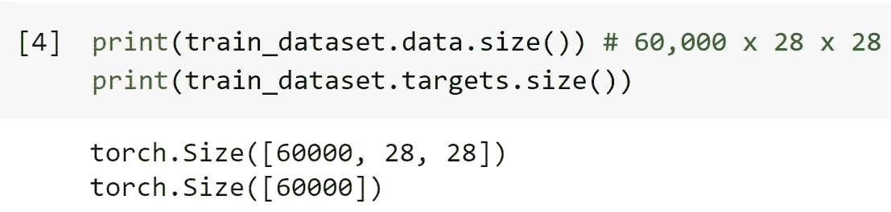
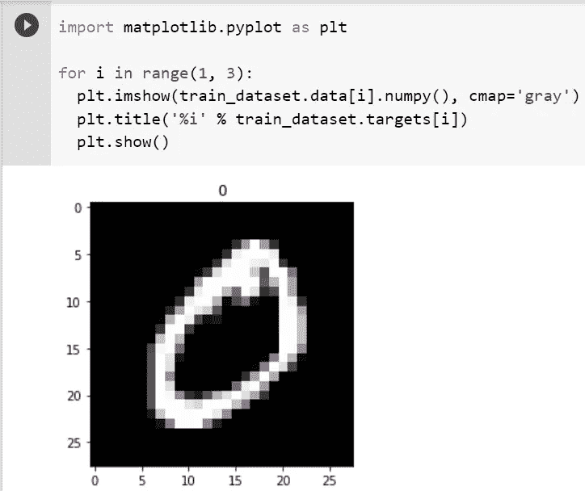
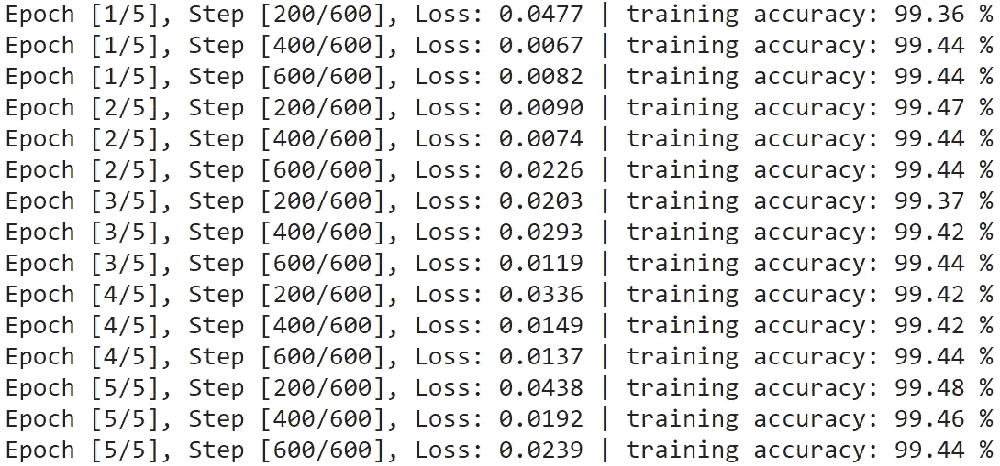
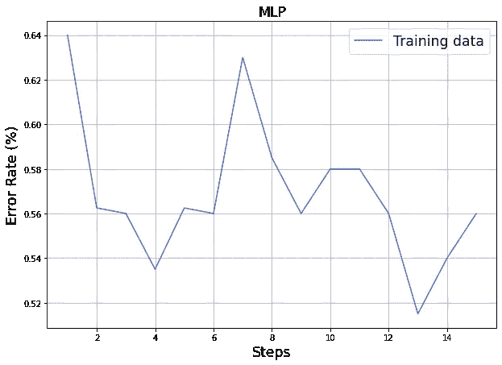
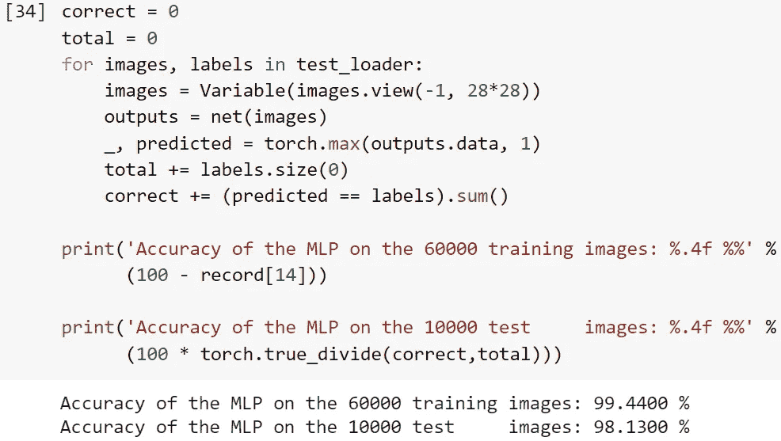

# ML14:py torch——MNIST 的 MLP

> 原文：<https://medium.com/analytics-vidhya/ml14-f03f75254934?source=collection_archive---------7----------------------->

## 图像分类的第一步(98.13%的准确率)

```
Read time: 20 minComplete code on Colab: [https://bit.ly/34yjiod](https://bit.ly/34yjiod)
```

DL 领域有两大领域，即解决图像相关问题(计算机视觉)和解决文本相关问题(自然语言处理)。然而，DL 社区经常把焦点放在与图像相关的问题上，而不是与文本相关的问题上，因为前者更有利可图。

本文通过著名的数据集 MNIST 来说明神经网络模型的工作流程。在 MNIST MLP 的测试数据上，我们得到了 98.13%的准确率。

> ***轮廓*** *(1)*[*MLP*](#c4cc) *(2)*[*准备数据*](#6f88) *(3)*[*MNIST 的图像*](#6c34) *(4)*[*初始化 MLP*](#ea80)

我们在 **ML13** 中尝试了 NN 简单线性回归，并浏览了 **ML04** 中的理论，现在我们继续到 MLP。

[](https://merscliche.medium.com/ml13-e52e251d41c5) [## ML13: PyTorch —简单线性回归

### 使用 torch.nn 构建一个简单的用例

merscliche.medium.com](https://merscliche.medium.com/ml13-e52e251d41c5) [](/analytics-vidhya/ml04-ce0b172deb2b) [## ML04:从 ML 到 DL 再到 NLP

### 简明概念图

medium.com](/analytics-vidhya/ml04-ce0b172deb2b) 

# (1) MLP

*   神经元是神经网络的最小单位。感知器是单层神经网络。[1]
*   前馈神经网络(FNN)是一种人工神经网络，其中节点之间的连接不形成循环。因此，它不同于它的后代:递归神经网络(RNN) 。FNN 是第一个也是最简单的人工神经网络。在这个网络中，信息只在一个方向上移动——向前——从输入节点通过隐藏节点(如果有的话)到达输出节点。网络中没有循环或环路。[2]
*   简言之，

1.  FNN: MLP(多层感知器，也称为“全连接”网络)，CNN(卷积神经网络)
2.  RNN: RNN(循环神经网络)，LSTM(长短期记忆)，GRU(门控循环单元)

更多相关 NN 理论详细查看 [**ML04**](https://becominghuman.ai/ml04-ce0b172deb2b) 。

# *(2)准备数据*

MNIST 是 DL 舞台上一个值得注意的影像资料。我们输入 MNIST，并把它们分成训练和测试数据。训练数据有 60，000 个数据点(图像)，而测试数据有 10，000 个数据点。有几件事值得注意:

*   下载:如果为“真”，则将数据集下载到工作目录当数据集已经存在时，不执行任何操作。
*   torch.utils.data.DataLoader:启用“shuffle”和“sample”这两个参数。
*   batch_size = 100(我们必须在这里决定批量大小)



图 1: 60，000 张照片，每张 28 个单位 x 28 个单位。

注意张量是 60，000 x 28 x 28。图像是 28 个单位× 28 个单位，所以我们必须设置 **input_size = 784 = 28 x 28** 。

# (3)MNIST 的形象

MNIST 数据库(改进的国家标准和技术研究所数据库)是一个手写数字的大型数据库，通常用于训练各种图像处理系统。[3]



图 2:MNIST 的图像。

# (4)初始化 MLP

```
# Neural Network Model (1 hidden layer)
class Net(nn.Module):
    def __init__(self, input_size, hidden_size, num_classes):
        super(Net, self).__init__()
        self.fc1 = nn.Linear(input_size, hidden_size) 
        self.relu = nn.ReLU()
        self.fc2 = nn.Linear(hidden_size, num_classes)  

    def forward(self, x):
        out = self.fc1(x)
        out = self.relu(out)
        out = self.fc2(out)
        return out# Neurons of each layer
input_size = 784
hidden_size = 500  
num_classes = 10# Initialization
MLP = Net(input_size, hidden_size, num_classes)# Hyperparameter
num_epochs = 5
batch_size = 100 # Recall that we set it before
learning_rate = 0.001# Loss function and optimizer
criterion = nn.CrossEntropyLoss()  
optimizer = torch.optim.Adam(MLP.parameters(), lr=learning_rate)
```

我们设置具有 784 个神经元的输入层(取决于图像的大小)，具有 500 个神经元的隐藏层，以及具有 10 个神经元的输出层(因为我们被给予 10 个类别的分类任务)。

## 超参数

*   输入大小= 784
*   隐藏大小= 500
*   数量类= 10
*   次数= 5
*   batch_size = 100(回想一下我们之前设置的)
*   学习率= 0.001

## 激活器、损失函数和优化器

*   激活功能:ReLU
*   损失函数:交叉熵
*   优化器:Adam

# (5)培训 MLP

```
def rightness(predictions, labels):
    '''
    Calculate the prediction error rate
    1\. "predictions" gives a series of predictions, which is a  "batch_size" x "num_classes" matrix.
    2\. "labels" are correct answer
    '''
    pred = torch.max(predictions.data, 1)[1] 
    # For the first dimension of every row (every image), ouput the index of the biggest elements in every row.
    rights = pred.eq(labels.data.view_as(pred)).sum() 
    # Compare the indexs with categories in "labels", and get the accumulated correct numbers.
    return rights, len(labels) 
    # Return the correct numbers and all samples.record = [] # A container recording the training accuraciesfor epoch in range(num_epochs):train_rights = [] # Record the training accuraciesfor i, (images, labels) in enumerate(train_loader):  

        # Convert torch tensor to Variable
        images = Variable(images.view(-1, 28*28))
        labels = Variable(labels)# Forward + Backward + Optimizer
        optimizer.zero_grad()  # zero the gradient buffer
        outputs = net(images)
        loss = criterion(outputs, labels)
        loss.backward()
        optimizer.step()right = rightness(outputs, labels) # (outputs, labels) = (correct numbers, all samples)
        train_rights.append(right) if (i+1) % 200 == 0:

          train_r = (sum([tup[0] for tup in train_rights]), sum([tup[1] for tup in train_rights]))
          train_accuracy = 100\. * train_r[0].numpy() / train_r[1]
          total_step = len(train_dataset)//batch_sizeprint ('Epoch [{:d}/{:d}], Step [{:3d}/{:d}], Loss: {:.4f} | training accuracy: {:5.2f} %'.format( 
                 epoch+1, num_epochs, i+1, total_step, loss.data, train_accuracy))record.append(100 - 100\. * train_r[0] / train_r[1])
```



图 3:培训过程。

# (6)训练和测试数据的准确性



图 4:训练错误率。



图 5:训练数据和测试数据的最终模型精度。

*   训练准确率:99.44 %
*   测试准确度: **98.13%**

# (7) *模型保存*

```
torch.save(MLP.state_dict(), 'ML14_MLP_parameter.pkl') # Save the parameters
torch.save(MLP, 'ML14_MLP_whole_model.pkl') # Save the whole model
```

在软件崩溃、硬件损坏或紧急断电的情况下，在训练神经网络模型时定期保存参数是至关重要的。

# *(8)总结*

在 MNIST MLP 的测试数据上，我们得到了 98.13%的准确率。

到目前为止，我们从:NN/DL 理论( [ML04](https://becominghuman.ai/ml04-ce0b172deb2b) ) = >一个仅仅由 NumPy ( [ML05](https://becominghuman.ai/ml05-8771620a2023) ) = >一个详细的 PyTorch 教程( [ML12](https://merscliche.medium.com/ml12-59d2a56737ac) ) = > NN 使用 PyTorch 的简单线性回归( [ML13](https://merscliche.medium.com/ml13-e52e251d41c5) ) = > MLP 在 MNIST 使用 PyTorch (ML14。这一个。).接下来，我们将在 ML15 中使用 PyTorch 转到 CNN 关于 MNIST 的报道。

[](/analytics-vidhya/ml15-56c033cc00e9) [## ML15:py torch——CNN 关于 MNIST 的报道

### 计算机视觉领域的资深人士(准确率 99.07%)

medium.com](/analytics-vidhya/ml15-56c033cc00e9) 

# (9)参考文献

[1]维基百科(身份不明)。感知器。检索自
[【https://en.wikipedia.org/wiki/Perceptron】](https://en.wikipedia.org/wiki/Perceptron)
【2】维基百科(身份不明)。前馈神经网络。检索自【https://en.wikipedia.org/wiki/Feedforward_neural_network】
【3】维基百科(身份不明)。MNIST 数据库。检索自
[https://en.wikipedia.org/wiki/MNIST_database](https://en.wikipedia.org/wiki/MNIST_database)

## (中文)

[4] 張校捷 (2020)。深入淺出 PyTorch：從模型到源碼。北京，中國：電子工業。
[5] 集智俱樂部 (2019)。深度學習原理與 PyTorch 實戰。北京，中國：人民郵電。
[6] 邢夢來等人 (2018)。深度学习框架 PyTorch 快速开发与实战。北京，中國：電子工業。