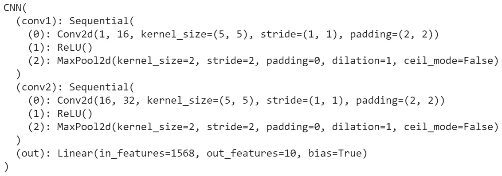
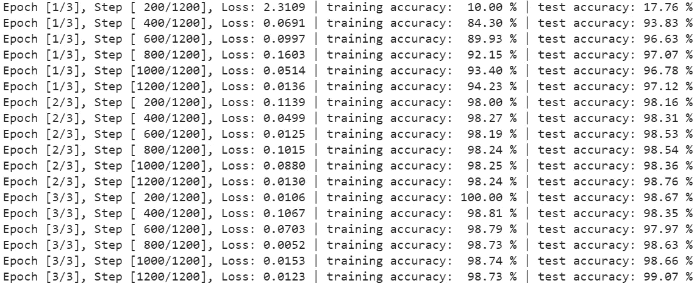
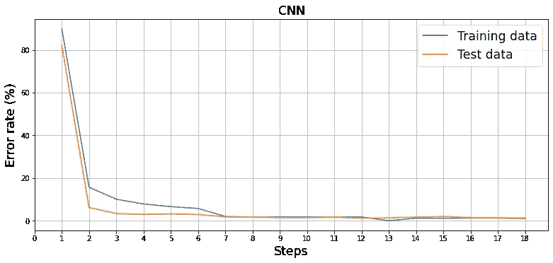
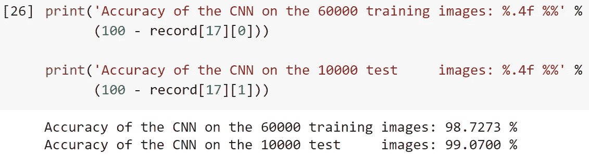
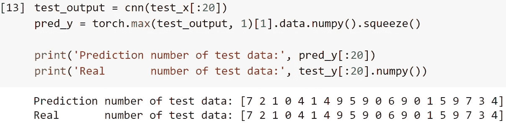
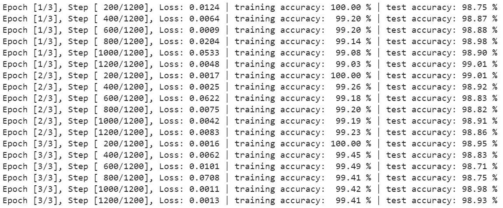
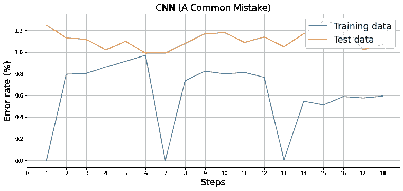

# ML15:py torch——CNN 关于 MNIST 的报道

> 原文：<https://medium.com/analytics-vidhya/ml15-56c033cc00e9?source=collection_archive---------8----------------------->

## 计算机视觉领域的资深人士(准确率 99.07%)

```
Read time: 20 minComplete code on Colab: [https://bit.ly/2KmLYK7](https://bit.ly/2KmLYK7)
```

我们在 CNN 对 MNIST 的测试数据上得到了 **99.07%** 的准确率，而在 ML14 中 MLP 对 MNIST 的测试数据只有 **98.13%** 的准确率。

> ***轮廓*** *(1)*[*CNN*](#10e7) *(2)*[*准备数据*](#0168) *(3)*[*MNIST 的图像*](#0168) *(4)*[*初始化 CNN*](#bbf5)[](#78fd) **(8)*[*模型保存*](#0727) *【9】*[*常见错误*](#8dca) *(10)*[*总结*](#a2a8)*

*在 **ML14** 的基础上，我们不断前进。*

*[](/analytics-vidhya/ml14-f03f75254934) [## ML14:py torch——MNIST 的 MLP

### 图像分类的第一步(98.13%的准确率)

medium.com](/analytics-vidhya/ml14-f03f75254934)* 

# *(1)美国有线电视新闻网*

*   **CNN，卷积神经网络*，是一种 *FNN* 。*全连接层*(或 MLP)***太复杂******丢失所有空间信息*** ，而 *CNN* 避免了前述问题，并利用卷积层和池层来产生计算机视觉中出色的真实世界结果。[1]*
*   **卷积神经网络*。*CNN*是**与** *完全连接的神经网络*完全不同，并且在许多任务中取得了最先进的性能。这些任务包括图像分类、对象检测、语音识别，当然还有句子分类。***CNN*的一个主要优点**是，与*全连接层*相比， *CNN* 中的卷积层具有数量少得多的**参数**。这允许我们构建更深层次的模型，而不用担心内存溢出。此外，更深的模型通常会带来更好的性能。[2]*
*   *我们研究了 MLPs 的主要缺点/限制之一——缺乏参数共享——并介绍了卷积网络架构作为一种可能的解决方案。最初为计算机视觉而开发的 CNN，**已经成为 NLP** 中的中流砥柱，这主要是因为它们的**高效实现**和**低内存需求**。[3]*
*   *简言之，*

1.  *FNN: MLP(多层感知器，也称为“全连接”网络)，CNN(卷积神经网络)*
2.  *RNN: RNN(循环神经网络)，LSTM(长短期记忆)，GRU(门控循环单元)*

*详细查看 **ML04** 了解更多相关神经网络理论。*

*[](https://becominghuman.ai/ml04-ce0b172deb2b) [## ML04:从 ML 到 DL 再到 NLP

### 简明概念图

becominghuman.ai](https://becominghuman.ai/ml04-ce0b172deb2b)* 

# *(2) *准备数据**

# *(3)MNIST 的形象*

*MNIST 是我们在 **ML14** 中见过的著名数据集。查看 [**ML14**](https://merscliche.medium.com/ml14-f03f75254934) 了解更多信息。*

# *(4)初始化 CNN*

```
*class CNN(nn.Module):
    def __init__(self):  
        super(CNN, self).__init__()  
        self.conv1 = nn.Sequential(  
                     nn.Conv2d(in_channels=1, out_channels=16, kernel_size=5, stride=1, padding=2),
                     nn.ReLU(),
                     nn.MaxPool2d(kernel_size=2) # (16,14,14)
                     )self.conv2 = nn.Sequential( # (16,14,14)
                     nn.Conv2d(16, 32, 5, 1, 2), # (32,14,14)
                     nn.ReLU(),
                     nn.MaxPool2d(2) # (32,7,7)
                     )
        self.out = nn.Linear(32*7*7, 10)def forward(self, x):
        x = self.conv1(x)
        x = self.conv2(x)
        x = x.view(x.size(0), -1) # (batch, 32,7,7) -> (batch, 32*7*7)
        output = self.out(x)
        return output*
```

*   **forward( )* 为正向传播。 *backward( )* 用于反向传播(BP)。在我们定义了*前进()*，*后退()*会自动采用函数*签名*。*
*   *输入层->Conv2D (2D 卷积层)->激活器(Sigmoid) ->平均池->全连接层->输出层(Softmax)*
*   *CNN 通常使用池来处理图像。*
*   *池化减少了特性和参数，但是保留了数据的一些属性。有 3 种流行的池化方法——平均池化、最大池化和随机池化。*
*   *观察活化剂 ReLU 是 PyTorch 中的一个层。*

```
*# Initialization
cnn = CNN()
print(cnn)params = list(cnn.parameters())
print('-----')
print(len(params))
print(params[0].size())EPOCH = 3
BATCH_SIZE = 50
LR = 0.001 # 0.001 is recommended# Optimizer = Adam
optimizer = torch.optim.Adam(cnn.parameters(), lr=LR)# Loss function = cross-entropy
loss_function = nn.CrossEntropyLoss()*
```

**

*图 CNN 模型的结构。*

# *(5)训练 CNN*

```
*record = [] # A container recording the training accuraciesfor epoch in range(EPOCH):train_rights = [] # Record the training accuraciesfor step, (x, y) in enumerate(train_loader):b_x = Variable(x)  
        b_y = Variable(y)**cnn.train() 
        # Tell PyTorch that the model is running in training mode (training)**output = cnn(b_x)  
        loss = loss_function(output, b_y)  
        optimizer.zero_grad() 
        # Indicate optimizer & loss function.
        # Bear in mind that one must zero the gradients last time before back propagation.

        loss.backward()  
        optimizer.step()right = rightness(output, b_y) # (outputs, labels) = (correct numbers, all samples)
        train_rights.append(right)if step % 200 == 0:**cnn.eval() 
            # Tell PyTorch that the model is running in evaluation mode (validation/test)**test_output = cnn(test_x)pred_y = torch.max(test_output, 1)[1].data.squeeze()
            test_accuracy = (sum(pred_y == test_y).item() / test_y.size(0)) * 100train_r = (sum([tup[0] for tup in train_rights]), sum([tup[1] for tup in train_rights]))
            training_accuracy = 100\. * train_r[0].numpy() / train_r[1]total_step = len(train_data)//BATCH_SIZEprint('Epoch [{}/{}], Step [{:4}/{}], Loss: {:.4f} | training accuracy: {:6.2f} % | test accuracy:{:6.2f} %'.format(
                 epoch+1, EPOCH, step+200, total_step, loss.data, training_accuracy, test_accuracy))

            record.append((100 - 100\. * train_r[0] / train_r[1], 100 - test_accuracy))*
```

**

*图 2:培训过程。*

## *model.train()和 model.eval()*

*顾名思义，这些函数**告诉 PyTorch** 模型运行在**训练模式(training)** 或**评估模式(validation/test)** 。只有当您想要**关闭或打开**模块，例如 **Dropout** 或 **BatchNorm** 时，这才有一些效果。[4]*

*记住*train()*&*eval()*会影响**Dropout**&**bact chnorm**，尽管实际上我们在这个 CNN 模型中不做这两者(检查类 *CNN* )。*

# *(6)训练和测试数据的准确性*

```
*import numpy as npplt.figure(figsize = (13, 5.5))
train_error, test_error = [k[0] for k in record], [k[1] for k in record]
# "record" records the (training error rate, test error rate) in each step
plt.plot(list(range(1,19)), train_error, label= "Training data") 
plt.plot(list(range(1,19)), test_error, label= "Test data")plt.xticks(range(0, 19, 1))plt.xlabel('Steps', fontsize = 'xx-large') # Change font size
plt.ylabel('Error rate (%)')
plt.ylabel('Error rate (%)', fontsize = 'xx-large') # Change font size
plt.title('CNN', fontname='DejaVu Sans', fontsize = 'xx-large') # Change font sizeplt.grid() # Simply add grid by default
plt.legend(fontsize = 'xx-large',  loc= 'upper right')
plt.show()*
```

**

*图 3:步骤中训练数据和测试数据的错误率。*

**

*图 4:训练数据和测试数据的最终模型精度。*

*   *训练准确率:98.73 %*
*   *测试准确度: **99.07%***

# *(7)对试验数据的预测*

**

*图 5:检查测试数据的预测类别(10 个类别)。*

# *(8) *模型保存**

*如[中所说 **ML14** 中所说](https://merscliche.medium.com/ml14-f03f75254934)。*

# *(9)常见的错误*

***忘记初始化模型**是高估模型性能的常见错误。这里有一个这种错误的例子。我们得到了一个性能模型，在训练开始时表现得难以置信的好。*

**

*图 6:一个常见的错误——培训过程*

**

*图 7:一个常见的错误——步骤中训练数据和测试数据的错误率。*

# *(10)总结*

*我们在 CNN 对 MNIST 的测试数据上得到了 **99.07%** 的准确率，而在 **ML14** MLP 对 MNIST 的测试数据只有 **98.13%** 的准确率。*

*CNN 已经在各种比赛中证明了自己，如 ImageNet 大规模视觉识别挑战赛(ILSVRC)，Kaggle 上的比赛等等[2][3][7]。此外，还有一些经典和流行的 CNN(基于 CNN 的模型)如:*

*   *LeNet-5*
*   *ImageNet-2010*
*   *VGGNet*
*   *谷歌网*
*   *雷斯内特*

*到目前为止，我们从:NN/DL 理论( [ML04](https://becominghuman.ai/ml04-ce0b172deb2b) ) = >一个仅仅由 NumPy ( [ML05](https://becominghuman.ai/ml05-8771620a2023) ) = >一个详细的 PyTorch 教程( [ML12](https://merscliche.medium.com/ml12-59d2a56737ac) ) = > NN 使用 py torch([ML13](https://merscliche.medium.com/ml13-e52e251d41c5))=>MLP 在 MNIST 使用 PyTorch ( [ML14](https://merscliche.medium.com/ml14-f03f75254934) ) = 【T56 这一个。).*

# *(11)参考文献*

*[1] Subramanian，V. (2018)。用 PyTorch 进行深度学习。英国伯明翰:Packt 出版公司。*

*[2]t . Ganegedara(2018 年)。用张量流进行自然语言处理。英国伯明翰:Packt 出版公司。*

*[3] Chollet，F. (2018)用 Python 进行深度学习。纽约州纽约市:曼宁出版公司。*

*[4]托马斯和帕西(2019 年)。PyTorch 深度学习动手。英国伯明翰:Packt 出版公司。*

## *(中文)*

*[5] 張校捷 (2020)。深入淺出 PyTorch：從模型到源碼。北京，中國：電子工業。
[6] 集智俱樂部 (2019)。深度學習原理與 PyTorch 實戰。北京，中國：人民郵電。
[7] 邢夢來等人 (2018)。深度学习框架 PyTorch 快速开发与实战。北京，中國：電子工業。*